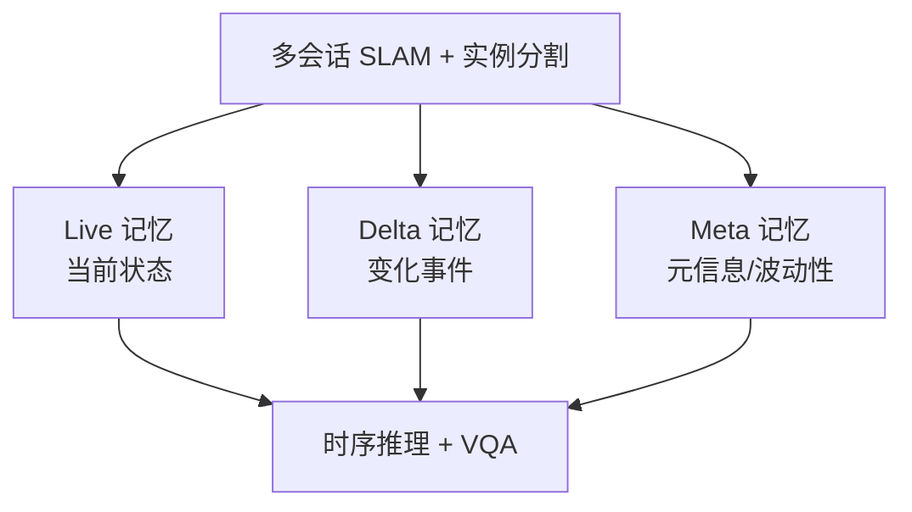

# LT-Mem：波动性感知的终身场景记忆

**LT-Mem**（*Volatility-Aware Spatio-Temporal Memory for Lifelong Scene Understanding*；[arXiv:2608.19059](https://arxiv.org/abs/2608.19059)，[项目页](https://lt-mem.github.io/)）由 **DGIST** 提出：长期运行的服务机器人反复进入 **变化环境** 时，单纯覆盖旧地图会丢失对象历史，逐次快照又难维持跨会话身份。

## 一句话定义

**用 Live / Delta / Meta 三层记忆，按对象波动性决定覆盖、保持或多假设，让机器人既记得「现在在哪」，也记得「曾经发生过什么」。**

## 英文缩写速查

| 缩写 | 英文全称 | 简要说明 |
|------|----------|----------|
| LT-Mem | Lifelong Tri-Memory | 本文三层记忆框架 |
| SLAM | Simultaneous Localization and Mapping | 多会话定位建图 |
| VQA | Visual Question Answering | 视觉问答 |
| LT-VQA | LT-Mem VQA Benchmark | 多会话时间问答数据集 |
| MASt3R | Matching And Stereo 3D Reconstruction | 感知前端 SLAM 栈 |

## 为什么重要

- 家庭/仓储/医院场景 **对象会移动、出现、消失** — 最新观测 alone 不够。
- 纯 VLM batch 全历史上下文 **令牌爆炸**；LT-Mem 报告 **~16×** 更少令牌仍更优。
- 与 Spatial Memory Agent 等同属「空间记忆」线，但强调 **跨会话身份 + 时间推理**。

## 核心信息

| 项 | 内容 |
|----|------|
| **机构** | DGIST（Robotics and Mechatronics Engineering） |
| **感知** | 多会话 **MASt3R-SLAM** + 实例 3D 分割 |
| **推理** | 波动性条件时序推理 + 确定性证据评分 |
| **开源** | **部分开源** — [LT-VQA 数据集](https://drive.google.com/drive/folders/1rrwXxJDqJO9P9-wf_-JENX6FP1v9AThC) 可下；**Code TBD** |

## 核心原理

### Tri-Memory 与更新策略

- **Live** — 对象当前状态（位置、属性）。
- **Delta** — 跨访问的变化事件（移动、出现、消失）。
- **Meta** — 对象动态性/波动性元数据，驱动 **overwrite / hold / multi-hypothesis**。
- **证据评分** — 维持跨会话 **persistent identity**。

## 源码运行时序图

**不适用** — 截至 **2026-08-21** 项目页 **Code (TBD)**，无官方训练/推理仓库。发布后预期：SLAM 会话对齐 → Tri-Memory 更新 → LT-VQA 问答接口。

## 工程实践

| 项 | 建议 |
|----|------|
| 与 SMA 对照 | SMA 偏 VLM 过程记忆 + verifier；LT-Mem 偏 **对象级 3D + 波动性** |
| 评测 | 先用 **LT-VQA** 做时间问答基线，再谈下游导航/操作 |
| 令牌预算 | 长期部署应报告 memory 检索 token，而非只报 QA 准确率 |
| 复现 | 数据集已可用；记忆系统代码待发布 |

## 实验与评测

- **LT-VQA：** 3 环境、30 会话、80 QA；含持久身份标注。
- **相对 VLM-Batch 基线：** 全面更优，令牌 **低约一个数量级**。
- **消融：** 波动性更新 vs  naive 覆盖/快照（见论文）。

## 结论

**长期记忆不是存得更多，而是知道什么该覆盖、什么必须保留、什么应暂存多种解释。**

1. **Tri-Memory 分工** — Live/Delta/Meta 解耦「现在 / 变化 / 元信息」。
2. **波动性驱动更新** — 静态对象可覆盖，高动态对象需 hold 或多假设。
3. **身份一致** — 确定性证据评分跨会话对齐实例 ID。
4. **效率** — ~16× 更少令牌，适合长期服务机器人。
5. **开源** — 数据集先行；系统集成代码 **TBD**。

## 与其他工作对比

| 对照 | 差异读法 |
|------|----------|
| 单纯覆盖旧地图 | 最新观测覆盖历史 → 丢失对象历史，答不了「曾经发生过什么」；LT-Mem 用 Delta 层留住变化事件 |
| 逐次会话快照 | 每次访问存一份快照，难维持跨会话实例身份；LT-Mem 用确定性证据评分对齐 persistent identity |
| VLM-Batch 全历史上下文 | 把全部历史塞进上下文 → 令牌爆炸；LT-Mem 全面更优且令牌 **低约 16×**（一个数量级） |
| [Spatial Memory Agent](./paper-spatial-memory-agent.md) | 同属「空间记忆」线，但偏 VLM 过程记忆 + verifier；LT-Mem 偏 **对象级 3D + 波动性**，强调跨会话身份与时间推理 |
| 统一更新策略 | 对所有对象一视同仁；LT-Mem 由 Meta 层的波动性元数据分流成 **overwrite / hold / multi-hypothesis** 三种策略 |
| [Hydra-0](./paper-hydra-0.md) | 综述同批但方向相反：Hydra 补的是**未来**（动作后果推演），LT-Mem 补的是**过去**（长期历史保存） |

## 局限与风险

- **代码未发布** — 无法复现完整 SLAM+记忆闭环。
- **MASt3R 依赖** — 感知前端误差会进入记忆层。
- **场景规模** — LT-VQA 3 环境；大规模商业部署需扩展审计。
- **与导航栈接口** — 本文聚焦 scene understanding/VQA；到 VLN/操作的路径需工程集成。

## 关联页面

- [Spatial Memory Agent](./paper-spatial-memory-agent.md) — 另一 VLM 空间记忆路线
- [VLN 任务](../tasks/vision-language-navigation.md)
- [Generative World Models](../methods/generative-world-models.md)
- [Hydra-0](./paper-hydra-0.md) — 综述同批「保存长期历史」

## 参考来源

- [LT-Mem 论文归档](../../sources/papers/lt_mem_arxiv_2608_19059.md)
- [lt-mem 项目页](../../sources/sites/lt-mem-github-io.md)
- [具身智能小站 8 篇综述](../../sources/blogs/wechat_embodied_station_8_papers_world_model_memory_2026-08-21.md)

## 推荐继续阅读

- [arXiv:2608.19059 PDF](https://arxiv.org/pdf/2608.19059)
- [LT-Mem 项目页](https://lt-mem.github.io/)
- [LT-VQA 数据集](https://drive.google.com/drive/folders/1rrwXxJDqJO9P9-wf_-JENX6FP1v9AThC)
