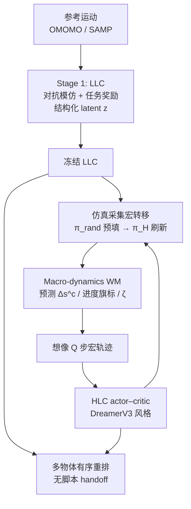

# LUCID：用想象的技能级动力学做长时程人形 Loco-Manipulation

**LUCID**（*Latent-Skill Unified Control via Imagined Dynamics*；[arXiv:2608.07746](https://arxiv.org/abs/2608.07746)）由**曼彻斯特大学计算机科学系**与**意大利技术研究院（IIT）人机界面与交互实验室**提出：把可复用全身技能接到 **macro-dynamics 世界模型** 上，让高层策略在 **想象的技能级转移** 里优化长时程多物体重排，而不是靠脚本 FSM 或纯 model-free 技能调度。

## 一句话定义

**先冻结一套结构化 latent 条件低层技能，再学「选哪个技能会发生什么」的宏动力学，用想象 rollout 训练高层，完成无脚本交接的长时程人形重排。**

## 英文缩写速查

| 缩写 | 英文全称 | 简要说明 |
|------|----------|----------|
| LUCID | Latent-Skill Unified Control via Imagined Dynamics | 本文分层 model-based 框架总称 |
| LLC | Low-Level Controller | 冻结的 latent 条件全身技能策略 |
| HLC | High-Level Controller | 目标条件宏动作（latent + guidance）策略 |
| WM | World Model | 预测宏步任务状态变化的宏观动力学模型 |
| ASE | Adversarial Skill Embeddings | LLC 对抗模仿骨架；本文改为结构化 latent |
| MDP | Markov Decision Process | 有序子目标重排的目标条件形式化 |
| SR\(k\) | Success Rate through subtask \(k\) | 前 \(k\) 个物体放置成功的前缀成功率 |
| APE | Average Placement Error | 全体任务物体最终放置误差均值 |

## 为什么重要

- **点破长时程瓶颈的位置：** 单体交互策略已不少，缺口常在 **子任务交接与后续条件预测**——脚本 handoff / FSM 不建模「当前技能如何改变后续局面」。
- **把世界模型放在对的时间尺度：** 不在关节级逐步自回归（接触丰富、误差易爆炸），而在 **技能级 / 宏步** 预测人形、物体与任务进度。
- **接口比「能解码」更关键：** 消融显示无结构超球面 latent 虽可被分类器解码，但对下游重排 **SR2 = 0**；结构化 skill anchor 才是 HLC 可用接口。
- **评测读法诚实：** 基线在子任务交接时重置人形到有利姿态，LUCID **不重置** 仍大幅领先 SR2——差距主要来自自主交接，而非单纯单步放置。

## 核心信息

| 项 | 内容 |
|----|------|
| **机构** | 曼彻斯特大学（University of Manchester）；意大利技术研究院（Istituto Italiano di Tecnologia） |
| **作者** | Cheng Guo（通讯）、Mingzhe Ni、Angelo Cangelosi、Arash Ajoudani |
| **平台** | Isaac Gym 仿真人形（15 rigid bodies / 28 PD 关节）；非真机 |
| **任务** | HITR 衍生多物体有序重排；ID 62 / OOD 20；链长 2（主表）至 5（扩展） |
| **栈** | LLC：ASE 式对抗模仿 + PPO + 三阶段课程；HLC：DreamerV3 式 actor–critic；WM：紧凑任务状态上的确定性 MLP |
| **开源** | **确认未开源**（截至 2026-08-12：无项目页、无官方 GitHub） |

## 核心原理

### 方法栈

| 阶段 | 组件 | 机制 |
|------|------|------|
| Stage 1 | 结构化 latent LLC | 对抗模仿 \(r^D\) + 任务奖励 \(r^G\)；oracle 按交互阶段供 skill anchor；课程 carry → rearrange → retreat/chaining |
| Freeze | LLC | 固定可复用全身技能；HLC 只选 \(z\) 与 guidance \(p^g\) |
| Stage 2 | Macro-dynamics WM | 每 \(K\) 个 LLC 步一条宏转移；残差预测连续任务量、BCE 预测进度旗标 + continuation |
| Stage 2 | Imagined HLC | 从 replay 起点在 WM 内想象 \(Q\) 步；\(\lambda\)-return + score-function；早期 BC 向 oracle 退火 |

结构化 latent（相对 ASE 无结构超球面）：为 \(N\) 个语义技能保留 one-hot **anchor**，其余维为 within-skill 高斯变分，再归一化——使离散相位决策与连续微调同处一个接口。

### 流程总览

## 源码运行时序图

**不适用**（截至入库日 2026-08-12：arXiv abs / HTML 均无官方可运行仓库或项目页代码链接；读法以方法与仿真指标为主，不可直接复现训练栈）。

## 工程实践

| 项 | 建议 / 论文设定 |
|----|----------------|
| 时间尺度 | 仿真 60 Hz；LLC 30 Hz；HLC 每 **20** LLC 步选一次宏动作（\(K=20\)） |
| 想象预算 | horizon **12**；sequence length 32；batch 64 |
| 并行度 | HLC/WM：**8192** 并行环境；LLC：2× RTX 4090 |
| LLC 接口 | 优先 **结构化 skill anchor**；不要指望无结构超球面「可解码」就够用 |
| 奖励 shaping | 稀疏设定更利于 OOD；稠密 shaping 略抬 ID、可伤迁移（Table 2） |
| 早期稳定 | 用几何 oracle 对离散技能选择做 **BC 退火**，再交给想象 RL |
| 复现边界 | **无公开代码**；需自建 Isaac Gym 管线 + HITR 构图协议 |
| 部署读法 | 当前为 **特权状态仿真**；真机 / 视觉控制属作者列出的未来工作 |

## 实验与评测

- **协议：** 放置成功阈值 0.2 m；三 seed 报 mean±std；ID/OOD 任务列表与 horizon 对所有方法共享。
- **主表（Table 1）：** LUCID ID **SR1 89.2% / SR2 73.4% / APE 0.32 m**；OOD **SR1 83.9% / SR2 68.4% / APE 0.52 m**。最强基线 HumanVLA ID SR2 **39.8%**、OOD **37.0%**。
- **长链：** 扩展到五物体时 LUCID 前缀成功衰减更缓（约 SR3 **56%**、SR5 **21%**）；InterMimic / TokenHSI 近 SR4 归零，HumanVLA SR5≈**5%**。
- **WM 消融：** 各 split×奖励设定下，带想象的 HLC 相对 model-free 的 SR2 一致更高（例：稀疏 ID **73.5%** vs **59.3%**）。
- **接口消融：** 结构化接口 ID/OOD SR2 **74.2% / 66.4%**；无结构接口 **0%** SR2。

## 结论

**长时程人形重排的关键不是再堆一个单物体控制器，而是让高层能在「技能级后果」上想象与优化，并把技能接口做成任务相位可对齐的结构。**

1. **宏动力学 > 关节级自回归** — 对多物体链，预测技能诱导的任务状态变化，比逐步复现全身物理轨迹更稳、更可规划。
2. **结构化 latent 是硬前提** — 仅有可解码行为不够；skill anchor 与交互阶段对齐后，HLC 才学得动。
3. **想象训练相对 model-free HLC 稳定抬 SR2** — 尤其在 OOD 与稀疏奖励下差距更明显。
4. **稠密 shaping 要慎用** — 可能略抬分布内、伤害分布外。
5. **相对脚本 FSM / 顺序单物体策略**，无交接重置时的完整链成功是主增益来源。
6. **工程边界清晰：** 仿真 + 特权状态 + **未开源**；选型时当方法坐标，不当可部署栈。

## 与其他工作对比

| 对照 | 差异读法 |
|------|----------|
| [ASE](../methods/ase.md) | 提供对抗技能嵌入骨架；LUCID 改用 **结构化 anchor latent**，并把下游接到想象 HLC |
| [DreamerV3](./paper-shenlan-wm-13-dreamerv3.md) / [Latent Imagination](../concepts/latent-imagination.md) | 想象 actor–critic 同族；LUCID 的动作是 **宏技能命令**，动力学在紧凑任务状态而非像素/关节 RSSM |
| [TokenHSI](./paper-bfm-38-tokenhsi.md) | 人–场景技能合成强，但长链依赖 **脚本 FSM** 切换；LUCID 用学得 WM 自主交接 |
| [InterMimic](./paper-bfm-15-intermimic.md) | 强在物理 HOI 跟踪；作基线时依赖 warped 参考与有利交接，长链 SR 快速塌缩 |
| HumanVLA（HITR） | 端到端单物体重排再顺序激活；LUCID 显式技能库 + 宏规划，完整链 SR2 大幅更高 |
| 关节级机器人世界模型（RWM / HAIC 等） | 多服务连续控制或状态估计；LUCID 专做 **技能级任务进度** 预测 |

## 局限与风险

- **开源：** 截至入库日 **无可运行官方代码**；复现成本高。
- **感知：** 特权状态输入；视觉控制与真机迁移未验证。
- **任务/具身多样性：** 评测集中于 HITR 风格重排与单一仿真人形设定。
- **时间指标：** 基线 handoff 重置使 Time 不可直接比效率。
- **Oracle 依赖：** LLC 训练与早期 HLC BC 依赖阶段 oracle；最终策略需退火掉监督，否则易过拟合脚本相位。

## 关联页面

- [Loco-Manipulation](../tasks/loco-manipulation.md) — 任务总览与技术路线
- [ASE](../methods/ase.md) — 对抗技能嵌入 / LLC 谱系
- [Model-Based RL](../methods/model-based-rl.md) — 基于模型强化学习总方法
- [Latent Imagination](../concepts/latent-imagination.md) — 潜空间想象训练概念
- [DreamerV3](./paper-shenlan-wm-13-dreamerv3.md) — HLC 想象训练参照
- [TokenHSI](./paper-bfm-38-tokenhsi.md) / [InterMimic](./paper-bfm-15-intermimic.md) — 论文基线谱系

## 参考来源

- [lucid_arxiv_2608_07746.md](../../sources/papers/lucid_arxiv_2608_07746.md) — 论文摘录与开源核查
- [arXiv:2608.07746](https://arxiv.org/abs/2608.07746) — 原文（Submitted 2026-08-07）

## 推荐继续阅读

- [ASE 官方代码（nv-tlabs/ASE）](https://github.com/nv-tlabs/ASE) — LUCID LLC 所继承的对抗技能嵌入实现
- [DreamerV3（danijar/dreamerv3）](https://github.com/danijar/dreamerv3) — 想象 actor–critic 参照实现
- [HITR / HumanVLA（NeurIPS 2024）](https://arxiv.org/abs/2406.19972) — 多物体重排数据与端到端基线谱系
