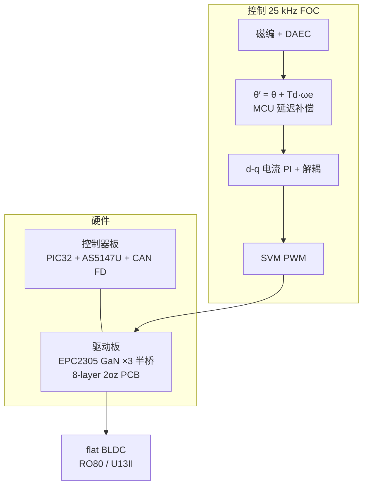

# LunaDrive（arXiv:2609.21818）

**LunaDrive**（*A Delay-Compensated High-Voltage GaN FET-Based Motor Driver for Dynamic Robots with Flat BLDC Motors*，东京大学 JSK，[arXiv:2609.21818](https://arxiv.org/abs/2609.21818)，**IROS 2026**）是贴装于 **高功率 flat BLDC** 背面的 compact **GaN FET** 驱动器：在 **96 V**（150 V 器件）下实现 **8890 rpm / 3110 Hz** 电频率 FOC，并通过 **编码器 DAEC + MCU 角度超前补偿** 解决超压高速区的延迟致稳问题。

## 一句话定义

为动态机器人 flat BLDC 设计的 **超薄 GaN 高压驱动 + 高电频率 FOC 延迟补偿**，让 48 V 额定电机在 96–100 V 下稳定拉出更高瞬时转速。

## 英文缩写速查

| 缩写 | 英文全称 | 简要说明 |
|------|----------|----------|
| FOC | Field-Oriented Control | 25 kHz 磁场定向 + SVM |
| GaN FET | Gallium Nitride Field-Effect Transistor | EPC2305，150 V / 3 mΩ |
| BLDC | Brushless DC Motor | 无框 flat 电机（RO80 等） |
| CAN FD | CAN with Flexible Data-Rate | PC 与驱动 1 kHz 通信 |
| DAEC | Dynamic Angle Error Compensation | AS5147U 编码器内部延迟补偿 |
| SVM | Space Vector Modulation | 提高调制比 |

## 为什么重要

- **动态机器人瓶颈：** 人形/四足高动态动作需要 **短时大功率**；48 V 商用 servo 限制 **空载转速**，超压驱动是常见工程诉求，但驱动器 **耐压–电流–体积** 三角难同时满足。
- **GaN + 贴装形态：** 70 mm 盘、**8.51 mm** 厚，可挂 flat 电机背面 — 相对 Elmo Gold Solo Twitter 等同电压 compact 驱动，论文报告 **更高连续/峰值电流与更薄厚度**。
- **控制而不仅是功率电子：** **p = 21** 极对 → 电频率 ~3 kHz；无 **Td·ωe** 补偿时 96 V 仅 ~5760 rpm 即发散；补偿后 **8890 rpm** — 说明 **驱动链 = 功率级 + FOC 带宽 + 角度延迟** 一体选型。

## 核心信息

| 字段 | 内容 |
|------|------|
| 机构 | 东京大学（The University of Tokyo / JSK） |
| arXiv | [2609.21818](https://arxiv.org/abs/2609.21818) |
| 项目页 | <https://woodrobo.github.io/lunadrive/> |
| 开源状态 | **未列官方仓库**（2026-09-23；PDF/视频已公开） |
| 封装 | Ø70 mm × 8.51 mm（连接器除外） |
| 电压 | 逻辑 12 V；电机 96 V 标称 / 150 V 峰值器件 |
| 目标电机 | CubeMars **RO80**（48 V 额定，21 极对） |

## 流程总览

## 工程实践

| 检查项 | 建议 |
|--------|------|
| 超压使用 | RO80 **48 V 额定** — 96 V 为 **超规格** 换转速；须评估绝缘、轴承与热 |
| 延迟补偿 | 高 **p** 电机必算 **电频率**；编码器 DAEC 不够时 MCU 侧 **ωe 超前** |
| 散热 | 无散热片连续仅 **13 A**；finned sink **30 A**；峰值 80 A 需短时占空 |
| 再生 | 负载下落实验用 **LiPo 24S** 吸收再生，非稳压电源 |
| 复现 | 截至入库日 **无 GitHub**；以 PDF + 项目页视频/BOM 描述为准 |

## 源码运行时序图

**不适用**（截至 2026-09-23 项目页 **未发布** 可运行固件/PCB 仓库）。若 Wood Lab 后续开源，应补 `sources/repos/` 与本节时序图。

## 实验与评测读法

- **空载加速（96 V）：** 无补偿 5760 rpm → 有补偿 **8890 rpm**（3110 Hz）；48 V 下补偿无差 — 延迟问题在高 **ωe** 才显现。
- **连续电流（θe=0 保守）：** flat/finned sink **28 / 30 A**；RO80 线模块 **20 A** 时电机先热限（80 °C）。
- **峰值：** U13II 负载 **80 A / 0.5 s**。
- **应用：** 8.1 kg 负载、0.5 m 线长高速卷绕 — 100 V 比 50 V 末端速度 **4.92 vs 4.14 m/s**（+19%）。
- **对照：** vs Gold Solo Twitter @85 V — LunaDrive 无散热片 **13 A / 8.51 mm** vs 对方 **3 A / 19.35 mm**（论文 Table）。

## 与其他工作对比

| 维度 | LunaDrive | [Katz QDD 执行器](./paper-low-cost-modular-actuator-katz.md) | 商用 Elmo Gold Solo Twitter |
|------|-----------|--------------------------------------------------------------|-----------------------------|
| 层级 | **驱动器**（贴 flat 电机） | **执行器模块**（电机+减速+驱动） | Compact 伺服驱动 |
| 电压 | 96 V（150 V 器件） | 24 V 级 | ~85–100 V |
| 材料 | **GaN FET** | Si MOSFET / 集成 FOC | 商业 Si 方案 |
| 控制亮点 | **高电频率延迟补偿** | 电流环带宽 / 磁编标定 | 未强调 3 kHz 电频率 |
| 开源 | 未列 repo | 部分开源（电子） | 闭源商业 |

## 结论

**LunaDrive 把「动态机器人要超压拉转速」拆成可验证的两块：GaN 功率密度 + 高电频率 FOC 延迟补偿。**

1. **硬件：** 8.51 mm 盘式 GaN 驱动在 96 V 达到 **30 A 连续 / 80 A 峰值**（论文条件）。
2. **控制：** 无补偿时 96 V 高速 **发散**；**θ + Td·ωe** 与 DAEC 是达 **3110 Hz** 电频率的关键。
3. **系统：** 线驱动跳跃负载证明 **LiPo 100 V + 大电流** 瞬时功率 — 面向 jumping/wire 类动态机构。
4. **开源：** PDF/视频公开，**无官方 GitHub** — 工程复现需等作者发布或自研对照。
5. 与 [关节编码器选型](../concepts/joint-encoder-selection.md)、[FOC](../concepts/field-oriented-control.md) 联读：高速环不只是「买更高分辨率编码器」，还有 **延迟与电角度**。

## 局限与风险

- **超压与寿命：** 96 V 驱 48 V 电机 — 转速收益伴随绝缘/轴承/热应力，论文未给长期可靠性数据。
- **不可直接对比散热：** LunaDrive 散热片固定机架，与 Elmo 文档条件不完全等价。
- **无开源 PCB/固件：** 目前为 **设计参考** 而非即插即用 DIY 包。

## 关联页面

- [field-oriented-control](../concepts/field-oriented-control.md)
- [joint-encoder-selection](../concepts/joint-encoder-selection.md)
- [paper-low-cost-modular-actuator-katz](./paper-low-cost-modular-actuator-katz.md)
- [actuator-drive-chain-selection-loop](../queries/actuator-drive-chain-selection-loop.md)
- [hub-actuator-drive-chain](../overview/hub-actuator-drive-chain.md)
- [locomotion](../tasks/locomotion.md)

## 参考来源

- [lunadrive_arxiv_2609_21818.md](../../sources/papers/lunadrive_arxiv_2609_21818.md)
- [lunadrive-woodrobo-github-io.md](../../sources/sites/lunadrive-woodrobo-github-io.md)
- [nikhilkr_x_lunadrive_2026.md](../../sources/sites/nikhilkr_x_lunadrive_2026.md)
- [arXiv:2609.21818](https://arxiv.org/abs/2609.21818)

## 推荐继续阅读

- [LunaDrive 项目页](https://woodrobo.github.io/lunadrive/)
- [Katz 低成本模块化执行器](./paper-low-cost-modular-actuator-katz.md)
- [执行器驱动链选型闭环](../queries/actuator-drive-chain-selection-loop.md)
