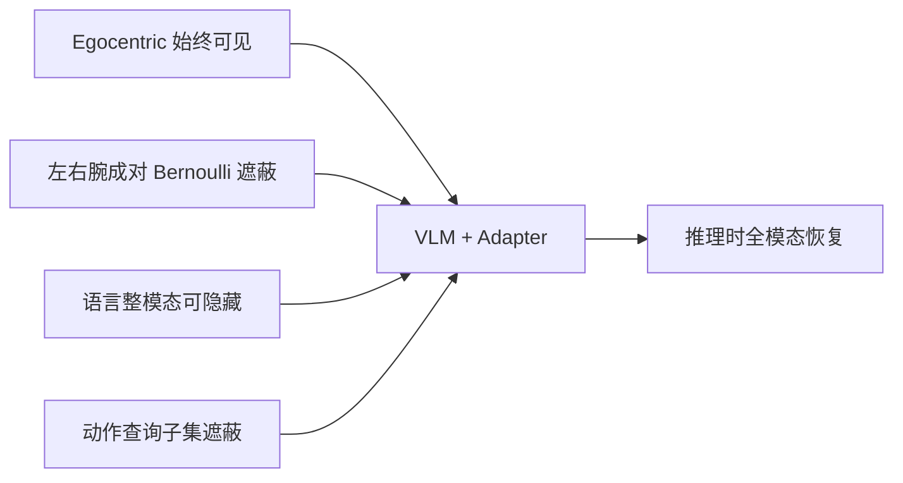

# M3：用训练期模态遮蔽稳住双臂 VLA

**M3**（*Robust Bimanual Vision-Language-Action Models via Embarrassingly Simple Modality Masking*，[arXiv:2608.22419](https://arxiv.org/abs/2608.22419)，[项目页](https://m3vla.github.io/)）由 **上海创智学院（Shanghai Innovation Institute）** 与 **香港城市大学（City University of Hong Kong）** 提出：在查询式双臂 VLA 上，仅于训练期随机屏蔽模态通道，推理结构不变，迫使策略少依赖干扰线索。

## 一句话定义

**鲁棒多模态融合有时不靠增加模块，而靠训练时主动制造信息缺失——M3 把腕相机成对拿掉、语言整段隐藏、查询子集置零。**

## 英文缩写速查

| 缩写 | 英文全称 | 简要说明 |
|------|----------|----------|
| M3 | Modality Masking Mechanism | 本文训练期结构化遮蔽 |
| VLA | Vision-Language-Action | 查询式低延迟策略 |
| OFT | OpenVLA Fine-Tuning | 第二骨干 OpenVLA-OFT |
| OOD | Out-of-Distribution | 真机新干扰物设定 |
| ACT | Action Chunking Transformer | 项目页对照基线之一 |

## 为什么重要

- **双臂失败常被当成数据不够：** 作者观察到动作不连续与注意力被干扰区拉走同时出现。
- **零架构改动：** 接到 Adapter 与 OpenVLA-OFT 都涨约 21 点。
- **真机 OOD 差距更大：** 干净 +25 pt，OOD +48.6 pt（12.5→61.1）。

## 核心信息

| 项 | 内容 |
|----|------|
| **机构** | 上海创智学院（Shanghai Innovation Institute）；香港城市大学（City University of Hong Kong） |
| **仿真** | RoboTwin 2.0 十任务；每任务 50 条干净示范；Clean / Clean2Rand |
| **真机** | Agilex 双臂；Bottle Cleanup / Stack & Shelf / Veggie Centering |
| **开源** | **未开源** — 仅项目页 |

## 核心原理（方法）

三条设计：保留 egocentric 全局布局；左右腕成对遮蔽，切断虚假跨视角；动作查询只藏子集并重缩放，避免丢掉全部动作上下文。统一加性可见性掩码进注意力；目标仍是标准 L1。部署时全部模态恢复。

### 流程总览

## 工程实践

| 项 | 建议 |
|----|------|
| **源码运行时序图** | **不适用**（截至 2026-08-30 无训练仓） |
| 何时用 | 查询式双臂 VLA 出现多视角注意力漂移时，先试遮蔽再加模块 |
| 不要当成通用 dropout | 相对 token/modality dropout，结构化成对腕遮蔽才是活性成分 |
| 复现 | 先跟项目页表与视频；官方代码未发布 |

## 实验与评测

| 设定 | 结果 |
|------|------|
| Adapter Clean 十任务均 | **41.0 → 62.7（+21.7）** |
| OpenVLA-OFT Clean | **32.2 → 53.5（+21.3）** |
| Clean2Rand | 相对 Adapter **+11.4** |
| 真机干净完整任务 | **44.4% → 69.4%** |
| 真机 OOD | **12.5% → 61.1%** |
| 三任务正则对照 | 完整 M3 **64.0** vs token dropout **31.8** / 单腕遮蔽 **32.7** |

## 结论

**双臂查询式 VLA 的鲁棒性，往往来自训练期主动制造缺失，而不是再叠一个融合模块。**

1. **成对腕遮蔽 > 随机 token dropout** — 消融里通用正则只涨几到十点，完整 M3 到 64。
2. **推理零改动** — 延迟优势保住，才能叫「embarrassingly simple」。
3. **OOD 比干净设定更该看** — 真机干扰物上差距扩大。
4. **跨骨干可迁移** — Adapter 与 OFT 涨幅接近，说明不是某一头的巧合。
5. **代码未发布** — 选型先读表，不要按可复现框架排期。

## 与其他工作对比

| 对照 | 差异读法 |
|------|----------|
| [Indi](./paper-indi.md) | 蒸馏行为意图进解码器；M3 不改监督目标，只改可见模态 |
| [FlashVLA](./paper-flashvla.md) | 改解码循环降延迟；M3 改训练可见性提鲁棒 |
| 视觉增强 / region aug | 项目页对照几乎不涨甚至掉点 |

## 局限与风险

- 作者写明：更多平台、扩散动作头、更丰富几何输入仍是未来工作。
- 仿真为单次官方协议比较，不是多种子均值。
- 无代码则无法核对手腕成对遮蔽的实现细节。

## 关联页面

- [VLA](../methods/vla.md)
- [双臂操作](../tasks/bimanual-manipulation.md)
- [Indi](./paper-indi.md)
- [FlashVLA](./paper-flashvla.md)
- [48ms WAM / 编排 10 篇地图](../overview/glancewam-vla-crew-10-papers-technology-map.md)

## 参考来源

- [m3_modality_masking_arxiv_2608_22419](../../sources/papers/m3_modality_masking_arxiv_2608_22419.md)
- [m3vla 项目页](../../sources/sites/m3vla-github-io.md)
- [具身智能小站 10 篇盘点](../../sources/blogs/wechat_embodied_station_10_papers_glancewam_vla_crew_2026-08-30.md)

## 推荐继续阅读

- [arXiv:2608.22419](https://arxiv.org/abs/2608.22419)
- [项目页](https://m3vla.github.io/)
