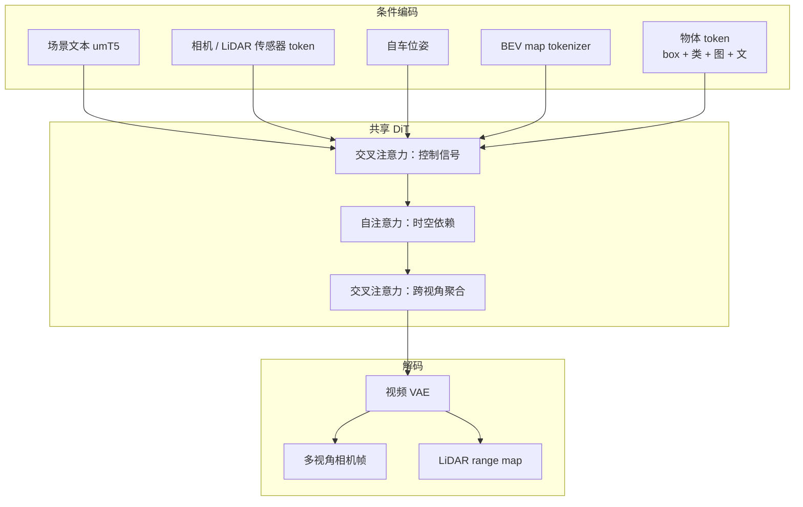
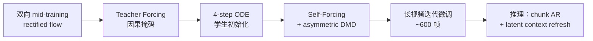

# M⁴World（Multi-view Multimodal Driving World Model）

**M⁴World**（*M⁴World: A Multi-view Multimodal Driving World Model for Interactive Object Manipulation and Minute-long Streaming*，[arXiv:2607.14005](https://arxiv.org/abs/2607.14005)，2026-07，Ke Cheng / Hanqiao Ye 等；通讯作者 Shuhan Shen）由**美团（Meituan）**、**中国科学院自动化研究所（CASIA）**与**北京理工大学（BIT）**联合提出：面向可扩展自动驾驶仿真的 **生成式驾驶世界模型**，在统一 DiT 潜空间中合成 **环视多相机视频 + 同步 LiDAR**，并强调 **物体级交互操纵** 与 **分钟级稳定流式**。

## 一句话定义

**一个少步自回归视频扩散驾驶世界模型：在时变控制信号与传感器上下文条件下，按 chunk 去噪并联合 rollout 多视角相机与 LiDAR，同时对单个交通参与者做空间布局与视觉外观级控制。**

## 英文缩写速查

| 缩写 | 英文全称 | 简要说明 |
|------|----------|----------|
| WM | World Model | 预测未来观测以支撑仿真 / 增广 |
| DiT | Diffusion Transformer | 共享潜空间去噪骨干 |
| VAE | Variational Autoencoder | 相机帧与 LiDAR range map 共用视频 VAE |
| BEV | Bird's-Eye View | 静态地图条件；亦用于检测下游评测 |
| DMD | Distribution Matching Distillation | 非对称蒸馏，对齐因果学生与双向教师 |
| LoRA | Low-Rank Adaptation | 稀有 case 的参数高效后训练 |
| FID / FVD | Fréchet Inception / Video Distance | 分布级生成质量指标 |
| VLM | Vision-Language Model | 可控性自动评判（如 Qwen3-VL） |
| APG | Adaptive Projected Guidance | LiDAR 采样，抑制 CFG 深度偏移 |
| CFG | Classifier-Free Guidance | 标准引导；对 range map 易致深度偏差 |

## 为什么重要

- **把「长什么样」写进驾驶仿真条件：** 相对 MagicDriveV2 等几何主导控制，M⁴World 用物体图像/文本描述做外观级操纵，直接服务长尾安全场景构造。
- **多传感器联合而非仅相机：** 同步 LiDAR range map 与环视视频，贴近车载感知栈输入形态。
- **分钟级流式可落地吞吐：** 4-step 因果学生在 8×A100、6 摄+LiDAR、424×800 上报 **2.3 FPS**，并展示 60s 稳定 rollout。
- **下游可测：** 运树卡车长尾上，500 条合成 clip 把目标 recall 从 **1.0%** 抬到 **69.7%**，常规 mAP 几乎不变。

## 核心信息

| 字段 | 内容 |
|------|------|
| 机构 | 美团（Meituan）；中国科学院自动化研究所（CASIA）；北京理工大学（BIT） |
| arXiv | [2607.14005](https://arxiv.org/abs/2607.14005) |
| 项目页 / 代码 | **未开源**（截至 2026-07-22；arXiv 无外链） |
| 骨干初始化 | Wan2.1-T2V（开源双向 T2V 先验） |
| 传感配置 | 10× 相机 @10 FPS + 1×128-beam LiDAR @10 FPS（训练/评测统一） |
| 主要基线 | MagicDriveV2 |

## 核心原理

### 输入 / 输出

| 侧 | 内容 |
|------|------|
| 全局条件 | 场景文本 $\mathbf{L}$（umT5）；相机内外参 / LiDAR 参考系 token $\mathbf{S}$ |
| 时变条件 | 自车位姿 $\mathbf{P}_t$；BEV map $\mathbf{M}_t$；物体属性集 $\mathbf{O}_t$ |
| 物体 token | 3D 8 角点 box + 类别 + SigLIP-V2 图像描述 + umT5 文本描述 |
| 输出 | 同步环视视频 + LiDAR range map（与图像同分辨率 latent 对齐） |

### 流程总览

### 长尾与视觉参考条件

| 路径 | 做法 |
|------|------|
| Few-clip 后训练 | 每稀有 case：50% 稀有 clip + 50% 普通；[LoRA](../concepts/lora.md) 绑定稀有外观/文本，保留基座几何与天气控制 |
| 视觉参考条件 | 首帧多视角 / 首帧单视角条件；物体补全（掩码后按控制补全）；参考 latent 与噪声通道拼接，控制 token 通路不变 |

## 源码运行时序图

**不适用** — 截至 2026-07-22，arXiv 条目与论文正文 **未提供** 可运行训练 / 推理仓库或项目页；无法对齐 README 入口绘制运行时序。

## 评测要点

| 维度 | 结果（相对 MagicDriveV2，同数据） |
|------|------|
| FID ↓ / FVD ↓ | **34.8 / 288.7**（基线 41.7 / 346.1） |
| 物体 visual / textual fidelity ↑ | **62.7% / 59.1%**（基线 13.4% / 11.6%） |
| 跨视角 object consistency ↑ | **84.5%**（基线 78.9%） |
| 长视界 | 定性展示 60s 六视角稳定 rollout；吞吐见上表 |
| 长尾增广 | 50k 真实 + 500 合成：运树卡车 recall **1.0% → 69.7%**；regular mAP 66.7→66.8 |

VLM judge 覆盖：场景天气/时段、视角内物体存在与清晰度、视觉/文本保真、跨视角同一 track 一致性（短边 >100px 的有效 crop）。

## 结论

**驾驶世界模型的差异化在「物体外观级可控 + 相机–LiDAR 同步 + 分钟级少步流式」，生成好看不等于物理正确或可闭环。**

1. **相对 MagicDriveV2（同数据）** — FID/FVD **34.8 / 288.7**（基线 41.7 / 346.1）；物体 visual/textual fidelity **62.7% / 59.1%**（基线 13.4% / 11.6%）；跨视角一致性 **84.5%**（78.9%）。
2. **外观 token 是长尾开关** — 物体级图像/文本描述直接服务稀有参与者构造；Few-clip LoRA 后训练绑定稀有外观，保留基座几何与天气控制。
3. **吞吐可落地** — 4-step 因果学生在 8×A100、6 摄+LiDAR、424×800 约 **2.3 FPS**，并展示 **60 s** 稳定 rollout。
4. **长尾增广有感知收益** — 50k 真实 + 500 合成运树卡车：recall **1.0% → 69.7%**，regular mAP 几乎不变（66.7→66.8）。
5. **LiDAR 采样优先 APG** — 标准 CFG 易致 range map 深度系统性偏移。
6. **用途边界** — 定位可控仿真/感知增广，非完备物理引擎；主证据开环，作者建议未来做真闭环策略交互；权重与数据未开源。

## 与其他工作对比

| 对照 | 差异 |
|------|------|
| **MagicDrive / MagicDriveV2** | 同为可控街景生成；M⁴World 强化 **外观级物体 token**、**LiDAR 并行生成** 与 **分钟级因果蒸馏** |
| **X-World** | 同为产业多摄驾驶 WM；X-World 强调 **动作条件 7 摄** 闭环评测；M⁴World 强调 **物体操纵 + 相机–LiDAR 多模态** |
| **PanoWorld** | ERP 全景轨迹可控；M⁴World 为车载 pinhole 环视 + range map |
| **GAIA-1 / Vista / DriveDreamer** | 同属驾驶视频 WM 谱系；本文额外给出 VLM 可控性协议与 few-clip 长尾定制路径 |
| **解析 / 重建仿真** | 生成式可外推未见组合，但无几何保证；与 NeRF/3DGS 重建路线互补 |

## 工程实践

| 项 | 要点 |
|------|------|
| 用途定位 | **可控驾驶数据仿真 / 长尾感知增广**；非完备物理引擎替代品 |
| 复现边界 | **权重与自采数据未公开**；仅可对照方法与评测协议 |
| 推理优化 | 序列并行 + **sensor parallelism**；VAE 异步跨传感器解码 |
| LiDAR 采样 | 优先 **APG**，避免标准 CFG 造成 range 深度系统性偏移 |
| 闭环注意 | 结论明确建议未来做 **真闭环策略交互** 评测；当前主证据为开环生成与感知增广 |

## 局限与风险

- **未开源：** 无法独立复现吞吐、可控性分数或长尾增广实验。
- **数据私有：** 训练日志自采，外部对齐需自建同构传感与标注管线。
- **误区：** 把高 FID/FVD 或「像行车记录仪」等同于物理正确 / 闭环安全。
- **评测依赖 VLM：** 二元问答分数受裁判模型偏差影响；Oracle 上界亦非 100%。

## 关联页面

- [生成式世界模型](../methods/generative-world-models.md) — 视频 / 多模态 WM 谱系
- [Video-as-Simulation](../concepts/video-as-simulation.md) — 像素级仿真概念
- [X-World](./paper-x-world.md) — 小鹏多摄动作条件驾驶 WM
- [PanoWorld](./paper-panoworld-real-world-panoramic-generation.md) — 全景 ERP 世界合成对照
- [DriftWorld](./paper-driftworld.md) — 另一条「少步 / 快推理」WM 路线（操纵域）
- [机器人世界模型训练闭环 taxonomy](../overview/robot-world-models-training-loop-taxonomy.md) — 学习型模拟器坐标
- [自动驾驶核心算法盘点](../overview/autonomous-driving-core-algorithms-series.md) — 感知栈与增广阅读入口
- [Cosmos 3](./cosmos-3.md) — 更广 Physical AI 世界模型平台对照

## 参考来源

- [M⁴World 论文摘录（arXiv:2607.14005）](../../sources/papers/m4world_arxiv_2607_14005.md)

## 推荐继续阅读

- 论文 PDF：<https://arxiv.org/pdf/2607.14005>
- 论文 HTML：<https://arxiv.org/html/2607.14005>
- 基线对照：Gao et al., *MagicDrive-V2: High-Resolution Long Video Generation for Autonomous Driving with Adaptive Control*（ICCV 2025）
- 开源 T2V 先验：[Wan: Open and Advanced Large-Scale Video Generative Models](https://arxiv.org/abs/2503.20314)
