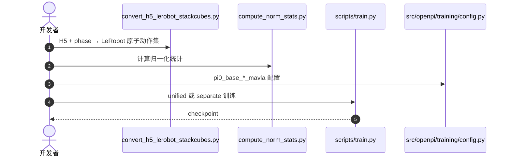

# MA-VLA

**MA-VLA: Multi-Arm Vision-Language-Action Model for Collaboration and Compositional Generalization**（[arXiv:2608.25864](https://arxiv.org/abs/2608.25864)，[代码](https://github.com/zhangzaibin/future-robots)）——大连理工大学（DUT）等；ECCV 2026。

## 一句话定义

**多臂通用化的核心不是共享感知，而是让角色与原子技能可以重新组合。**

## 英文缩写速查

| 缩写 | 英文全称 | 简要说明 |
|------|----------|----------|
| MA-VLA | Multi-Arm Vision-Language-Action | 本文多臂 VLA |
| MACG | Multi-Arm Compositional Generalization | 测试协作模式不在训练集中 |
| Arm Shuffle | Arm-wise permutation augmentation | 训练时同步置换观察/状态/提示 |
| MoE | Mixture of Experts | 三臂以上架构选项 |

## 为什么重要

- 纳入 [具身智能小站 2026-08-28 九篇盘点](../../sources/blogs/wechat_embodied_station_wam_vla_cross_embodiment_9_papers_2026-08-28.md)：多臂子目标显式化。
- 开源状态（入库日）：**已开源**。

## 核心信息

| 项 | 内容 |
|----|------|
| **机构** | 大连理工大学（DUT）等（见论文作者列表） |
| **出处** | arXiv:2608.25864；ECCV 2026 |
| **开源** | **已开源**（[`zhangzaibin/future-robots`](https://github.com/zhangzaibin/future-robots)） |

### 流程总览

## 工程实践

| 项 | 内容 |
|----|------|
| **训练模式** | Unified（一模型控全臂）或 Separate（每臂一模型） |
| **入口** | `uv run scripts/train.py pi0_base_3arms_stackcubes_mavla` |
| **数据** | `scripts/tasks/convert_h5_lerobot_stackcubes.py --use_phase` |
| **增强** | 图像遮蔽、高斯噪声、agent order shuffling |
| **许可证** | LICENSE 为 Apache-2.0（README 徽章写 MIT，以 LICENSE 为准） |

## 评测

| 项 | 内容 |
|----|------|
| **设定** | 测试时协作模式不出现在训练集（MACG） |
| **对照** | 既有先进 VLA 在该设定下大多失败 |
| **结果** | 仿真与真机上 MA-VLA 能持续完成任务 |

- 数据出处：[ingest 摘录「评测」](../../sources/papers/ma_vla_arxiv_2608_25864.md)。论文未在摘要中给单一百分表；以官方仓复跑为准。

## 结论

**没有逐臂子目标，多臂 VLA 学到的是固定角色剧本，而不是可重组协作。**

1. 原子提示让技能可以跨任务拼接。
2. Arm Shuffle 是角色无关指令跟随的关键数据增强，不是装饰。
3. MACG 基准专门打「训练时没见过的协作模式」。
4. 开源仓可跑 2–4 臂训练；权重是否随仓发布需对照 README / LFS。

## 源码运行时序图

关键复现路径：先转 phase 标注的原子动作数据，再走 `*_mavla` 配置；Arm Shuffle 在 unified 训练中默认开启。

## 局限与风险

- README Quick Start 仍写 `yourusername/multivla-pi0` 占位 clone 路径。
- 单臂迁移与 5+ 臂仍在 Roadmap。
- 论文定量细节需读 PDF / 复跑，摘要只给定性对照。

## 与其他工作对比

- 相对全局单指令 VLA：显式按臂分配子目标。
- 相对 [UCAG-P](./paper-ucag-p.md)：一个解**异构本体动作几何**，一个解**同构多臂角色组合**。

## 关联页面

- [VLA](../methods/vla.md)
- [Manipulation](../tasks/manipulation.md)
- [R³](./paper-r3-robotic-reasoner.md)
- [WAM / VLA / 跨本体 9 篇技术地图](../overview/wam-vla-cross-embodiment-9-papers-technology-map.md)

## 参考来源

- [ma_vla_arxiv_2608_25864](../../sources/papers/ma_vla_arxiv_2608_25864.md)
- [future-robots-ma-vla](../../sources/repos/future-robots-ma-vla.md)
- [具身智能小站 9 篇盘点](../../sources/blogs/wechat_embodied_station_wam_vla_cross_embodiment_9_papers_2026-08-28.md)

## 推荐继续阅读

- [arXiv:2608.25864](https://arxiv.org/abs/2608.25864)
- [future-robots 官方代码](https://github.com/zhangzaibin/future-robots)
