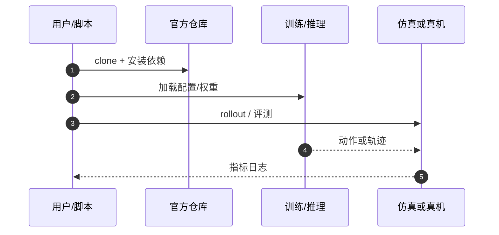

# Machine Zygote（arXiv:2609.17300）

**Machine Zygote**（*Machine Zygote: Causal Biparental Heredity Before Learning in a Germline--Soma Artificial Agent*，[arXiv:2609.17300](https://arxiv.org/abs/2609.17300)，[代码](https://github.com/LyesSaadSaoud/machine-zygote)）来自 [具身智能小站 12 篇盘点](../../sources/blogs/wechat_embodied_station_12_papers_vla_deploy_2026-09-16.md)。

## 一句话定义

**模拟智能体在「学习前」通过双亲 germline 重组与冻结 soma 测试因果遗传 vs 表观相似。**

## 英文缩写速查

| 缩写 | 英文全称 | 简要说明 |
|------|----------|----------|
| germline | Germline | 可遗传配置层 |
| soma | Soma | 个体表现型/执行层 |
| MDP | Markov Decision Process | 序贯决策形式化 |
| IL | Imitation Learning | 模仿学习（本文刻意不在学习阶段） |

## 为什么重要

- 区分亲子行为相似与真正因果遗传；论文明确不外推到生物遗传或真实机器人。
- 开源结论：**已开源**（步骤 2.5，2026-09-16）。
- 与 [12 篇技术地图](../overview/vla-deploy-12-papers-technology-map.md) 中同类工作可横向对照。

## 核心机制

| 项 | 内容 |
|----|------|
| **arXiv** | [2609.17300](https://arxiv.org/abs/2609.17300) |
| **开源** | **已开源** |
| **要点** | 双亲 germline 重组、冻结 soma、干预实验；无学习阶段的模拟智能体。 |
| **文内指标** | 模拟干预实验；非机器人部署论文。 |

## 源码运行时序图

## 实验与评测

- 模拟干预实验；非机器人部署论文。
- **读法：** 索引级摘要；逐项对照与 baseline 以原文 PDF 为准。

## 与其他工作对比

- 横向索引见 [12 篇技术地图](../overview/vla-deploy-12-papers-technology-map.md)；与同 arXiv 节点不重复造页。

## 结论

**Machine Zygote 是方法论/因果实验论文，读法应限定在模拟智能体遗传推断，勿当机器人算法。**

1. 开源边界：**已开源** — 以项目页实际链接为准（入库日 2026-09-16）。
2. 核心机制：双亲 germline 重组、冻结 soma、干预实验；无学习阶段的模拟智能体。…
3. 部署前核对任务协议与硬件条件，勿直接横比公众号摘录数字。

## 关联页面

- [reinforcement-learning](../methods/reinforcement-learning.md)
- [reinforcement-learning](../methods/reinforcement-learning.md)
- [manipulation](../tasks/manipulation.md)
- [paper-robresilience](./paper-robresilience.md)

## 参考来源

- [machine-zygote_arxiv_2609_17300.md](../../sources/papers/machine-zygote_arxiv_2609_17300.md)
- [wechat_embodied_station_12_papers_vla_deploy_2026-09-16.md](../../sources/blogs/wechat_embodied_station_12_papers_vla_deploy_2026-09-16.md)
- [arXiv:2609.17300](https://arxiv.org/abs/2609.17300)

## 推荐继续阅读

- [arXiv PDF](https://arxiv.org/pdf/2609.17300)
- [https://github.com/LyesSaadSaoud/machine-zygote](https://github.com/LyesSaadSaoud/machine-zygote)

