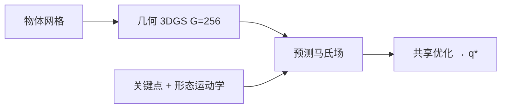

# MANGO-Grasp：几何 3DGS 上的马氏场跨手型抓取

**MANGO-Grasp**（*Mahalanobis Fields over Geometry-Oriented 3D Gaussians for Cross-Embodiment Dexterous Grasping*；[arXiv:2608.02014](https://arxiv.org/abs/2608.02014)，[项目页](https://connor-zh.github.io/MANGO-Grasp/)）由 **A\*STAR-I2R / 南洋理工大学 / 新加坡国立大学 Show Lab** 提出：跨多指手合成稳定抓取，且 **不按手调一套优化超参**。

## 一句话定义

**物体用带外法向的板状 3D Gaussian，手用同时编码外形与可动性的关键点描述子，二者之间的马氏场沿法向敏感、沿切向宽容——训练预测这张场，推理用同一场把所有手优化到可抓配置。**

## 英文缩写速查

| 缩写 | 英文全称 | 简要说明 |
|------|----------|----------|
| 3DGS | 3D Gaussian Splatting | 本文改成几何监督的表面基元，不是外观重建 |
| CMAP | Contact Map 基准 | 见手仿真主表之一 |
| IK | Inverse Kinematics | 关键点随正运动学走，不在此求 IK 抓取 |
| DoF | Degrees of Freedom | 腕 6-DoF + 各手关节 |
| FPS | Farthest Point Sampling | 在规范姿态链网上采 256 个表面点 |

## 为什么重要

- 一只手一个优化器或一个网络，硬件一换就要重做。
- 点云交互把接触当成各向同性距离，分不清切向滑动和法向分离。
- 手描述子若只对齐「长得像」，不管「怎么动」，跨构型会漂。

## 核心信息

| 项 | 内容 |
|----|------|
| **机构** | 新加坡科技研究局资讯通信研究院（A*STAR-I2R）；南洋理工大学（NTU）；新加坡国立大学（NUS） |
| **见手** | ShadowHand、Allegro、Barrett |
| **未见手** | SharpaWave（仿真零样本 + 真机） |
| **开源** | **宣称出版后开源**（截至 2026-08-15） |

## 核心原理

### 方法栈

网格 → 法向监督 densify → 固定 \(G=256\) 板状 Gaussian。手：规范姿态 FPS 256 点，预训练形态身份 + 跨构型运动。交互场 \(\hat M\in\mathbb{R}_+^{256\times256}\) 作目标；推理最小化场重建 + 穿透 + 自碰，**超参跨手共用**。

### 流程总览

## 工程实践

| 项 | 建议 |
|----|------|
| 源码运行时序图 | **不适用**（代码/权重待出版后发布） |
| 何时用 | 多指手型号多、不想为新手重训接触模型 |
| 物体表示 | 用几何/法向监督，不要用纹理 3DGS 直接当接触基元 |
| 真机 | 文内零微调上 SharpaWave；光滑小球（苹果 6/10）仍是弱点 |

## 实验与评测

- 见手仿真：CMAP / MultiGripperGrasp **97.59% / 89.47%**，相对最强见手基线最高 **+8.24 pp**。
- 未见 SharpaWave：**84.17% / 81.47%**，相对最强零样本基线最高 **+16.57 pp**。
- 真机 10 物 ×10 次，平均 **86%**（海绵、番茄汤罐、牙膏盒 10/10；苹果 6/10）。

## 与其他工作对比

相对 DRO 的欧氏关键点–点云距离：马氏场带切向/法向各向异性。相对 TRO 的补丁变换扩散：显式表面框。相对 [UHAS](../methods/uhas-unified-hand-action-space.md)：UHAS 统一策略动作；本文统一 **接触场 + 实现优化**。相对 [DigitCode](./paper-digitcode.md)：DigitCode 符号化手姿态，本文符号化手–物相互作用。

## 结论

**跨手型抓取要同时显式化局部表面方向、物体几何容量和手的可动性，而不是再学一张各向同性距离表。**

1. **接触是各向异性的** — 法向偏离应重罚，切向滑动应更宽容。
2. **容量跟着曲率走** — 平面少而大、高曲率密而小。
3. **手描述子要会「怎么动」** — 只对齐外形不够。
4. **实现层共用超参** — 这才是跨 embodiment 的工程含义。
5. **真机 86% 不是均匀的** — 光滑圆物仍弱。
6. **复现等正式 release。**

## 局限与风险

- 入库日无代码，无法核验 3DGS 几何管线与优化权重。
- \(G=N=256\) 是算力折中；更细接触可能要加基元。
- 输入是网格，从单目深度到网格的误差会直接进场。

## 关联页面

- [抓取位姿估计](../methods/grasp-pose-estimation.md) — 平行爪 6-DoF 对照
- [UHAS](../methods/uhas-unified-hand-action-space.md)
- [灵巧手运动学](../concepts/dexterous-kinematics.md)
- [DigitCode](./paper-digitcode.md)
- [All Hands Up](./all-hands-up.md) — 多手 URDF 画廊

## 参考来源

- [MANGO-Grasp 论文摘录](../../sources/papers/mango_grasp_arxiv_2608_02014.md)
- [MANGO-Grasp 项目页归档](../../sources/sites/mango-grasp.md)
- [具身智能小站 9 篇盘点](../../sources/blogs/wechat_embodied_station_ego2robot_mango_grasp_2026-08-11.md)
- [arXiv:2608.02014](https://arxiv.org/abs/2608.02014)

## 推荐继续阅读

- [MANGO-Grasp 项目页](https://connor-zh.github.io/MANGO-Grasp/)
- DRO / TRO 交互中心抓取（文内主要对照）
