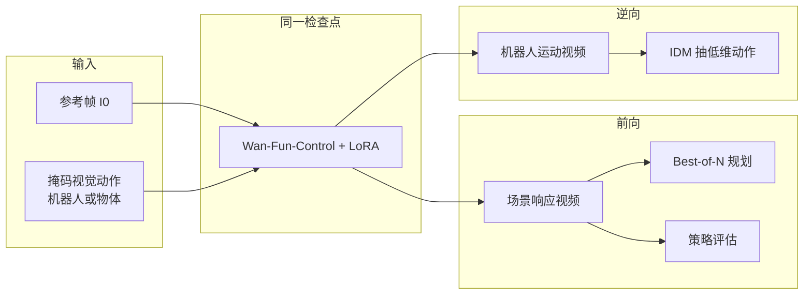
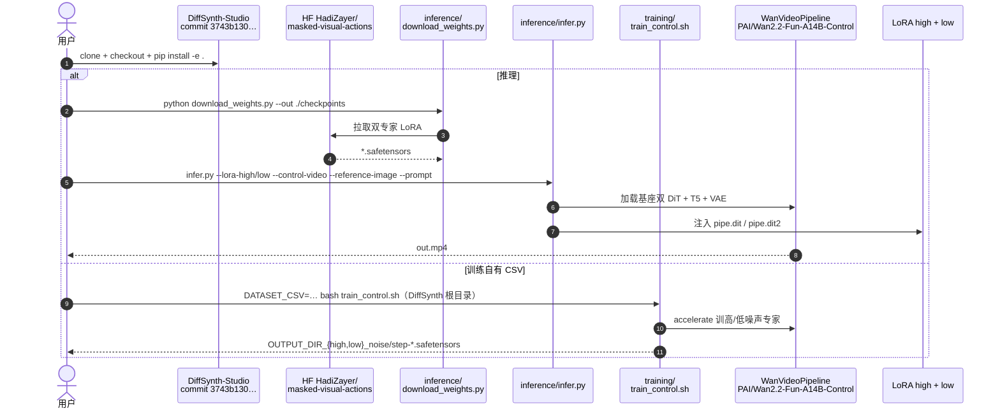

# Masked Visual Actions（统一世界建模的掩码视觉动作）

**Masked Visual Actions**（*Masked Visual Actions for Unified World Modeling*，[arXiv:2607.19343](https://arxiv.org/abs/2607.19343)，2026，Hadi Alzayer 等 · **斯坦福大学（Stanford）** / **马里兰大学学院公园分校（University of Maryland, College Park）** / **哈佛大学（Harvard University）**；[项目页](https://masked-visual-actions.github.io)，[代码](https://github.com/HadiZayer/masked-visual-actions)）把机器人动作写成视频里任意实体的 **像素空间部分揭示轨迹**：同一检查点既可 **前向** 仿真「机器人怎么动 → 场景怎么变」，也可 **逆向** 合成「想要物体怎么动 → 机器人该怎么动」。

## 一句话定义

**一种像素对齐的动作接口：用掩码视频揭示实体轨迹，让预训练视频模型在同一权重上同时充当前向动力学与逆向行为合成器，并支撑规划 / 策略评估 / IDM 抽动作。**

## 英文缩写速查

| 缩写 | 英文全称 | 简要说明 |
|------|----------|----------|
| MVA | Masked Visual Actions | 本文的像素空间掩码动作接口 |
| WM | World Model | 用想象 rollout 支撑规划 / 评估 |
| IDM | Inverse Dynamics Model | 从合成机器人视频恢复低维动作 |
| LoRA | Low-Rank Adaptation | 在 Wan-Fun-Control 14B 上的高效微调 |
| EEF | End-Effector | 末端位姿可视化条件（本文对照基线） |
| DROID | Distributed Robot Interaction Dataset | 真机微调数据源之一 |
| VLM | Vision-Language Model | 规划中作 rollout 评判（Gemini 3.1 Pro） |

## 为什么重要

- **动作表示与视觉先验同空间：** 低维关节 / 骨架 / EEF 与视频模型学到的交互先验不对齐；掩码轨迹直接落在像素时空，跨未见夹爪与双臂具身更稳（项目页 Skeleton / EEF 对照）。
- **一个检查点两种推理方向：** 训练只见机器人掩码，物体目标运动条件仍可 **零样本** 涌现——把前向仿真与「人演示 / 物体目标 → 机器人视频」接到同一骨干。
- **虚拟沙盒可落地：** RoboCasa 上 WM 成功率与 GT **r=0.982**；真机四任务演示进度分布对齐；Best-of-N 规划把 Diffusion Policy 提案在想象里筛优——对齐 [route-03 虚拟沙盒](../overview/world-models-route-03-virtual-sandbox.md)。

## 核心原理（方法）

### 掩码条件

视频模型刻画实体轨迹联合分布。选条件集 \(S\)，掩码 \(M(S)\) 为这些实体所占时空像素的并；模型输入 \(M\odot V\) 与参考帧 \(I_0\)，学习 \(p_\theta(V\mid M\odot V, I_0)\)。

| 设定 | 条件 \(S\) | 预测 | 机器人解读 |
|------|------------|------|------------|
| **前向** | 主动实体（机器人 / 人） | 被动实体与场景响应 | 动作条件动力学 |
| **逆向** | 被动实体（目标物体） | 主动实体运动 | 目标结果 → 机器人行为 |

主动/被动是 **用法标签**，不是训练时硬编码的 agency；推理时可任选 \(S\)。

### 数据与微调

| 模块 | 作用 |
|------|------|
| **分割轨** | SAM + “A robotic arm” 从 DROID 抽机器人掩码；通用，但测试难供精确掩码且遮挡易泄漏 |
| **渲染轨** | 标定后渲染 URDF/mesh（半透明 + 红夹爪）；支持任意动作可视化；需标定 |
| **仿真** | RoboCasa 仅渲染机器人作条件 |
| **基座** | Wan-Fun-Control **2.2 14B**；**LoRA rank 256**；约 **15 h** 掩码数据；~10k step / 8×H200 / ~4 天 |

官方实现不改基座训练器：用 DiffSynth-Studio 钉定 commit 训 **高噪声 / 低噪声** 两个专家 LoRA（MoE 分界 timestep **0.358**）。

### 流程总览

## 实验要点（索引级）

| 轴 | 报告口径（以论文 / 项目页为准） |
|----|--------------------------------|
| 视觉 · DROID / BEHAVIOR | Tab. 1：相对 [Ctrl-World](./paper-ctrl-world.md) / [Wan-Move](./paper-wan-move.md) / [Wan](./paper-wan-video.md)-I2V，LPIPS / SSIM / PSNR 更优；BEHAVIOR 为未见双臂 |
| 条件消融 | Skeleton / EEF 在未见夹爪与双臂上易把机器人「拉回」训练域具身 |
| 规划 | Diffusion Policy 提案 + Best-of-N（\(N=10\)）+ Gemini 3.1 Pro 评判；成功率随样本数上升 |
| 策略评估 · 仿真 | RoboCasa 多任务 WM vs GT 成功率 **r = 0.982**（存在正向任务进度偏置） |
| 策略评估 · 真机 | 四任务 × 20 演示；仿真进度分布与真机对齐 |
| 动作抽取 | 逆设定 + IDM；CoffeeServeMug 上相对 DP / ACT / SmolVLA 有竞争力（图 11 约 **90%**） |

## 开源状态

**部分开源**（截至 **2026-07-22** 项目页与 README 核查）：

| 产物 | 状态 |
|------|------|
| 论文 | [arXiv:2607.19343](https://arxiv.org/abs/2607.19343)（项目页 `paper.pdf` **404**） |
| 代码 | [HadiZayer/masked-visual-actions](https://github.com/HadiZayer/masked-visual-actions) · **Apache-2.0** |
| 权重 | HF `HadiZayer/masked-visual-actions`（`masked_world_lora_{high,low}.safetensors`） |
| 推理 / LoRA 训练 | **可运行**（依赖 DiffSynth-Studio 钉定 commit + 基座 14B） |
| DROID URDF 渲染工具 | README：**coming soon** |
| 完整数据发布 | 论文承诺 release；截至入库日以脚本/权重为主 |

## 源码运行时序图

节点对齐 [`sources/repos/masked-visual-actions.md`](../../sources/repos/masked-visual-actions.md)。

- **最短复现路径：** 装 DiffSynth 钉定 commit → `download_weights.py` → `infer.py`（可选 `--low-vram`）。
- **自有数据微调：** CSV 列 `prompt, reference_image, video, control_video` → `train_control.sh`。
- **控制视频构造：** URDF 渲染工具待官方补齐；此前需自备 control video。

## 工程实践

| 项 | 实践要点 |
|----|----------|
| 算力 | 基座 14B；推理可用 `--low-vram` 磁盘 offload；训练默认多卡 accelerate |
| 条件制作 | 推理侧优先 **渲染轨**（任意关节轨迹可视化）；分割轨更适合数据扩增 |
| 规划环 | 策略采样 \(N\) 条 → WM 想象 → VLM/人工 rubric 选优再真机执行 |
| 评估偏置 | 论文报告 WM 对任务进度 **正向偏置**；相关高仍须真机校准 |
| 选型 | 需要 **跨具身像素条件 + 前向/逆向统一** 时优先；需要 **低延迟大量提案** 见 [DriftWorld](./paper-driftworld.md)；需要 **2D 骨架跨具身** 见 [OSCAR](./paper-oscar.md) |

## 局限与风险

- **相关 ≠ 因果：** 学的是交互相关，不是严格因果；精细接触易出不自然交互。
- **受基座能力绑定：** 速度与可表达性受 Wan-Fun-Control 限制；未见参考帧区域易伪影。
- **部分开源：** 不可假设 clone 即可复现论文全部数据管线；渲染工具与完整数据仍待齐。
- **评估偏置：** 想象成功率系统性偏高；适合预筛选与版本对比，不能单独替代真机验收（见 [评测选型闭环](../queries/embodied-eval-benchmark-selection-loop.md)）。

## 与相邻工作的分界（对比）

| 对比轴 | Masked Visual Actions | [DriftWorld](./paper-driftworld.md) | [OSCAR](./paper-oscar.md) |
|--------|----------------------|-------------------------------------|---------------------------|
| **条件** | **像素掩码轨迹**（机器人或物体） | 低维动作 + 帧级 FiLM | **2D 运动学骨架** |
| **生成范式** | 扩散控制模型 + LoRA | **Drifting · 1-step** | Cosmos-Predict 扩散 / flow |
| **统一能力** | **前向 + 零样本逆向** | 主打前向快想象 | 主打跨具身前向 |
| **评估叙事** | RoboCasa **r=0.982** + 真机进度对齐 | 离线相关最高约 **0.99** + GPC-RANK | RoboArena 真机排名相关 |
| **开源重心** | DiffSynth LoRA 推理/训练；渲染 *soon* | Push-T 全链路 | 数据管线 + 2B 微调 |

## 关联页面

- [Generative World Models](../methods/generative-world-models.md) — 像素域 WM 谱系；本页为 **掩码动作条件** 代表
- [Video-as-Simulation](../concepts/video-as-simulation.md) — 像素仿真动机
- [世界模型路线 03：虚拟沙盒](../overview/world-models-route-03-virtual-sandbox.md) — 规划 / 评估沙盒
- [世界模型路线 01：级联架构](../overview/world-models-route-01-cascade.md) — 逆设定 + IDM 抽动作
- [robot-world-models-training-loop-taxonomy](../overview/robot-world-models-training-loop-taxonomy.md) — 学习型模拟器坐标
- [DriftWorld](./paper-driftworld.md) — 1-step 快评估对照
- [OSCAR](./paper-oscar.md) — 骨架条件跨具身对照
- [Ctrl-World](./paper-ctrl-world.md) — 低维动作多视角 VLA 闭环对照（文中视觉基线）
- [Wan-Move](./paper-wan-move.md) / [Wan](./paper-wan-video.md) — 轨迹可控 I2V 与上游视频先验（文中对照）
- [GigaWorld-1](./paper-gigaworld-1-policy-evaluation.md) / [WorldGym](./paper-shenlan-wm-15-worldgym.md) — WM 作评估器坐标
- [具身大模型评测基准选型闭环](../queries/embodied-eval-benchmark-selection-loop.md) — ② 世界模型评估层
- [Manipulation](../tasks/manipulation.md) — 操纵基准语境

## 参考来源

- [Masked Visual Actions 论文归档（arXiv:2607.19343）](../../sources/papers/masked_visual_actions_arxiv_2607_19343.md)
- [HadiZayer/masked-visual-actions 代码索引](../../sources/repos/masked-visual-actions.md)
- [Masked Visual Actions 项目页归档](../../sources/sites/masked-visual-actions-github-io.md)

## 推荐继续阅读

- [arXiv:2607.19343](https://arxiv.org/abs/2607.19343) — 论文全文
- [项目页演示](https://masked-visual-actions.github.io)
- [GitHub — HadiZayer/masked-visual-actions](https://github.com/HadiZayer/masked-visual-actions)
- [DiffSynth-Studio](https://github.com/modelscope/DiffSynth-Studio) — 训练/推理依赖
