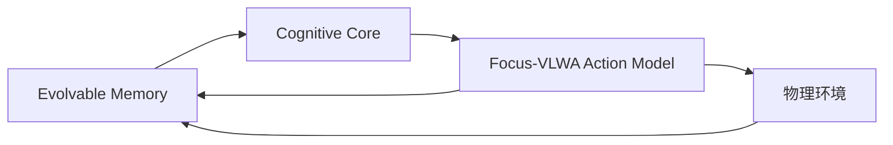
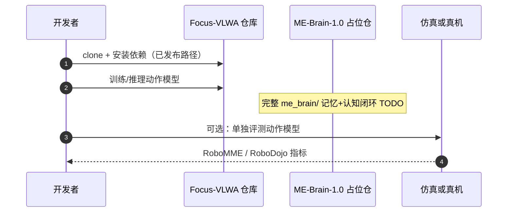

# ME-Brain-1.0：记忆、认知与动作的自我演进具身框架

**ME-Brain-1.0**（*Memory, Cognition and Action for Evolving Embodied Intelligence*，[arXiv:2609.24271v2](https://arxiv.org/abs/2609.24271v2)，[项目页](https://machembodied.com/ME-Brain/ME-Brain-1.0.html)，[代码](https://github.com/MachEmbodied/ME-Brain-1.0)）由 **理想汽车 MachEmbodied** 提出：把 **Evolvable Memory**、**Cognitive Core** 与 **Action Model** 组成闭环——执行产生轨迹，轨迹沉淀为可检索经验，认知核在新任务中查经验、分解与重规划，动作模型在关键交互时刻生成控制，结果再写回记忆。

## 一句话定义

**机器人通过外部可演进记忆积累技能经验，在不动模型权重的前提下，让「做过的事」变成「下次能查到的知识」。**

## 英文缩写速查

| 缩写 | 英文全称 | 简要说明 |
|------|----------|----------|
| ME-Brain | MachEmbodied Brain | 本文记忆–认知–动作自我演进框架 |
| VLM | Vision-Language Model | 认知核可对接 [ME-VLM](./paper-me-vlm.md) |
| VLWA | Vision-Language-World-Action | Focus-VLWA 动作模型族 |
| SFT | Supervised Fine-Tuning | 认知/动作模块典型训练阶段 |
| SR | Success Rate | 任务成功率 |

## 为什么重要

- 纳入 [2026-09-25 理想四篇盘点](../../sources/blogs/wechat_li_auto_me_brain_vlm_u0_dex_2026-09-25.md)：与 ME-VLM（认知训练）、ME-U0（理解–生成动作）、ME-Dex（触觉 WAM）形成同机构 **分层栈**。
- 明确 **自我演进 ≠ 在线微调权重**：演进的是记忆结构与技能库，适合长程、多任务部署叙事。
- **开源结论：部分开源**（步骤 2.5，2026-09-25）— [Focus-VLWA](https://github.com/MachEmbodied/Focus-VLWA) 动作模型训练/推理已释；完整 ME-Brain 框架、ME-VLM 子模块集成、仿真/真机栈 **待发布**。

## 核心机制

| 模块 | 职责 |
|------|------|
| **Evolvable Memory** | 编码视觉、关节、动作与结果；长轨迹事件化（抓取/放置等），归纳成功/失败模式；事件链回原始观测 |
| **Cognitive Core** | 任务分解、技能/工具调用、结果验证、失败归因与重规划；与 [ME-VLM](./paper-me-vlm.md) 训练路线对齐 |
| **Action Model（Focus-VLWA）** | 聚焦下一交互事件，结合相关历史与局部未来条件生成关节/夹爪动作；轨迹反馈记忆 |

```mermaid
flowchart LR
  mem[Evolvable Memory]
  cog[Cognitive Core]
  act[Focus-VLWA Action Model]
  env[物理环境]
  env --> mem
  mem --> cog
  cog --> act
  act --> env
  act --> mem
```

## 实验与评测

| 设定 | 结果 | 读法 |
|------|------|------|
| **Cognitive Core / embodied benchmark** | ME-VLM 35B-A3B **70.9**；领先最强对照 **8.2 分** | 26 项具身基准，14 项最佳或并列最佳 |
| **Cognitive Core / agent benchmark** | ME-VLM 35B-A3B **72.5**；领先最强对照 **9.6 分** | 4B 版本平均 **63.1**，也高于该表所有对照 |
| **Focus-VLWA / RoboMME** | **47.88%**，较 FrameSampling + Modulation 高 **3.26 个百分点** | 16 项历史依赖操作，覆盖计数、持续性、指代、模仿 |
| **Focus-VLWA / RoboDojo** | 平均 Score **21.51**、SR **16.03%**；较 π₀.₅ 高 **10.10 分 / 9.12 个百分点** | Memory 维度 Score **25.57**、SR **24.67%**；54 配置 × 24 次，共 1,296 次仿真试验 |
| **Piper 双臂真机 / ME-RealBench** | 六任务各 10 次；平均 SR **66.7%**、Score **69.5** | 相比 DM0.5 高 **11.7 个百分点 / 12.8 分**；叠碗 10/10，插充电器 1/10 |

以上均为论文 v2 报告的结果；真机 Score 为任务完成进度分，不能与成功率混为一谈。

## 与其他工作对比

| 维度 | ME-Brain 1.0 | [ME-U0](./paper-me-u0.md) | 典型端到端 VLA |
|------|--------------|---------------------------|----------------|
| 长程经验 | **显式外部记忆** + 事件检索 | 无显式长观察历史（RoboDojo 记忆维 ~7%） | 多为单窗口上下文 |
| 权重更新 | 任务级 **不改** 主模型权重 | 预训练 + 下游适配 | 微调或 RL 均可 |
| 动作生成 | Focus-VLWA 事件中心 | MoT 理解–生成联合 flow matching | 单骨干动作头 |

## 结论

**ME-Brain 1.0 把「会记住、会改计划、再动手」拆成可运维的三模块栈，用外部记忆承担演进，而不是每次任务反向传播改权重。**

1. **部分开源**：Focus-VLWA 训练与推理代码已释；ME-VLM 认知核、完整 ME-Brain 框架、仿真/真机集成和预训练权重仍待发布（按 2026-10-09 仓库 README）。
2. 真机 avg **66.7%** 说明闭环已跑通，但 **contact-rich 插入** 与 RoboDojo 低分暴露长程/精细操作上限。
3. 认知核训练见 [ME-VLM](./paper-me-vlm.md)；勿将同一系统下的 ME-VLM 案例重复计为独立真机验证集。
4. 与 ME-U0 分工：Brain 引 **过去经验**；U0 做 **当前理解 + 未来视觉–动作联合生成**。
5. 部署前区分「记忆检索延迟 / 一致性」与「动作模型频率」的工程预算。

## 源码运行时序图

```mermaid
sequenceDiagram
  autonumber
  participant U as 开发者
  participant F as Focus-VLWA 仓库
  participant M as ME-Brain-1.0 占位仓
  participant S as 仿真或真机
  U->>F: clone + 安装依赖（已发布路径）
  U->>F: 训练/推理动作模型
  Note over M: 完整 me_brain/ 记忆+认知闭环 TODO
  U->>S: 可选：单独评测动作模型
  S-->>U: RoboMME / RoboDojo 指标
```

**完整 ME-Brain 闭环：** 截至 2026-10-09，README 已发布 Focus-VLWA 训练/推理代码；预训练权重、ME-VLM 认知核和完整框架/仿真/真机集成仍在 Todo。

## 关联页面

- [ME-VLM](./paper-me-vlm.md)
- [MachEmbodied-U0](./paper-me-u0.md)
- [ME-Dex 1.0](./paper-me-dex-1-0.md)
- [四篇技术地图](../overview/li-auto-machembodied-4-papers-technology-map.md)

## 参考来源

- [me_brain_1_0_arxiv_2609_24271.md](../../sources/papers/me_brain_1_0_arxiv_2609_24271.md)
- [wechat_li_auto_me_brain_vlm_u0_dex_2026-09-25.md](../../sources/blogs/wechat_li_auto_me_brain_vlm_u0_dex_2026-09-25.md)
- [arXiv:2609.24271v2](https://arxiv.org/abs/2609.24271v2)
- [v2 HTML 全文](https://arxiv.org/html/2609.24271v2)

## 推荐继续阅读

- [arXiv PDF](https://arxiv.org/pdf/2609.24271)
- [Focus-VLWA 代码](https://github.com/MachEmbodied/Focus-VLWA)
- [MachEmbodied Brain 项目区](https://machembodied.com/index.html#brain)
