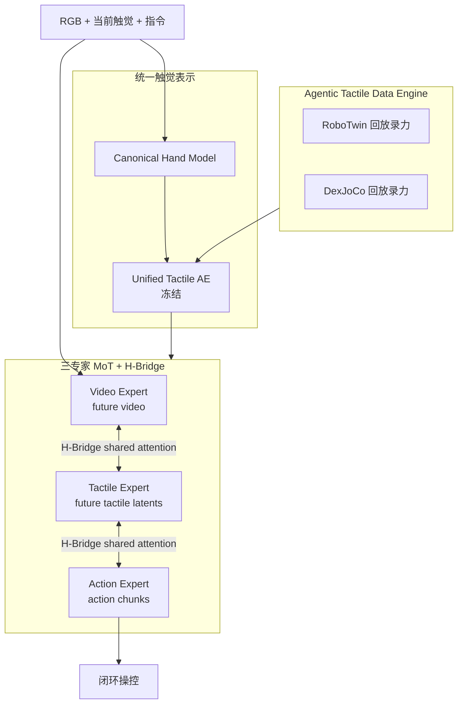
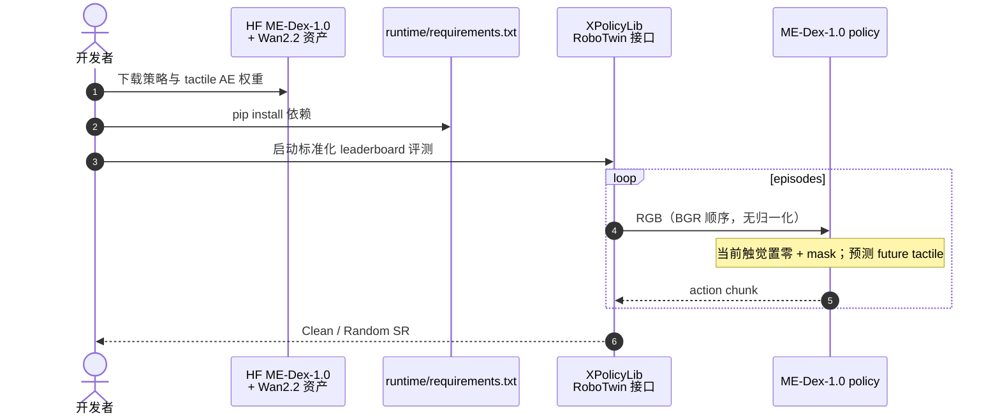

# ME-Dex 1.0：异构触觉进入 World Action Modeling

**ME-Dex 1.0**（*Bringing Heterogeneous Tactile Sensing into World Action Modeling*，[arXiv:2609.21449](https://arxiv.org/abs/2609.21449)，[项目页](https://machembodied.com/ME-Dex/ME-Dex1.0.html)，[代码](https://github.com/MachEmbodied/ME-Dex-1.0)）由 **理想汽车（Li Auto）Foundation Model** 提出：**MachEmbodied-Dex-1.0** 把触觉与视频并列建模为 **未来观测**，在 Mixture-of-Transformers 内用 flow matching 联合预测 future video、future tactile latents 与 action chunks。

## 一句话定义

**触觉不该只是条件输入——ME-Dex 1.0 把 future tactile 与 future video 一起预测，再让动作专家在联合去噪里读两种动力学。**

## 英文缩写速查

| 缩写 | 英文全称 | 简要说明 |
|------|----------|----------|
| WAM | World Action Model | 联合未来观测与动作生成的具身策略 |
| MoT | Mixture-of-Transformers | 视频/触觉/动作三专家并行 Transformer |
| AE | Autoencoder | Unified Tactile AE 编码异构触觉到共享潜空间 |
| SR | Success Rate | 闭环任务成功率 |
| HF | Hugging Face | 权重托管 |

## 为什么重要

- **范式推进：** 相对「VLA/WAM + 当前触觉条件」（Figure 1a–b），ME-Dex 1.0 把 **future tactile** 与 **future video** 并列作为预测目标（Figure 1c），动作生成可读取两种未来动力学表示。
- **跨具身触觉：** Canonical Hand Model + Unified Tactile AE 解决 **Representation Gap**——多手型/夹爪/传感布局映射到共享空间后再联合训练。
- **数据引擎：** Agentic Tactile Data Engine 在 RoboTwin / DexJoCo 轨迹回放时从仿真力传感器录触觉，缓解 **Data Gap**（原生 benchmark 无触觉）。
- **工程触点：** RoboTwin Clean→Random **78.9% avg** 超过公开榜 OLA-Sem 等；**推理 runtime + HF 权重已开源**，训练侧待发布。

## 核心信息

| 项 | 内容 |
|----|------|
| **机构** | 理想汽车（Li Auto）Foundation Model |
| **骨干初始化** | Video / Action Expert 自 [Motus](./paper-sa-2512-13030-motus-a-unified-latent-action-world-model.md) 预训练权重；Tactile Expert 随机初始化 |
| **训练目标** | flow matching 联合去噪：future video + future tactile latents + action chunks |
| **触觉对齐** | Canonical Hand Model（人手启发模板）+ Unified Tactile AE（跨源预训练后 **冻结**） |
| **数据** | RoboTwin 50 任务 27500 轨迹（Clean+Random）；DexJoCo 11 任务 1100 demo；ManiFeel 4 任务各 50 demo |
| **开源** | **部分开源**：推理 + RoboTwin leaderboard 评测 [MachEmbodied/ME-Dex-1.0](https://github.com/MachEmbodied/ME-Dex-1.0)；HF 权重已发布；**训练代码/数据 Coming soon** |

### 流程总览

## 评测

| 平台 | 设定 | 主要结果 |
|------|------|----------|
| **RoboTwin** | Clean+Random 混合训练 | Clean **91.56%** / Random **91.92%**（Table 1 Full Joint + H-Bridge） |
| **RoboTwin** | 仅 2500 Clean 训练；评测时触觉置零 | Clean **89.6%** / Random **68.1%**，**avg 78.9%**（超 OLA-Sem +6.5 pt avg） |
| **DexJoCo** | 11 任务 multi-task，rand-obj | **65.3% avg**；双手 avg **48.8%**（超 DECO/DECO.p 39.6%） |
| **ManiFeel** | 4 插入任务，单任务 50 demo | **70.0% avg**（+15 pt vs Diffusion Policy baseline） |
| **真机** | LeRobot SO-101 + Paxini PX6AX；Xynova Flex2 双手 | 定性：换插座、叠罐等 contact-rich 序列 |

**消融读法（RoboTwin Random）：** 仅 VA **86.90%** → +当前触觉条件 **89.54%** → +future tactile 预测 **90.60%** → +H-Bridge **91.92%**。训练后评测时将当前触觉置零仍 **91.70%**，说明 future tactile 预测路径可部分补偿缺失当前触觉。

## 与其他工作对比

同为「把触觉接进操作策略」，差别在 **触觉出现在计算图的哪一侧**：

| 维度 | ME-Dex 1.0（本页） | [ContactWorld](./paper-sa-2606-13877-contactworld-what-matters-in-vision-tactile-worl.md) / [Tactile-WAM](./paper-sa-2606-26663-tactile-wam-touch-aware-world-action-model-with.md) | 把触觉只当条件输入的 VLA |
|------|---------------------|--------------------------------------------------------------------------------------------------------------------------------------------|---------------------------|
| 触觉的角色 | **与视频并列的未来观测**，被联合预测 | 视触觉世界模型，各自定义触觉进入方式 | 仅作为观测条件，不被预测 |
| 结构 | 三专家 MoT + **H-Bridge 共享注意力** | 见各自页 | 单骨干 + 动作头 |
| 跨传感器对齐 | Canonical Hand Model + **冻结** Unified Tactile AE | 依赖各自传感器口径 | 通常绑定单一传感器 |
| 代价 | 需要成规模的配对触觉数据与回放录力管线 | 同类代价 | 最低 |

- **「预测触觉」比「读触觉」多要求什么：** 联合去噪要求触觉信号 **可预测且与动作因果相关**；传感器噪声大或标定漂移时，这一支会变成噪声源而不是信息源——这也是 Unified Tactile AE 需要跨源预训练后 **冻结** 的原因。
- **数值可比性：** RoboTwin avg **78.9%（Clean→Random）** 是仿真基准口径，属 [评测闭环](../queries/embodied-eval-benchmark-selection-loop.md) 的 ③ 层；与 DexJoCo / ManiFeel 上的数不是同一评测面，也不蕴含真机成功率。
- **复现边界：** 仓库目前是 **推理 + RoboTwin 评测**，训练代码与数据 coming soon；因此第三方暂时只能复现 **评测**，不能复现 **训练配方**，对比时应注明这一不对称。

## 结论

**ME-Dex 1.0 把「触觉条件 WAM」推进到「未来触觉–视频–动作三模态联合 WAM」，并用统一手模 + 数据引擎把异构传感与缺触觉 benchmark 接进同一训练栈。**

- future tactile 与 future video 并列预测，是比纯条件输入更完整的 contact-rich 世界建模
- H-Bridge 共享注意力在 Random 上带来约 +1.3 pt，三专家信息交换有实证增益
- Unified Tactile AE 跨 RoboTwin/DexJoCo/ManiFeel contact F1 90%+，支撑跨布局联合训练
- RoboTwin Clean→Random **78.9%** 与 DexJoCo **65.3%** 在公开/自建基线上有竞争力
- 双手任务（Assembly/Microwave 等）相对 DECO 系有明显优势，但并非全任务 uniform SOTA
- **开源边界清晰：** 可复现 RoboTwin leaderboard 推理；训练代码与 Agentic Data Engine **待发布**
- Leaderboard 评测 **无触觉观测** 时靠零输入 + 预测 future tactile——部署读法与有触觉训练设定不同

## 源码运行时序图

**不适用完整训练复现：** README 声明 training code & data **Coming soon**；上图覆盖 **已发布** 的 leaderboard 推理路径。

## 工程实践

| 主题 | 说明 |
|------|------|
| 视觉契约 | 单 RGB→BGR；**不做** mean/std 归一化（与 checkpoint 对齐） |
| 无触觉评测 | Leaderboard 无 force 观测：current tactile=0，靠模型预测 future tactile |
| 权重依赖 | 除策略包外需 Wan2.2-TI2V-5B 的 VAE/T5/tokenizer |
| 数据引擎 | 仿真回放录力传感器——复现训练侧需等官方 release |
| 对照基线 | Fast-WAM / π₀.₅ / Motus；+Tac 变体用同一 Unified Tactile AE 编码 |

## 局限与风险

- **训练不可复现（截至入库日）：** 仅有 inference runtime，Agentic Tactile Data Engine 与联合训练脚本未公开。
- **项目页不可达：** 入库日 `machembodied.com` SSL 失败，演示视频与补充材料需后续核实。
- **触觉缺失评测：** Clean→Random leaderboard 协议故意无触觉输入，数字不能等同于「全程力传感闭环」。
- **任务方差：** ManiFeel Gear Assembly 略低于 baseline；DexJoCo 部分单臂任务 DECO 仍更强。

## 关联页面

- [World Action Models（WAM）](../concepts/world-action-models.md)
- [RoboTwin](./robotwin.md)
- [Motus（索引）](./paper-sa-2512-13030-motus-a-unified-latent-action-world-model.md)
- [ContactWorld](./paper-sa-2606-13877-contactworld-what-matters-in-vision-tactile-worl.md)
- [Tactile-WAM（TAAM）](./paper-sa-2606-26663-tactile-wam-touch-aware-world-action-model-with.md)
- [Manipulation](../tasks/manipulation.md)

## 参考来源

- [me_dex_1_0_arxiv_2609_21449.md](../../sources/papers/me_dex_1_0_arxiv_2609_21449.md)
- [me-dex-1-0.md](../../sources/sites/me-dex-1-0.md)
- [machembodied-me-dex-1-0.md](../../sources/repos/machembodied-me-dex-1-0.md)

## 推荐继续阅读

- [arXiv:2609.21449](https://arxiv.org/abs/2609.21449)
- [GitHub 推理仓库](https://github.com/MachEmbodied/ME-Dex-1.0)
- [HF RoboTwin Clean2Random 权重](https://huggingface.co/liuxuetao/ME-Dex-1.0-RoboTwin-Clean2Random-Leaderboard)
- [Motus 项目页](https://motus-robotics.github.io/motus)
