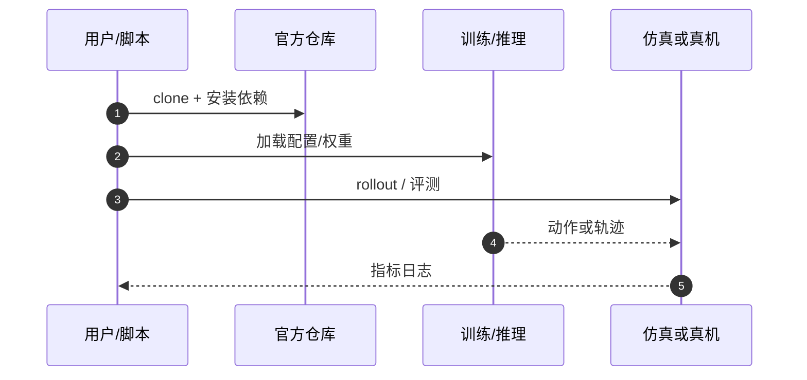

# MachEmbodied-U0（arXiv:2609.25627）

**MachEmbodied-U0**（*MachEmbodied-U0: Unified Understanding and Generation Model for Embodied Intelligence*，[arXiv:2609.25627](https://arxiv.org/abs/2609.25627)，[项目页](https://machembodied.com/ME-U/ME-U0.html)，[代码](https://github.com/MachEmbodied/ME-U0)）来自 [具身智能小站 12 篇盘点](../../sources/blogs/wechat_embodied_station_12_papers_collab_wm_2026-09-23.md)；[2026-09-25 理想四篇盘点](../../sources/blogs/wechat_li_auto_me_brain_vlm_u0_dex_2026-09-25.md) 将其与 ME-Brain / ME-VLM / ME-Dex 并读（**复用本页，不重复 arXiv 节点**）。

## 一句话定义

**Mixture-of-Transformers 连接子任务理解、affordance grounding、视觉动态与连续动作生成；~4200h 预训练。**

## 英文缩写速查

| 缩写 | 英文全称 | 简要说明 |
|------|----------|----------|
| ME-U0 | MachEmbodied-U0 | 本文统一理解–生成具身模型 |
| MoT | Mixture-of-Transformers | 多专家 Transformer 混合 |
| VLA | Vision-Language-Action | 视觉–语言–动作策略 |
| WM | World Model | 环境动态预测模型 |

## 为什么重要

- 把理解、预测与动作合进一个具身模型，避免 VLA 与 world model 割裂；报告 RoboDojo 17.66、LIBERO 99.0%、LIBERO-Plus 82.5%。
- 开源结论：**已开源**（步骤 2.5，2026-09-23）。
- 与 [12 篇技术地图](../overview/collab-wm-12-papers-technology-map.md) 中同类工作可横向对照；与 [ME-Brain 1.0](./paper-me-brain-1-0.md) 分工：U0 缺显式长程记忆（RoboDojo 记忆维 ~7%），Brain 用外部记忆承担演进。

## 核心机制

| 项 | 内容 |
|----|------|
| **arXiv** | [2609.25627](https://arxiv.org/abs/2609.25627) |
| **开源** | **已开源** |
| **要点** | MoT 多专家 + 统一预训练；子任务理解 / affordance / 视觉动态 / 动作生成共享表征。 |
| **文内指标** | 官方仓库提供后训练与评测代码；具体消融以原文为准。 |

## 源码运行时序图

## 实验与评测

- 官方仓库提供后训练与评测代码；具体消融以原文为准。
- **读法：** 索引级摘要；逐项对照与 baseline 以原文 PDF 为准。

## 与其他工作对比

- 横向索引见 [12 篇技术地图](../overview/collab-wm-12-papers-technology-map.md)；与同 arXiv 节点不重复造页。

## 结论

**ME-U0 代表 MachEmbodied 统一理解–生成–动作路线；与 ME-Dex 1.0 触觉 WAM 形成同机构对照。**

1. 开源边界：**已开源** — 以项目页实际链接为准（入库日 2026-09-23）。
2. 核心机制：MoT 多专家 + 统一预训练；子任务理解 / affordance / 视觉动态 / 动作生成共享表征。…
3. 部署前核对任务协议与硬件条件，勿直接横比公众号摘录数字。

## 关联页面

- [vla](../methods/vla.md)
- [world-action-models](../concepts/world-action-models.md)
- [manipulation](../tasks/manipulation.md)
- [paper-me-dex-1-0](./paper-me-dex-1-0.md)

## 参考来源

- [me-u0_arxiv_2609_25627.md](../../sources/papers/me-u0_arxiv_2609_25627.md)
- [wechat_embodied_station_12_papers_collab_wm_2026-09-23.md](../../sources/blogs/wechat_embodied_station_12_papers_collab_wm_2026-09-23.md)
- [wechat_li_auto_me_brain_vlm_u0_dex_2026-09-25.md](../../sources/blogs/wechat_li_auto_me_brain_vlm_u0_dex_2026-09-25.md)
- [arXiv:2609.25627](https://arxiv.org/abs/2609.25627)

## 推荐继续阅读

- [arXiv PDF](https://arxiv.org/pdf/2609.25627)
- [项目页](https://machembodied.com/ME-U/ME-U0.html)
- [https://github.com/MachEmbodied/ME-U0](https://github.com/MachEmbodied/ME-U0)

