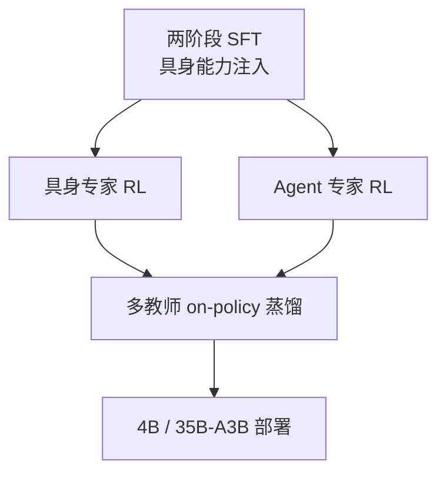

# ME-VLM：统一具身认知与 Agent 协调的 VLM

**ME-VLM**（*A Unified VLM for Embodied Cognition and Agent Coordination*，[arXiv:2609.24526](https://arxiv.org/abs/2609.24526)，[项目页](https://machembodied.com/ME-Brain/ME-VLM.html)，[仓库](https://github.com/MachEmbodied/ME-VLM)）是 **MachEmbodied（理想汽车基础模型团队）** 的统一视觉–语言模型，提供 **4B** 与 **35B-A3B** 两档，在同一建模框架内融合 **具身认知**（几何/时序/执行反馈）与 **多模态 Agent**（规划、工具调用、失败归因与修正）。

## 一句话定义

**一个 VLM 同时做「看懂物理世界里的下一步」和「数字任务里的多轮 Agent」，靠分专家 RL 再蒸馏合并，而不是简单串联规划器与执行器。**

## 英文缩写速查

| 缩写 | 英文全称 | 简要说明 |
|------|----------|----------|
| ME-VLM | MachEmbodied-VLM | 本文统一 VLM |
| VLM | Vision-Language Model | 视觉–语言多模态骨干 |
| RL | Reinforcement Learning | 具身 / Agent 双专家强化学习 |
| SFT | Supervised Fine-Tuning | 两阶段具身能力注入 |
| MoE | Mixture of Experts | 35B-A3B 稀疏激活变体 |

## 为什么重要

- [ME-Brain 1.0](./paper-me-brain-1-0.md) 的 **Cognitive Core** 与本文训练路线直接对应：Brain 讲系统协同，ME-VLM 讲认知核 **如何练出来**。
- 训练强调 **执行反馈与结果检查**（仿真堆叠案例中认错目标后根据反馈改计划），与「只出计划不验结果」的级联管线对比。
- **开源结论：待发布**（步骤 2.5，2026-09-25）— 技术报告与 PDF 已释；推理/训练/4B·35B 权重与端侧工具包 **TODO**。

## 核心机制

| 阶段 | 内容 |
|------|------|
| **能力注入** | 多模态基座 + 空间关系、 affordance、动作前提/结果；练习 **选下一步** 与 **检查是否完成** |
| **双专家 RL** | 具身专家：物理约束、空间判断、执行反馈；Agent 专家：拆解、工具、多轮交互 |
| **多教师蒸馏** | 学生在 **自身轨迹** 上由专家 on-policy 指导，合并为单一部署模型 |
| **端侧（4B）** | Visual token 压缩、W4A8 量化、M100 NPU 协同（论文报告 prefill 400ms→188ms） |

## 实验与评测

| 指标 | 报告值 | 读法 |
|------|--------|------|
| **ME-VLM 35B-A3B 具身基准 avg** | **70.9** | 26 项具身相关基准综合（物理理解、规划、执行、纠错等） |
| **Agent 基准 avg** | **72.5** | 多模态理解、工具、长程规划等套件综合 |
| **仿真堆叠案例** | 定性 | 首轮认错目标 → 反馈后改计划，第三轮完成 |
| **真机** | 未给大样本 SR | 与 ME-Brain 共享系统背景；**勿重复计为第二套独立真机集** |

## 与其他工作对比

| 维度 | ME-VLM | 级联「VLM 规划 + 独立 VLA 执行」 | [ME-U0](./paper-me-u0.md) |
|------|--------|----------------------------------|---------------------------|
| 决策层 | 统一 VLM 内嵌 Agent + 具身认知 | 模块边界清晰但反馈闭环弱 | 理解专家选子任务/接触点 |
| 输出 | 语言/结构化决策 → 下游动作模块 | 同上 | 直接联合生成视觉未来 + 动作 |
| 开源 | 报告已释，权重/代码 TODO | 依具体项目 | **已开源** ME-U0 仓库 |

## 结论

**ME-VLM 是 MachEmbodied 栈的「认知与 Agent 中枢」：用分专家 RL + 蒸馏解决具身与数字任务优化目标冲突，再向 ME-Brain 记忆–动作环供决策。**

1. **待发布** 推理与权重前，第三方只能读报告与项目页案例，无法复现榜单数字。
2. 70.9 / 72.5 为 **多基准平均**，不可与单一 LIBERO/RoboTwin 数字直接横比。
3. 训练强调 **失败恢复与结果检查** — 部署时应保留执行反馈通道，而非开环计划。
4. 4B 端侧路径说明车企场景对 **延迟与量化** 的要求，与云端 35B 形成产品梯度。
5. 与 ME-U0：**VLM 定「做什么/对不对」**；U0 定 **「怎么动 + 世界怎么变」** 的联合生成。

## 源码运行时序图

不适用：GitHub README Todo 列 **Inference code / Training code / Pretrained weights** 均为未完成（2026-09-25）。待官方发布推理入口后，应按「加载 4B/35B → 多模态 prompt + 图像 → 具身/Agent 决策 JSON → 下游执行器」补序图。

## 关联页面

- [ME-Brain 1.0](./paper-me-brain-1-0.md)
- [MachEmbodied-U0](./paper-me-u0.md)
- [VLA](../methods/vla.md)
- [四篇技术地图](../overview/li-auto-machembodied-4-papers-technology-map.md)

## 参考来源

- [me_vlm_arxiv_2609_24526.md](../../sources/papers/me_vlm_arxiv_2609_24526.md)
- [wechat_li_auto_me_brain_vlm_u0_dex_2026-09-25.md](../../sources/blogs/wechat_li_auto_me_brain_vlm_u0_dex_2026-09-25.md)
- [arXiv:2609.24526](https://arxiv.org/abs/2609.24526)

## 推荐继续阅读

- [arXiv PDF](https://arxiv.org/pdf/2609.24526)
- [ME-VLM 项目页](https://machembodied.com/ME-Brain/ME-VLM.html)
- [ME-Brain 总览](https://machembodied.com/index.html#brain)
