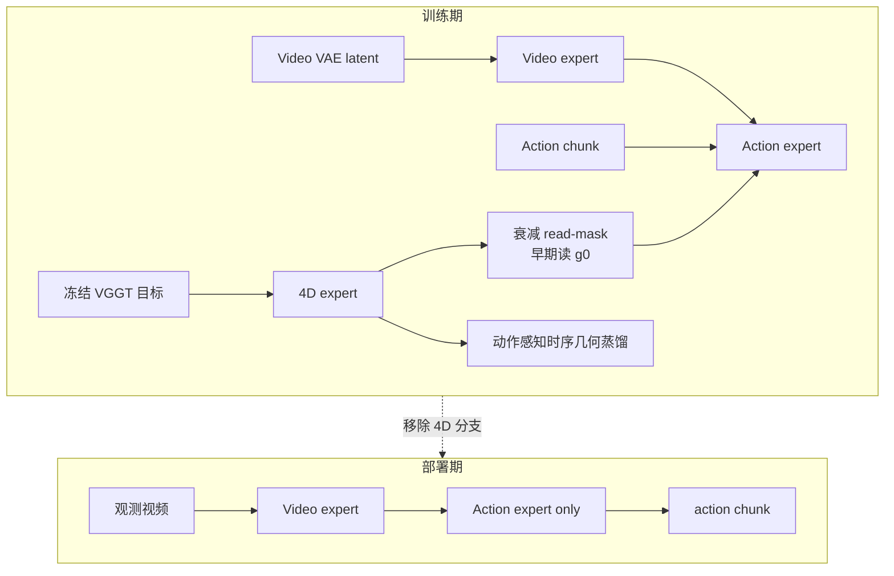

# MECo-WAM（Multi-Expert Co-Training World Action Model · arXiv:2607.05468）

**MECo-WAM**（*Learning 4D Geometric Priors for Inference-Efficient World Action Models*，[arXiv:2607.05468](https://arxiv.org/abs/2607.05468)，Midea AI Research / 同济大学等，[meco-wam.github.io](https://meco-wam.github.io/)）在 **不改变部署推理图** 的前提下，用 **训练期轻量 4D 专家** 把 **动作相关时序几何** 注入 video-action WAM：冻结 **VGGT** 提供关系监督，**衰减 4D read-mask** 早期允许读当前帧几何、后期撤依赖，**动作感知时序几何蒸馏** 对齐关键 token 对；**推理时移除全部 4D 辅助模块**。

## 一句话定义

**4D 几何只在训练里当老师——校正 video-action 表征，真机推理仍是原来的轻量 WAM 通路。**

## 英文缩写速查

| 缩写 | 英文全称 | 简要说明 |
|------|----------|----------|
| WAM | World Action Model | 视频–动作 **联合 flow matching** 基线 |
| VGGT | Visual Geometry Grounded Transformer | **冻结** 4D 关系监督源 |
| MoT | Mixture-of-Transformers | video / action / **4D** 三专家共训 |
| CFM | Conditional Flow Matching | 视频与动作 denoising 目标 |
| 4D expert | — | 预测 keyframe 几何关系 $g_{p1}, g_{p2}, g_{ph}$ |
| read-mask | — | 控制 action 路径 **何时可读 4D token** |
| Fast-WAM | — | **训练学世界、部署不想象** 同族部署哲学 |

## 为什么重要

- **回应「几何监督 vs 推理延迟」矛盾：** 策展文强调 **4D 留在训练阶段**；MECo-WAM 与 [RynnWorld-4D](./paper-rynnworld-4d-rgb-depth-flow.md) **显式 4D 生成** 构成设计光谱 **两端**。
- **针对 WAM 表征瓶颈：** 外观导向 video latent **不保证抓取可达/对齐/接触稳定**；时序几何关系 **随 approach–contact–release 演化**，需 **action-relevant** 监督而非 generic reconstruction。
- **与 [DSWAM](./paper-dswam-dual-system-wam.md) 同 Midea WAM 生态：** DSWAM 解耦 **规划–执行**；MECo 解耦 **训练几何–部署算力**；作者重叠（Jian Zhu、Chong Ma、Yi Xu 等）。
- **LIBERO 98.2% + RoboTwin 92.6%：** 在 **不增加 action-chunk 推理延迟** 下提升操纵（论文 Fig.1 latency–SR 权衡）。

## 核心结构与方法

| 机制 | 方法要点 |
|------|----------|
| **Video expert** | Wan 系 VAE latent **视频 CFM** |
| **Action expert** | 可执行 action chunk **CFM** |
| **4D expert（仅训练）** | 输入 slots $g_0,g_1,g_2,g_h$；预测 $g_{p1},g_{p2},g_{ph}$；**VGGT 编码** 当前/未来帧为 relation target |
| **Asymmetric expert visibility** | 防 **非因果捷径**：未来几何 primarily **loss-side**，限制直接喂给 action 生成 |
| **Decay 4D read-mask attention** | 训练早期：action 可读 **当前帧 4D**；随 schedule **逐步 mask 掉** 4D read |
| **Action-aware temporal geometric distillation** | 对齐 **帧内关系 + 跨帧变化**；加权 **与动作相关的 token 对** |
| **Inference** | **仅 video + action 专家**；4D 分支 **完全移除** |

### 训练–推理不对称方法流

### 与显式 4D WAM / VLA 几何方法

| 维度 | 显式 4D 重建 WAM | MECo-WAM |
|------|------------------|----------|
| **部署输出** | 可能含 depth/pointmap | **仅 action chunk** |
| **几何来源** | 在线预测 | **训练期 VGGT 蒸馏进 latent** |
| **因果性** | 易 future leak | **read-mask + asymmetric visibility** |
| **算力** | 高 | **与 base WAM 同延迟** |

## 实验要点（索引级）

| 轴 | 报告口径（以论文为准） |
|----|------------------------|
| **LIBERO** | 平均 **98.2%** |
| **RoboTwin 2.0** | 平均 **92.6%** |
| **真机 challenging tasks** | 相对 base WAM **一致提升**（见论文） |
| **Latency** | action-chunk 推理 **不增**（vs 加部署 4D 的 baseline） |
| **消融** | 去 read-mask / 去 distillation / 去 4D expert 均 **降点** |
| **机构** | Midea AI Research、同济大学；[meco-wam.github.io](https://meco-wam.github.io/) |

## 与其他工作对比

| 工作 | 关系 |
|------|------|
| **[RynnWorld-4D](./paper-rynnworld-4d-rgb-depth-flow.md)** | **推理期 4D latent + Policy**；MECo **训练期几何、推理轻量** |
| **[DSWAM](./paper-dswam-dual-system-wam.md)** | 同团队 **双系统执行 WAM**；MECo 专注 **几何共训** |
| **Fast-WAM / GigaWorld-Policy** | 同 **efficient WAM** 部署观；MECo 加 **VGGT 几何 teacher** |
| **Geometry-aware VLA（Qu et al. 等）** | 多 **3D token 进 VLA**；MECo **不改推理图** |
| **X-WAM 4D RGB-D** | **显式多视角 4D 未来**；MECo **隐式关系蒸馏** |

## 常见误区或局限

- **误区：** 部署仍跑 VGGT；**推理图无 4D 组件**，VGGT **仅训练 target**。
- **误区：** read-mask 等于 **永远不看几何**；是 **衰减 schedule**，非从零屏蔽。
- **局限：** 几何 teacher **冻结 VGGT**，错误会 **蒸馏进 policy**；真机 **极接触丰富** 任务增益待更多验证；与 **触觉 WM**（VT-WAM/TACO） **未融合**。

## 与其他页面的关系

- [wm-action-consequence-category-03-geometry-4d](../overview/wm-action-consequence-category-03-geometry-4d.md) — 训练期 4D 几何代表
- [动作后果技术地图](../overview/robot-world-models-action-consequence-technology-map.md) — 几何层索引
- [World Action Models](../concepts/world-action-models.md) — efficient WAM 坐标
- [DSWAM](./paper-dswam-dual-system-wam.md) — 同生态 WAM
- [RynnWorld-4D](./paper-rynnworld-4d-rgb-depth-flow.md) — 显式 4D 生成对照

## 推荐继续阅读

- [MECo-WAM 论文（arXiv:2607.05468）](https://arxiv.org/abs/2607.05468)
- [MECo-WAM 项目页](https://meco-wam.github.io/)
- [DSWAM 论文实体](./paper-dswam-dual-system-wam.md)
- [RynnWorld-4D 论文实体](./paper-rynnworld-4d-rgb-depth-flow.md)

## 参考来源

- [具身智能研究室 · 世界模型动作后果专题导读（2026-07）](../../sources/blogs/wechat_embodied_ai_lab_robot_world_models_action_consequence_2026.md)
- [MECo-WAM 论文（arXiv:2607.05468）](https://arxiv.org/abs/2607.05468)
