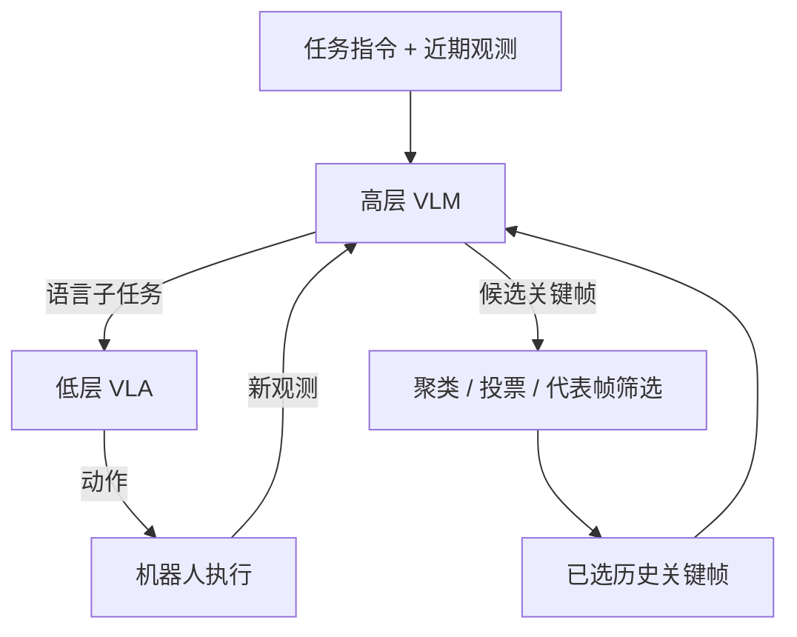
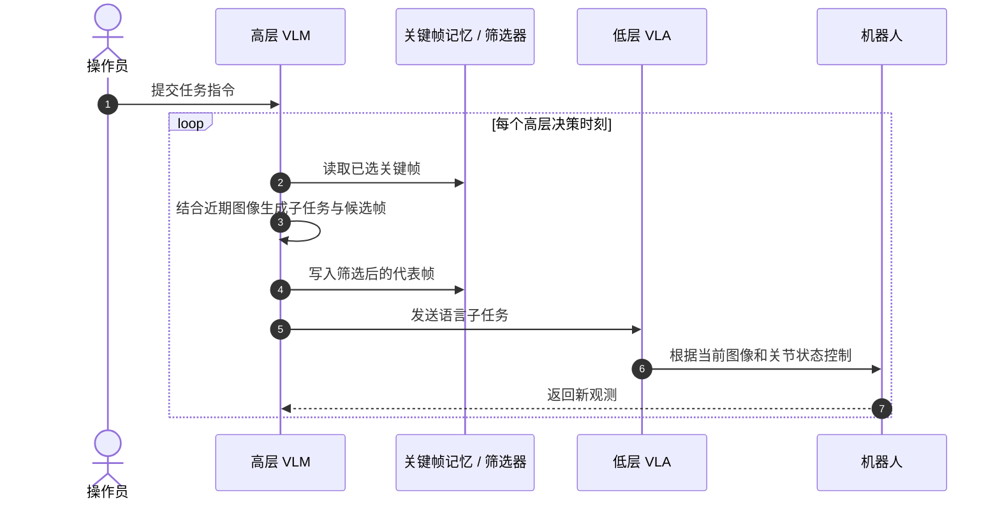

# MemER：用经验检索扩展机器人控制记忆

**MemER**（*Scaling Up Memory for Robotic Control via Experience Retrieval*）是 Stanford 团队提出的分层机器人策略：高层模型从历史中选择任务相关关键帧并生成语言子任务，低层视觉—语言—动作策略据此完成长程操纵。

## 一句话定义

**MemER 用可检索的关键帧代替整段历史，让机器人记住数分钟前发生的事，并把记忆转成下一步可执行子任务。**

## 英文缩写速查

| 缩写 | 英文全称 | 简要说明 |
|------|----------|----------|
| MemER | Memory for Robotic Control via Experience Retrieval | 经验检索式机器人记忆框架 |
| VLM | Vision-Language Model | 高层理解历史图像并提出记忆与子任务 |
| VLA | Vision-Language-Action | 低层根据图像、关节状态和指令输出动作 |
| ICLR | International Conference on Learning Representations | 论文发表会议 |

## 为什么重要

长时程操纵不仅需要识别眼前物体，还要记得搜索过哪里、已经数了几次、哪些子任务完成过。把所有观察拼成长上下文会增大推理成本，也容易在失败重试后遇到分布偏移；无差别抽帧则可能丢掉关键事件。MemER 把“记忆什么”作为策略的一部分学习和执行。

## 核心信息

| 项 | 内容 |
|----|------|
| 作者 / 机构 | Ajay Sridhar、Jennifer Pan、Satvik Sharma、Chelsea Finn；斯坦福大学（Stanford University） |
| 论文 | [arXiv:2510.20328](https://arxiv.org/abs/2510.20328)，ICLR 2026 |
| 高层策略 | 论文摘要为 Qwen2.5-VL-7B-Instruct；项目页文字为 Qwen2.5-VL-3B-Instruct，需留意版本差异 |
| 低层策略 | π0.5 |
| 代码 | [memer-policy/memer](https://github.com/memer-policy/memer)，项目页公开 Code 链接 |

## 核心原理

1. **高层读取上下文：** 输入任务指令、近期图像与已选关键帧；产出低层语言子任务和候选记忆帧。
2. **候选帧压缩：** 将跨时间重复提名的候选聚成事件簇，为每簇取代表帧，避免把冗余画面持续塞入策略。
3. **低层执行：** 把高层子任务与最新相机图像、机器人关节状态交给低层 VLA，输出控制动作。
4. **在线更新记忆：** 新候选通过筛选后加入记忆，供之后的高层决策使用。

### 流程总览

候选簇和代表帧的细节来自项目页；其示例使用 5 帧聚类距离并取中位候选帧。这个参数是论文实现设定，不应当视为适合所有相机帧率的常数。

## 源码运行时序图

[memer-policy/memer](https://github.com/memer-policy/memer) 是项目页公开的官方代码入口；以下按论文公开的分层推理过程归纳模块时序，具体脚本名以仓库 README 为准。

## 实验与评测

- **任务：** object search、counting、dust & replace 三类需要分钟级记忆的真实操作。
- **历史长度对照：** 项目页可视化比较单帧、8 帧、32 帧与 MemER；检索式记忆在展示任务上完成更多子目标。
- **重试鲁棒性：** 页面展示掉落、抓取失败、空舀和物体卡住等情况下继续完成任务。
- **读结果时的边界：** 项目页给出可视化任务对比，论文摘要说明胜过先前方法；此处不把视频示例解读成覆盖全部场景的统计保证。

## 工程实践

| 环节 | 实践提示 |
|------|----------|
| 记忆筛选 | 检查重复候选、事件簇合并和代表帧是否保留任务进度 |
| 长时任务 | 同时评估顺序执行与中途失败重试，避免只测理想轨迹 |
| 高低层接口 | 子任务语言必须可被低层策略执行；关键帧要能支持高层状态判断 |
| 模型复现 | 论文摘要与网站对高层模型参数量写法不同；复现前核对仓库版本与配置 |

## 局限与风险

- 页面展示的三类任务规模有限；更广任务分布和跨机器人泛化需另行评估。
- 关键帧选择的错误会长期污染后续上下文；检索质量与高层 VLM 的状态理解直接影响低层成功率。
- 高层 VLM 推理成本与低层 VLA 实时控制需求需要分频运行。
- 项目页与论文摘要对高层 Qwen2.5-VL 规格有 3B / 7B 差异，现阶段不应静默归一成单一结论。

## 结论

**MemER 把长历史压缩成策略主动挑选的事件记忆，再通过语言子任务连接到低层动作；其价值在多分钟任务与重试中的记忆连续性。**

1. **核心机制是主动选择记忆帧**，不是简单扩大上下文窗口。
2. **分层接口清楚：** 高层负责历史和子任务，低层负责视觉运动控制。
3. **真实长时任务已验证**，但公开页面中的统计主要是任务演示，勿夸大为广泛泛化证明。
4. **复现前核对模型版本**，论文摘要与网站在高层参数量上不一致。
5. **部署时分开高层慢决策与低层快控制**，并监测记忆遗漏和失败重试后的漂移。

## 关联页面

- [机器人 In-Context Learning](../concepts/robot-in-context-learning.md) — 区分状态记忆、上下文学习和测试时更新
- [KEMO](./paper-kemo-event-driven-keyframe-memory-vla.md) — 事件驱动关键帧选择的相邻方法
- [VLA](../methods/vla.md) — 低层视觉—语言—动作策略
- [Manipulation](../tasks/manipulation.md) — 长程真实操作任务

## 参考来源

- [MemER 论文归档](../../sources/papers/memer_arxiv_2510_20328.md)
- [MemER 项目页归档](../../sources/sites/memer-project.md)
- [MemER 官方代码归档](../../sources/repos/memer.md)

## 推荐继续阅读

- [MemER 项目页](https://jen-pan.github.io/memer/) — 方法图、任务对比和代码入口
- [arXiv:2510.20328](https://arxiv.org/abs/2510.20328)
