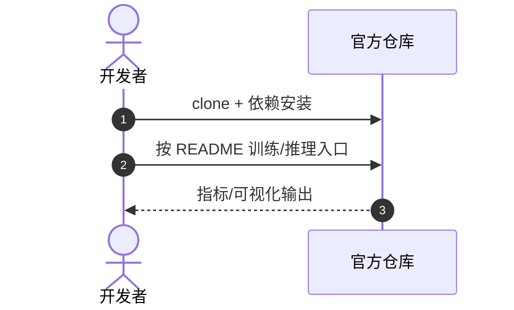

# MemForest

**MemForest**（*Efficient Agent Memory Management via EventTree Partitioning and Progressive Merging*，[arXiv:2609.08273](https://arxiv.org/abs/2609.08273)，[项目/代码](https://github.com/Celina-love-sweet/MemForest)）— 详见 [具身智能小站 10 篇盘点（2026-09-09）](../../sources/blogs/wechat_embodied_station_visual_focus_10_papers_2026-09-09.md)。

## 一句话定义

长程智能体记忆不能只按语义相似度合并——MemForest 用事件树同时保留时间邻域与全局语义，在压缩率和问答准确率之间做可量化折中。

## 英文缩写速查

| 缩写 | 英文全称 | 简要说明 |
|------|----------|----------|
| MemForest | Memory Forest | 本文记忆管理框架 |
| LLM | Large Language Model | 智能体骨干 |
| MST | Maximum Spanning Tree | EventTree 渐进合并 |
| RAG | Retrieval-Augmented Generation | 记忆检索上下文 |

## 为什么重要

- 50% 历史压缩：Mem0 保留 97.1% 性能、检索 1.89×；M3-Agent 保留 99.7%、2.24×
- 70% 压缩时 Mem0 降至 93.3%；低冗余文本记忆仍是短板

## 核心信息

| 项 | 内容 |
|----|------|
| **arXiv** | [2609.08273](https://arxiv.org/abs/2609.08273) |
| **开源** | **已开源** |
| **项目/代码** | [https://github.com/Celina-love-sweet/MemForest](https://github.com/Celina-love-sweet/MemForest) |

## 核心原理

- 50% 历史压缩：Mem0 保留 97.1% 性能、检索 1.89×；M3-Agent 保留 99.7%、2.24×
- 70% 压缩时 Mem0 降至 93.3%；低冗余文本记忆仍是短板
- 锚点引导传播检索保留时间邻域

## 源码运行时序图

官方仓 [https://github.com/Celina-love-sweet/MemForest](https://github.com/Celina-love-sweet/MemForest)（归档见 [memforest.md](../../sources/repos/memforest.md) 若已建）：

- **最短复现：** 以 README 训练/评测脚本为准。

## 实验与评测

- 指标与设置以原文 PDF / 项目页为准；上文 Highlights 来自公众号归纳 + 项目页摘要。
- 横向对照见 [视觉聚焦与数据效率 10 篇技术地图](../overview/visual-focus-data-efficiency-10-papers-technology-map.md)。

## 结论

**MemForest 的可迁移主张已写入 Highlights；部署前以原文实验设定与开源边界为准。**

1. **真影响：** 见核心原理 bullets。
2. **次要代价：** 预印本/待开源项需独立复现验证。
3. **部署读法：** 已开源 — 先读 README 或项目页再接真机/智能体栈。

## 关联页面

- [视觉聚焦与数据效率 10 篇技术地图](../overview/visual-focus-data-efficiency-10-papers-technology-map.md)
- [模仿学习](../methods/imitation-learning.md)

## 参考来源

- [memforest_arxiv_2609_08273.md](../../sources/papers/memforest_arxiv_2609_08273.md)
- [具身智能小站 10 篇盘点（2026-09-09）](../../sources/blogs/wechat_embodied_station_visual_focus_10_papers_2026-09-09.md)
- [arXiv:2609.08273](https://arxiv.org/abs/2609.08273)

## 推荐继续阅读

- [原文 PDF](https://arxiv.org/pdf/2609.08273)
- [项目/代码](https://github.com/Celina-love-sweet/MemForest)
