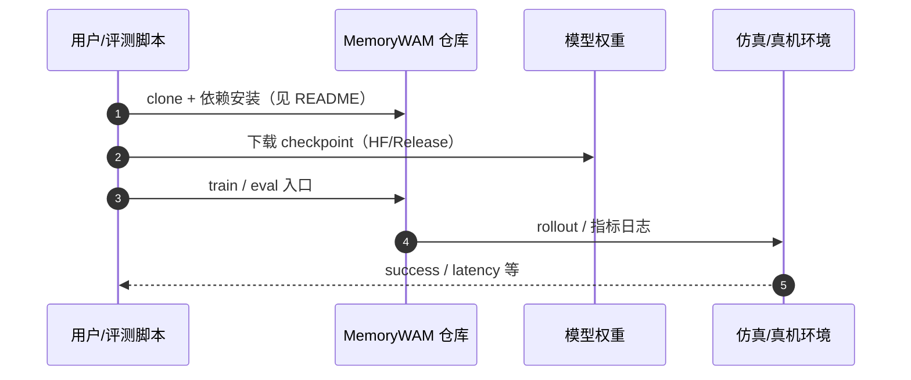

# MemoryWAM（arXiv:2606.20562）

**MemoryWAM**（*MemoryWAM: Efficient World Action Modeling with Persistent Memory*，[arXiv:2606.20562](https://arxiv.org/abs/2606.20562)，[项目页](https://yangsizhe.github.io/MemoryWAM/)，[代码](https://github.com/yangsizhe/MemoryWAM)）来自 [机器人研发工程师 · 前沿算法盘点](../../sources/blogs/wechat_robot_engineer_embodied_frontier_algorithms_2026-09-23.md)。

## 一句话定义

**混合持久记忆 WAM：滑窗近期帧 + 任务起点 anchor + gist token 压缩长历史；推理复杂度 O(N)→O(N/d)，长时序家务优于 VLA/WAM 基线。**

## 英文缩写速查

| 缩写 | 英文全称 | 简要说明 |
|------|----------|----------|
| MemoryWAM | Memory World Action Model | 本文带持久记忆的 WAM |
| WAM | World Action Model | 世界–动作联合模型 |
| KV | Key-Value Cache | 注意力键值缓存 |
| MoT | Mixture-of-Transformers | 多专家 Transformer |

## 为什么重要

- 全历史 KV 缓存贵；纯滑窗在非 Markov 家务任务上丢进度。
- 开源结论：**已开源**（步骤 2.5，2026-09-23）。
- 与 [具身前沿算法技术地图](../overview/embodied-frontier-algorithms-technology-map.md) 同路线条目可横向对照。

## 核心机制

| 项 | 内容 |
|----|------|
| **arXiv** | [2606.20562](https://arxiv.org/abs/2606.20562) |
| **开源** | **已开源** |
| **要点** | MoT 视频 DiT + 动作 DiT；gist token 蒸馏长程；推理跳过像素生成只更新 KV。 |
| **文内指标** | RMBench 等长时序记忆依赖任务（作者报告 83.0% 均值等）。 |

## 源码运行时序图

图下说明：复现以 [`sources/repos/memorywam.md`](../../sources/repos/memorywam.md) 与官方 README 为准。

## 实验与评测

- RMBench 等长时序记忆依赖任务（作者报告 83.0% 均值等）。
- **读法：** 索引级摘要；逐项 baseline 以原文 PDF 为准。

## 结论

**MemoryWAM 代表 WAM 记忆结构工程化；与 TempoWAM 执行层、Fast-WAM 延迟优化可组合阅读。**

1. 开源边界：**已开源** — 以项目页/仓库实际链接为准（入库日 2026-09-23）。
2. 核心机制：MoT 视频 DiT + 动作 DiT；gist token 蒸馏长程；推理跳过像素生成只更新 KV。…
3. 部署前核对硬件栈与评测协议，勿直接横比公众号摘录数字。

## 关联页面

- [world-action-models](../concepts/world-action-models.md)
- [paper-fast-wam](./paper-fast-wam.md)
- [paper-tempowam](./paper-tempowam.md)
- [lingbot-vla](./lingbot-vla.md)

## 参考来源

- [memorywam_arxiv_2606_20562.md](../../sources/papers/memorywam_arxiv_2606_20562.md)
- [wechat_robot_engineer_embodied_frontier_algorithms_2026-09-23.md](../../sources/blogs/wechat_robot_engineer_embodied_frontier_algorithms_2026-09-23.md)
- [arXiv:2606.20562](https://arxiv.org/abs/2606.20562)

## 推荐继续阅读

- [arXiv PDF](https://arxiv.org/pdf/2606.20562)
- [项目页](https://yangsizhe.github.io/MemoryWAM/)
- [代码](https://github.com/yangsizhe/MemoryWAM)

