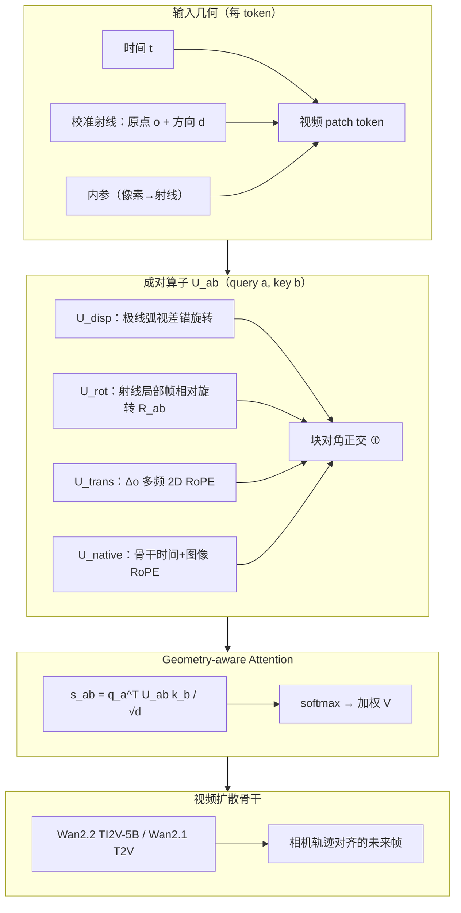

# MeRoPE：相机可控视频生成的 Metric 旋转位置编码

**MeRoPE**（*Metric Rotary Position Embedding for Camera-Controlled Video Generation*，[arXiv:2609.01252](https://arxiv.org/abs/2609.01252)，Zhijian Qiao 等 · **香港科技大学（HKUST）** / **卓驭科技（Zhuoyu Technology）**；[项目页](https://qiaozhijian.github.io/merope/)）指出：现有 **几何感知相机位置编码**（GTA、PRoPE、UCPE 等齐次射影形式）在 **真实 metric 相机轨迹** 上存在 **尺度依赖失效**——物理平移基线增大时，attention logit 与特征范数 **无界增长**，远距离帧因距离而非视觉相似性主导 softmax。MeRoPE 用 **全块正交** 的相对相机算子 $\mathcal{U}_{ab}$ 保留 **深度无关的全 metric 相对位姿**，同时 **严格保持特征范数**。

## 一句话定义

**在视频 DiT attention 中用四块对角正交旋转（视差锚、射线相对朝向、metric 平移 RoPE、骨干原生 RoPE）替换齐次射影平移项，使大基线相机轨迹下的可控生成既保留米制位移语义又不让平移项数值碾压视觉内容。**

## 英文缩写速查

| 缩写 | 英文全称 | 简要说明 |
|------|----------|----------|
| MeRoPE | Metric Rotary Position Embedding | 本文范数保持的 metric 相机相对位置编码 |
| RoPE | Rotary Position Embedding | 用旋转改相位；本文用于平移坐标多频编码 |
| UCPE | Unified Camera Positional Encoding | 射线局部坐标齐次块基线；本文主要对照 |
| PRoPE | Projective Positional Embeddings | 含内参的射影视锥 PE；同属齐次失效族 |
| GTA | Geometry-Aware Attention | 多视图 $SE(3)\times SO(2)^2$ 群作用 attention |
| PE | Positional Encoding | 位置/几何编码，本文作用于 query-key 比较 |
| FoV | Field of View | PanShot 评测覆盖 118°–177° 等多样光学 |
| TI2V | Text-Image-to-Video | nuScenes 实验所用 Wan2.2 条件生成范式 |

## 为什么重要

- **定位真实失败模式：** 自动驾驶 / 机器人仿真常用 **米制大基线** 轨迹；齐次 PE 的平移内积随基线线性放大，论文 Fig. 1 显示 UCPE 训练模型把 attention 质量 **偏向最远历史帧**——这是轨迹可控 WM 的结构性 bug，而非单纯调参问题。
- **理论取舍清晰：** Theorem 1 形式化 **(A) 全 metric 相对位姿 / (B) 严格 per-token 分解 / (C) 范数保持** 不可兼得；MeRoPE 选 **A+C** 并通过 **query-camera 分组** 放松 B，给后续相机 PE 设计明确坐标。
- **轻量几何接口：** 仅需 **校准 per-token 射线**（时间 + 原点 + 方向），**推理期不需** VGGT、Depth Anything 等 3D 重建前处理；与 [PanoWorld](./paper-panoworld-real-world-panoramic-generation.md) 的 PRoPE 射线场、[DreamX-Phi](./paper-dreamx-phi.md) 的 SE(3) 注入同属 **几何进 attention** 路线，但主攻 **相机轨迹** 而非操纵动作。
- **上游骨干可复用：** 实验基于开源 [Wan](./paper-wan-video.md) **2.2 TI2V-5B** / **2.1 T2V-1.3B**，便于接入现有视频 WM / 驾驶仿真数据管线。

## 流程总览

## 核心机制

### 1）齐次射影 PE 为何在大基线上失控

对 query 相机 $i$、key 相机 $j$，GTA/UCPE 类 $\mathcal{U}^{\mathrm{cam}}_{ij}$ 含块：

$$\mathcal{U}^{\mathrm{cam}}_{ij}=\begin{bmatrix}R_{ij}&\Delta\mathbf{o}_{j\mid i}\\ \mathbf{0}^\top&1\end{bmatrix}$$

attention 得分含 **未归一化** 项 $h_k(\mathbf{u}^q)^\top\Delta\mathbf{o}_{j\mid i}$，随 $\|\mathbf{o}_j-\mathbf{o}_i\|$ **线性增长**；同一算子非正交，value 聚合范数亦随基线放大。尺度 $\lambda$ 放大平移时，平移项同比放大，softmax 易被 **远距帧** 劫持。

### 2）MeRoPE 四块正交结构

| 块 | 作用 | 关键性质 |
|----|------|----------|
| $\mathcal{U}^{\mathrm{rot}}$ | MinRot 射线局部系间 $R_{ab}$ | 正交，保范数 |
| $\mathcal{U}^{\mathrm{trans}}$ | query 系位移 $\Delta\mathbf{o}_{b\mid a}$ 各轴多频 RoPE | 改 **相位** 不改向量长度 |
| $\mathcal{U}^{\mathrm{disp}}$ | 极线球面弧上视差锚的相对旋转 | 静态场景 **对应先验**，有界角度采样 |
| $\mathcal{U}^{\mathrm{native}}$ | 骨干原生时间 + 图像坐标 RoPE | 与预训练分布兼容 |

合成 $\mathcal{U}_{ab}=\mathcal{U}^{\mathrm{disp}}\oplus\mathcal{U}^{\mathrm{rot}}\oplus\mathcal{U}^{\mathrm{trans}}\oplus\mathcal{U}^{\mathrm{native}}$，满足 $\mathcal{U}_{ab}^\top\mathcal{U}_{ab}=I$。

### 3）与相关相机 PE 的属性对比（论文 Table 1 归纳）

| 方法 | 全 metric 相对位姿 (A) | 严格 per-token (B) | 范数保持 (C) |
|------|------------------------|--------------------|--------------|
| CaPE / GTA / PRoPE / UCPE | ✓ | ✓ | ✗ |
| RayNova / ViewRope | ✗ | ✓ | ✓ |
| URoPE / RayRoPE / CRePE | ✗ | ✗ | 部分 |
| **MeRoPE** | **✓** | **✗**（query-camera 分组） | **✓** |

深度依赖方法（URoPE、RayRoPE）在像素/深度空间放松 (B)，且难以同时满足 (A)。

## 实验与评测

| 设置 | 骨干 | 数据 / 任务 | 报告要点 |
|------|------|-------------|----------|
| 驾驶相机控制 | Wan2.2 **TI2V-5B** | **nuScenes** 大基线轨迹 | 命令/恢复相机路径与生成帧一致；相对 UCPE 等 **旋转+平移联合一致性最佳** |
| 跨光学泛化 | Wan2.1 **T2V-1.3B** | **PanShot**（UCPE 同源 benchmark） | 118°–177° FoV、室内/户外/低光；射线编码泛化多样相机 |
| Real-to-Sim | History **SA** | 同地点检索图像锚定 rollout | 跨遍历/天气保持静态布局；优于 History CA |

**注意力诊断：** 末帧中心 token 对历史帧的 attention 质量——UCPE 随基线增大偏向最早帧，MeRoPE 保持 **局部时序** profile（项目页 Fig. 与论文 Fig. 1）。

## 结论

**MeRoPE 的价值在于把「metric 相机轨迹」与「attention 数值稳定」从对立变成可同时满足的设计目标——代价是接受 query-camera 分组，放弃严格 per-token 分解。**

1. **先诊断再改 PE：** 大基线驾驶轨迹上，齐次平移项会让远距离帧在 softmax 中「因米数获胜」；换范数保持旋转块是结构性修复，不是微调 trick。
2. **A+C 优先于 B：** 若任务需要米制平移语义（仿真对齐、轨迹 PSNR），应优先保留 (A)(C)；per-token 分解留给方向-only 或深度锚方法。
3. **视差块补 pose 算子的盲区：** 纯 scene-independent 位姿 PE 不指明静态对应；沿极线弧的 $\mathcal{U}^{\mathrm{disp}}$ 用有界旋转给出 **对应假设**，无需推理期 3D 重建。
4. **骨干与数据可落地：** Wan2.2 TI2V-5B + nuScenes 证明与现有开源视频先验兼容；PanShot 说明 **多样内参/FoV** 仍受益。
5. **Real-to-Sim 读法：** 检索历史帧 + 几何 History SA 可把「同地点不同遍历」当布局锚——对 **仿真环境铺底**（非逐物体复现）有工程启发。
6. **开源前复现边界：** 截至入库日 **无官方仓库**；复现需自实现 $\mathcal{U}_{ab}$ 注入 Wan attention 与训练配方。
7. **与操纵 WM 的关系：** 本文条件为 **相机外参/射线**，不替代 [DreamX-Phi](./paper-dreamx-phi.md) 式 **末端 SE(3) 动作**；可作为 **环视/驾驶 rollout** 的几何层，再叠动作或语义条件。

## 工程实践

| 项 | 口径 |
|----|------|
| 输入 | 每 token：**时间** + **校准射线**（原点、方向）；来自已知外参内参或 SLAM/标定 |
| 注入点 | Geometry-aware attention：替换 $q^\top k$ 为 $q^\top \mathcal{U}_{ab} k$（value 路径同理） |
| 骨干 | 论文默认 **Wan2.2 TI2V-5B**（nuScenes）、**Wan2.1 T2V-1.3B**（PanShot） |
| 不需 | 推理期 VGGT / Depth Anything / 点云渲染（与 Gen3C、ViewCrafter 等显式 3D 引导路线对比） |
| 源码运行时序图 | **不适用**（截至 **2026-09-06** 项目页与论文均未提供可运行官方仓库；摘要写 code will be released） |

## 局限与风险

- **开源状态：** **宣称将开源 / 待发布** — 摘要 "Code will be made publicly available"，[项目页](https://qiaozhijian.github.io/merope/) **无 GitHub/HF 链接**（见 [`sources/sites/merope.md`](../../sources/sites/merope.md)）。
- **per-token 分解：** 放松 (B) 后，实现与理论分析需按 **query-camera 分组** 理解，不能直接与 CaPE 类 API 互换。
- **场景与任务：** 评测以 **驾驶/环视相机轨迹** 为主；**人形 egocentric 操纵**、接触丰富动力学未覆盖；高轨迹一致性 **不保证** 可用于 closed-loop 控制（见 [Video-as-Simulation](../concepts/video-as-simulation.md)）。
- **校准依赖：** 错误外参/内参会直接污染 $\mathcal{U}_{ab}$；Real-to-Sim 检索图也需 **位姿对齐**。
- **与重建路线分工：** 不做持久 3D 资产或点云 cache；需要可编辑 mesh/GS 时仍看 Matrix-3D / Gen3C 等。

## 关联页面与对比

- [Generative World Models](../methods/generative-world-models.md) — 生成式 WM 总览；MeRoPE 为 **相机几何 PE** 实例
- [Wan 视频基础模型](./paper-wan-video.md) — 实验骨干与开源 DiT 族
- [PanoWorld](./paper-panoworld-real-world-panoramic-generation.md) — 同为 **射线/PRoPE 几何条件** 的视频生成（全景平移 vs 本文 metric 相机 PE）
- [Wan-Move](./paper-wan-move.md) — **潜空间轨迹** 运动控制（像素级点轨迹 vs 本文外参级）
- [Video-as-Simulation](../concepts/video-as-simulation.md) — 视频 rollout 作仿真代理的适用边界

## 推荐继续阅读

- [MeRoPE 项目页](https://qiaozhijian.github.io/merope/)
- [Wan 技术报告（arXiv:2503.20314）](https://arxiv.org/abs/2503.20314)
- [UCPE 对照工作（项目页检索 Unified Camera Positional Encoding）](https://arxiv.org/search/?query=Unified+Camera+Positional+Encoding&searchtype=all)
- [nuScenes 多模态驾驶数据集](https://www.nuscenes.org/)

## 参考来源

- [MeRoPE 论文归档（arXiv:2609.01252）](../../sources/papers/merope_arxiv_2609_01252.md)
- [MeRoPE 项目页归档](../../sources/sites/merope.md)
- [MeRoPE 项目页](https://qiaozhijian.github.io/merope/)
