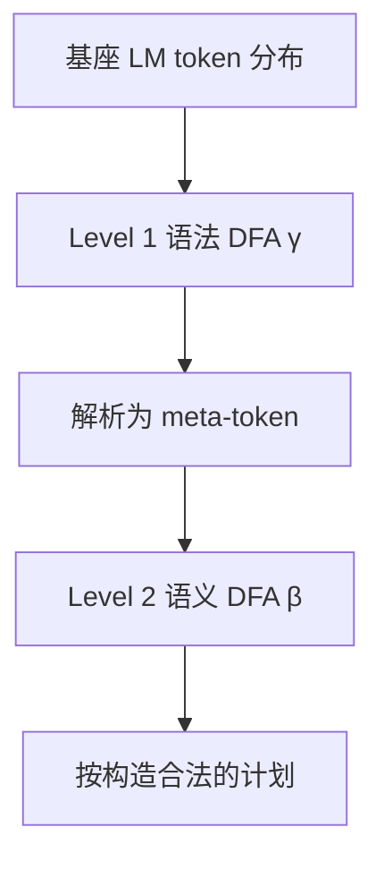

# Meta-Ctrl：保证计划合法，同时留下常识

**Meta-Ctrl**（*Guaranteed Plan Generation by Decoupling Syntactic and Semantic Constraints*，[arXiv:2608.22149](https://arxiv.org/abs/2608.22149)，[项目页](https://meta-ctrlg.github.io/)）由 **加州大学洛杉矶分校（UCLA）** 与 **密歇根州立大学（Michigan State University）** 提出：用紧凑 meta-token 词表在 token 级保证语法、在动作级执行前置条件/目标/顺序，精确因式分解把受约束解码内存从超过 **107 TB** 降到 **2 GB** 以下。

## 一句话定义

**可靠规划不必在常识与保证之间二选一——关键是把语法约束和语义约束拆到两个粒度，而不是编一个乘积自动机。**

## 英文缩写速查

| 缩写 | 英文全称 | 简要说明 |
|------|----------|----------|
| DFA | Deterministic Finite Automaton | 编译语法/语义约束 |
| HMM | Hidden Markov Model | 可处理前瞻近似 |
| EAI | Embodied Agent Interface | VirtualHome / BEHAVIOR 协议 |
| WAH-NL | Watch-And-Help Natural Language | LoTa-Bench 设定 |
| SSR | Subgoal Success Rate | WAH-NL 主可比轴 |

## 为什么重要

- **软约束没有保证，硬符号规划丢掉 LM。** Meta-Ctrl 要两者。
- **工程可行性：** 单层联合自动机约 350M 状态 / 107 TB；两级相加约 57K 状态 / 1.6 GB。
- **小模型可用：** Llama-3-8B 从排行榜底部超过闭源前沿。

## 核心信息

| 项 | 内容 |
|----|------|
| **机构** | 加州大学洛杉矶分校（UCLA）；密歇根州立大学（Michigan State University） |
| **真机** | xArm7 + RealSense；Code-as-Policies 执行器 |
| **开源** | **未开源** — 仅项目页 |

## 核心原理（方法）

计划须同时满足 token 级语法 \(\gamma\) 与动作级语义 \(\beta\)。解析器 \(\tau\) 把合法 token 序列映射到 grounded 动作（约 132 个 meta-token）。因式分解后，语法与语义各做一次后向 DP，只通过桥接项 \(p(a_l\mid x_{\le t})\) 通信。

硬掩码也能保证语法，但会贪心走向最短合法续写（执行率高、任务成功率接近 0）。完整前瞻才能把任务成功率拉回来。

### 流程总览

## 工程实践

| 项 | 建议 |
|----|------|
| **源码运行时序图** | **不适用**（截至 2026-08-30 无官方解码仓） |
| 约束覆盖 | BEHAVIOR 提示只编码约 24% 前置（VH 约 82%），DFA 写不进的约束抬不起来 |
| 真机失败拆账 | 计划 100% 合法后，剩余失败记在感知/抓取 |
| 不要只用硬掩码 | VH-AS 硬掩码任务成功率 1.4，完整 Meta-Ctrl 88.7 |

## 实验与评测

| 设定 | 结果 |
|------|------|
| Llama-3-8B VH Action Sequencing | 任务 SR **21.3 → 88.7**，Exec **95.7** |
| 同模型 VH Subgoal Decomposition | **48.8 → 88.2** |
| gpt-oss-20B VH AS | **74.4 → 86.6** |
| WAH-NL Llama 3.1 8B | SR **0.470**，SSR **0.705**，Exec **1.000**（GPT-4 LoTa SSR 0.342） |
| xArm 甜甜圈入罐 | 规划 20/20；感知 17/20；执行 13/17；无约束基线规划 1/20 |

## 结论

**保证合法是必要但不够的——没有序列级前瞻，硬掩码会走向最短合法废话。**

1. **两级分解是工程前提** — 107 TB 的联合自动机无法部署。
2. **小开源 LM + 约束 > 大闭源裸解码** — 至少在约束能写入 DFA 的基准上。
3. **BEHAVIOR 涨幅小是提示覆盖问题** — 不是方法突然失效。
4. **真机把规划从下游拆开** — 合法计划仍可能被感知打死。
5. **代码未发布** — 选型先读 EAI / WAH 表。

## 与其他工作对比

| 对照 | 差异读法 |
|------|----------|
| [Physical Agentic AI](./paper-physical-agentic-ai.md) | 多机技能派发门控；本页是单机计划 token 约束 |
| LLM+P / 符号规划 | 保证强但丢掉 LM 常识 |
| Ctrl-G 硬掩码 | 同语法保证，无前瞻则任务成功率崩溃 |
| SayCan / ProgPrompt | WAH-NL 上 SSR 远低于 0.705 |

## 局限与风险

- 只能保证写进 DFA 的约束；提示漏掉的前置条件仍会错。
- 开环生成（相对 STEP 闭环）。
- 无代码则无法复核 132 元令牌词表与 HMM 训练。

## 关联页面

- [Physical Agentic AI](./paper-physical-agentic-ai.md)
- [VLA](../methods/vla.md)
- [48ms WAM / 编排 10 篇地图](../overview/glancewam-vla-crew-10-papers-technology-map.md)

## 参考来源

- [meta_ctrl_arxiv_2608_22149](../../sources/papers/meta_ctrl_arxiv_2608_22149.md)
- [项目页归档](../../sources/sites/meta-ctrlg-github-io.md)
- [具身智能小站 10 篇盘点](../../sources/blogs/wechat_embodied_station_10_papers_glancewam_vla_crew_2026-08-30.md)

## 推荐继续阅读

- [arXiv:2608.22149](https://arxiv.org/abs/2608.22149)
- [项目页](https://meta-ctrlg.github.io/)
