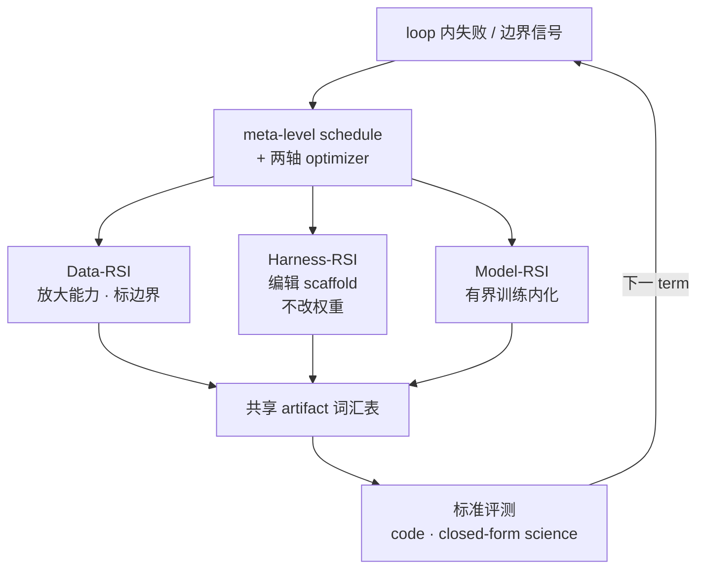

# MetaRSI-v1：递归自改进系统的元递归自改进

**MetaRSI-v1**（项目页亦称 MetaRSI / RSI2；[arXiv:2609.06396](https://arxiv.org/abs/2609.06396)，[CosmosMind 项目页](https://www.cosmosmind.ai/research/metarsi-v1)）由 **宇宙心智（CosmosMind AI Lab）** 提出：把 **递归自改进（RSI）** 从「在单一可形式化表面做 edit」推进为 **Data / Harness / Model 三 typed operator 在同一 loop kernel 上的 scheduled composition**，并由 **两轴 optimizer**（算子顺序 + 各算子 proposal policy）与 **meta-level policy**（跨 term 修订 schedule）统一调度。

## 一句话定义

**用一套共享 artifact 词汇表，把数据扩增、scaffold 编辑与有界训练内化做成可组合的三算子 RSI，而不是只在 coding / 闭式 science QA 里改单点。**

## 英文缩写速查

| 缩写 | 英文全称 | 简要说明 |
|------|----------|----------|
| RSI | Recursive Self-Improvement | 系统从自身失败改进模型生产 machinery |
| MetaRSI | Meta Recursive Self-Improvement | 本文框架；对 RSI 系统本身的 meta-level 调度 |
| Data-RSI | Data Recursive Self-Improvement | 放大既有能力并标记能力边界的数据算子 |
| Harness-RSI | Harness Recursive Self-Improvement | 编辑五槽 scaffold、**不改权重** 的 harness 算子 |
| Model-RSI | Model Recursive Self-Improvement | 经有界训练把能力内化进参数的算子 |
| GEE | Genome Expression Engine | RSI-Harness 中 `gee` → 从会话史生成 Genome |
| Pi | Pi coding agent | RSI-Harness 所基于的不可 fork Core |

## 为什么重要

- **突破 format bound：** 既往 RSI 多在 **机器可检** 的 coding / formal QA 上验证；MetaRSI 主张下一跳是 **开放科学、工程与 meta-science** — 正确性靠论证、复现与测量，而非单点 pass@k。
- **Harness 与 Model 双路线：** **Harness route** 不动权重，可把自改进延伸到 **任意经 interface 可达的模型**；**Model route** 走有界训练 — 与 [HarnessBank](./paper-harnessbank.md) / [SoL-Pi](./sol-pi.md) 的「只改 harness」同轴，但 **与 Data / Model 算子同一 kernel 可组合**。
- **对本库机器人读者：** 真机 / 仿真 [autoresearch 闭环](../queries/real-robot-policy-autoresearch-harness.md) 长期依赖 **coding agent 写 env / reward / 评测脚本**；MetaRSI 的 **Harness-RSI** 给出 **可版本化 Genome**（见 [RSI-Harness](./rsi-harness.md)），是把「实验组织程序」从 chat 散配置收成 **diffable artifact** 的一步 — 仍 **不** 替代 reset / verify 环境。

## 核心信息

| 项 | 内容 |
|----|------|
| **机构** | 宇宙心智（CosmosMind AI Lab） |
| **项目页** | <https://www.cosmosmind.ai/research/metarsi-v1> |
| **arXiv** | [2609.06396](https://arxiv.org/abs/2609.06396)（2026-09-06 投稿） |
| **作者** | Zihan Tan*、Leixin Sun*†、Guancheng Wan‡ 等 31 人 |
| **验证设定** | code + closed-form science 标准评测；**无 external teacher**；target model 自扮 loop 内全部角色 |
| **开源** | **部分开源** — [RSI-Harness](https://github.com/CosmosMind-ai/RSI-Harness)（Harness-RSI + GEE）**已发布**；**无** 官方 Model-RSI / Data-RSI 训练与 benchmark 仓（截至 2026-09-14） |

## 核心原理

### 三算子 + 两轴 + meta schedule

| 算子 | 改什么 | 权重 |
|------|--------|------|
| **Data-RSI** | 数据与能力边界标记 | 间接（底物） |
| **Harness-RSI** | 五槽 scaffold / agent harness | **不动** |
| **Model-RSI** | 参数内化（有界训练） | **动** |

- **One kernel：** 三算子共享 loop kernel 与 artifact vocabulary → 改动 **可组合** 而非互斥。
- **Two axes：** (1) **算子顺序**；(2) 各算子的 **proposal policy**。
- **Meta-level：** 跨 term 修订 **schedule** 本身（对「如何 RSI」做 RSI）。

### 流程总览



## 源码运行时序图

官方 **Harness-RSI** 实现 [CosmosMind-ai/RSI-Harness](https://github.com/CosmosMind-ai/RSI-Harness)（归档见 [sources/repos/rsi-harness.md](../../sources/repos/rsi-harness.md)）提供 **可运行** 的 `rsih` / `gee` 链；**不含** 论文侧 Model-RSI 训练或 benchmark 驱动：

```mermaid
sequenceDiagram
    autonumber
    actor Dev as 开发者
    participant Install as ./install.sh
    participant RSIH as rsih<br/>Pi + Genome adapter
    participant GEE as gee / harness-rsi
    participant Stores as Session stores<br/>~/.rsih · ~/.pi · ~/.claude
    participant Plan as 证据化计划<br/>用户确认
    participant Val as rsih genome validate
    participant Gen as ~/.rsih/genomes/&lt;id&gt;/
    Dev->>Install: clone RSI-Harness
    Install->>RSIH: 安装 rsih → ~/.local/bin
    Dev->>GEE: gee（Harness-RSI 演示）
    GEE->>Dev: 询问 Genome 用途
    GEE->>Stores: 聚合 tool/bash/纠错 histogram
    GEE->>Plan: 展示计划 + 证据
    Dev->>Plan: 确认
    Plan->>Gen: 写入 genome.json + 12 components
    Gen->>Val: 校验 bundle
    Dev->>RSIH: rsih :&lt;genome_id&gt;
    RSIH->>Gen: 编译 managed keys → ~/.rsih/settings.json
    Note over Dev,RSIH: 无 Genome 时 rsih ≡ pi（仅 ~/.rsih 配置根）
```

- **最短复现路径：** Node ≥ 22.19 → `./install.sh` → `rsih genome list` → `gee` 或 `rsih :paperlab`。
- **自指读点：** `harness-rsi` 的 charter / skill / extension **均用 Genome 手段构建**，`src/` 无专供分支 — 对应论文「harness route 用 interface 可达手段编辑 harness」。

## 实验与评测

| 项 | 归档口径 |
|----|----------|
| **评测域** | 领域标准评测：**code** + **closed-form science**（答案可机器判定的切片） |
| **关键设定** | **无 external teacher** — target model 在 loop 内自扮全部角色（提议、执行、判定） |
| **归档定量数据** | **无** — 归档未落下逐项分数；本页不提供可横比的数字 |
| **可复现范围** | 仅 **Harness-RSI**（`rsih` / `gee` / Genome 链）；RSI-Harness 的 README 与 HF 卡片均写明 **不含** benchmark / 数据生成 / 训练 / 评测代码 |
| **不可复现范围** | Data-RSI、Model-RSI 与完整三算子 meta schedule 的训练环 |

- **最该注意的一条：** 论文的主张是「RSI 应突破 format bound、走向开放科学」，但 **验证本身仍在 format-bound 域内完成**（code + closed-form science）。主张与证据之间这段距离，读者须自行判断强度——本页不替读者下结论。
- **无 teacher 的读法：** 「无 external teacher」是 **自举强度** 的声明，不是成绩本身；它排除了蒸馏更强模型这一条捷径，但不保证改进幅度。
- **复现提醒：** 装了 RSI-Harness ≠ 复现 MetaRSI。想要论文级结论，须等官方训练/benchmark 栈发布。

## 工程实践

| 项 | 建议 |
|----|------|
| **选型：只要 harness RSI** | 装 [RSI-Harness](./rsi-harness.md)；与 Pi 生态 [SoL-Pi](./sol-pi.md) 可叠（效率扩展 vs Genome 打包） |
| **选型：要 Model-RSI** | 截至入库日 **等论文/后续官方训练栈**；勿把 RSI-Harness 当全论文复现包 |
| **Genome 分享** | `rsih genome validate` 通过后再 PR 到 `examples/genomes/`；分享前人工 redact 路径/密钥（仓内 **尚无** 自动 redaction gate） |
| **对照最小环** | [karpathy/autoresearch](./karpathy-autoresearch.md) — 锁 `train.py` + val_bpb；MetaRSI 是 **多算子 schedule**，复杂度高一个数量级 |
| **机器人 autoresearch** | Harness-RSI 适合固化「读 log → 改脚本 → 再跑」的 **组织程序**；真机仍要 env reset + metric（见 [autoresearch harness 指南](../queries/real-robot-policy-autoresearch-harness.md)） |

## 局限与风险

- **部分开源：** Harness 栈已公开；**Data-RSI / Model-RSI 与完整 MetaRSI loop 训练代码未随 RSI-Harness 发布** — HF README 明确无 benchmark / training / eval。
- **许可：** RSI-Harness 根目录 **无 LICENSE 文件**（2026-09-14）— 生产使用前确认仓库声明。
- **format bound 未 magically 消失：** 论文验证仍含 **code + closed-form science**；向开放域 RSI 的推广需读者自行判断证据强度。
- **与「完全 RSI」的距离：** 仍属 [递归自改进](../concepts/recursive-self-improvement.md) 谱系中的 **结构化中间态** — meta schedule 由人设计框架，非后继模型完全自主定义下一代。

## 与其他工作对比

| 对照 | 差异读法 |
|------|----------|
| [HarnessBank](./paper-harnessbank.md) | 冻结模型 + harness 自进化 + 门控银行；**无** 与 Model/Data 算子同一 kernel 的显式 composition |
| [SoL-Pi](./sol-pi.md) | Pi 上 **auto-research 搜效率 extension**；MetaRSI 是 **三算子 RSI 框架 + Genome 自指 harness** |
| [autoresearch](./karpathy-autoresearch.md) | 单 GPU、单文件 edit 面 + 固定 metric；MetaRSI 是多算子 **schedule + 双路线** |
| [DeepSeek Harness](./deepseek-harness.md) | 通用插件 agent OS；RSI-Harness **钉 Pi + Genome**，强调 harness **一等对象** |

## 结论

**MetaRSI-v1 的可迁移贡献是把 RSI 从「改一处」重述为「在同一 kernel 上组合 Data / Harness / Model 三算子 + meta schedule」；工程上 Harness-RSI 已落到 RSI-Harness，但全栈复现仍待官方训练/benchmark 发布。**

1. **真影响：算子分解** — 数据、scaffold、权重三条改进面 **可组合**，而非 harness-only 或 train-only 二选一。
2. **真影响：harness route** — 不动权重即可 RSI，理论上覆盖 **经 API 可达的任意 backbone**。
3. **真影响：Harness-RSI artifact** — Genome + GEE 把 harness 变成 **可版本、可分享、可从 session 蒸馏** 的目录对象（见 [RSI-Harness](./rsi-harness.md)）。
4. **次要代价：复杂度** — meta schedule + 三算子使 **验证与 debug** 显著难于 autoresearch 单环。
5. **开源读法：** **部分** — 只装 RSI-Harness **≠** 复现 MetaRSI 全论文。
6. **部署读法：** 机器人研究优先把 Harness-RSI 当 **实验组织与 coding agent 配置** 层，而非运动策略本身。

## 关联页面

- [RSI-Harness](./rsi-harness.md) — Harness-RSI 官方实现与 CLI
- [递归自改进（RSI）](../concepts/recursive-self-improvement.md) — 概念框架与完全 RSI 距离
- [AI Auto-Research](../concepts/ai-auto-research.md) — S3 实验自动化语境
- [karpathy/autoresearch](./karpathy-autoresearch.md) — 最小固定 eval 环对照
- [SoL-Pi](./sol-pi.md) — Pi harness 上的 auto-research 扩展
- [真机策略 autoresearch 闭环](../queries/real-robot-policy-autoresearch-harness.md) — harness 前提与 verify 环境

## 参考来源

- [MetaRSI-v1 论文归档](../../sources/papers/metarsi_v1_arxiv_2609_06396.md)
- [CosmosMind 官网](../../sources/sites/cosmosmind-ai.md)
- [RSI-Harness 仓库](../../sources/repos/rsi-harness.md)

## 推荐继续阅读

- [MetaRSI-v1 项目页（CosmosMind）](https://www.cosmosmind.ai/research/metarsi-v1)
- [arXiv:2609.06396 PDF](https://arxiv.org/pdf/2609.06396)
- [CosmosMind-ai/RSI-Harness（GitHub）](https://github.com/CosmosMind-ai/RSI-Harness)
