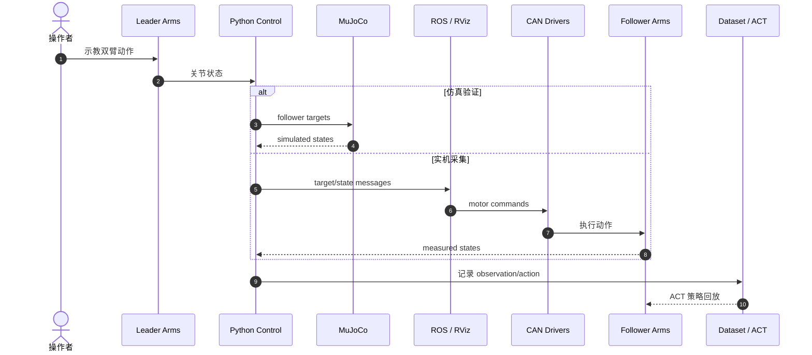

# MEVION：高力高速双臂数据采集系统

**MEVION** 是面向重载、高速双臂模仿学习的开源 leader–follower 数据采集平台，用四条 6-DoF 机械臂与平行夹爪扩展 ALOHA 的力速工作区。

## 英文缩写速查

| 缩写 | 英文全称 | 简要说明 |
|---|---|---|
| DoF | Degrees of Freedom | 每条机械臂 6 自由度 |
| ACT | Action Chunking with Transformers | 论文采用的模仿学习策略 |
| ROS | Robot Operating System | 实机消息与可视化接口 |
| CAN | Controller Area Network | 关节驱动通信总线 |

## 核心设计与方法栈

| 项目 | MEVION |
|---|---|
| 机械结构 | 四臂（双 leader + 双 follower），每臂 6-DoF + 平行夹爪 |
| 单臂 | 7.0 kg；最大 60 Nm；闭链肘部降低远端质量 |
| 整套成本 | 约 14,000 美元，零件可电商采购 |
| 软件 | Python；MuJoCo；ROS/RViz；CAN；Scikit-Robot |
| 验证 | 开瓶、装箱、炒锅、3.6 kg 哑铃、毛巾；ACT 策略回放 |

## 源码运行时序图

官方仓的统一控制思路让同一 Python 上层在 MuJoCo 与实机后端之间切换：

## 评测与验证

论文以一组重载/高速与柔性物体任务展示系统能力，均为定性、索引级演示（原文未给统一量化成功率）：

- **任务集：** 开瓶、装箱、炒锅翻炒、搬运 3.6 kg 哑铃、毛巾操作——覆盖高力矩、高速与柔性物体场景，落在桌面级 ALOHA 力速边界之外。
- **策略验证：** 采集的双臂示范用于训练 ACT（Action Chunking with Transformers）策略并回放生成动作，验证数据可支撑模仿学习闭环。
- **仿真–实机一致性：** 同一 Python 上层可在 MuJoCo 与 ROS/CAN 实机后端间切换，先在仿真验证限位、碰撞与重力补偿再上实机。

> 上述为论文/项目页报告的定性验证；具体量化指标需以原文为准。

## 与其他工作对比

| 维度 | MEVION | ALOHA（桌面级双臂） |
|------|--------|---------------------|
| 力矩/速度 | 单臂最大 60 Nm，面向重载高速 | 桌面级力速，负载较低 |
| 机械结构 | 类四足闭链肘部，降低远端质量 | 串联臂，远端质量较大 |
| 臂数/拓扑 | 四臂 leader–follower（双主双从） | 双臂 leader–follower |
| 成本 | 整套约 14,000 美元，零件可电商采购 | 更低成本桌面方案 |
| 软件栈 | 统一 Python + MuJoCo + ROS/CAN，仿真实机可切换 | 以桌面遥操作 + 模仿学习为主 |
| 定位 | 扩展 ALOHA 力速工作区的开源采集平台 | 低成本双臂采集基线 |

## 工程实践与局限

- 适合建立比桌面级 ALOHA 更高力速的遥操作数据采集线；先在 MuJoCo 验证限位、碰撞和重力补偿，再上实机。
- 14,000 美元不等同于交钥匙成本；还需计入焊接装配、电气安全、相机、工装和维护。
- **成熟度：中高。** 软硬件入口已开放，但仍是需要机电集成能力的研究原型。

## 关联页面

- [Bimanual Manipulation](../tasks/bimanual-manipulation.md)
- [ALOHA](./aloha.md)
- [Teleoperation](../tasks/teleoperation.md)

## 推荐继续阅读

- [MEVION 项目页](https://haraduka.github.io/mevion-hardware/)
- [官方仓库](https://github.com/haraduka/mevion)
- [论文 PDF](https://arxiv.org/pdf/2607.17970)

## 参考来源

- [论文归档](../../sources/papers/mevion_arxiv_2607_17970.md)
- [项目页归档](../../sources/sites/mevion-hardware.md)
- [仓库归档](../../sources/repos/mevion.md)

