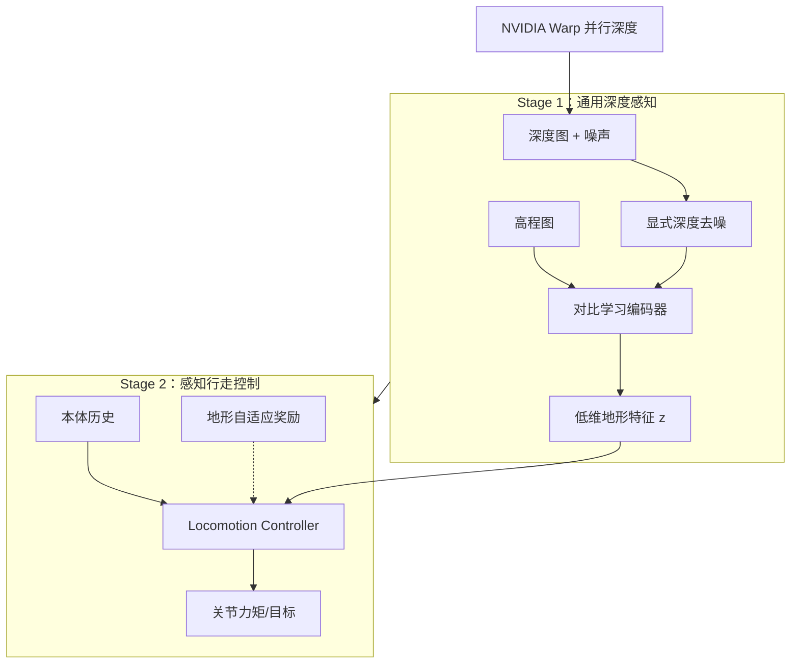
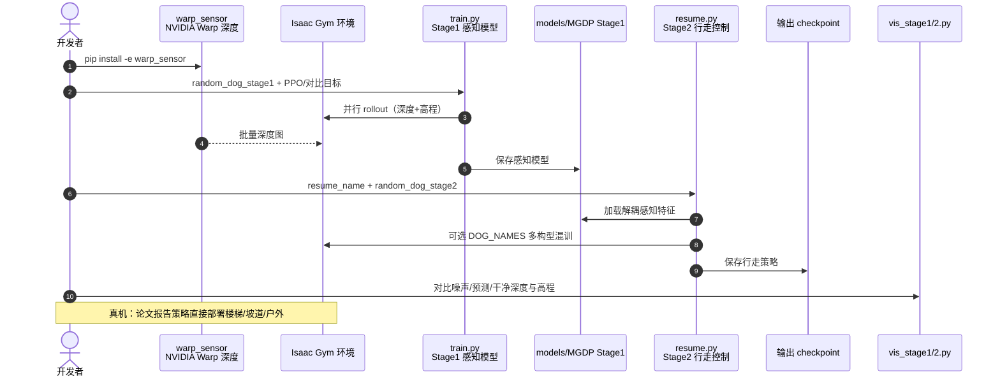

# MGDP：四足通用深度感知模型

**MGDP**（*Mastering a Generalized Depth Perception Model for Quadruped Locomotion*，*Advanced Science* 2026，[DOI:10.1002/advs.202524345](https://doi.org/10.1002/advs.202524345)，[项目页](https://arclab-hku.github.io/MGDP/)，[代码](https://github.com/arclab-hku/MGDP)）由 **香港大学** 与 **北京理工大学** Yinzhao Dong、Ji Ma、Peng Lu 等提出：用**对比学习**从深度图与高程图提取**低维、跨地形泛化**特征，并与动力学**解耦**，再配合**地形自适应奖励**在单训练阶段习得攀爬、跳跃、匍匐、挤压等技能；**NVIDIA Warp** 并行深度计算降低感知 DRL 算力瓶颈。

## 一句话定义

**先训一个可迁移的通用深度感知头，再把它当固定地形接口接行走策略——用对比特征 + 去噪扛噪声，用解耦换跨构型快速微调。**

## 英文缩写速查

| 缩写 | 英文全称 | 简要说明 |
|------|----------|----------|
| MGDP | Mastering a Generalized Depth Perception Model | 本文框架（感知模型 + 行走控制器） |
| DRL | Deep Reinforcement Learning | Isaac Gym 中 PPO 类感知行走训练 |
| RL | Reinforcement Learning | 强化学习 |
| Sim2Real | Simulation to Real | 策略直接部署真机楼梯/坡道/户外 |
| GPU | Graphics Processing Unit | Warp 并行深度渲染依赖 CUDA |
| PPO | Proximal Policy Optimization | 行走控制器训练（legged_gym 栈） |

## 为什么重要

- **地形泛化 + 平台可迁移同时做：** 现有感知 DRL 常只能二选一；MGDP 用**解耦感知**支持 **9** 种四足构型与 **10** 类极端地形。
- **算力与噪声两条工程痛点：** **Warp** 并行深度缓解训练开销；**显式深度去噪** 针对传感器伪影，比裸深度端到端更稳。
- **单阶段技能栈：** 地形自适应奖励调节惩罚，无需多阶段蒸馏即可学攀爬/跳跃/匍匐/挤压 — 对照 [Extreme Parkour](./extreme-parkour.md) 等 teacher-student 路线。
- **与 [PIE](../methods/pie-perceptive-locomotion.md) / [APT-RL](./paper-apt-rl-agile-perceptive-quadruped-locomotion.md) 同轴：** 都是感知四足 DRL，但 MGDP 强调**对比学习特征 + 跨构型感知预训练**。

## 核心信息

| 项 | 内容 |
|----|------|
| **机构** | 香港大学（HKU）；北京理工大学（BIT） |
| **仿真** | Isaac Gym；`warp_sensor`（NVIDIA Warp） |
| **感知输入** | 深度图 + 高程图（height map） |
| **评测构型** | A1、B1、Go1、Go2、Lite3、Spot、Aliengo、ANYmal C、Mini Cheetah |
| **开源** | **已开源** — [arclab-hku/MGDP](https://github.com/arclab-hku/MGDP)（无官方预训练权重托管） |

## 流程总览

## 核心原理

1. **对比学习地形表征：** 从多模态几何输入学到**跨场景可迁移**的低维特征，而非过拟合单一 URDF 的动力学纠缠表征。
2. **感知–动力学解耦：** Stage1 预训练感知模型；Stage2 换 `DOG_NAMES` 可**快速微调**行走策略而少动感知骨干。
3. **显式去噪分支：** 训练/可视化可对比 noisy / predicted / clean depth，利于诊断 sim2real 深度域差。
4. **地形自适应奖励：** 不同障碍类型动态调节碰撞、姿态等惩罚，单阶段覆盖离散与连续极端地形。

## 源码运行时序图

官方仓库 [arclab-hku/MGDP](https://github.com/arclab-hku/MGDP)（归档见 [sources/repos/mgdp.md](../../sources/repos/mgdp.md)）：

- **最短复现路径：** Python 3.8 + Isaac Gym + `pip install -e .` → `train.py` → `resume.py` → `vis_stage2.py`。
- **多构型：** Stage2 设 `DOG_NAMES = [...]`，环境按 `dog_id = i % len(DOG_NAMES)` 轮换。

## 实验与评测

### 跨构型泛化（项目页）

- **9** 种四足在尺寸与动力学差异显著条件下，均可穿越挑战地形。
- 定量表：**10** 类极端地形上，每格为「该构型稳定可达最大难度 / 该地形最大难度」比值，反映 traversal 上限。

### 仿真与真机

- 仿真：离散缝隙、踏脚石、连续崎岖等；策略表现鲁棒敏捷 locomotion。
- 真机：**直接部署**（无额外微调叙述为主打），覆盖楼梯、坡道、户外非结构化场景。

## 结论

**MGDP 把「通用深度感知」做成可预训练、可去噪、可跨 URDF 复用的模块，是四足感知 DRL 走向统一框架的实用一步。**

1. **对比学习 + 深度/高程双模态** 是跨地形泛化的核心，不是简单堆更深 CNN。
2. **感知–动力学解耦** 直接服务 **9 构型快速微调** — 部署选型时优先保留 Stage1 权重。
3. **Warp 并行深度** 解决训练算力瓶颈，是大规模感知 rollout 的工程前提。
4. **显式去噪** 应纳入 sim2real 检查清单（`vis_stage1.py` 对比视图）。
5. **地形自适应奖励** 让攀爬/跳跃/匍匐/挤压单阶段可学，减少蒸馏流水线依赖。
6. **官方代码完整** — [arclab-hku/MGDP](https://github.com/arclab-hku/MGDP) 可复现 Stage1/2；**无** 官方预训练权重，需自备 GPU 与 Isaac Gym 许可。
7. **对照 [DreamWaQ](../methods/dreamwaq.md)**：MGDP 走**显式深度前瞻**；对照 [PIE](../methods/pie-perceptive-locomotion.md)：MGDP 强调**跨构型感知预训练**而非单狗单阶段隐式–显式多头。

## 与其他工作对比

| 对照 | 差异读法 |
|------|----------|
| [DreamWaQ](../methods/dreamwaq.md) | 盲走、本体想象地形；MGDP **机载深度+高程** 与对比特征 |
| [PIE](../methods/pie-perceptive-locomotion.md) | 单阶段隐式–显式估计器；MGDP **两阶段解耦 + 跨构型感知预训练** |
| [APT-RL](./paper-apt-rl-agile-perceptive-quadruped-locomotion.md) | TO+TVAE 动作先验 + 深度/LiDAR 蒸馏；MGDP **对比地形特征 + Warp 深度** |
| [Extreme Parkour](./extreme-parkour.md) | 两阶段 teacher-student 跑酷；MGDP **单阶段技能 + 解耦感知迁移** |

## 局限与风险

- **Isaac Gym 依赖：** 内嵌 vendor 包，需 NVIDIA 许可；环境钉死 **PyTorch 1.10 / Python 3.8**，与现代栈有落差。
- **无官方权重：** 复现成本主要在 Stage1 大规模并行训练。
- **许可证：** 仓库根目录截至入库日**无**独立 LICENSE 文件，商用需自行核对。

## 工程实践

| 项 | 建议 |
|----|------|
| 环境 | 严格按 README：conda 3.8.20 + cu113 torch + Isaac Gym + `warp_sensor` |
| 训练顺序 | 先 Stage1 收敛再 `resume.py`；勿跳过感知预训练直接训行走 |
| 多构型 | Stage2 用 `DOG_NAMES` 混训验证解耦假设 |
| 调试 | `COMPARE_DEPTH_VIS` / `COMPARE_HEIGHT_VIS` 查去噪与高程对齐 |
| Sim2Real | 真机前对比 noisy vs predicted depth 分布 |

## 关联页面

- [Stair & Obstacle Perceptive Locomotion](../tasks/stair-obstacle-perceptive-locomotion.md)
- [PIE](../methods/pie-perceptive-locomotion.md)
- [APT-RL](./paper-apt-rl-agile-perceptive-quadruped-locomotion.md)

## 参考来源

- [MGDP 论文摘录](../../sources/papers/mgdp_adv_sci_2026.md)
- [MGDP 项目页归档](../../sources/sites/mgdp.md)
- [MGDP 仓库归档](../../sources/repos/mgdp.md)

## 推荐继续阅读

- [Advanced Science 论文 PDF](https://advanced.onlinelibrary.wiley.com/doi/pdf/10.1002/advs.202524345)
- [MGDP 项目页](https://arclab-hku.github.io/MGDP/)
- [GitHub: arclab-hku/MGDP](https://github.com/arclab-hku/MGDP)
