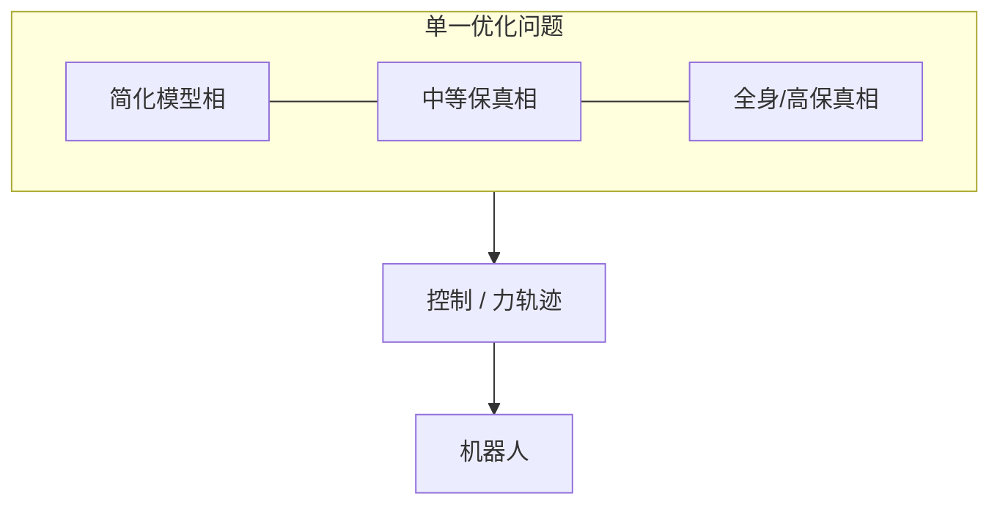
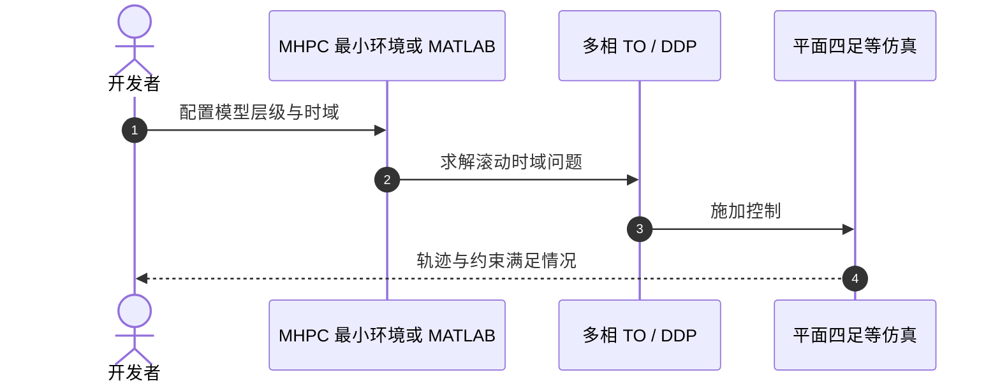

# Model Hierarchy Predictive Control (MHPC)

## 一句话定义

**Li, Frei & Wensing（圣母大学，[arXiv:2010.08881](https://arxiv.org/abs/2010.08881)）** 提出 **MHPC**：把传统「先简模型再繁模型」的**串行层级 MPC** 改成在**一个**多相滚动时域轨迹优化里嵌入**模型层级**，可用通用 multi-phase TO 求解器实现。

## 英文缩写速查

| 缩写 | 英文全称 | 简要说明 |
|------|----------|----------|
| MHPC | Model Hierarchy Predictive Control | 本文架构名 |
| MPC | Model Predictive Control | 经典预测控制 |
| TO | Trajectory Optimization | 轨迹优化 |
| SRBD | Single Rigid Body Dynamics | 常见简化层模型 |
| DDP | Differential Dynamic Programming | 可与 HS-DDP 联用的求解族 |

## 为什么重要

- 重新定义「层级」：不是流水线多个 QP，而是**单问题内多保真模型**。
- 与 [HS-DDP](./paper-hs-ddp-legged.md) 同属 ROAM 最优控制工具链，常被 Mini Cheetah 相关规划工作引用。
- 为高维机器人提供比纯简化 MPC 更细、又比全程全身 MPC 更省的折中。

## 核心信息

| 项 | 内容 |
|----|------|
| **机构** | 圣母大学（University of Notre Dame） |
| **形式** | multi-phase receding-horizon TO |
| **开源** | **部分开源**（HS-DDP-MATLAB 示例；社区 [MHPC_Minimal_Env](https://github.com/NaCl-1374/MHPC_Minimal_Env)） |

## 核心原理

- 传统：Solve₁(简)→Solve₂(繁)… 易不一致。
- MHPC：层级模型同场优化，相位与时域耦合在一个问题。

## 源码运行时序图

**部分适用**——官方无单一「MHPC 真机仓」；算法侧可经 HS-DDP-MATLAB / 社区最小环境理解：

## 工程实践

| 项 | 建议 |
|----|------|
| 建模 | 明确每层模型负责的时域与变量 |
| 求解 | 选用支持 multi-phase 的 TO/DDP 后端 |
| 对照 | 与 Mini Cheetah 上 cMPC/WBIC 工程栈区分：MHPC 更偏规划理论 |

## 评测

| 维度 | 要点 |
|------|------|
| 基准 | 仿真四足等高维系统 |
| 对比 | 相对传统层级 MPC 序列 |
| 实现 | 通用 multi-phase TO |

## 结论

**总判：** MHPC 的贡献是**问题表述**：把模型层级放进单个预测控制问题，避免串行层级的接口裂缝。

- 真影响：多保真耦合优化的架构清晰度。
- 次要代价：实现与调参复杂；实时嵌入需裁剪。
- 部署：先仿真验证层级设定，再谈嵌入 Mini Cheetah 类平台。

## 局限与风险

- 完整开源真机栈缺失。
- 与工业常用「cMPC + WBC」工程路径不同，迁移成本高。

## 关联页面

- [HS-DDP](./paper-hs-ddp-legged.md)
- [MPC](../methods/model-predictive-control.md)
- [MPC–WBC 集成](../concepts/mpc-wbc-integration.md)
- [MIT Mini Cheetah](./mit-mini-cheetah.md)

## 参考来源

- [论文归档](../../sources/papers/mhpc_arxiv_2010_08881.md)
- [HS-DDP-MATLAB](../../sources/repos/roam-lab-nd-hs-ddp-matlab.md)

## 推荐继续阅读

- arXiv：<https://arxiv.org/abs/2010.08881>
