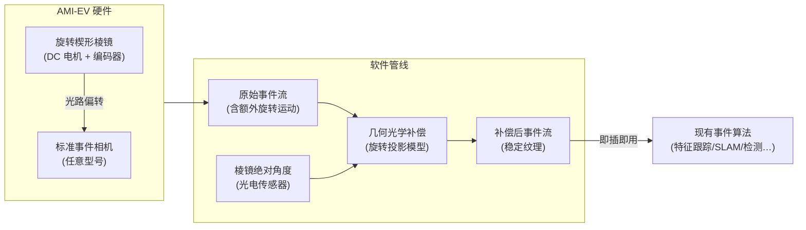
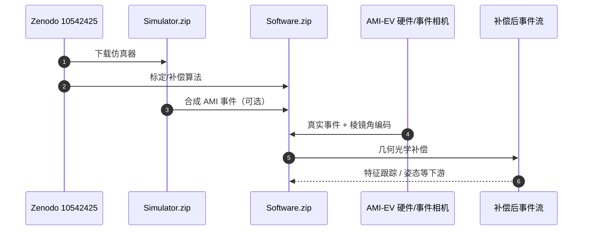

# AMI-EV：微扫视启发的事件相机系统

**Microsaccade-inspired event camera for robotics**（Botao He*、Fei Gao*、Cornelia Fermüller* 等，ZJU FAST-Lab + UMD HLB Lab + HKUST，**Science Robotics 2024**，[DOI:10.1126/scirobotics.adj8124](https://doi.org/10.1126/scirobotics.adj8124)，[arXiv:2405.17769](https://arxiv.org/abs/2405.17769)）提出 **AMI-EV**（Artificial MIcrosaccade-enhanced EVent camera）：在标准事件相机镜头前加装 **旋转楔形棱镜**，主动制造周期性光路偏移（模拟人眼微扫视），使即便相机和场景均静止时也能 **持续产生事件**；再通过 **几何光学补偿算法** 消除棱镜附加运动，恢复稳定纹理——最终实现对现有事件驱动算法的 **即插即用兼容**，并在极端光照场景下超越普通灰度相机。

## 一句话定义

**在事件相机前加旋转楔形棱镜"主动微扫视"，几何光学补偿后使静止场景持续产生事件，同时保留事件相机的 HDR 与微秒级时间分辨率优势，解决事件相机最核心的纹理消失问题。**

## 英文缩写速查

| 缩写 | 英文全称 | 简要说明 |
|------|----------|----------|
| AMI-EV | Artificial MIcrosaccade-enhanced EVent camera | 本文系统：棱镜 + 事件相机 + 补偿算法 |
| HDR | High Dynamic Range | 高动态范围；事件相机的核心优势，AMI-EV 予以保留 |
| VIO | Visual-Inertial Odometry | 视觉-惯性里程计；事件相机常见下游任务 |
| UMD | University of Maryland | 马里兰大学帕克分校，Fermüller/Aloimonos 实验室 |
| ESC | Electronic Speed Controller | 电调；控制棱镜旋转直流电机 |
| S-EV | Standard Event Camera | 标准事件相机；AMI-EV 的比较基准 |
| ZJU | Zhejiang University | 浙江大学，Gao Fei 课题组 |

## 为什么重要

- **根治事件相机的先天局限：** 事件相机只感知亮度变化，平行于运动方向的边缘在静止时完全不产生事件；这是 **传感器物理内禀缺陷**，无法单靠软件解决。AMI-EV 通过 **主动引入可精确补偿的运动** 从根源上消除这一缺陷，思路类似「用已知噪声打败未知噪声」。
- **极端光照场景的唯一可行方案：** 在逆光/强闪/黑暗等 HDR 场景，普通相机过曝或欠曝，标准事件相机纹理不稳定；**实验表明 AMI-EV 是三种传感方案中唯一鲁棒的**——对无人机、车辆、工业视觉等恶劣环境场景有直接价值。
- **即插即用降低迁移成本：** 棱镜旋转被精确补偿后，输出事件流与标准事件相机格式相同；现有算法（特征跟踪、SLAM、目标检测）无需任何修改即可受益，**采用门槛极低**。
- **Zenodo 工具链：** 硬件 / 软件 / 仿真 / 数据集打包在 [Zenodo:10542425](https://zenodo.org/records/10542425)（同内容亦见 8157775），社区可无物理硬件先跑仿真与 Translator。

## 系统架构

## 核心机制（提炼）

| 要素 | 设计 | 物理原理 |
|------|------|----------|
| **旋转楔形棱镜** | 折射率 >1 的光学楔形体持续旋转，将光线周期性偏折至传感器不同区域 | 几何光学折射；偏折角由楔角和折射率精确计算 |
| **主动微扫视** | 棱镜旋转 → 场景投影在传感器面上持续移动 → 静止边缘也产生事件 | 模拟视网膜上"场景边缘持续扫过感光细胞"的效果 |
| **几何光学补偿** | 依据棱镜角度计算像素级偏移并在事件坐标中补偿 | 可微几何变换，无需神经网络 |
| **位置编码器** | 绝对位置编码器实时读取棱镜朝向 | 补偿算法精度依赖角度参考误差 |
| **即插即用** | 补偿后事件流与标准事件格式（x, y, t, p）一致 | 下游算法零改动；只需用 AMI-EV 替换相机 |

## 性能评测与对比总结

| 场景类型 | 普通灰度相机 | 标准事件相机 | AMI-EV |
|----------|-------------|-------------|--------|
| 结构化环境（正常光照） | 优 | 差（静止时丢纹理） | **优** |
| 非结构化环境 | **最优** | 差 | 良 |
| 极端光照（HDR/逆光/黑暗） | 失效（过曝/欠曝） | 差（纹理不稳） | **唯一鲁棒** |

- **低层任务（特征检测与跟踪）：** 在三类场景下，AMI-EV 综合优于标准事件相机，极端光照下优于灰度相机。
- **高层任务（人体检测 + 姿态估计）：** AMI-EV 在极端光照下成功，其他两种方案均失败。

## 局限与风险

- **额外机械部件：** 旋转棱镜增加约 57 g 重量与电机功耗；对超轻量无人机（<100 g）或尺寸受限场景有明显约束。
- **补偿误差对精度的影响：** 几何光学补偿依赖棱镜绝对角度精度；高速旋转或振动环境下编码器误差可能导致残余运动伪影。
- **仿真到真实的域偏移：** 仿真平台（WorldGen）生成的合成 AMI-EV 数据与真实采集数据存在域差异；基于仿真训练的模型在真实场景中的泛化需额外验证。
- **现有数据集覆盖有限：** Translator 工具支持 Caltech101 和 MVSEC，但更多专用基准（如 ESIM 生成的高速运动数据集）的适配需社区贡献。
- **动态场景补偿复杂度：** 相机与场景同时运动时，补偿算法需同时处理棱镜附加运动与真实相机运动，分离精度受限。

## 源码运行时序图

项目页未挂独立 GitHub 应用仓；**可运行资产以 Zenodo 压缩包为准**（`Hardware.zip` / `Software.zip` / `Simulator.zip` / `Dataset.zip`）。

## 工程实践

- **开源状态（2026-07-20）：** [Zenodo](https://zenodo.org/records/10542425) 提供 Hardware/Software/Simulator/Dataset 全套；项目页为演示与入口，非 GitHub 主仓。
- **直接复用途径：** 先跑 **Simulator + Translator**，再按 Materials and Methods 复现棱镜模块。
- **下游算法适配：** 补偿后事件流可接现有事件特征跟踪 / SLAM，接口改动小。
- **与神经形态计算结合：** 感知层增强，与 SNN 等算力路线正交可叠加。

## 关联页面

- [KEMO：事件驱动关键帧记忆 VLA](./paper-kemo-event-driven-keyframe-memory-vla.md)
- [Sim2Real（仿真到真实迁移概念）](../concepts/sim2real.md)

## 参考来源

- [深蓝AI：近五年 Science Robotics 中国顶尖高校盘点](../../sources/blogs/wechat_shenlan_scirobotics_china_top3_2026-07-02.md)
- [AMI-EV 论文归档（Science Robotics 2024）](../../sources/papers/microsaccade_inspired_event_camera_scirobotics_2024.md)
- [AMI-EV 项目页归档](../../sources/sites/ami-ev-bottle101-github-io.md)
- He et al., *Microsaccade-inspired event camera for robotics*, [Science Robotics 2024](https://doi.org/10.1126/scirobotics.adj8124) · [arXiv:2405.17769](https://arxiv.org/abs/2405.17769)

## 推荐继续阅读

- [AMI-EV 项目页（代码 + 视频 + 仿真）](https://bottle101.github.io/AMI-EV/)
- [arXiv 全文（含完整方法与实验）](https://arxiv.org/abs/2405.17769)
- [Science Robotics 论文页](https://doi.org/10.1126/scirobotics.adj8124)
