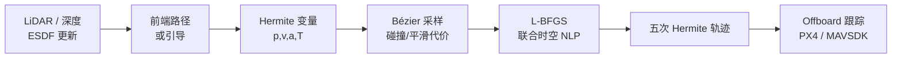

# MIGHTY（Hermite 样条高效 UAV 轨迹规划）

**MIGHTY**（*Hermite Spline-based Efficient Trajectory Planning*，arXiv:2511.10822，[IEEE RA-L 2026](https://arxiv.org/abs/2511.10822)，[代码](https://github.com/mit-acl/mighty)，[视频](https://youtu.be/Pvb-VPUdLvg)）是 MIT ACL 提出的 **软约束四旋翼轨迹规划器**：用 **五次 Hermite 样条** 显式参数化各 knot 的 **位置、速度、加速度** 与 **段时长**，在 **一次非线性优化** 中完成 **联合时空** 搜索，并借 Bézier 基实现高效代价评估与闭式梯度。

## 一句话定义

**把 UAV 局部重规划写成 Hermite 空间上的联合时空 NLP**——在保留样条连续搜索空间的同时，获得 B-spline 类方法的 **几何局部性** 与 MINCO 类方法缺乏的 **knot 级高阶动力学直接控制**。

## 英文缩写速查

| 缩写 | 英文全称 | 简要说明 |
|------|----------|----------|
| UAV | Unmanned Aerial Vehicle | 无人机，本文聚焦四旋翼微分平坦轨迹 |
| NLP | Nonlinear Program | 非线性规划；MIGHTY 用软惩罚 unconstrained NLP |
| ESDF | Euclidean Signed Distance Field | 欧氏符号距离场，碰撞软惩罚常用表示 |
| ROS 2 | Robot Operating System 2 | MIGHTY 官方栈基于 Humble 发行版 |
| RA-L | IEEE Robotics and Automation Letters | 论文录用期刊 |
| MINCO | Minimum Control | 最小控制努力类轨迹参数化（waypoint + duration） |

## 为什么重要

- **规划表示层的新选项**：相对 [EGO-Planner Swarm](./ego-planner-swarm.md) 的 **均匀 B-spline + 固定/后处理时间分配**，MIGHTY 在 **同一次优化** 里调节几何与高阶动力学，论文报告更短 **飞行时间** 与 **求解时间**。
- **相对 MINCO/SUPER 的搜索空间**：MINCO 将系数全局耦合在 banded 线性系统里，难以对单个 knot 独立塑形；Hermite 保证 $\mathcal{C}^2$ 连续且 **局部可控**，更适合叠加碰撞/动力学软惩罚的通用目标。
- **工程可复现**：官方 [mit-acl/mighty](https://github.com/mit-acl/mighty) 提供 Docker、Gazebo、`run_sim.py` 与 Livox 真机依赖锁定，补齐多旋翼栈中「**新一代软约束 planner**」的实体节点。

## 核心结构

| 模块 | 作用 |
|------|------|
| **Hermite 决策变量** | 内点 knot 的 $\mathbf{p}_i,\mathbf{v}_i,\mathbf{a}_i$ 与各段时长 $T_s$（边界 knot 固定） |
| **Bézier 代价评估** | 每段 Hermite→Bézier 仿射映射；在 Bernstein 基下采样碰撞/平滑项，数值更稳 |
| **闭式梯度链** | $\partial J/\partial \mathbf{c}_s$ 经 $C(T_s)^\top$ 回传至 Hermite 变量与 $T_s$ |
| **软约束** | ESDF 排斥势、速度/加速度/jerk 超限惩罚；$T_s=\exp(\sigma_s)$ 保证正时长 |
| **前端引导** | kinodynamic 搜索或引导路径初始化（与 EGO 类管线类似） |
| **执行层** | 轨迹跟踪 → [PX4](./px4-autopilot.md) / [MAVSDK](./mavsdk.md) Offboard 设定点 |

### 流程总览

### 与相邻规划器的分界

| 规划器 | 表示 | 时间优化 | 高阶导数控制 | 备注 |
|--------|------|----------|--------------|------|
| [EGO-Planner Swarm](./ego-planner-swarm.md) | 均匀 B-spline | 固定 knot / 后处理 | 控制点间接 | 工程生态成熟、swarm 扩展 |
| RAPTOR | 均匀 B-spline | 固定 | 控制点间接 | 两阶段 QP 热启动 + NLP |
| MINCO / SUPER | MINCO | 联合 | 解析耦合、无局部导数 | 最小 jerk/snap 解析最优 |
| **MIGHTY** | 五次 Hermite | **联合** | **knot 级直接** | RA-L 2026；真机 6.7 m/s 报告 |

## 实验要点（索引级）

- **仿真**：静态复杂场景相对 SOTA **计算时间 −9.3%**、**飞行时间 −13.1%**，**成功率 100%**；动态障碍场景验证安全行为。
- **真机**：LiDAR 感知定位；静态 clutter **最高 6.7 m/s**；长航时与 **在线新增动态障碍** 实验（见项目视频）。
- **复现**：Ubuntu 22.04 + ROS 2 Humble；`docker/make run-interactive` 或 `setup.sh` + `run_sim.py`（细节见 [sources/repos/mighty.md](../../sources/repos/mighty.md)）。

## 常见误区或局限

- **误区：MIGHTY 是硬约束安全规划器** — 与 EGO 同类，靠 **软惩罚** 实现快速梯度优化；极端安全场景仍需限速、禁飞区、人工接管等外层。
- **误区：Hermite 可直接替代 PX4 内环** — 输出仍是 **轨迹/设定点**；姿态与推力跟踪由飞控完成。
- **局限：平台绑定** — 官方栈锁定 **ROS 2 Humble + Ubuntu 22.04**；与 ROS 1 版 EGO 教程栈不能直接混用。
- **局限：群体扩展** — 论文聚焦 **单机** 高效规划；多机 swarm 协调需额外层（对照 EGO-Planner Swarm 的 swarm 分支）。

## 关联页面

- [多旋翼仿真—规划—飞控栈总览](../overview/multirotor-simulation-planning-control-stack.md) — 本页在规划层的定位
- [EGO-Planner Swarm](./ego-planner-swarm.md) — 同赛道 B-spline 软约束基线与工程对照
- [PX4 Autopilot](./px4-autopilot.md) · [MAVSDK](./mavsdk.md) — 常见执行层
- [Flightmare](./flightmare.md) — 敏捷飞行仿真前端（感知—规划闭环验证）

## 方法栈

见上文 **核心结构** 与 **流程总览**（Hermite 决策变量 → Bézier 代价 → L-BFGS 联合时空 NLP → Offboard 跟踪）；闭式梯度与 diffeomorphism 细节见 [论文 PDF](https://arxiv.org/abs/2511.10822)。

## 与其他工作对比

- 正文 **与相邻规划器的分界** 表给出相对 EGO-Planner / RAPTOR / MINCO 的表示与时间优化差异；定量 benchmark（计算时间 −9.3%、飞行时间 −13.1%、成功率 100%）见 [参考来源](#参考来源) 论文摘录。

## 参考来源

- [MIGHTY 论文摘录（arXiv:2511.10822）](../../sources/papers/mighty_arxiv_2511_10822.md)
- [mit-acl/mighty 代码索引](../../sources/repos/mighty.md)

## 推荐继续阅读

- [MIGHTY 论文 PDF](https://arxiv.org/abs/2511.10822) — Hermite 公式、梯度推导与 benchmark 细节
- [mit-acl/mighty README](https://github.com/mit-acl/mighty) — Docker / Gazebo / 真机构建
- [EGO-Planner 原版仓库](https://github.com/ZJU-FAST-Lab/ego-planner) — B-spline 软约束经典实现
- [演示视频](https://youtu.be/Pvb-VPUdLvg) — 高速飞行与动态障碍真机片段
