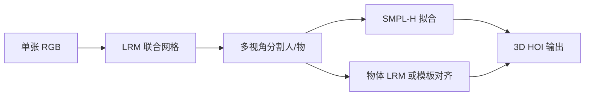
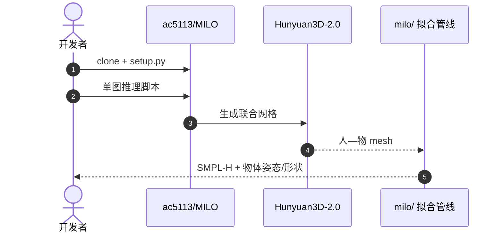

# MILO：大型重建模型解释人—物三维交互

**MILO**（*Reconstructing Humans and Objects in Interaction using Large Reconstruction Models*，[arXiv:2608.27407](https://arxiv.org/abs/2608.27407)，[项目页](https://ac5113.github.io/MILO)，[代码](https://github.com/ac5113/MILO)）由 **德州大学奥斯汀分校（UT Austin）** 提出：用 **大型重建模型（LRM）** 从单张 RGB 生成人—物联合网格，再分割并拟合 **SMPL-H** 与可选物体模板，把困难优化转为 **解释 LRM 几何**。

## 一句话定义

**LRM 的价值不仅是生成几何，更是提供保留人—物相对布局的交互脚手架。**

## 英文缩写速查

| 缩写 | 英文全称 | 简要说明 |
|------|----------|----------|
| HOI | Human-Object Interaction | 人—物交互 |
| LRM | Large Reconstruction Model | 大规模图像到三维重建模型 |
| SMPL-H | SMPL with Hands | 带手部关节的参数化人体模型 |
| MILO | Modeling Interactions using Large Reconstruction MOdels | 本文方法名 |

## 为什么重要

- 纳入 [具身智能小站 2026-08-31 九篇盘点](../../sources/blogs/wechat_embodied_station_clap_9_papers_open_source_2026-08-31.md) 的「三维交互感知」支线。
- 相对二维重投影 + 接触约束拟合，**无需 GT 接触** 即在 InterCap / HODome / IMHD 上 SOTA。
- **已开源** `ac5113/MILO`（ECCV 2026 官方代码）。

## 核心信息

| 项 | 内容 |
|----|------|
| **机构** | 德州大学奥斯汀分校（UT Austin） |
| **骨干 LRM** | Hunyuan3D-2.0（实现可替换） |
| **人体** | HMR2.0 初始化 + SMPL-H 优化 |
| **开源** | **已开源** [ac5113/MILO](https://github.com/ac5113/MILO) |

### 流程总览

## 评测

| 基准 | 读法 |
|------|------|
| InterCap / HODome / IMHD | 定量优于既有单图 HOI 基线 |
| PICO-db 野外图 | 定性展示布局一致性 |

## 与其他工作对比

单图 HOI 重建的分歧点是「三维先验从哪来」——MILO 的答案是 **让 LRM 先把人和物一起生出来，再去解释这团几何**：

| 路线 | 输入 | 三维先验来源 | 接触处理 | 相对 MILO |
|------|------|--------------|----------|-----------|
| **MILO** | 单张 RGB | **LRM 联合网格**（Hunyuan3D-2.0，可替换） | **无需 GT 接触**，靠 LRM 保留的相对布局 | — |
| 二维重投影 + 接触约束拟合 | 单张 RGB | 参数化人体 + 物体模板 | 显式接触先验/标注驱动优化 | 本文的直接对照组；MILO 在 InterCap / HODome / IMHD 上定量占优 |
| [ECHO](./paper-sa-2508-21556-echo-ego-centric-modeling-of-human-object-intera.md) | **头 + 腕稀疏追踪**（非图像） | 三变量扩散过程 | 与人体姿态、物体运动**联合恢复** | 传感形态完全不同：ECHO 面向可穿戴/头显链路，MILO 面向单目图像与野外素材 |

- **模板是可选项而非前提**：物体侧走「LRM 物体部分」或「模板对齐」双路径，缺 CAD 时仍能出解，但精细度受限（见「局限与风险」）。
- **对机器人链路的位置**：MILO 产出的是 **SMPL-H + 物体姿态/形状**，属于 [动作重定向管线](../concepts/motion-retargeting-pipeline.md) 的上游供给端，不替代重定向本身的可行性与约束求解。
- **同批次分工**：在 [CLAP 九篇地图](../overview/clap-cross-embodiment-vla-wm-9-papers-technology-map.md) 的「感知—执行接口」组里，MILO 补 **三维交互几何**，[ViTaR](./paper-vitar.md) 补 **接触执行校准**，[AlloEgo-VLM](./paper-alloego-vlm.md) 补 **参照系语义**——三者互补而非竞争。

## 结论

**单图 HOI 应优先解释 LRM 联合几何，而不是在二维歧义里硬拟合接触。**

- LRM 网格保留相对布局与邻近关系，降低优化难度
- 人体 SMPL-H + 物体 LRM/模板双路径，模板可选
- 不依赖 GT 接触仍达 SOTA
- 官方代码与 demo 可复现
- 对机器人 teleop / 操作场景的三维交互感知有直接价值

## 源码运行时序图

## 局限与风险

- **LRM 依赖：** 几何质量受所选 LRM 与算力约束。
- **物体侧：** 无模板时依赖 LRM 物体部分，精细 CAD 级精度有限。
- **单图：** 深度歧义未完全消除，极端遮挡仍困难。

## 关联页面

- [Manipulation](../tasks/manipulation.md)
- [CLAP / 跨本体 9 篇技术地图](../overview/clap-cross-embodiment-vla-wm-9-papers-technology-map.md)

## 参考来源

- [milo_arxiv_2608_27407](../../sources/papers/milo_arxiv_2608_27407.md)
- [ac5113-milo](../../sources/sites/ac5113-milo.md)
- [ac5113-milo 仓库](../../sources/repos/ac5113-milo.md)
- [wechat_embodied_station_clap_9_papers_open_source_2026-08-31](../../sources/blogs/wechat_embodied_station_clap_9_papers_open_source_2026-08-31.md)

## 推荐继续阅读

- [arXiv:2608.27407](https://arxiv.org/abs/2608.27407)
- [MILO 项目页](https://ac5113.github.io/MILO)
