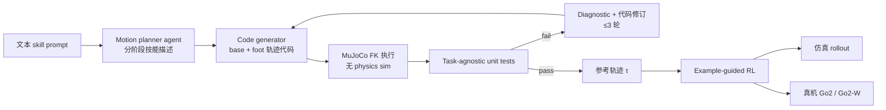

# MimicAgent（arXiv:2609.24145）

**MimicAgent**（*Quadruped Skills via Prompt-to-Trajectory Generation*，CMU，[arXiv:2609.24145](https://arxiv.org/abs/2609.24145)）提出 **prompt-to-trajectory** agentic 管线：用 LLM coding agent 生成 ** kinematically feasible 但 dynamics-infeasible** 的参考轨迹，再交给 **example-guided RL**（DeepMimic 族）在仿真与 **Unitree Go2 / Go2-W** 真机落地；相对 Eureka 等 **LLM reward design**，强调 **轨迹合成比 reward shaping 更易泛化**。

## 一句话定义

用 LLM 把自然语言技能变成可执行 reference trajectory，再用模仿式 RL 补全动力学，让四足（及扩展人形 SMPL）从文本获得多样动态技能。

## 英文缩写速查

| 缩写 | 英文全称 | 简要说明 |
|------|----------|----------|
| RL | Reinforcement Learning | 参考轨迹跟踪与 sim2real |
| FK | Forward Kinematics | MuJoCo 运动学执行，无 physics |
| LLM | Large Language Model | motion planner / code generator agent |
| Sim2Real | Simulation to Real | Go2 / Go2-W 真机部署 |
| EGRL | Example-Guided RL | 参考运动 + RL 跟踪（DeepMimic 族） |

## 为什么重要

- **四足数据缺口：** 人形有大规模 mocap，四足公开参考库远小；MimicAgent 用 LLM **合成** 参考，绕过 reward engineering。
- **与 Eureka 对照：** 同一文本 prompt，轨迹法在 **7 技能** 与 **57 人用户研究** 中多次优于 LLM reward 与手工 keyframe（Bound / RYP 等例外见项目页表）。
- **Agent 范式：** motion planner → code gen → unit tests → self-improvement，与 [ai-auto-research](../concepts/ai-auto-research.md) S3 代码生成环同构但目标域为 **motor skill**。

## 核心信息

| 字段 | 内容 |
|------|------|
| 机构 | 卡内基梅隆大学（CMU） |
| arXiv | [2609.24145](https://arxiv.org/abs/2609.24145) |
| 项目页 | <https://luckykantnayak.github.io/mimic-agent/> |
| 开源状态 | **待发布**（code coming soon，2026-09-23） |
| 真机 | Unitree Go2、Go2-W（wheeled quadruped） |

## 流程总览

### Unit tests（技能无关）

- Base height envelope
- Joint limit violations
- Foot ground penetration
- Non-aerial 脚接触约束

## 工程实践

| 检查项 | 建议 |
|--------|------|
| 参考质量 | 87% prompt 语义对齐（Claude Fable 5.1 + harness）；仍依赖 unit test 过滤退化轨迹 |
| 粗轨迹可用性 | 动力学不可行轨迹 **足够** 作 RL 目标 — 勿要求 LLM 输出 physics-valid |
| 开源 | 代码待发布；复现前以 PDF + 项目页视频为准 |
| 人形扩展 | SMPL 演示为 **同管线** 能力展示；主实验与指标在四足 |

## 源码运行时序图

**不适用**（截至 2026-09-23 项目页 **code coming soon**，无官方仓库入口）。代码发布后应补 `sources/repos/` 并更新本图。

## 实验与评测读法

- **7 技能 baseline：** Eureka、Manual Keyframing、MimicAgent — Trot/Bound/Flip/AC/CDS/RYP 等（Go2 vs Go2-W 分工见项目页）。
- **用户研究：** n=57，1–5 偏好分；MimicAgent 在 Side Flip、Front Flip、AC、CDS 等领先。
- **真机：** four-leg trot、two-leg walk/skate/roll、handstand 过渡等 clip — 证明 sim2real 非仅仿真。

## 结论

**MimicAgent 把四足技能学习从「reward 景观搜索」改写成「参考轨迹合成 + EGRL」，对缺 mocap 的 embodiment 尤具启发。**

1. LLM **生成参考** 比 **生成 reward** 更易跨技能/形态泛化（相对 Eureka）。
2. **粗、动力学不可行** 轨迹仍可作为 DeepMimic 族有效监督 — 降低对 mocap 精度依赖。
3. Agentic 环（planner → code → test → revise）是 scalable skill library 的关键工程壳。
4. 开源 **待发布**；部署前勿假设仓库与 checkpoint 可用。
5. 与 [reinforcement-learning](../methods/reinforcement-learning.md) / DeepMimic 对照阅读，明确 **参考从哪来** 这一变量。

## 局限与风险

- **Wheeled quadruped：** Go2-W 技能（flip、skating）对 unit test 与 RL 稳定性要求更高；Eureka 在 RYP 上仍可能更优。
- **人形 SMPL：** 演示 ≠ 与 AMASS 级 mocap 同等数据效率；真机人形未作为主结果。
- **LLM 依赖：** prompt / 模型版本变更会影响 87% 对齐率的可复现性。

## 关联页面

- [reinforcement-learning](../methods/reinforcement-learning.md)
- [hybrid-locomotion](../tasks/hybrid-locomotion.md)
- [sim2real](../concepts/sim2real.md)
- [ai-auto-research](../concepts/ai-auto-research.md)

## 参考来源

- [mimicagent_arxiv_2609_24145.md](../../sources/papers/mimicagent_arxiv_2609_24145.md)
- [mimic-agent-github-io.md](../../sources/sites/mimic-agent-github-io.md)
- [arXiv:2609.24145](https://arxiv.org/abs/2609.24145)

## 推荐继续阅读

- [MimicAgent 项目页](https://luckykantnayak.github.io/mimic-agent/)
- [DeepMimic（arXiv:1804.00657）](https://arxiv.org/abs/1804.00657)
- [Eureka（arXiv:2310.12931）](https://arxiv.org/abs/2310.12931)
