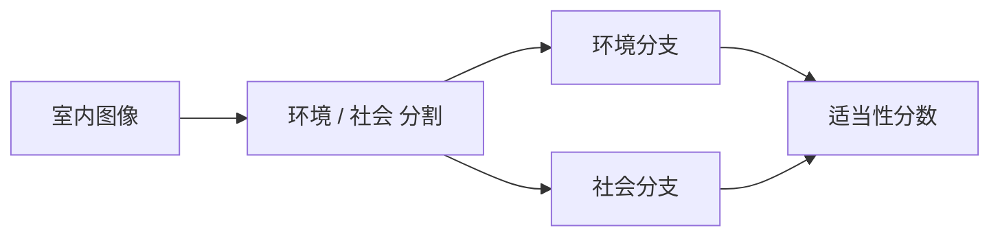
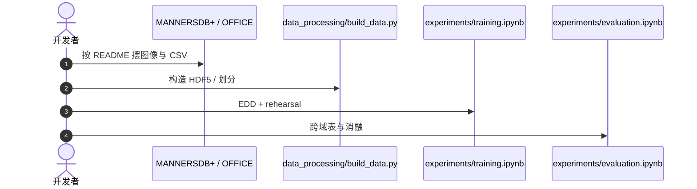

# Mind the Context：同样的房间布局，社交规则可以完全不同

**Mind the Context**（*Continual Learning of Socially Appropriate Robot Actions via Environmental-Social Disentanglement*；[arXiv:2608.13448](https://arxiv.org/abs/2608.13448)，[代码](https://github.com/Cambridge-AFAR/Mind-the-Context)）由 **剑桥大学 AFAR** 等提出（IROS 2026 扩展版）：社交机器人换房间后，相似家具可能对应完全不同的「能不能扫地 / 端食物 / 搭话」。

## 一句话定义

**持续学习社交适当动作时，把环境线索和社会主体线索拆成双分支，再用 replay 记住旧域规范。**

## 英文缩写速查

| 缩写 | 英文全称 | 简要说明 |
|------|----------|----------|
| EDD | Explicit Disentanglement Dual-Branch | 本文双分支框架 |
| CL | Continual Learning | domain-incremental 设定 |
| HRI | Human–Robot Interaction | 动作是否「合适」 |
| MANNERSDB | 社交适当性图像基准 | 本文用其扩展集 |
| NAO / PR2 | 人形/移动操作平台 | 数据按机器人分子目录 |

## 为什么重要

- 社会规范无法在出厂时穷举；必须边见边学且不忘掉客厅规则。
- 把「房间很挤」和「有人在开会」混进同一表征，换域就会乱。
- 开源 notebook 让复现路径可见，尽管数据要自备。

## 核心信息

| 项 | 内容 |
|----|------|
| **机构** | 剑桥大学（University of Cambridge） |
| **会议** | IROS 2026 |
| **开源** | **已开源**（训练/评测 notebook）；数据集不随仓 |

## 核心原理

### 方法栈

全景分割得到环境/社会 mask → 双分支分别编码 → 预测清洁、端送、发起对话等动作的适当性分数。replay buffer 排练旧域，减轻遗忘。对照 DUCA / DARE++ 等改成 Domain-IL 的基线。

### 流程总览

## 源码运行时序图

官方仓 [Cambridge-AFAR/Mind-the-Context](https://github.com/Cambridge-AFAR/Mind-the-Context)（默认分支 `iros2026`；归档见 [sources/repos/mind-the-context.md](../../sources/repos/mind-the-context.md)）：

- **最短复现：** 备齐三机型目录 → 跑数据处理 → `training.ipynb`。
- **数据集不在 GitHub。**

## 工程实践

| 项 | 建议 |
|----|------|
| 域顺序 | 论文有顺序敏感性消融，复现要固定域序列 |
| 解耦 | 对比「启发式分割」与其他拆法，不要只报一种 |
| 指标 | 适当性是多标签分数，不是导航成功率 |

## 实验与评测

跨客厅、会议室、办公室、走廊等室内域，EDD 优于多种持续学习基线；另评不同解耦策略。具体百分比以论文表与 `evaluation.ipynb` 为准。

## 与其他工作对比

相对 [HUI360](./paper-hui360.md)：HUI360 预测会不会交互，本页预测交互之后哪种动作合适。相对 [Extreme-RGMT](./paper-extreme-rgmt.md)：后者是运动技能持续学习，本页是社会规范。相对 [nav-ps-balance](./paper-nav-ps-balance.md)：跟随安全 ≠ 社交礼仪。

## 结论

**社交适当性是跨场景记忆问题：先拆环境与社会线索，再 rehearsal，而不是把新房间当新分类任务。**

1. **双分支有明确语义** — 挤和「有人开会」不是同一个特征。
2. **Domain-IL 才是设定** — 不要用 i.i.d. 分类数字对比。
3. **数据自备** — 代码开了不等于能立刻出表。
4. **规范无法穷举** — 部署仍要持续学习开关。

## 局限与风险

- 无 LICENSE 文件。
- 图像基准不是真机闭环控制。
- 标注适当性带文化与标注者偏差。

## 关联页面

- [HUI360](./paper-hui360.md)
- [Extreme-RGMT](./paper-extreme-rgmt.md)
- [接近–安全跟随](./paper-nav-ps-balance.md)
- [接触–预测–适应 10 篇技术地图](../overview/contact-predict-adapt-10-papers-technology-map.md)

## 参考来源

- [论文摘录](../../sources/papers/mind_the_context_arxiv_2608_13448.md)
- [官方仓归档](../../sources/repos/mind-the-context.md)
- [具身智能小站 10 篇盘点（2026-08-18）](../../sources/blogs/wechat_embodied_station_contact_predict_adapt_10_papers_2026-08-18.md)

## 推荐继续阅读

- [Cambridge-AFAR/Mind-the-Context](https://github.com/Cambridge-AFAR/Mind-the-Context)
- [arXiv:2608.13448](https://arxiv.org/abs/2608.13448)
