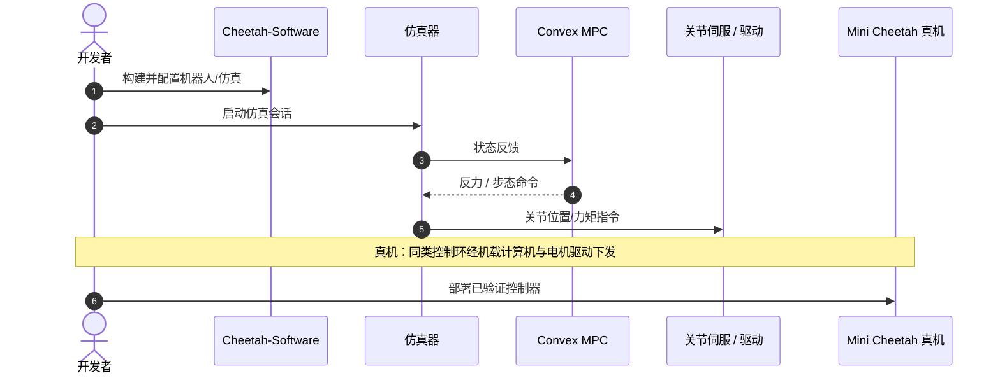

# Mini Cheetah: A Platform for Pushing the Limits of Dynamic Quadruped Control

## 一句话定义

**Katz, Di Carlo & Kim（MIT，ICRA 2019，[DOI:10.1109/ICRA.2019.8793865](https://doi.org/10.1109/ICRA.2019.8793865)）** 正式介绍 **Mini Cheetah**：约 0.3 m / 9 kg、定制可背驱模块化执行器的小型四足，用 **Convex MPC** 跑出多种动态步态（至 2.45 m/s）并用离线非线性优化完成 **360° 后空翻**。

## 英文缩写速查

| 缩写 | 英文全称 | 简要说明 |
|------|----------|----------|
| cMPC | Convex Model Predictive Control | 文中步态控制的凸 MPC |
| BLDC | Brushless DC Motor | 执行器所用无刷电机族 |
| DoF | Degree of Freedom | 自由度；整机十二驱动关节 |
| TOR | Torque | 关节力矩/力控带宽是平台卖点 |
| ICRA | International Conference on Robotics and Automation | 发表会议 |

## 为什么重要

- 把「控制友好的小型力控四足」产品化叙事写清楚：便宜相对、单人可操作、抗冲击。
- 后空翻 + 多步态成为后续 WBIC/RPC/视觉/RL 论文的硬件前提。
- 与 [Cheetah-Software](../../sources/repos/cheetah-software.md) 开源栈共同定义社区基线。

## 核心信息

| 项 | 内容 |
|----|------|
| **机构** | 麻省理工（MIT） |
| **平台** | Mini Cheetah ~0.3 m，~9 kg |
| **控制** | Convex MPC 步态；离线优化空翻轨迹 |
| **开源** | **部分开源**：控制见 Cheetah-Software；驱动/电气见 [bgkatz](../../sources/repos/bgkatz.md) |

## 核心原理

- **模块化可背驱执行器** → 高带宽力控 + 撞击鲁棒。
- **cMPC** 在简化模型上优化地面反力/步态，支撑 trot、trot-run、bounding、pronking。
- **空翻** 走离线非线性轨迹优化，再由平台跟踪执行——展示执行器峰值与控制带宽余量。

## 源码运行时序图

官方整机「一键训练仓」不适用；可运行入口以 **Cheetah-Software** 仿真/控制为主：

- **最短路径：** clone [mit-biomimetics/Cheetah-Software](https://github.com/mit-biomimetics/Cheetah-Software) → 按 README 跑仿真 MPC → 再谈真机与驱动标定。

## 工程实践

| 项 | 建议 |
|----|------|
| 指标 | 先对齐质量/腿长/执行器连续与峰值力矩，再比速度数字 |
| 空翻 | 视为执行器与结构冲击设计的压力测试，而非日常 loco 基线 |
| 对照 | 与 [ODRI Solo](./odri-solo-and-bolt.md) 比开源完整度；与 Unitree 比供应链 |

## 评测

| 维度 | 论文报告要点 |
|------|----------------|
| 速度 | 动态步态至 **2.45 m/s** |
| 步态 | trot / trot-run / bounding / pronking |
| 特技 | **360°** 后空翻 |
| 操作 | 单人可搬运操作 |

## 结论

**总判：** Mini Cheetah 平台论文的价值是「把可背驱小四足 + 凸 MPC 动态能力」钉成可引用实验床，而不是提出全新最优控制理论。

- 真影响指标：力控带宽、抗冲击、cMPC 多步态速度包络。
- 次要代价：小尺度传感/越障净空受限（后续视觉论文补课）。
- 部署读法：复现优先 Cheetah-Software；硬件走 Katz 论文+博客+bgkatz。
- 与 [WBIC+MPC](./paper-wbic-mpc-mini-cheetah.md) 组成「平台 + 控制」最小阅读对。

## 局限与风险

- IEEE 全文可能付费；摘要与实验室材料可作入门。
- 「inexpensive」是相对液压大狗而言，自建全套仍需机加与电控能力。

## 关联页面

- [MIT Mini Cheetah](./mit-mini-cheetah.md)
- [Benjamin Katz](./benjamin-katz.md)
- [WBIC + MPC](./paper-wbic-mpc-mini-cheetah.md)
- [MPC](../methods/model-predictive-control.md)

## 参考来源

- [平台论文归档](../../sources/papers/mini_cheetah_platform_icra_2019.md)
- [Robot Daycare 博文](../../sources/blogs/robot_daycare_mini_cheetah_2019.md)
- [Cheetah-Software](../../sources/repos/cheetah-software.md)

## 推荐继续阅读

- IEEE：<https://ieeexplore.ieee.org/abstract/document/8793865/>
- 博文：<https://robot-daycare.com/posts/2019-12-16-the-mini-cheetah-robot/>
