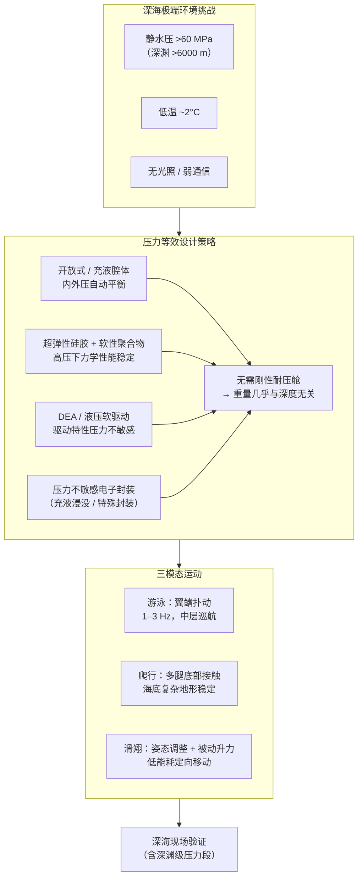

# 深海软体可变形机器人：压力等效多模态运动

**Miniature deep-sea morphable robot with multimodal locomotion**（Wen Li‡ / Ding Xilun‡（丁希仑），北京航空航天大学，**Science Robotics 2025**，[DOI:10.1126/scirobotics.adp7821](https://doi.org/10.1126/scirobotics.adp7821)）提出一种**无刚性耐压舱**的自由软体机器人：以**压力等效（pressure-tolerant）** 设计消除内外压差，使机器人在深渊级极端静水压（>60 MPa）下结构完整并保持运动能力；融合**游泳、爬行、滑翔**三种运动模态适应不同深海场景，并在真实深海环境完成现场验证，是北航文力/丁希仑团队 Science Robotics 系列中探索最深、形态适应能力最强的一作。

## 一句话定义

**通过内外压力等效（机身内充液/开放式设计 + 压力不敏感驱动器）彻底消除耐压舱需求，使厘米级软体机器人在深渊级水压下正常工作，并以翼鳍游泳、多腿爬行、姿态滑翔三模态在深海中自由切换运动方式。**

## 英文缩写速查

| 缩写 | 英文全称 | 简要说明 |
|------|----------|----------|
| DEA | Dielectric Elastomer Actuator | 介电弹性体驱动器；高电压驱动薄膜形变，压力不敏感 |
| PT | Pressure-Tolerant | 压力等效/耐压设计，内外压平衡无需刚性舱 |
| AUG | Autonomous Underwater Glider | 自主水下滑翔机；本机滑翔模态策略借鉴此类平台 |
| ROV | Remotely Operated Vehicle | 有缆遥控水下机器人；传统深海探测主力，本机对标挑战 |
| AUV | Autonomous Underwater Vehicle | 自主水下机器人；刚性耐压舱，本机轻量化替代方向 |
| DOF | Degrees of Freedom | 机体多自由度（翼扑 + 腿动 + 姿态调整）|
| SMA | Shape Memory Alloy | 形状记忆合金；部分深海软体驱动方案中使用 |

## 为什么重要

- **深海探索的根本性工程突破：** 传统 ROV/AUV 耐压舱重量随深度三次方增长，限制了微型化与低成本化；压力等效设计将此约束从"结构工程问题"转变为"材料与驱动器兼容性问题"，在深度无关的重量预算下实现深渊级探索。
- **北航文力组研究系列的技术顶峰：** 从[章鱼软臂（2023）](./paper-octopus-inspired-esoam-soft-arm.md)的仿生传感，到[两栖机器人（2022）](./paper-aerial-aquatic-remora-hitchhiking-robot.md)的跨介质运动，再到本工作的深渊级压力等效，构成完整的软体机器人极端环境适应研究脉络。
- **多模态运动的深海实证：** 单一平台融合游泳（高效中层巡航）、爬行（海底稳定定位）、滑翔（低能耗定向移动）三种模态，在深海中切换，是软体机器人多模态研究从实验室向真实极端环境推进的标志性工作。
- **小型化意义：** "Miniature"意味着可批量部署、低成本、高覆盖；多机协同的深海探测网络在此基础上具备可行性，与[多旋翼集群](./crazyswarm2.md)在空中领域的意义平行。

## 系统设计与压力等效原理

## 核心机制（提炼）

| 模块 | 设计方案 | 关键意义 |
|------|----------|----------|
| **压力等效** | 内外压平衡 + 开放/充液腔 | 消除耐压舱，重量-深度解耦 |
| **DEA 驱动翼鳍** | 高压驱动介电弹性体薄膜扑动 | 压力不敏感，可在深渊下正常工作 |
| **多腿爬行机构** | 软腿接触海底，液压或腱绳驱动 | 适应礁石/沉积物等非结构化底质 |
| **滑翔姿态控制** | 内部质量块偏移 or 浮力调节 | 低能耗长距离定向移动 |
| **材料选型** | 超弹性硅胶（Ecoflex / DragonSkin 系列）| 高压下弹性模量变化 < 5%（文献背景） |
| **深海封装** | 传感/通信模块充液浸没 | 消除密封界面压差，延长寿命 |

## 与深海机器人发展脉络对比

| 维度 | 传统 ROV/AUV | 北航 2021（Science Advances）| 本工作（2025）|
|------|-------------|------------------------------|----------------|
| 耐压方案 | 刚性钛合金/玻璃球壳 | 仿蜇鱼软体（原理验证） | 多模态压力等效（系统化） |
| 运动模态 | 推进器单模 | 游泳（单模） | **游泳 + 爬行 + 滑翔** |
| 测试环境 | 深海（ROV 探测） | 深海（早期验证） | 深海（含深渊级压力段） |
| 自由度 | 高（刚体 6-DOF） | 受限（早期软体） | **多模态自由切换** |
| 小型化 | 受耐压舱体积限制 | 蜇鱼翼展级 | **"Miniature" 厘米级** |

## 局限与风险

- **自主能力受限：** 深海通信依赖声学（低带宽 < 10 kbps）或脐带缆；高度自主行为需机载计算，功率预算紧张。
- **驱动器功率密度：** DEA 和液压软驱动的功率密度远低于刚性电机，导致运动速度和载荷能力有限；深海巡航效率需仔细权衡。
- **长期耐用性未充分评估：** 论文测试为单次/少次深海任务；软材料在持续极端压力下的疲劳寿命（>数百小时）未系统量化。
- **代码与设计未开源：** 截至 2026-07-20，**无官方代码仓库或 CAD 文件公开**；Supplementary 含材料与驱动参数，控制代码及制造图纸未发布，完整复现需大量硬件投入。
- **深海测试门槛极高：** 验证需要深海测试船与作业支持，普通实验室无法复现全功能测试。

## 工程实践

- **压力等效设计入门路径：** 可从浅水（< 100 m）开始验证充液腔体的密封与传感稳定性，逐步向更深处推进；优先选用经海水兼容性验证的弹性材料（Ecoflex 0050 已有相关文献）。
- **DEA 深海应用要点：** 需使用与海水电气绝缘的驱动电路；高压电源小型化是关键硬件挑战；建议参考 Harvard/MIT 相关深海 DEA 工作（Keplinger et al. 系列）。
- **多模态切换传感器：** 深度（压力）传感器 + 惯性测量单元（IMU）+ 可选接触传感器构成最小传感套件，用于触发游泳/爬行/滑翔模态切换。
- **与浅水平台的关系：** 本机设计原则与[章鱼软臂（E-SOAM）](./paper-octopus-inspired-esoam-soft-arm.md)的液态金属柔性传感共享"软材料极端形变下传感稳定性"的工程逻辑，可互为参考。

## 参考来源

- [深蓝AI：近五年 Science Robotics 中国顶尖高校盘点](../../sources/blogs/wechat_shenlan_scirobotics_china_top3_2026-07-02.md)
- [深海软体可变形机器人论文归档（Science Robotics 2025）](../../sources/papers/miniature_deep_sea_morphable_scirobotics_2025.md)
- Wen Li, Ding Xilun et al., *Miniature deep-sea morphable robot with multimodal locomotion*, [Science Robotics 2025](https://doi.org/10.1126/scirobotics.adp7821)
- Li et al. (2021), *A bioinspired soft robot for deep-sea application*, Science Advances — 同组前序工作，压力等效原理验证
- Keplinger et al. (2013), *Stretchable, transparent, ionic conductors*, Science — DEA 深水应用基础
- Teoh et al. (2018), *A pressure-tolerant soft robot*, Soft Robotics — 压力等效软体机器人早期工作

## 关联页面

- [运动任务（Locomotion）](../tasks/locomotion.md) — 游泳/爬行/滑翔三模态运动
- [章鱼软臂仿生（北航文力组 Science Robotics 2023）](./paper-octopus-inspired-esoam-soft-arm.md)
- [两栖印鱼搭便车机器人（北航文力组 Science Robotics 2022）](./paper-aerial-aquatic-remora-hitchhiking-robot.md)

## 推荐继续阅读

- [Science Robotics 原文](https://doi.org/10.1126/scirobotics.adp7821)
- Li et al. (2021) *A bioinspired soft robot for deep-sea application*, Science Advances — 同组前序基础
- Wehner et al. (2016) *An integrated design and fabrication strategy for entirely soft, autonomous robots*, Nature — 软体自主机器人奠基工作
- [两栖印鱼搭便车机器人（同系列）](./paper-aerial-aquatic-remora-hitchhiking-robot.md)
