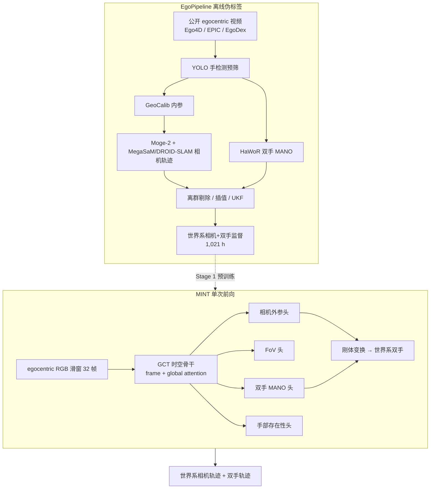
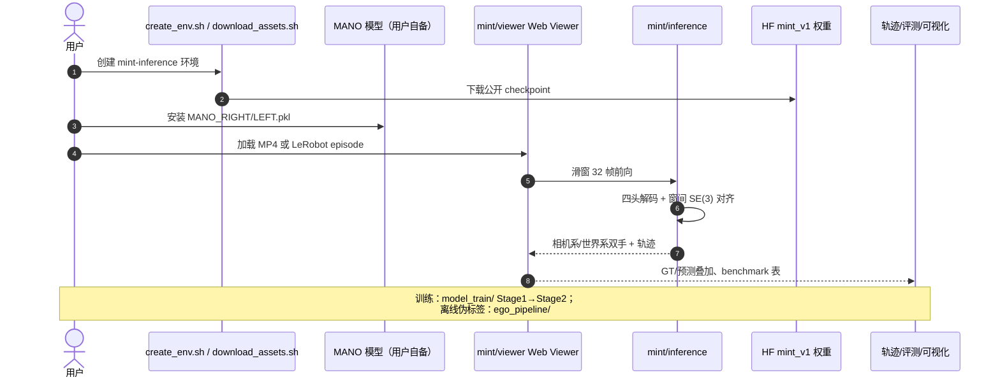

# MINT — World-Space Camera and Hand Motion Estimation

**MINT**（*Minting IN-the-Wild Trajectories*，arXiv:2609.04958，[项目页](https://1847540790.github.io/mint-project-page/)，[代码](https://github.com/wuji-technology/wuji-ego-mint)）提出首个从普通 **第一视角 RGB 视频** **单次前向** 联合恢复 **世界系相机轨迹 + 双手 MANO + 手部存在性** 的基础模型。训练依赖开源 **EgoPipeline** 将 Ego4D / EPIC-KITCHENS / EgoDex 等 **1,729 h** 视频转为 **1,021 h** 结构化伪标签，再以小量高精度遥操作数据 **Stage 2** 精调相机头；在 **HOT3D / ARCTIC** 零样本评测上相对级联基线具竞争力，并发布 **1.139B** 权重、Web Viewer、训练代码与数据集标注。

## 一句话定义

**用共享时空几何表征一次性解码相机、视场、双手 MANO 与手部可观测性，经刚体变换合成世界系双手轨迹，把多阶段 ego 重建管线摊销为可部署的单模型前向。**

## 英文缩写速查

| 缩写 | 英文全称 | 简要说明 |
|------|----------|----------|
| MINT | Minting IN-the-Wild Trajectories | 本文：世界系相机与双手运动联合估计基础模型 |
| Ego | Egocentric | 第一人称可穿戴视角视频 |
| MANO | Mesh-based hand Model with Articulated joints | 参数化手部网格与关节模型 |
| GCT | Geometric Context Transformer | LingBot-Map 的时空几何聚合骨干 |
| FoV | Field of View | 相机水平/垂直视场角 |
| SLAM | Simultaneous Localization and Mapping | 同步定位与建图；本文管线用 MegaSaM/DROID-SLAM |
| UKF | Unscented Kalman Filter | 推理时可选轨迹平滑，显著降 jitter |
| MPJPE | Mean Per Joint Position Error | 关节 3D 位置平均误差（本文用 penalty 版） |

## 为什么重要

- **问题对准 ego 数据瓶颈**：世界系双手轨迹是 [EgoMimic](./paper-ego-03-egomimic.md)、ViTRA 等 **人视频→机器人策略** 路线的关键监督，但专用采集与 **检测→SLAM→手部重建→修补** 级联管线成本高、误差串联、吞吐受限。
- **范式：管线摊销（amortization）**：**EgoPipeline** 离线生成大规模伪标签；**MINT** 学习摊销多模型级联，新视频只需 **单 GPU 前向**（项目页宣称相对 labeling pipeline 显著加速）。
- **联合建模相机与手**：与 [HaWoR](https://arxiv.org/abs/2409.08688) 等「先相机系手、再 SLAM、再 infill」不同，MINT 从 **同一 GCT 特征** 解码四路输出，显式 **camera-to-world** 组合，无需推理时深度图或点云。
- **工程可落地**：**已开源** 权重（[HF mint_v1](https://huggingface.co/ZZJAsher/mint_v1)）、Web Viewer、benchmark CLI 与 **1,021 h** 结构化标注（[HF wuji_ego_mint](https://huggingface.co/datasets/ZZJAsher/wuji_ego_mint)）；含 **Wuji Hand** MuJoCo retargeting 演示，与 [舞肌科技](./wuji-robotics.md) 硬件栈衔接。

## 核心信息

| 字段 | 内容 |
|------|------|
| 机构 | 上海科技大学（ShanghaiTech）；舞肌科技（Wuji Technology）；清华大学（Tsinghua）；香港大学（HKU）；浙江大学（ZJU） |
| 骨干 | **LingBot-Map GCT** + DINOv2 ViT-L/14；**32 帧**训练窗；**1.139B** 参数 |
| 输出 | 相机外参、FoV、双手 **MANO**（相机系）、手部存在性 → **世界系双手轨迹** |
| 监督规模 | EgoPipeline **1,021 h** 有效数据（**560,649** episodes，**110M+** frames） |
| arXiv | <https://arxiv.org/abs/2609.04958v1> |
| 项目页 | <https://1847540790.github.io/mint-project-page/> |
| 代码 | <https://github.com/wuji-technology/wuji-ego-mint> |
| 开源 | **已开源**（模型 + 推理/训练 + 数据集标注）；MANO 与部分 HaWoR 权重需自行获取 |

## 流程总览

## 方法要点

### EgoPipeline（结构化监督生成）

| 阶段 | 模块 | 作用 |
|------|------|------|
| 预筛 | YOLO | 剔除 >1 s 无手或 >2 只手的片段 |
| 内参 | GeoCalib | 估计相机内参并去畸变 |
| 深度+SLAM | MoGe-2 + MegaSaM / DROID-SLAM | 度量尺度相机轨迹 |
| 手部 | HaWoR | 相机系双手 MANO + 运动状态 |
| 后处理 | 离群剔除、插值、UKF | 稳定轨迹；合成世界系双手 |
| 产出 | 1,021 h 有效标注 | 场景/动作多样性覆盖日常操作 |

### MINT 架构与长序列推理

- **四预测头**：相机平移+四元数（world-to-camera）、垂直/水平 FoV、双手 MANO（腕部 6D + 15 关节 6D + 形状）、手部可观测性。
- **手部解码**：每手 4 个 learnable query（腕平移、腕旋转、关节、形状）+ **两轮迭代 refinement**（bounded axis-angle 残差，零初始化保证训练初期近似恒等）。
- **长视频**：重叠 **32 帧滑窗** → 相邻窗 **SE(3) 对齐** 拼接相机轨迹 → 重叠帧手部参数融合；计算量近似 **线性** 于视频长度。

### 两阶段训练

1. **Stage 1**：在 EgoPipeline 伪标签上联合训练 GCT 表征与四头，建立相机–手耦合。
2. **Stage 2**：冻结几何表征与手部能力，仅用高精度遥操作数据 **微调相机外参头**，提升世界系 metric 轨迹。

## 源码运行时序图

官方仓库 [wuji-technology/wuji-ego-mint](https://github.com/wuji-technology/wuji-ego-mint)：推理主入口为 **Web Viewer**；训练在 `model_train/`；可选离线重建走 `ego_pipeline/`。

- **Viewer 是一等公民**：`scripts/create_env.sh inference` + `download_assets.sh` 后即用；长视频自动滑窗。
- **MANO 非可选**：资产检查会验证 `assets/mano/` 路径。

## 工程实践

| 项 | 建议读法 |
|----|----------|
| 硬件 | 推理 **≥ 24 GB** NVIDIA VRAM；CPU-only 不可用 |
| 选型场景 | 需从 **in-the-wild egocentric MP4** 批量导出 **世界系双手+相机** 标注，替代多模型级联 |
| 对照基线 | 相机系双手看 [WiLoR](../methods/wilor.md)、[ViDiHand](./paper-vidihand.md)；世界相机看 DROID-SLAM / MegaSaM |
| 级联开源配方 | 要立即拼装可复现管线 → [Macrodata Hand-Action](../methods/macrodata-egocentric-hand-action.md) |
| 数据使用 | HF 数据集为 **结构化标注**；源视频按 Ego4D 等各自许可获取；轨迹 **scale-enlarged** 版适合预训练、不宜直接 metric 评相机 |
| 平滑 | 推理可选 **MINT + UKF** 大幅降 jitter，几乎不影响 pose 误差 |
| Retarget | `eval/simulate/wuji-retargeting/` 可将世界系手轨迹映射到 **Wuji Hand** MuJoCo |

## 实验与评测

### 相机系双手（HOT3D / ARCTIC，零样本 MINT）

| 基准 | 方法 | FAcc ↑ | PA-MPJPE-p ↓ mm | Jitter ↓ |
|------|------|--------|-----------------|----------|
| HOT3D | WiLoR | 0.827 | 19.98 | 17.98 |
| HOT3D | WildHands | 0.655 | 28.95 | 22.89 |
| HOT3D | **MINT** | **0.940** | **10.70** | 11.52 |
| HOT3D | **MINT + UKF** | **0.940** | **10.69** | **2.39** |
| ARCTIC | WiLoR | 0.919 | 11.87 | 24.09 |
| ARCTIC | **MINT** | 0.916 | 27.71 | 12.26 |

（**ViDiHand\*** 在两 benchmark 大部分数据上训练，作参考行非零样本对比；完整表见 [项目页](https://1847540790.github.io/mint-project-page/)。）

### 世界系相机轨迹（SE(3) 对齐，不拟合尺度）

| 基准 | 方法 | ATE ↓ mm (mean) | Arc len. ratio → 1 |
|------|------|-----------------|---------------------|
| HOT3D | DROID-SLAM | 49.1 | 0.778 |
| HOT3D | HaWoR | 200.3 | 0.950 |
| HOT3D | **MINT** | **181.7** | **1.094** |
| ARCTIC P2 | MegaSaM† | 51.4 | 1.956 |
| ARCTIC P2 | **MINT** | 81.9 | **1.412** |

- **消融**：去掉 Stage 2 相机精调（MINT w/o stage 2）在 HOT3D 上 ATE 恶化至 **524.7 mm**，arc-length ratio **0.466**，说明世界系 metric 依赖第二阶段。

## 结论

**MINT 的核心贡献是把「世界系相机+双手」从多阶段重建管线摊销为单次前向，并用 1,021 h EgoPipeline 伪标签把这一能力训成可部署的基础模型。**

1. **联合解码是关键** — 共享 GCT 表征同时输出相机、FoV、双手 MANO 与存在性，避免检测器掉帧与 SLAM–手部割裂；推理无需深度图、点云或 TTO。
2. **EgoPipeline 解决监督稀缺** — 1,729 h 公开视频 → 1,021 h 有效世界系标注，使大规模预训练可行；新视频处理成本从多模型级联降为单模型前向。
3. **两阶段训练分工明确** — Stage 1 学耦合几何；Stage 2 仅用高精度遥操作数据微调相机头，HOT3D 上 w/o stage 2 的 ATE 从 181.7 mm 恶化到 524.7 mm。
4. **零样本 HOT3D 双手领先级联** — FAcc **0.940**、PA-MPJPE-p **10.70 mm**；+UKF 将 jitter 降至 **2.39** 而 pose 几乎不变。
5. **已开源可跑通** — Web Viewer + HF 权重/数据集；MANO 与部分 HaWoR 权重需用户自备；发布轨迹 scale-enlarged 适合预训练、metric 相机评测需 Stage 2 数据或自标定。
6. **局限** — ≥24 GB VRAM；面团塑形、极端模糊等细粒度/高速场景仍失败；ARCTIC 上 PA-MPJPE-p 仍弱于 WiLoR；论文 under review。

## 与其他路线对比

| 路线 | 代表 | 世界系输出 | 推理形态 | 本文 |
|------|------|------------|----------|------|
| 级联开源配方 | [Macrodata Hand-Action](../methods/macrodata-egocentric-hand-action.md) | 有（VGGT+HaWoR 等拼装） | 多模型串行 | **单模型、四头联合** |
| 相机系 video diffusion | [ViDiHand](./paper-vidihand.md) | 否（相机系 MANO） | 单次 VACE 前向 | **世界系相机+手** |
| 手+SLAM+infill | HaWoR、Dyn-HaMR | 后处理合成 | 多阶段+常含 TTO | **无 infiller/TTO** |
| Per-frame 检测重建 | [WiLoR](../methods/wilor.md) | 否 | 逐帧 | **时序 GCT + 存在性头** |
| 专用采集 benchmark | HOT3D、ARCTIC | GT 有 | N/A | **零样本迁移评测** |

## 局限与风险

- **算力门槛**：推理需 **≥ 24 GB** GPU；不适合边缘设备实时流。
- **数据尺度**：公开发布轨迹经 **scale enlargement**，README 明确 **不宜直接作 metric 相机评测**；Cause 见仓库「Public Ego pretraining data」节。
- **第三方依赖**：MANO 许可、HaWoR 适配件不可再分发；完整复现 EgoPipeline 需自行拼装受限权重。
- **任务边界**：专注 **双手 MANO + 相机**；不含全身、物体 6D pose 或语义动作标签（数据集另有 action 描述字段）。
- **失败模式**：项目页展示 **面团塑形、强运动模糊** 等 case；快速相机运动与低照度虽为宣传强项，但并非全能。

## 关联页面

- [Macrodata Egocentric Hand-Action](../methods/macrodata-egocentric-hand-action.md) — 级联开源手部标注配方对照
- [Auto-Labeling Pipelines](../methods/auto-labeling-pipelines.md) — 自动标注管线总览
- [WiLoR](../methods/wilor.md) — 强 per-frame 双手基线
- [ViDiHand](./paper-vidihand.md) — video diffusion 双手 4D 重建（相机系）
- [EgoMimic](./paper-ego-03-egomimic.md) — 世界系手轨迹对机器人模仿的意义
- [Manipulation](../tasks/manipulation.md) / [Teleoperation](../tasks/teleoperation.md) — 下游任务语境
- [舞肌科技](./wuji-robotics.md) — 机构与 Wuji Hand 生态

## 参考来源

- [MINT 论文摘录（arXiv:2609.04958）](../../sources/papers/mint_arxiv_2609_04958.md)
- [MINT 官方项目页归档](../../sources/sites/mint-project-page.md)
- [wuji-ego-mint 代码仓库索引](../../sources/repos/wuji-ego-mint.md)

## 推荐继续阅读

- 论文 PDF：<https://arxiv.org/pdf/2609.04958v1>
- 项目主页：<https://1847540790.github.io/mint-project-page/>
- GitHub：<https://github.com/wuji-technology/wuji-ego-mint>
- 模型权重：<https://huggingface.co/ZZJAsher/mint_v1>
- 数据集：<https://huggingface.co/datasets/ZZJAsher/wuji_ego_mint>
