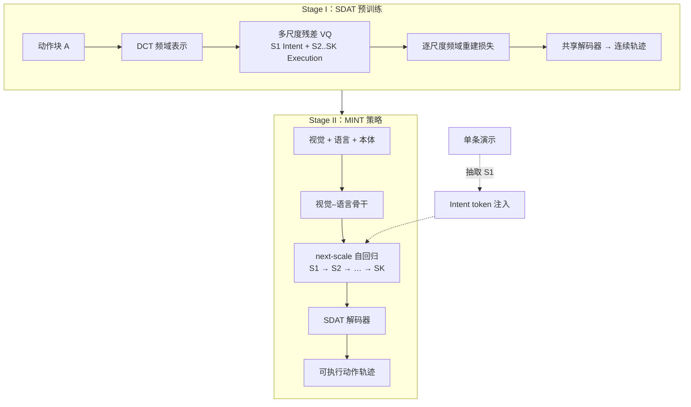

# MINT（Mimic Intent, Not Just Trajectories）

**MINT**（*Mimic Intent, Not Just Trajectories*，arXiv:2602.08602，**RSS 2026**）由上海交通大学与上海创智学院等提出：认为 VLA 走向真实场景的最大瓶颈是 **泛化**——不仅是换物体/背景/光照，更关键是 **组合泛化**（学会子技能后能自由组合）与 **小样本迁移**（几次示范而非上千条演示）。方法在 **动作表示层** 用 **频域谱分解** 把 **行为意图** 与 **执行细节** 拆开，再以 **跨尺度自回归** 推理，并支持 **单条演示的 Intent token 注入** 完成 one-shot 技能迁移。

## 一句话定义

**把操作轨迹像信号一样做多尺度频域分词：粗 token 承载意图，细 token 承载执行残差；策略不直接吐连续轨迹，而是逐尺度从意图展开到可执行动作。**

## 英文缩写速查

| 缩写 | 英文全称 | 简要说明 |
|------|----------|----------|
| MINT | Mimic Intent, Not Just Trajectories | 本文 IL/VLA 泛化框架简称 |
| SDAT | Spectrally Disentangled Action Tokenizer | 频域多尺度动作分词器，解耦意图与执行 |
| VLA | Vision-Language-Action | 视觉-语言-动作多模态策略方向 |
| DCT | Discrete Cosine Transform | 离散余弦变换，将动作块映射到频域 |
| IL | Imitation Learning | 从专家演示学习策略的范式 |
| RSS | Robotics: Science and Systems | 机器人顶会，本文录用 venue |

## 为什么重要

- **问题定位准：** 直指「模仿原始轨迹」而非「理解意图」导致的 **过拟合表面相关**；把 **组合泛化** 与 **小样本迁移** 从口号落到 **可操作的表示结构**。
- **与 VLA 主线的关系：** 不替换 VLM 底座，而是重构 **动作头 / 动作分词** 的学习目标；与 **UniVLA、FAST、CARP** 等 tokenization 路线形成 **频域监督 vs 时域压缩** 的对照轴。
- **工程可迁移：** **MINT-Zero** 只需从一条演示抽取 **Intent token** 并固定粗尺度，即可向新布局/任务迁移；真机报告每任务约 **20 条演示** 仍显著优于 **π₀.₅** 等强基线。

## 方法栈（核心结构）

| 模块 | 角色 |
|------|------|
| **SDAT（Stage I）** | 滑动窗口动作块 → **DCT 频域**；**多尺度残差 VQ** 得 \(S_1,\dots,S_K\)；**\(S_1\)** 为 **Intent token**（单 token，低频全局结构），**\(S_2\sim S_K\)** 为 **Execution tokens**（高频残差） |
| **渐进频域重建** | 训练时依次用 \(S_1\)、\(S_1{+}S_2\)、… 重建频谱，**\(\mathcal{L}_{\text{freq.}}\)** 迫使不同尺度分工；辅以时域 \(l_1\) 重建保证解码可执行 |
| **MINT policy（Stage II）** | 视觉–语言骨干 + **action expert**；**next-scale autoregression**：尺度内并行、跨尺度自回归；解码器继承 SDAT |
| **Intent ensemble** | 重叠 action chunk 在推理时按 **意图 token 一致性** 加权融合，稳定长视界执行 |
| **MINT-Zero / one-shot** | **语言无关**变体：从单演示抽 Intent token → 生成时 **固定 \(S_1\)** → 只预测执行 token，完成技能迁移 |

### 流程总览

## 实验要点（摘要级）

> 数字以 [arXiv:2602.08602](https://arxiv.org/abs/2602.08602) 为准；复现请对照 [官方仓库](https://github.com/RenMing-Huang/MINT)。

| 设定 | 要点 |
|------|------|
| **仿真基准** | LIBERO、MetaWorld、CALVIN、扰动增强 **LIBERO-Plus** |
| **强基线** | π₀.₅、UniVLA、OpenVLA-OFT、ACT、Diffusion Policy 等 |
| **鲁棒性** | LIBERO 训练 → LIBERO-Plus 评测：较 OpenVLA-OFT 约 **+15%** 成功率 |
| **One-shot** | 意图注入迁移：新任务/环境约 **+60%** 相对基线（论文叙事） |
| **真机** | 每任务约 **20 演示**；较 π₀.₅ 约 **+29%** |
| **模型规模** | **MINT-30M**（Transformer 从头）与 **MINT-4B**（预训练 VLM + action head） |

## 常见误区或局限

- **误区：** 把 MINT 等同于「数据增强换背景」——论文强调的是 **表示层意图–执行解耦** 与 **跨尺度推理**，域随机只是基线能力。
- **误区：** 认为 one-shot 完全不需要任何目标域数据——**MINT-Zero** 仍需在 **执行 token 生成** 上具备与目标环境匹配的策略能力；注入的是 **任务级意图规格**，不是魔法零样本。
- **局限：** 两阶段训练（SDAT + policy）与多尺度超参（尺度数 \(K\)、码本大小）增加管线复杂度；与单阶段端到端 VLA 相比 **工程面更碎**。
- **局限：** 当前公开叙事以 **桌面/臂部操作** 为主；向 **人形全身 loco-manip** 扩展仍需独立验证。

## 与其他工作对比

| 对照对象 | MINT 的差异 |
|----------|-------------|
| **UniVLA / FAST / CARP** | 同为动作 tokenization，但 MINT 走 **频域多尺度解耦（意图 vs 执行）**，而非时域压缩 |
| **π₀.₅ / OpenVLA-OFT** | 作强基线；MINT 在 LIBERO-Plus 鲁棒性与真机小样本迁移上更优（见实验要点） |
| **DeFI** | 解耦发生在 **动作频谱**；DeFI 解耦发生在 **视频动力学（前向/逆向模块）** |
| **CapVector** | 迁移发生在 **表示空间意图注入**；CapVector 在 **参数空间能力向量** |

## 关联页面

- [VLA（Vision-Language-Action）](../methods/vla.md) — MINT 所针对的 **泛化与迁移** 瓶颈语境。
- [Action Tokenization](../formalizations/vla-tokenization.md) — **SDAT** 在形式化分词谱系中的位置。
- [Behavior Cloning](../methods/behavior-cloning.md) — 端到端 IL 基线范式。
- [DeFI](../methods/defi-decoupled-dynamics-vla.md) — 另一类 **意图/动力学解耦**（前向 vs 逆向模块），解耦发生在 **视频动力学** 而非 **动作频谱**。
- [CapVector](./paper-capvector-capability-vectors-vla.md) — **参数空间** 能力向量迁移，与 MINT **表示空间** 意图注入形成对照。
- [Manipulation](../tasks/manipulation.md) — LIBERO / CALVIN 等评测任务背景。

## 参考来源

- [MINT 论文摘录（RSS 2026 / arXiv:2602.08602）](../../sources/papers/mint_rss_2026.md)
- [MINT 项目页归档](../../sources/sites/mint-project.md)
- [RenMing-Huang/MINT 仓库归档](../../sources/repos/renming_huang_mint.md)

## 推荐继续阅读

- 论文 PDF：<https://arxiv.org/pdf/2602.08602>
- 项目主页：<https://renming-huang.github.io/MINT/>
- 官方代码：<https://github.com/RenMing-Huang/MINT>
- Hugging Face 权重：<https://huggingface.co/huangrm/MINT-libero>
- 相邻 tokenization：UniVLA、FAST/BEAST、CARP（论文 Related Work 对照）
