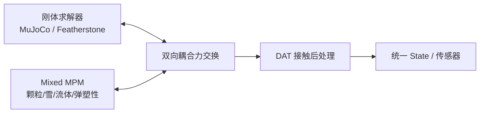

# Mixed MPM：刚性弹粘塑性混合物质点法

**Mixed Material Point Methods for Stiff Elastoplasticity**（Gilles Daviet，[DOI:10.1145/3811345](https://doi.org/10.1145/3811345)，SIGGRAPH 2026，[项目页](https://research.nvidia.com/labs/prl/mixed_mpm/)）提出一族 **混合速度–应力离散** 的 **MPM**，面向 **CFL 步长** 下的 **刚性弹粘塑性** 材料，直至 **近不可压极限**。在 [Daviet & Bertails-Descoubes 2016] 混合格式上扩展 **有限应变粘弹性** 与更一般 **流动法则**；隐式积分得到 **对称、良定** 优化问题与 **紧凑 stencil** 的 GPU 求解器。作为 [Newton](./newton-physics.md) **一等模块**，与刚体求解器 **双向耦合**（颗粒推回关节角色，腿式机器人可因地形调整步态）。

## 一句话定义

**用混合 MPM 在可接受步长下仿真沙、雪、刚性弹塑性甚至近不可压流体，并和 Newton 刚体后端双向推–拉。**

## 英文缩写速查

| 缩写 | 英文全称 | 简要说明 |
|------|----------|----------|
| MPM | Material Point Method | 物质点法：粒子携带物质、网格求梯度 |
| CFL | Courant–Friedrichs–Lewy | 显式稳定步长条件；本文追求 CFL-rate 隐式步 |
| GPU | Graphics Processing Unit | 紧凑 stencil 的单卡大规模颗粒仿真 |
| FEM | Finite Element Method | 与 MPM 并列的连续介质离散 |
| RL | Reinforcement Learning | 颗粒地形 + 腿式策略的潜在训练后端 |
| DAT | Divide and Truncate | Newton 多物理接触框架，与 MPM 刚–软耦合互补 |

## 为什么重要

- **颗粒与刚性固体是机器人场景常客：** 沙地、雪面、碎屑、可变形包装与 **腿式/轮式** 机体共存；需要 **颗粒→刚体** 反作用而不只是 one-way 地形。
- **刚性弹塑性此前难实时：** 经典 MPM 在 **硬材料 / 近不可压** 上步长或 stencil 成本高；混合离散把 **49M 颗粒落城** 压到单 GPU **~4 s/frame** 量级（项目页演示）。
- **与 Newton 栈原生集成：** 不必另接第三方 MPM；与 [DAT](./paper-dat-divide-and-truncate.md)、MuJoCo Warp、[Kamino](./paper-kamino.md) 同属引擎选型空间。
- **离散可切换：** 多种速度–应力对；**trilinear 速度** 常在精度/吞吐上具竞争力——便于工程折中。

## 核心信息

| 项 | 内容 |
|----|------|
| **机构** | 英伟达（NVIDIA Research，PRL） |
| **会议** | SIGGRAPH 2026 |
| **材料** | 沙、雪、弹性固体、近不可压流体、混凝土式断裂 |
| **Newton** | **first-party module**；无独立 GitHub |
| **开源** | **已开源（经 Newton）** — Apache-2.0 主仓 + `mpm_*` 示例 |

## 核心原理

### 混合离散

- **基础：** [Daviet & Bertails-Descoubes 2016a] 混合 MPM — 速度场与应力场 **不同插值空间**。
- **扩展：** 有限应变 **粘弹性** + 更一般 **弹塑性流动法则** → 覆盖沙、雪、弹性梁扭转至 **近不可压流体**。
- **隐式积分：** 每步化为 **对称、良定** 优化；**紧凑 stencil** 利于 GPU 并行。

### 刚体双向耦合

| 模式 | 行为 |
|------|------|
| One-way | 刚体/角色不受颗粒反作用（地形仅碰撞几何） |
| **Two-way** | 颗粒对关节角色与障碍 **施力**；演示中腿式机器人 **调整步态** |
| 交互沙盘 | 实时双向耦合编辑 |

### 流程总览

## 源码运行时序图

实现随 [Newton](https://github.com/newton-physics/newton) `SolverImplicitMPM` 分发，无独立复现仓库。**不适用**单独 sequenceDiagram；最短路径：`pip install "newton[examples]"` → 运行 `mpm_*` / 刚–颗粒耦合示例 → 观察 `Solver.step` 与刚体状态同步更新。

## 工程实践

| 步骤 | 做法 |
|------|------|
| 安装 | Newton `[examples]` extra；核对 GPU 驱动 ≥545 |
| 示例 | 仓库 `mpm_*`：雪、水、颗粒与机器人耦合 |
| 耦合 | 需要 **地形反作用改步态** 时开 **two-way**；纯视觉地形可用 one-way 省算力 |
| 离散 | 大规模场景可优先评估 **trilinear 速度** 对 |
| 接触 | 与 [DAT](./paper-dat-divide-and-truncate.md) 组合理解多物理 **无穿透** 管线 |

## 局限与风险

- **无独立 repo：** 算法变更需跟踪 Newton 版本与 release note。
- **与 Genesis / 其他 MPM：** [Genesis](./genesis-world-10.md) 等亦支持 MPM；Newton 侧优势在 **与 MuJoCo/Kamino 同栈双向耦合**。
- **RL 实证：** 论文侧重图形/物理演示；大规模腿式 RL on deformable terrain 仍须自行验证样本效率与 sim2real。

## 关联页面

- [Newton Physics](./newton-physics.md)
- [DAT](./paper-dat-divide-and-truncate.md)
- [Kamino](./paper-kamino.md)
- [仿真物理保真（Query）](../queries/simulation-physics-fidelity.md)
- [Genesis World 1.0](./genesis-world-10.md)

## 结论

**总判：Mixed MPM 把 Newton 的颗粒后端从「沙盒特效」推到刚性弹塑性与双向刚体耦合，是腿式/操作机器人在可变形地面上做高保真仿真的关键模块之一。**

1. **材料谱先对齐任务：** 沙/雪/流体/硬弹塑性选型不同流动法则，勿一律默认雪参数。
2. **双向耦合是步态敏感场景的开关** —— one-way 低估反作用力矩。
3. **复现走 Newton `mpm_*`**，不要找独立 GitHub。
4. **trilinear 速度** 常是性价比高的默认离散起点。
5. **与 DAT 同读** 理解刚–软–颗粒几何接触。
6. **SIGGRAPH 2026 / 项目页视频** 含 49M 颗粒与交互沙盘，适合估吞吐上限。

## 参考来源

- [Mixed MPM 论文归档](../../sources/papers/mixed_mpm_siggraph_2026.md)
- [NVIDIA Mixed MPM 项目页归档](../../sources/sites/nvidia-mixed-mpm.md)

## 推荐继续阅读

- [NVIDIA PRL：Mixed MPM 项目页](https://research.nvidia.com/labs/prl/mixed_mpm/)
- [DOI:10.1145/3811345](https://doi.org/10.1145/3811345)
- [Newton ImplicitMPM 文档与示例](https://github.com/newton-physics/newton)
