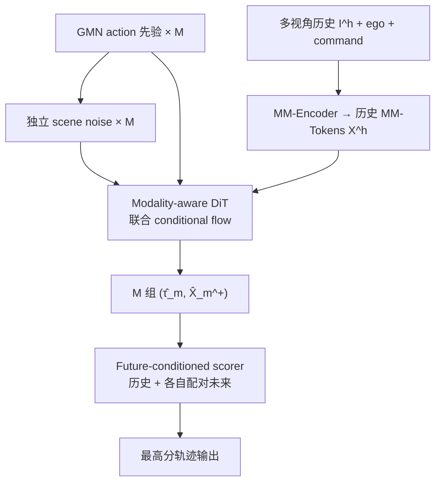

# MM-Future（arXiv:2609.20377）

**MM-Future**（*Multi-Mode Joint World–Action Modeling for Autonomous Driving*，[arXiv:2609.20377](https://arxiv.org/abs/2609.20377)）由 **蔚来（NIO）、中国科学技术大学 AGI 研究院、中山大学、北京航空航天大学** 等提出：在 **单条日志监督** 下同时学 **多组配对的未来场景与 ego 轨迹**，并用 **配对未来** 而不只看历史来选最终规划。

## 一句话定义

**多模态联合驾驶 WAM：并行 rollout 多组 scene–action 假设并双向共演化，用紧凑 MM-Tokens 承载多视角未来，再用 future-conditioned scorer 选轨迹。**

## 英文缩写速查

| 缩写 | 英文全称 | 简要说明 |
|------|----------|----------|
| WAM | World–Action Model | 联合建模场景演化与 ego 动作 |
| MM-Tokens | Multi-Mode Tokens | 面向规划的 chunk 级紧凑场景 token |
| GMN | Gaussian Mixture Noise | 结构化多模态 action 先验噪声 |
| BoM | Best-of-Many | 按轨迹 L1 选 winning 假设再监督 flow |
| PDMS / EPDMS | Predictive / Extended PDMS | NAVSIM v1 / v2 综合规划分 |
| NAVSIM | NAVSIM benchmark | 开环伪仿真驾驶规划评测 |
| HUGSIM | HUGSIM simulator | 照片级闭环交互仿真（零样本迁移测） |

## 为什么重要

- **补联合 WAM 的 mode 缺口：** 级联 WAM 有多假设但单向；典型 joint WAM 只有 **一对** rollout。MM-Future 在 **同一生成过程** 里保留 **双向 scene↔action** 又覆盖 **多结局**。
- **NAVSIM headline：** v1 **94.0 PDMS**、v2 **91.5 EPDMS** 在论文表内领先所列 WAM / E2E / VLA 基线；说明 **多模态 + 配对未来打分** 对开环规划指标有效。
- **闭环零样本信号：** 未在 HUGSIM 微调即 **32.3** 平均 HD-Score，Medium 难度 **+10.5** HD-Score 相对表内最强基线 — 支持「想象未来」参与 **交互场景** 选轨，而不只是开环拟合。

## 核心信息

| 项 | 内容 |
|----|------|
| **机构** | 蔚来（NIO）；中国科学技术大学 AGI 研究院；中山大学；北京航空航天大学（作者含 Shaoqing Ren） |
| **输入** | 2 s 历史，四相机 336×560（前/前左/前右/后）；2 Hz 预测 **4 s** 未来 |
| **训练** | NAVSIM **navtrain**；AdamW 25 epoch，batch 64，lr 2e-4；loss 权重 action/scene/score = 1.0/0.1/1.0 |
| **开源** | **待发布** — 无项目页与官方仓库（2026-09-27 步骤 2.5） |
| **数据文档** | 评测链见 [NAVSIM 仓库归档](../../sources/repos/navsim.md)；地图/数据集生态参考 [Argoverse User Guide](../../sources/sites/argoverse-user-guide.md)（非本文训练集） |

## 流程总览

## 核心原理

### MM-Tokens

- DINOv2-S + LoRA 提 register tokens；每 **2 帧** 用 4 层 attention 压成 **64×256-D** chunk tokens。
- **无 RGB/BEV 重建** — 表示由 **多模态 joint BoM 目标** 塑形，偏向规划相关动态与可通行结构。
- Target encoder **EMA** 仅从未来图像得干净 endpoint \( \bar{X}^+ \)；推理 **不看未来真值图**。

### 多模态 joint flow

- 各 mode：\( (\epsilon^a_m, \epsilon^x_m) \) 独立初始化 → 线性 flow path → 共享权重、**batch 维折叠 mode**（mode 间不交换 token）。
- **非对称 mask：** 历史 prefix 仅自注意；action 与 future token **双向交互**（action 可改想象场景，场景可反推动作）。
- **BoM：** \( m_{\mathrm{win}} = \arg\min_m \|D_a(\hat y^a_m) - \tau^{\mathrm{gt}}\|_1 \)；只对 winner 回传 velocity loss，避免所有假设塌向同一条件均值。

### Future-conditioned proposal scoring

- 轨迹 embedding 与 **历史 MM-Tokens** 交互后，再 **块对角** 只看 **自己的 \( \hat{X}^+_m \)**，预测 PDMS 分量 logits。
- 训练用官方 pseudo-simulator 标签；**stop-gradient** 在 proposal 与 future token 上，避免 generator 为「好打分」而扭曲 rollout。

## 源码运行时序图

**不适用（待发布）** — 截至 2026-09-27 arXiv 未提供可运行官方代码；公开后应对齐：**MM-Encoder → M 路 flow 积分 → scorer argmax** 与 NAVSIM metric 脚本。

## 实验与评测

| 设定 | 指标 | MM-Future |
|------|------|-----------|
| NAVSIM-v1 navtest（trainval） | PDMS ↑ | **94.0**（EP 91.6） |
| NAVSIM-v1 navtest（train only） | PDMS ↑ | **93.4** |
| NAVSIM-v2 navtest | EPDMS ↑ | **91.5** |
| HUGSIM 436 场景，无微调 | HD-Score ↑ | **32.3**（Medium **40.0**） |

**Ablation 读法（navtest v1）：**

- 32 假设 **paired** vs action-only multi-mode：**+0.6~1.8 PDMS** 量级（见原文 Table 3）。
- **Hist.+paired** scorer vs 仅历史：**93.3 vs 92.9 PDMS**，TTC **+0.5**。
- Multi-mode（M=32）较 M=1 **更快达到** 相同 validation PDMS 阈值（约 **3.8k vs 17.5k** steps）。

## 与其他工作对比

> 定位对照；各行评测协议不同，勿直接横比绝对分差。

| 对照 | 差异读法 |
|------|----------|
| [Latent-WAM（清单）](./paper-sa-2603-24581-latent-wam-latent-world-action-modeling-for-end.md) | 同为驾驶 WAM；Latent-WAM 强调 **潜空间** 联合；MM-Future 强调 **显式多假设对** + **配对未来打分**。HUGSIM 表内 MM-Future 平均 HD-Score **高 3.4** |
| [RISE（酷哇）](./paper-rise-adaptive-imagination-wam.md) | RISE 改 **测试时想象深度**（Roll/Stop）；MM-Future 改 **训练/推理时的多模态 joint 生成与选轨**。PDMS 量级接近（RISE **91.5** v1 / MM-Future **94.0** trainval）但 **方法正交** |
| [World Action Models](../concepts/world-action-models.md) | 概念页 **Cascaded vs Joint** 二分；MM-Future 占 **Joint + multi-mode coverage** 象限 |
| [DiffusionDrive 等 E2E](../overview/e2e-autonomous-driving-top10-algorithms.md) | E2E 多模态扩散多 **轨迹-only**；MM-Future 显式 **绑定每条轨迹与其想象未来** 再打分 |

## 局限与风险

- **MM-Tokens 纯隐式** — 论文承认难 interpret；计划加辅助感知可视化（未发布）。
- **开环 NAVSIM vs 闭环 HUGSIM** — v1 PDMS 高并不自动等于全场景闭环最优；HUGSIM Extreme 分桶仍偏低（**22.8** HD-Score）。
- **算力：** 64 假设主结果 **~233 ms/步**（H800）；部署需在 **假设数 M** 与 latency 间折中（文内 16 假设为效率甜点之一）。
- **复现：** 依赖 NAVSIM 数据与 metric 栈；**代码未发** 时只能对照方法与 headline 数字。

## 结论

**MM-Future 把「联合 WAM」从单条 rollout 扩展到多组 **双向共演化** 的场景–轨迹对，并用 **配对未来** 做选轨，在 NAVSIM 与零样本 HUGSIM 上给出强规划分。**

1. **选型：** 若你关心 **多模态不确定性 + 后果感知选轨**，本文比 action-only multi-mode 或 single-mode joint 更有据（ablation 一致增益）。
2. **工程：** 在代码发布前，按 **NAVSIM 官方仓** 准备数据与 PDMS/EPDMS 口径；勿混用 v1/v2 指标。
3. **对比阅读：** 与 [RISE](./paper-rise-adaptive-imagination-wam.md)（自适应想象步数）和 [Latent-WAM](./paper-sa-2603-24581-latent-wam-latent-world-action-modeling-for-end.md)（潜空间 WAM）组成 **2026 驾驶 WAM** 三角对照。
4. **数据生态：** 训练集是 NAVSIM navtrain，不是 Argoverse；地图/传感器文档可参考 [Argoverse User Guide](../../sources/sites/argoverse-user-guide.md) 作周边阅读。
5. **跟进：** 关注 Shaoqing Ren / NIO 系是否释出 GitHub 与 checkpoint。

## 关联页面

- [world-action-models](../concepts/world-action-models.md)
- [generative-world-models](../methods/generative-world-models.md)
- [e2e-autonomous-driving-top10-algorithms](../overview/e2e-autonomous-driving-top10-algorithms.md)
- [paper-rise-adaptive-imagination-wam](./paper-rise-adaptive-imagination-wam.md)

## 参考来源

- [mm_future_arxiv_2609_20377.md](../../sources/papers/mm_future_arxiv_2609_20377.md)
- [navsim.md](../../sources/repos/navsim.md)
- [argoverse-user-guide.md](../../sources/sites/argoverse-user-guide.md)
- [arXiv:2609.20377](https://arxiv.org/abs/2609.20377)

## 推荐继续阅读

- [NAVSIM GitHub](https://github.com/autonomousvision/navsim)
- [Argoverse User Guide](https://argoverse.github.io/user-guide/)
- [arXiv PDF](https://arxiv.org/pdf/2609.20377)
