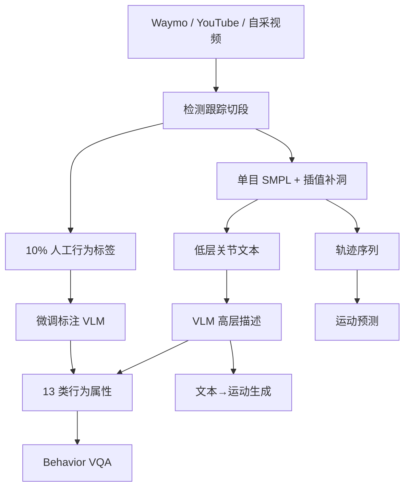

# MMHU（驾驶场景人体行为理解基准 · arXiv:2507.12463）

**MMHU**（*MMHU: A Massive-Scale Multimodal Benchmark for Human Behavior Understanding*，[arXiv:2507.12463](https://arxiv.org/abs/2507.12463)，[项目页](https://MMHU-Benchmark.github.io/)）由 **德州农工、布朗、约翰霍普金斯、UT Austin** 提出：把驾驶场景中的行人 **运动 / 轨迹 / 文本 / 安全相关行为** 收进同一基准，并提供运动预测、文本→运动生成与 Behavior VQA 评测套件。

## 一句话定义

**MMHU 用 57k 行人实例上的 SMPL 运动、分层文本与 13 类驾驶安全行为标签，把「过街意图」类窄任务升级为可扩展的人本体 Behavior VQA + 运动评测基准。**

## 英文缩写速查

| 缩写 | 英文全称 | 简要说明 |
|------|----------|----------|
| MMHU | Massive-Scale Multimodal Human Understanding | 本文基准/数据集：驾驶场景人体行为多模态评测 |
| SMPL | Skinned Multi-Person Linear Model | 人体参数化运动表示；本库从单目视频重建 |
| VQA | Visual Question Answering | 本库将 13 类行为写成闭式是/否问答 |
| VLM | Vision-Language Model | 标注管线与 Behavior VQA 基线的骨干 |
| MPJPE | Mean Per Joint Position Error | 运动预测主指标（根对齐后关节欧氏误差） |
| FID | Fréchet Inception Distance | 文本→运动生成分布距离（本库对驾驶域很敏感） |
| HITL | Human-in-the-Loop | 约 10% 人工行为标签微调标注 VLM 后再标全库 |

## 为什么重要

- **补齐「人本驾驶」评测缺口：** 既有库多只覆盖过街二分类、轨迹或通用 Driving QA，缺统一运动+语义+安全行为标签。
- **暴露域差：** 通用 text-to-motion 在街景上 FID 极高；混训 MMHU 后运动预测 / 意图 / T2M / VQA 均有可量化增益。
- **工程可读的行为集合：** 13 类属性（打电话、推婴儿车、轮椅、骑车等）比「是否过街」更贴近安全交互。
- **复现入口：** HF 数据集已公开；官方训练脚手架截至入库日未上项目页。

## 核心信息

| 项 | 内容 |
|----|------|
| 机构 | 德州农工大学、布朗大学、约翰霍普金斯大学、德州大学奥斯汀分校 |
| 规模 | 57k 人体实例 · 1.73M 帧 · ~48h · 10 Hz；片段时长均值 ~3s |
| 来源 | Waymo · YouTube（CC）· 自采/付费行车视频 |
| 标注 | SMPL 运动+轨迹 · 低层/高层文本 · 13 类 critical behaviors · Behavior QA |
| 划分 | MMHU-V 47k（VLM）· MMHU-H 9.5k（人工）· MMHU-T 840（测试） |
| 任务 | 运动预测 · 文本→运动生成 · Behavior VQA（+ 意图作为特例） |
| 数据 | [HF jerryye0110/MMHU](https://huggingface.co/datasets/jerryye0110/MMHU) |
| 开源核查 | **部分开源**（2026-08-02）：数据已发；**项目页无 GitHub / 训练代码** |

## 核心原理（方法）

### 标注与数据流

1. **采集与切段：** 多源行车视频 → 人体检测/跟踪 → 片段裁剪（野源统一 10 FPS）。
2. **运动：** 逐帧 SMPL 重建；遮挡帧用球面插值式补洞；轨迹由全局运动导出。
3. **分层文本：** 规则/PoseScript 式 **低层关节描述** → LLM 时序聚合 → VLM 结合关键帧生成 **高层行为描述**。
4. **Critical behaviors：** VLM 先从样本归纳 13 类安全相关属性，再对每实例闭式提问打标；**10% 人工** 微调标注 VLM 后推全库。

### 13 类行为（论文缩写）

| 缩写 | 行为 | 缩写 | 行为 |
|------|------|------|------|
| CR | Crossing（过街） | UP | Using Phone |
| CI | Carrying Items | TS | Talking |
| BI / SC / MC / SK | Bike / Scooter / Motorcycle / Skateboard | ST / WC | Stroller / Wheelchair |
| WP / UU / UH | Walking Pets / Umbrella / Headphones | | |

### 流程总览

## 源码运行时序图

**不适用**（截至 2026-08-02）：项目页仅提供 arXiv 与 Hugging Face Dataset，**无官方可运行训练 / 评测仓库**；复现需自接 PhysMoP、MotionDiffuse、Qwen2.5-VL 等外部基线，并按论文附录 B.3 配置微调。

## 工程实践

| 项 | 实践要点 |
|----|----------|
| 数据入口 | HF `jerryye0110/MMHU`：含 `MMHU_H.json`、行为/描述 JSON、`smpl/*.pkl` 等 |
| 开源边界 | **勿假设有官方 train/eval 脚本**；以项目页按钮为准定期复查 Code |
| Behavior VQA 协议 | 4–6 帧均匀采样；正问+反问均对才计正确；格式失败最多回滚 3 次 |
| 运动预测协议 | 50 帧窗：前 25 历史 → 后 25 未来；报 MPJPE（按 frame_id）与 ACCL |
| T2M 协议 | 高层文本作 prompt；序列长度约 20–196 帧；主看 FID |
| 混训提示 | 与 3DPW 混训时需处理 **10 Hz ↔ 25 Hz** 采样率对齐（论文：上采再下采） |
| 标注噪声 | 全自动 VLM 标注受限于模型能力；关键评测应用 MMHU-T / 人工子集校验 |

## 实验与评测

### 零样本 / 预训练基线（摘录）

| 任务 | 关键读法 |
|------|----------|
| Motion Prediction（Tab. 4） | PhysMoP 在 MMHU-T 上领先（frame 24 MPJPE 54.3 vs AuxFormer 86.1） |
| Motion Generation（Tab. 2） | MotionDiffuse FID **39.27**、MotionGPT **27.06** → 通用 T2M 不适配街景 |
| Behavior VQA（Tab. 3） | 开源多图 VLM Micro-F1 约 27–58；GPT-4o-mini **64.8**；过街/通话等仍难 |

### 微调增益（Tab. 5–8）

| 设定 | 基线 | +MMHU |
|------|------|-------|
| Qwen2.5-VL Behavior VQA Acc / F1 | 35.31 / 44.72 | **67.77 / 68.54** |
| PhysMoP→3DPW MPJPE-avg / ACCL | 47.67 / 3.8 | **38.18 / 2.7** |
| TrEP 意图（JAAD）Acc / F1 / AuROC | 84.49 / 84.45 / 92.98 | **91.89 / 91.89 / 97.72** |
| MotionDiffuse FID | 39.27 | **1.86** |
| MotionGPT FID | 27.06 | **8.44** |

## 结论

**MMHU 的真贡献是「驾驶域人本多任务对齐」：同一批行人实例同时服务运动预测、街景 T2M 与可扩展 Behavior VQA；通用运动/VLM 基线在零样本街景上明显吃亏，混训后增益可迁移到 3DPW/JAAD。**

1. **选型先看任务轴** — 要评「是否过街」可用 JAAD/PIE；要评 **多行为+运动+文本** 才上 MMHU。
2. **读 T2M 先看 FID 域差** — 通用 HumanML3D 类模型 FID>20 时，优先判域失配而非调参。
3. **VQA 用双问协议** — 正问+反问同时正确，降低单次胡答；稀有类（轮椅等）单独看 F1。
4. **混训有外推价值** — 论文显示对 3DPW 运动预测与 JAAD 意图均有提升，可作街景数据增广来源。
5. **复现预期** — 数据在 HF；官方代码未列时，按附录自建微调环，勿等待不存在的一键脚本。
6. **标注上限** — HITL 仍依赖 VLM 能力；安全关键部署需人工抽检，不能把自动标签当 GT 金标。

## 与其他工作对比

| 对照 | MMHU（本页） | JAAD / PIE | DriveLM / nuScenes-QA | HumanML3D 类 T2M 数据 |
|------|--------------|------------|------------------------|------------------------|
| **问题** | 驾驶人本多任务统一评测 | 过街意图/轨迹 | 通用驾驶 VQA | 通用人体 text-to-motion |
| **运动** | SMPL + 轨迹 | 多为 2D/轨迹 | 通常无行人 SMPL | 有，但非街景驾驶 |
| **行为** | 13 类显式属性 | 1–11 类、偏过街 | 非结构化 QA | 动作类，非驾驶安全 |
| **开源** | HF 数据；代码未列 | 视具体库 | 视具体库 | 通常代码+数据齐 |

## 局限与风险

- **标注瓶颈：** 论文自承 VLM 行为理解能力限制全自动管线；HITL 只能降噪，难消系统偏差。
- **开源边界：** 数据已发、**官方训练/评测仓未见**；复现成本高于「一键 benchmark」。
- **场景覆盖：** 仍以车载前视街景为主，室内/非交通人本行为不在范围内。
- **类别长尾：** 轮椅等稀有行为样本少，Micro-F1 可能被常见类主导。
- **与机器人本体控制：** 产出是 **人体 SMPL/行为语义**，进人形控制仍需 retarget + 跟踪，勿直接当 robot policy 数据。

## 关联页面

- [《自动驾驶核心算法盘点》技术地图](../overview/autonomous-driving-core-algorithms-series.md) — 跟踪/轨迹预测模块的人本评测补充
- [端到端自动驾驶十大算法地图](../overview/e2e-autonomous-driving-top10-algorithms.md) — 驾驶 VLM/VLA 语境
- [具身评测基准选型闭环](../overview/hub-embodied-eval-benchmark.md) — ① 层认知评测的驾驶人本相邻基准
- [具身评测基准选型 Query](../queries/embodied-eval-benchmark-selection-loop.md)
- [Diffusion-based Motion Generation](../methods/diffusion-motion-generation.md) — 街景 T2M 域差与微调证据
- [3D 空间 VQA](../concepts/3d-spatial-vqa.md) — 空间/行为问答对照
- [人形训练数据管线](../queries/humanoid-training-data-pipeline.md) — 视频→SMPL 链路

## 参考来源

- [MMHU 论文归档](../../sources/papers/mmhu_arxiv_2507_12463.md)
- [项目页归档](../../sources/sites/mmhu-benchmark-github-io.md)
- 论文：Li et al., *MMHU: A Massive-Scale Multimodal Benchmark for Human Behavior Understanding*, arXiv:2507.12463

## 推荐继续阅读

- 项目页与示例视频：<https://MMHU-Benchmark.github.io/>
- 数据集：<https://huggingface.co/datasets/jerryye0110/MMHU>
- arXiv：<https://arxiv.org/abs/2507.12463>
- Waymo Open Dataset（上游来源之一）：<https://waymo.com/open/>
