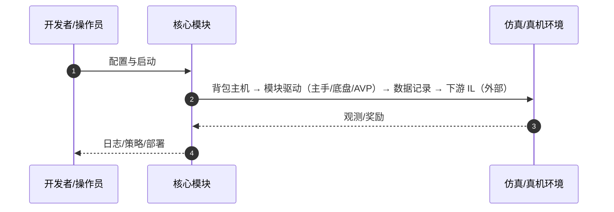

# ModPack（arXiv:2607.19479）

**ModPack**（Joshua Citron, Renee Zbizika, Zeyi Liu, Shuran Song；Stanford University；[arXiv:2607.19479](https://arxiv.org/abs/2607.19479)，[项目页](https://modpack-robotics.github.io/)）— 以自包含可穿戴「背包」为枢纽，把主手遥操作、移动底盘、主动感知做成可插拔模块，降低异构双臂移动平台数据采集成本。

## 一句话定义

以自包含可穿戴「背包」为枢纽，把主手遥操作、移动底盘、主动感知做成可插拔模块，降低异构双臂移动平台数据采集成本。

## 英文缩写速查

| 缩写 | 英文全称 | 简要说明 |
|------|----------|----------|
| ModPack | Modular Teleoperation Backpack | 本文系统 |
| AVP | Apple Vision Pro | 主动感知模块示例 |
| DoF | Degrees of Freedom | 主手自由度配置 |
| IL | Imitation Learning | 下游策略训练 |

## 为什么重要

传统遥操作高度绑定特定机器人，换平台要重搭通信与算力；ModPack 抽象公共基础设施。

## 核心原理（方法）

背包集成计算/电源/存储/通信；模块：关节级主手（含力反馈）、iPhone 底盘跟踪、Vision Pro 主动感知等。

## 实验与评测

两型机器人、真实双臂移动操作任务；所采数据训练策略部署表现强。

## 结论

ModPack 是移动操作数据飞轮的「通用遥操作底座」，适合多机体并行采集而非单点定制。

- 背包一体化降低现场布线
- 模块热插拔适配不同臂/底盘
- 开源硬件设计与遥操作软件
- 策略训练代码未随仓库发布

## 源码运行时序图

官方入口见 frontmatter `code` / 项目页。运行时主干：

- **最短路径：** 克隆官方仓库 → 按 README 安装依赖 → 运行训练/采集/部署入口脚本。

## 局限与风险

背包重量影响长时间操作员疲劳；不含策略训练栈。

## 与其他工作对比

相对整机定制遥操作，复用率高；相对纯软件中间件，含可穿戴硬件方案。

## 关联页面

- [teleoperation](../tasks/teleoperation.md)
- [paper-hommi](./paper-hommi.md)
- [realab-14-papers-technology-map-2026](../overview/realab-14-papers-technology-map-2026.md)
- [REALab 14 篇技术地图](../overview/realab-14-papers-technology-map-2026.md)

## 参考来源

- [modpack_arxiv_2607_19479.md](../../sources/papers/modpack_arxiv_2607_19479.md)
- [wechat_shenlan_realab_14_papers_2026.md](../../sources/blogs/wechat_shenlan_realab_14_papers_2026.md)

## 推荐继续阅读

- 论文：<https://arxiv.org/abs/2607.19479>
- 项目页：<https://modpack-robotics.github.io/>
