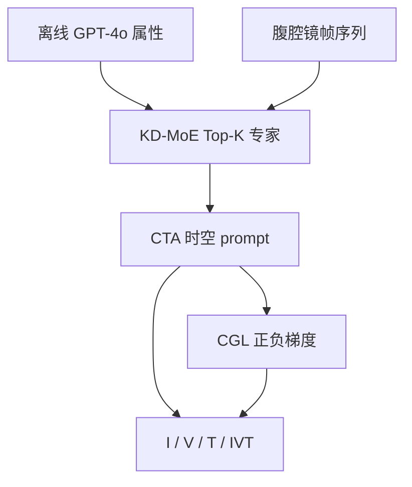
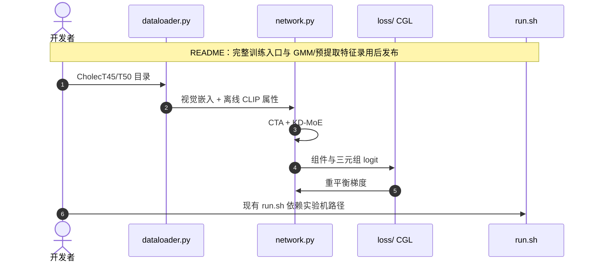

# MoeCo：知识驱动 MoE 协同识别手术三元组

**MoeCo**（*Mixture-of-Experts-guided Co-Optimization*，[arXiv:2608.22972](https://arxiv.org/abs/2608.22972)，[代码](https://github.com/YIYIZH/MoeCo)）由 **香港中文大学（CUHK）** 与 **香港理工大学（PolyU）** 提出：针对手术视频 \(\langle\)instrument, verb, target\(\rangle\) 识别中的组件冲突、长尾梯度与领域先验缺失，把适配器、梯度重平衡和知识专家放进同一协同优化管线。

## 一句话定义

**手术语义不是「再做一个更强视觉骨干」，而是把器械结构先验写进优化过程，并拆开互相打架的多任务梯度。**

## 英文缩写速查

| 缩写 | 英文全称 | 简要说明 |
|------|----------|----------|
| MoeCo | Mixture-of-Experts-guided Co-Optimization | 本文框架 |
| CTA | Component-Tailored Adapter | 时空分regime 的任务特征适配 |
| CGL | Coordinated Gradient Learning | 分解并重平衡正负梯度 |
| KD-MoE | Knowledge-Driven Mixture-of-Experts | MLLM 属性 → 高斯专家 |
| AP_IVT | Average Precision of instrument-verb-target | 主指标：整三元组 |

## 为什么重要

- 上下文感知的机器人辅助手术需要同时认对器械、动作与组织目标，错一个三元组就错。
- 共享「抓钳+牵拉」的两个目标在 I/V 空间该靠近、在 T 空间该分开——纠缠特征会把优化拉裂。
- CholecT45 头类 >4 万、尾类 8 条；临床少见组合往往更危险。

## 核心信息

| 项 | 内容 |
|----|------|
| **机构** | 香港中文大学（CUHK）；香港理工大学（PolyU） |
| **数据** | CholecT45（5-fold）、CholecT50 |
| **视觉骨干** | Swin-T / Swin-B；集成取 sigmoid 平均 |
| **开源** | **部分开源** — 模型/损失已放，完整训练入口待发布 |

## 流程总览

## 源码运行时序图

关键复现路径：仓内可读 `network.py` / `loss/`；**不要**把当前 `run.sh` 当成可一键复现论文表的官方入口。

## 实验与评测读法

CholecT45 5-fold \(AP_{IVT}\)：MoeCo-T **40.5%**（TERL-T +4.8，CurConMix-T +2.8），MoeCo-B **41.7%**，集成 **42.6%**。组件：\(AP_I\) 94.7%、\(AP_V\) 72.5%、\(AP_T\) 52.3%。CholecT50：MoeCo-B **40.5%**。消融（Fold 1）：38.3 → KD-MoE 40.3 → 全模块 42.3。相对「4 个任务分支」，CTA 参数更少、增益更大。MLLM 不在训练/推理环内。

## 结论

**把领域先验当专家、把冲突梯度当一等公民，比堆更大骨干更能抬稀有三元组。**

1. **主指标读 \(AP_{IVT}\)**，不要只报器械 AP（已经很高）。
2. **KD-MoE 的价值**是按视觉内容选先验，不是随机拼文本特征。
3. **工程：** 属性库需人工剪枝防幻觉；当前仓还不能当完整复现包。

## 与其他工作对比

| 对比轴 | MoeCo | 仅多任务 + CAM | 长尾 re-weight |
|--------|-------|----------------|----------------|
| 组件冲突 | CTA 分特征 | 共享 backbone | 不处理 |
| 尾类 | CGL 梯度层 | 实例重采样 | 损失权重 |
| 先验 | 结构属性 MoE | 粗定位 | 无 |

## 工程实践

| 项 | 说明 |
|----|------|
| 数据 | 官方 31-5-9 CholecT45；T50 跟 RDV 划分 |
| 超参 | 文中 \(\alpha=0.1\)、\(\lambda=0.1\) |
| MLLM | 仅离线挖属性，三次研究者共识剪枝 |

## 局限与风险

- 完整可运行训练包尚未发布。
- 胆囊切除专科数据，迁移到其他术式未证。
- 属性质量依赖提示与人工审核。

## 关联页面

- [开源 7 篇系统结构地图](../overview/open-source-7-papers-system-structure-technology-map.md)
- [VLA](../methods/vla.md) — 另一条「把语义写进策略」对照（本页是感知三元组，不是出控）
- [Indi](./paper-indi.md) — 意图/语义中间态
- [Manipulation](../tasks/manipulation.md)

## 参考来源

- [论文摘录](../../sources/papers/moeco_arxiv_2608_22972.md)
- [MoeCo 仓库](../../sources/repos/moeco.md)
- [具身智能小站 7 篇盘点](../../sources/blogs/wechat_embodied_station_7_papers_vla_intent_space_2026-08-26.md)

## 推荐继续阅读

- [arXiv:2608.22972](https://arxiv.org/abs/2608.22972)
- [GitHub YIYIZH/MoeCo](https://github.com/YIYIZH/MoeCo)
