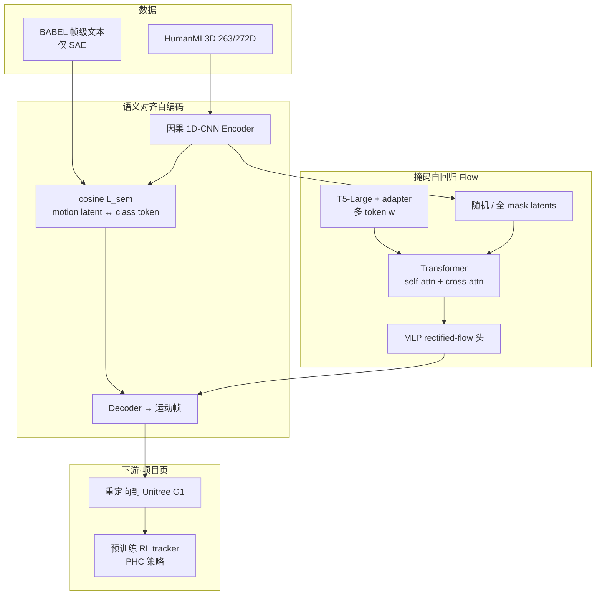
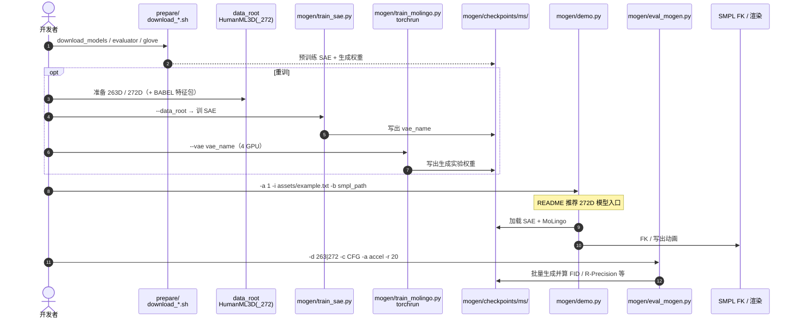

# MoLingo（Motion–Language Alignment for Text-to-Human Motion Generation）

**MoLingo**（[项目页](https://hynann.github.io/molingo/MoLingo.html)，[arXiv:2512.13840](https://arxiv.org/abs/2512.13840)，[代码](https://github.com/hynann/MoLingo)）由 **图宾根大学 / Tübingen AI Center / MPI-INF / 帝国理工** 等提出（CVPR 2026）：在 **连续运动 latent** 上做 **掩码自回归 rectified flow**，并用 **BABEL 帧级文本** 训出的 **语义对齐自编码器（SAE）** 与 **T5 多 token cross-attention**，提升文本→人体运动的真实感与指令跟随；项目页另演示生成结果经重定向后由 **PHC 风格 RL tracker** 在 **Unitree G1** 上跟踪。

## 一句话定义

**语义对齐的连续运动 latent + 掩码自回归 flow 去噪 + 多 token 交叉注意力文本条件**，把 HumanML3D 上的 FID / R-Precision 与用户偏好一并拉高，并可接 G1 跟踪验证物理可执行性。

## 英文缩写速查

| 缩写 | 英文全称 | 简要说明 |
|------|----------|----------|
| T2M | Text-to-Motion | 文本条件人体/角色运动生成 |
| SAE | Semantically Aligned Autoencoder | 用帧级文本对齐运动 latent 的自编码器 |
| VAE | Variational Autoencoder | 本文对照变体：无语义对齐的连续潜编码器 |
| FID | Fréchet Inception Distance | 生成分布与真实分布距离（越低越好） |
| CFG | Classifier-Free Guidance | 训练丢条件、推理放大条件强度 |
| PHC | Perpetual Humanoid Control | 下游物理跟踪控制器（项目页 G1 演示） |
| SMPL | Skinned Multi-Person Linear Model | 人体网格/姿态参数化，可视化与 FK |
| AR | Auto-Regressive | 按 latent 时间片逐步条件生成 |

## 为什么重要

- **连续 latent AR 路线的「对齐」杠杆：** 相对 MARDM / MotionStreamer 等「连续 latent + 自回归扩散/flow」工作，MoLingo 明确把 **帧级语义对齐** 与 **多 token 文本条件** 拆开消融，说明 **潜空间结构** 与 **条件注入方式** 各自抬升指令跟随。
- **评测协议诚实：** 主表用 **MARDM-67**，并补充 **MS-272 / TMR-263**，避免只刷单一 263D Guo 协议。
- **机器人接口可读：** 生成仍在人体表示（263/272D），落地走 **retarget → PHC tracker → G1**；与 [PhyGile](./paper-phygile.md) 的 **robot-native 262D** 路线形成清晰对照。
- **可复现入口齐：** 官方仓已放 demo / 训练 / 评测与权重脚本（Apache-2.0）；**G1 tracking 管线仍待发布**，选型时勿默认「一键真机」。

## 核心信息

| 项 | 内容 |
|----|------|
| **机构** | 图宾根大学（University of Tübingen）；Tübingen AI Center；马克斯·普朗克信息学研究所（MPI for Informatics）；帝国理工学院（Imperial College London）；Zuse School ELIZA |
| **数据** | HumanML3D（AMASS + HumanAct12；20 FPS，≤10 s）；SAE 用 BABEL∩HumanML3D 帧级标签；另训 272D@30 FPS 对照 MotionStreamer |
| **栈** | 因果 1D-CNN SAE/VAE → T5-Large + text adapter → Transformer AR + rectified-flow MLP 头 |
| **算力（论文）** | 最佳配置约 **10 h / 4×H100**（Tab.1）；仓库另测 4×A100 |
| **开源** | **已开源（部分）**：训推/评测/权重已放；**G1 tracking pipeline 截至 2026-07-27 未发布** |

## 核心原理

### 方法栈

| 模块 | 机制 |
|------|------|
| **运动编码** | 因果 1D 卷积 encoder–decoder：\(N\) 帧 → \(l=N/h\) 连续 latent（保留时序结构） |
| **SAE 语义对齐** | BABEL 帧级文本 → 冻结文本编码器 → class token \(\kappa\)；过滤连续重复标签后最小化 \(1-\cos(m,\kappa)\)；叠加 recon / 关节 / 速度与 KL |
| **文本条件** | T5-Large 多 token → adapter；相对单 token AdaLN，**cross-attention** 到运动侧更强 |
| **生成目标** | 训练随机 mask latent；decoder-only Transformer 出条件向量 \(z\)，MLP 学 rectified-flow 速度场；推理从全 mask 迭代去噪后 decode |
| **CFG** | 训练 10% 空条件；推理 CFG scale≈**5.5**（263D 评测默认） |

### 流程总览

## 源码运行时序图

官方仓库 [hynann/MoLingo](https://github.com/hynann/MoLingo)（归档见 [sources/repos/molingo.md](../../sources/repos/molingo.md)）提供 SAE 训练、生成训练、demo 与评测入口；**G1 跟踪脚本尚未随仓发布**。

- **最短试跑：** `conda env create -f environment.yml` → `prepare/download_models.sh` → `mogen/demo.py`（272D + 自备 SMPL）。
- **刷表：** 准备数据与评测器 → `eval_mogen.py`（263：TMR-263/MARDM-67；272：MS-272）。
- **G1：** 仅项目页演示；跟踪管线以 README TODO 为准，勿假设仓库可复现真机闭环。

## 工程实践

| 项 | 建议 |
|----|------|
| **表示选型** | 论文公平对比多用 **4× 下采样 + 16-d latent（263D）**；实用生成 README **推荐 272D（2×、32-d）**，旋转直接来自 AMASS、少 IK 误差 |
| **加速比 `-a`** | demo 默认 `1` 求质量；评测可加大加速（一次采样多个 latent） |
| **长度** | prompt 文件 `文本#秒数`；`#NA` 可走 MoMask 长度估计器 |
| **SAE 权重** | \(\lambda_{\text{sem}}\) 宜小（论文最佳 **0.001**）；InfoNCE 过硬，cosine 更稳 |
| **下游机器人** | 人体 T2M → retarget → [PHC](./phc.md) 类 tracker；若目标是 **robot-native 高动态**，优先对照 [PhyGile](./paper-phygile.md) |
| **开源边界** | 训推已开；**G1 pipeline 未开** — 写入选型清单，避免部署预期落空 |

## 实验与评测

### MARDM-67（主表，HumanML3D test，20 runs）

| 方法 | FID ↓ | R-Precision Top-1 ↑ | CLIP-Score ↑ |
|------|-------|---------------------|--------------|
| DisCoRD | 0.053 | — | — |
| ACMDM-XL-PS2 | 0.058 | 0.522 | 0.652 |
| **MoLingo (VAE)** | **0.049** | 0.528 | 0.672 |
| **MoLingo (SAE)** | 0.066 | **0.544** | **0.686** |

读法：VAE 变体更贴分布（FID）；SAE 变体更贴文本（R-Precision / CLIP）；二者都进入 SOTA 区间。

### 消融与用户研究（摘要）

- **条件机制：** T5 + CrossAttn 全面优于 CLIP/T5 + AdaLN 单 token（对齐与 FID 同时改善）。
- **SAE：** 相对 VAE/AE 抬升对齐指标；定性上更能完成「放下箱子再跑」等多阶段指令。
- **用户偏好：** vs DisCoRD **83.75%**、MoMask **77.70%**、MotionStreamer **84.70%**（各基线 20 对 × 15 人）。
- **G1：** 相对 MotionStreamer，网球挥拍等序列足地接触更稳、ballet / 运球等指令更可跟踪（定性；跟踪代码未放）。

## 结论

**连续 latent 上的 AR flow 要同时把「语义可对齐的 tokenizer」和「多 token 文本条件」做对，才会在真实感与指令跟随上一起赢；落地机器人仍需另接重定向与物理跟踪。**

1. **SAE 是对齐杠杆，不是单纯压 FID** — 帧级 cosine 软对齐抬升 R-Precision/CLIP；FID 最优常在 VAE 变体，选型看目标是分布还是语义。
2. **Cross-attn 多 token ≫ 单 token AdaLN** — T5 全序列条件比「一个全局向量调制」更跟得上复合指令。
3. **表示与评测要配对** — 263D 刷 MARDM-67/TMR；实用生成优先 272D；勿跨协议直接比 FID。
4. **机器人链路是生成→retarget→tracker** — 与 PhyGile 的 robot-native 闭环不同；G1 视频≠开源部署脚本。
5. **复现优先级** — demo 权重可先跑；全量重训要 HumanML3D(+272)+BABEL 特征与多卡；手指精细动作不在当前范围。

## 与其他工作对比

| 对照 | 差异读法 |
|------|----------|
| [MARDM / MotionStreamer](../methods/diffusion-motion-generation.md) | 同属连续 latent AR；MoLingo 加 **SAE + T5 cross-attn**，项目页定性更跟复合指令 |
| [HY-Motion 1.0](../methods/hy-motion-1.md) | 十亿级 DiT+流匹配 + 大规模数据；MoLingo 偏 **HumanML3D 协议 SOTA 与潜空间对齐机制** |
| [DART](../methods/dart-control.md) | 在线文本流 + 原语潜扩散 + 空间控制；MoLingo 偏 **离线 clip 级对齐与评测** |
| [PhyGile](./paper-phygile.md) | **262D robot-native** 生成–GMT 闭环；MoLingo 仍是 **人体 T2M + PHC 跟踪** |
| [PHC](./phc.md) | 下游执行底座；MoLingo 提供上游参考运动 |

## 局限与风险

- **适用边界：** 主躯干动力学；**无精细手部**；MModality 相对部分高多样性基线偏低（对齐换多样性）。
- **协议陷阱：** 263/67/272 与 TMR 评测器不可混比；仓库 demo 默认 272D，与主表 263 配置不同。
- **工程风险：** BABEL 帧级标签重复噪声需过滤；G1 跟踪 **代码未开**，真机复现依赖自有 PHC/重定向栈。
- **部署预期：** 生成质量高 ≠ 动力学可行；retarget 后仍可能需跟踪器纠偏（项目页亦对比了失败案例）。

## 关联页面

- [Diffusion-based Motion Generation](../methods/diffusion-motion-generation.md)
- [HY-Motion 1.0](../methods/hy-motion-1.md)
- [DART（DartControl）](../methods/dart-control.md)
- [Probability Flow](../formalizations/probability-flow.md)
- [Awesome Text-to-Motion（Zilize）](./awesome-text-to-motion-zilize.md)
- [HumanML3D](./paper-notebook-humanml3d.md)
- [PHC](./phc.md)
- [PhyGile](./paper-phygile.md)
- [AMASS](./amass.md)

## 参考来源

- [molingo_arxiv_2512_13840.md](../../sources/papers/molingo_arxiv_2512_13840.md) — 论文策展摘录
- [molingo-github-io.md](../../sources/sites/molingo-github-io.md) — 项目页与开源核查
- [molingo.md](../../sources/repos/molingo.md) — 官方仓库入口

## 推荐继续阅读

- 论文：<https://arxiv.org/abs/2512.13840>
- 项目页：<https://hynann.github.io/molingo/MoLingo.html>
- 代码：<https://github.com/hynann/MoLingo>
- 对照人体 T2M 索引：[Awesome Text-to-Motion](./awesome-text-to-motion-zilize.md)
