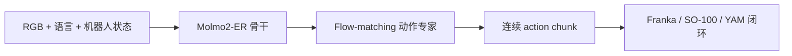
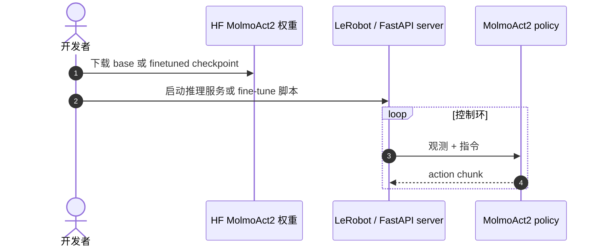

# MolmoAct2：面向真机部署的 Action Reasoning Models

**MolmoAct2**（*Action Reasoning Models for Real-world Deployment*，[arXiv:2605.02881](https://arxiv.org/abs/2605.02881)，[博客](https://allenai.org/blog/molmoact2)，[代码](https://github.com/allenai/molmoact2)）是 **Allen Institute for AI（Ai2）** 开源的 **action reasoning VLA** 家族：在 [Molmo2-ER](./molmo-er.md) 视觉-语言骨干上接入机器人状态与 **flow-matching 连续动作专家**，面向 Franka / SO-100/101 / 双臂 YAM 等真机闭环。

## 一句话定义

**MolmoAct2 = 先 ER（理解空间与任务）再出动作——并把整条栈开源到 LeRobot 可 fine-tune、可评测、可部署。**

## 英文缩写速查

| 缩写 | 英文全称 | 简要说明 |
|------|----------|----------|
| VLA | Vision-Language-Action | 视觉-语言-动作策略 |
| ER | Embodied Reasoning | Molmo2-ER 具身推理 mid-training |
| Ai2 | Allen Institute for AI | 发布机构 |
| HF | Hugging Face | 模型与数据集托管 |
| YAM | Yet Another Manipulator | 论文双臂真机平台 |

## 为什么重要

- **开源可部署 VLA 栈：** 相对闭源 frontier VLA，提供 base checkpoint、fine-tuned policy、BimanualYAM 数据集与 ManiSkill/DROID 零样本评测脚本。
- **ER→Action 两段式：** 与 LightNav「先 ER 再 SFT」、[Gemini Robotics ER](./gemini-robotics.md) 同路线；Molmo2-ER 数据集单独发布供 mid-training 研究。
- **产业评测触点：** [Manda Robotics 开放策略评测](./manda-robotics-open-policy-evaluation.md) 将 MolmoAct 2 列为 DROID 五策略之一；[Embody](./anthropic-embody.md) 用作 LLM 监督的操作基线。

## 核心信息

| 项 | 内容 |
|----|------|
| **机构** | Allen Institute for AI（Ai2） |
| **骨干** | Molmo2-ER VLM + flow-matching action expert |
| **开源** | **已开源** [allenai/molmoact2](https://github.com/allenai/molmoact2)；HF base/finetuned + ER datasets |
| **部署** | LeRobot MolmoAct2 policy；FastAPI 推理服务（DROID/YAM） |

### 流程总览

## 评测

| 设定 | 读法 |
|------|------|
| MolmoSpace leaderboard | 官方称 **第一 VLA**（项目 README 口径） |
| ManiSkill 零样本 | DROID + Bimanual YAM sim eval 脚本已发布 |
| Manda RoboLab-120 | MolmoAct 2 报告 **13.8%** aggregate（DROID 零样本对照） |

## 与其他工作对比

| 维度 | MolmoAct2（本页） | 直出动作的端到端 VLA | 闭源 VLA 产品栈 |
|------|--------------------|----------------------|------------------|
| 推理结构 | **先 ER 后动作**：Molmo2-ER 骨干 + flow-matching 动作专家 | 特征直出动作 | 不可见 |
| 开源边界 | 代码 + base/finetuned 权重 + **ER 数据集** + LeRobot 部署栈 | 视项目而定 | 通常仅 API |
| 部署目标 | Franka / SO-100·101 / 双臂 YAM 真机闭环 | 视项目而定 | 产品本体 |
| 可复核性 | 高：第三方可 fine-tune、可重跑评测 | 中 | 低 |

- **「MolmoSpace 第一」的口径要看清：** 那是 **项目 README 的自报口径**，与 [Manda RoboLab-120](./manda-robotics-open-policy-evaluation.md) 上 **13.8% aggregate（DROID 零样本）** 是两套完全不同的评测面——前者偏空间认知，后者是第三方真机聚合成功率，**不可互相替代，也不可合成一个排名**。
- **开源栈本身是它的主要贡献之一：** 把 ER 数据、权重与 LeRobot 部署路径一起放出，使它成为少数能被外部 **重跑而非转述** 的 VLA；横比时这一点应计入，而不是只比成功率。
- **与骨干页的分工：** 视觉-语言能力归 [Molmo2-ER](./molmo-er.md) / [Molmo2 VLM](./molmo2-vlm.md)，本页只负责 **动作侧** 的结构与部署读法。

## 结论

**MolmoAct2 把「具身推理 + 连续动作 VLA」做成可复现开源产品，而非单次论文 demo。**

- Molmo2-ER 与动作头解耦，ER 数据可独立 mid-training
- flow-matching 连续专家对接真机 chunk 控制
- base + finetuned + 数据集 + LeRobot 集成 **已可跑通**
- Manda 等第三方评测将其列为开放策略对照组
- 相对闭源 Gemini/GR 系，数字需按各自 benchmark 协议读，不可横比 SR

## 源码运行时序图

## 关联页面

- [MolmoER](./molmo-er.md)
- [Molmo2 VLM](./molmo2-vlm.md)
- [VLA](../methods/vla.md)
- [LeRobot](./lerobot.md)
- [空间推理 benchmark 地图](../overview/spatial-reasoning-benchmarks-technology-map.md)

## 参考来源

- [molmoact2_arxiv_2605_02881.md](../../sources/papers/molmoact2_arxiv_2605_02881.md)
- [allenai-molmoact2.md](../../sources/sites/allenai-molmoact2.md)
- [allenai-molmoact2.md](../../sources/repos/allenai-molmoact2.md)

## 推荐继续阅读

- [Ai2 MolmoAct2 博客](https://allenai.org/blog/molmoact2)
- [GitHub allenai/molmoact2](https://github.com/allenai/molmoact2)
- [MolmoAct v1 仓库](https://github.com/allenai/MolmoAct)（前代）
