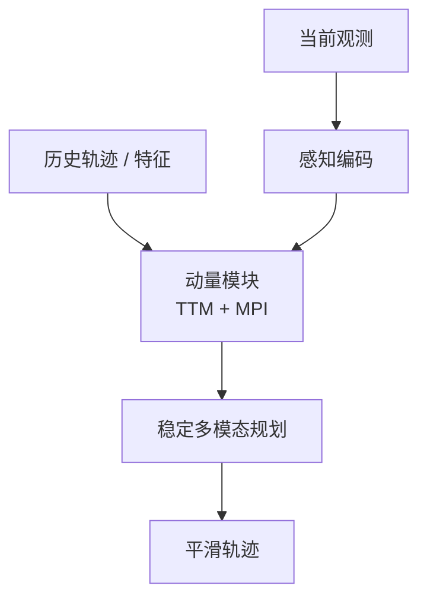
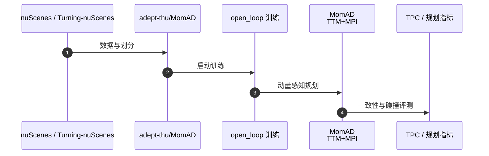

# MomAD（Don't Shake the Wheel: Momentum-Aware Planning in End-to-End Autonomous Driving · arXiv:2503.03125）

**MomAD**（*Don't Shake the Wheel: Momentum-Aware Planning in End-to-End Autonomous Driving*，[2503.03125](https://arxiv.org/abs/2503.03125)，CVPR 2025）由 **地平线（Horizon Robotics）；清华大学（Tsinghua）等** 提出，收录于深蓝AI《端到端自动驾驶：十大前沿算法盘点》**动量感知 / 帧间一致** 线索代表作。

## 一句话定义

用轨迹动量与感知动量抑制单帧 E2E「左右横跳」，面向量产乘坐舒适与控制稳定。

## 英文缩写速查

| 缩写 | 英文全称 | 简要说明 |
|------|----------|----------|
| MomAD | Momentum-Aware Driving | 动量感知端到端驾驶 |
| TTM | Topological Trajectory Matching | 历史轨迹拓扑对齐 |
| MPI | Momentum Planning Interactor | 规划与历史上下文交互 |
| TPC | Trajectory Prediction Consistency | 轨迹预测一致性指标 |
| E2E | End-to-End | 端到端自动驾驶 |

## 为什么重要

- 开环榜低碰撞率不等于实车可乘：帧间轨迹抖动是量产痛点。
- 引入 TPC 指标与 Turning-nuScenes 验证集，把「稳定性」变成可测目标。
- 标志 E2E 研究从刷榜转向落地一致性。

## 核心信息

| 字段 | 内容 |
|------|------|
| **机构** | 地平线（Horizon Robotics）；清华大学（Tsinghua）等 |
| **arXiv** | [2503.03125](https://arxiv.org/abs/2503.03125) |
| Venue | CVPR 2025 |
| **演进线索** | 动量感知 / 帧间一致 |
| **开源** | **已开源** — [`adept-thu/MomAD`](https://github.com/adept-thu/MomAD) |
| **指标索引** | nuScenes 规划精度 SOTA 级；强调 Smoothness / TPC 与 Turning-nuScenes（以论文为准）。 |

## 核心原理

### 两大动量

1. **轨迹动量（Trajectory Momentum）**：当前规划参考历史轨迹趋势（TTM：Hausdorff 对齐等），避免突变。
2. **感知动量（Perception Momentum）**：历史特征平滑，缓解短暂遮挡丢检。

另含 **Momentum Planning Interactor (MPI)**：规划 query 与历史时空上下文交叉注意力；编码器扰动增强抗噪。

### 流程总览

## 源码运行时序图

关键复现路径：[`adept-thu/MomAD`](https://github.com/adept-thu/MomAD)（CVPR 2025 官方仓）。

## 实验与评测

| 维度 | 记录 |
|------|------|
| 数据集 | nuScenes；**Turning-nuScenes** 验证子集 |
| 新指标 | **TPC**（Trajectory Prediction Consistency） |
| 报告点 | 长时域（>3s）一致性与转弯场景响应；规划精度 SOTA 级 |
| 对照 | 单帧 one-shot 规划 E2E |

## 与相邻路线对比

| 路线 | 相对 MomAD | 取舍 |
|------|------------|------|
| [UniAD](./paper-uniad.md) / [VAD](./paper-vad-vectorized-scene.md) | 刷开环碰撞 | 帧间可能抖 |
| [DriveTransformer](./paper-drivetransformer.md) | 并行扩展 | 不专攻动量 |
| [DiffusionDrive](./paper-diffusiondrive.md) | 多模态意图 | 需另保时序平滑 |

## 工程实践

| 维度 | 记录 |
|------|------|
| 典型评测 | nuScenes / NAVSIM / Bench2Drive / Waymo Open（依论文） |
| 开源状态 | **已开源** — [`adept-thu/MomAD`](https://github.com/adept-thu/MomAD) |
| 复现入口 | https://github.com/adept-thu/MomAD |
| 工程关注点 | 延迟、帧间一致性、可解释中间量表征、与模块化栈的接口 |

## 局限与风险

- 过强动量可能推迟必要急避；需在稳定与响应间折中。
- 开环一致性不自动保证闭环控制品质。
- Turning 子集构造细节影响可比性。

## 关联页面

- [e2e-autonomous-driving-top10-algorithms](../overview/e2e-autonomous-driving-top10-algorithms.md) — 十大盘点父节点
- [自动驾驶核心算法盘点专辑](../overview/autonomous-driving-core-algorithms-series.md) — 模块化栈姊妹篇
- [生成式世界模型](../methods/generative-world-models.md)
- [S²-VLA](./paper-s-squared-vla.md) — 驾驶 VLA / NAVSIM 对照
- [M⁴World](./paper-m4world.md) — 驾驶世界模型后继
- [VLA](../methods/vla.md)

## 参考来源

- [深蓝AI：端到端自动驾驶十大前沿算法盘点](../../sources/blogs/wechat_shenlan_ai_ad_e2e_top10.md)
- [e2e_ad_momad.md](../../sources/papers/e2e_ad_momad.md) — 论文 source
- arXiv: [2503.03125](https://arxiv.org/abs/2503.03125)
- [repos/momad.md](../../sources/repos/momad.md)

## 推荐继续阅读

- 论文 PDF：<https://arxiv.org/pdf/2503.03125.pdf>
- 官方代码：<https://github.com/adept-thu/MomAD>
