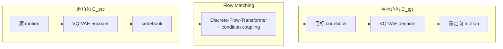

# MoReFlow

**MoReFlow**（*MoReFlow: Motion Retargeting Learning through Unsupervised Flow Matching*，arXiv:[2509.25600](https://arxiv.org/abs/2509.25600)，[项目页](https://dnjsxor999.github.io/projects/MoReFlow/MoReFlow.html)）是 Georgia Tech 提出的 **无配对跨角色运动重定向** 框架：先把各 embodiment 的运动序列 token 化到独立 VQ-VAE codebook，再用 **flow matching** 学习 codebook 之间的对应，推理时 ODE 积分 + 目标 decoder 重建。

## 一句话定义

**无监督 flow matching 对齐各角色 VQ-VAE motion token 空间，在不需要配对数据集的前提下实现可逆、可条件（局部风格 / 世界系对齐）的跨形态重定向。**

## 英文缩写速查

| 缩写 | 英文全称 | 简要说明 |
|------|----------|----------|
| VQ-VAE | Vector Quantized Variational Autoencoder | 离散 motion token 自编码器 |
| FM | Flow Matching | 学习向量场把源分布 transport 到目标分布 |
| IK | Inverse Kinematics | 传统手工约束重定向对照 |
| GAN | Generative Adversarial Network | 早期无监督对齐基线（本文对比） |
| SMPL | Skinned Multi-Person Linear Model | 人形 motion 表示之一 |

## 为什么重要

- **数据驱动路线的「无配对」分支：** 深蓝 2026-09-07 长文把 MoReFlow 与 Human2Humanoid、AdaMorph 并列为深度学习重定向代表；相对有监督配对，降低多机种覆盖成本。
- **任务条件灵活：** Multi-Sample Condition Coupling 允许 local style 或 world-frame alignment 等 domain-specific 目标，不假设单一 retargeting 定义。
- **可逆性：** 同一框架支持 source→target 与反向，利于 animation 与 robotics 双向数据增广讨论。

## 核心原理（方法栈）

| 阶段 | 模块 | 作用 |
|------|------|------|
| 1 | 角色专属 VQ-VAE | encoder → quantize → decoder；compact latent / codebook |
| 2 | Flow matching | 对齐源/目标 codebook 分布；conditional coupling |
| 推理 | ODE + 目标 decoder | 源 motion → 源 tokens → 目标 tokens → 目标 motion |

## 工程实践

| 项 | 说明 |
|----|------|
| Codebook | SMPL 人形 / Booster T1：512×512；Spot 四足：256×256 |
| 时序 | 32 帧窗口 → downsample ×4 → 8 tokens |
| 训练 | AdamW β=[0.9,0.99]；batch 128；VQ-VAE warm-up 1K @ 2e-4 再 100K |
| 下游 | 产出 reference motion 后仍常接 RL tracking / 物理 refinement（见 [GMR](../methods/motion-retargeting-gmr.md)、[DynaRetarget](../methods/dynaretarget-sbto-motion-retargeting.md)） |

## 实验与评测

| 维度 | 论文/项目页给出的证据 | 证据类型 |
|------|------------------------|----------|
| 形态覆盖 | SMPL 人形、**Booster T1**（512×512 codebook）、**Spot 四足**（256×256）——含异构形态，不只人形间 | 覆盖广度 |
| 动作类型 | locomotion、arm motion、可控条件生成、**chain-reversal**（反向重定向） | 能力清单 |
| 相对 GAN 式无监督 | flow matching 的分布对齐 **更稳定** | 定性对照 |
| 相对手写 IK 约束 | 任务条件更灵活（local style / world-frame alignment 可注入） | 定性对照 |

> **读法警告：** 截至 **2026-09-07**，公开材料是 **arXiv + 项目页 demo 视频**，**没有与 IK / GAN / 其他神经重定向方法的统一量化对照表**。「比 GAN 更稳」「比 IK 更灵活」都是 **定性主张**，不是基准分数。可逆性与条件耦合是框架 **能力**，其真机可用性（足滑、穿模、限位）尚未见评测。

## 与其他工作对比

放进 [三路技术地图](../queries/motion-retargeting-three-routes-landscape.md) 看，MoReFlow 属 **路线 2（深度学习数据驱动）** 里的 **无配对分支**：

| 工作 | 路线 | 需要配对数据 | 换一台新机器人要做什么 | 与 MoReFlow |
|------|------|--------------|------------------------|-------------|
| **MoReFlow** | 2 · DL | **否**（Multi-Sample Condition Coupling 训练时造伪配对） | 训一个新 VQ-VAE + 一个对齐模型 | 本页；**可逆**，source↔target 双向 |
| [AdaMorph](./paper-adamorph-unified-motion-retargeting.md) | 2 · DL | 是（12 机种联合训练） | 加一组 robot prompt + output adapter，共享 decoder | 同路线主要对照：**一个模型服务多拓扑** vs **每角色一套 tokenizer** |
| [Human2Humanoid](./human2humanoid.md) | 2 · DL | 是 | 重训 | 更早的一支，已用于真机遥操作；MoReFlow 尚无真机结果 |
| GAN 式无监督对齐 | 2 · DL | 否 | 重训 | 本文的直接前身，论文主张 flow matching **训练更稳** |
| [GMR](../methods/motion-retargeting-gmr.md) / [NMR](../methods/neural-motion-retargeting-nmr.md) | 1 · IK | 否 | 写约束 / 配置 | 实时可解释；见 [GMR vs NMR vs ReActor 对比](../comparisons/gmr-vs-nmr-vs-reactor.md)。MoReFlow 推理走 ODE 积分，**难满足高频遥操作** |
| [OmniRetarget](./paper-hrl-stack-03-omniretarget.md) / [DynaRetarget](../methods/dynaretarget-sbto-motion-retargeting.md) / [ReActor](../methods/reactor-physics-aware-motion-retargeting.md) | 3 · 物理 | — | — | **下游而非竞争**：MoReFlow 原生不建模 foot contact 与物体交互，接触密集任务须接这些后端 |

**选型读法：** MoReFlow 的独特位置是「**多机种覆盖成本**」——不需要为每对角色准备配对动作。代价是 **离线取向**（ODE 积分延迟）与 **物理无保证**。适合 **离线构建跨形态数据集**，不适合实时遥操；后者仍看 [GMR](../methods/motion-retargeting-gmr.md)。**代码待发布**，当前不构成可落地选项。

## 局限与风险

- **开源状态：** 截至 2026-09-07 项目页 **无 GitHub** → 复现需等官方发布或自实现。
- **推理延迟：** 深度学习路线普遍难满足高频遥操作；更适合离线数据集构建。
- **物理接触：** 原生不建模 foot contact / 物体交互；复杂 loco-manipulation 需接 [OmniRetarget](./paper-hrl-stack-03-omniretarget.md) 或 [ReActor](../methods/reactor-physics-aware-motion-retargeting.md) 类后端。

## 源码运行时序图

**不适用**（截至 2026-09-07 官方未发布可运行代码仓库；仅有项目页 demo 与 arXiv 描述）。

## 结论

**MoReFlow 把跨角色重定向写成 codebook 潜空间上的 flow matching，在无需配对 motion 的前提下兼顾可逆与任务条件，是 2025–2026 数据驱动重定向的重要无监督分支。**

1. **两阶段解耦** — 先 per-character VQ-VAE，再跨 codebook flow；换目标机只需换 decoder + 对齐模型。
2. **条件耦合** — local style / world-frame 等可通过 training-time coupling 注入，不必重训整套 IK 约束。
3. **覆盖四足与人形** — 实验含 Spot 等异构形态，不只 narrow locomotion IK。
4. **与 GMR 串联而非替代** — 工程上仍可能需要 IK/物理层做限位与接触校验。
5. **代码待发布** — 选型时以 arXiv + 项目页为准，勿假设已有 pip 包。

## 参考来源

- [MoReFlow arXiv 摘录](../../sources/papers/moreflow_arxiv_2509_25600.md)
- [MoReFlow 项目页归档](../../sources/sites/moreflow-gatech.md)
- [深蓝运动重定向三路综述（公众号）](../../sources/blogs/wechat_shenlan_motion_retargeting_three_routes_2026-09-07.md)

## 关联页面

- [Motion Retargeting](../concepts/motion-retargeting.md)
- [AdaMorph](./paper-adamorph-unified-motion-retargeting.md)
- [GMR](../methods/motion-retargeting-gmr.md)
- [三路技术地图 Query](../queries/motion-retargeting-three-routes-landscape.md)

## 推荐继续阅读

- <https://arxiv.org/abs/2509.25600>
- <https://dnjsxor999.github.io/projects/MoReFlow/MoReFlow.html>
