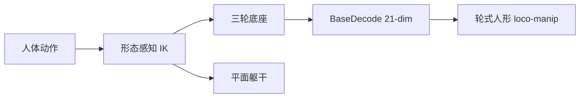

# Morphology-Aware Retargeting（arXiv:2609.11357）

**Morphology-Aware Retargeting**（*Morphology-Aware Human Motion Retargeting for Wheeled-Humanoid Loco-Manipulation*，[arXiv:2609.11357](https://arxiv.org/abs/2609.11357)）由 **哈尔滨工业大学（HIT）** 提出（公众号周更 ingest 见 [策展索引](../../sources/blogs/wechat_shenlan_weekly_humanoid_quadruped_2026-09-14.md)）。

## 一句话定义

面向轮式人形移动操作的形态感知人体动作重定向 — lower body to 3-wheel base + planar torso。

## 英文缩写速查

| 缩写 | 英文全称 | 简要说明 |
|------|----------|----------|
| IK | Inverse Kinematics | 逆运动学 |
| DoF | Degrees of Freedom | 自由度 |
| loco-manip | Loco-Manipulation | 移动操作 |

## 为什么重要

人体动作直接套到轮式人形会关节不可达；需形态感知重定向。

## 核心信息

| 项 | 内容 |
|----|------|
| **机构** | 哈尔滨工业大学（HIT） |
| **开源** | **未见/待发布**（步骤 2.5 核查：截至 2026-09-14 无可运行官方仓库） |

## 核心原理

下半身映射三轮移动底座与平面躯干自由度；morphology-aware differential IK 过滤不可行动作；21-dim BaseDecode 策略输出底座+上身。

### 流程总览

## 源码运行时序图

**不适用** — 截至 **2026-09-14** arXiv 与常见项目页 **未见** 官方可运行代码仓库。

## 工程实践

| 项 | 说明 |
|----|------|
| 开源状态 | 未见官方仓库；以 arXiv 为准 |
| 复现入口 | 论文方法与超参；代码发布后再补 `sources/repos/` |
| 部署注意 | IK 奇异点处理；底座速度限幅与上身协调。 |

## 实验与评测

重定向误差、任务成功率；轮式人形 loco-manipulation 演示。

## 结论

形态感知重定向 + BaseDecode 让轮式人形可复用人体 loco-manip 数据。

1. 三轮底座是下半身核心抽象。
2. 微分 IK 保证实时可行。
3. 21 维策略联合底座与上身。
4. 避免直接套 G1 类重定向。
5. 数据效率依赖人体源动作质量。

## 与其他工作对比

| 对照 | 差异读法 |
|------|----------|
| UMR 等人形重定向 | 未针对轮式底座 |
| 纯轮式导航 | 无上身操作 |

## 局限与风险

三轮模型与特定硬件绑定；动态跳跃类动作不适用。

## 关联页面

- [loco-manipulation](../tasks/loco-manipulation.md)
- [./paper-umr-unified-motion-retargeting.md](./paper-umr-unified-motion-retargeting.md)
- [hybrid-locomotion](../tasks/hybrid-locomotion.md)

## 参考来源

- [morphology_aware_retargeting_wheeled_humanoid_arxiv_2609_11357.md](../../sources/papers/morphology_aware_retargeting_wheeled_humanoid_arxiv_2609_11357.md)
- [公众号周更策展](../../sources/blogs/wechat_shenlan_weekly_humanoid_quadruped_2026-09-14.md)

## 推荐继续阅读

- [https://arxiv.org/abs/2609.11357](https://arxiv.org/abs/2609.11357)
