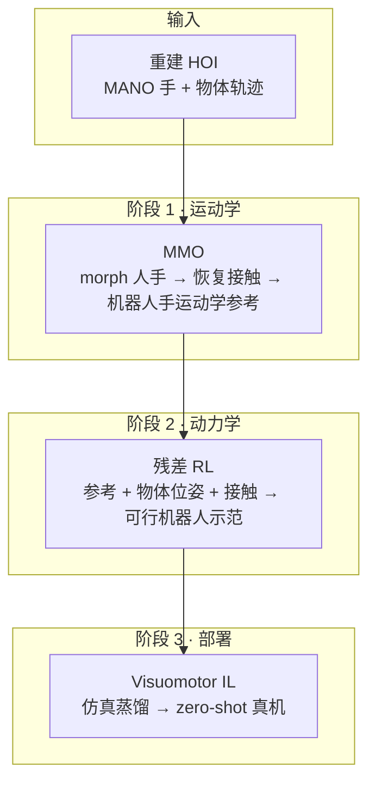

# Morphometric Imitation（人类 HOI → 零样本真机 visuomotor）

**Morphometric Imitation**（*From Morphology and Contact Aware Hand Retargeting to Sim-to-Real Visuomotor Policy*，[arXiv:2609.28660](https://arxiv.org/abs/2609.28660)，[项目页](https://morphometricimitation.github.io/)）来自 **加州大学伯克利分校 EECS**（Sastry、Tomlin*、Malik* 等）：把 **重建的人手–物交互** 经 **三阶段** 变为 **零样本 sim-to-real 视觉运动策略**——**MMO** 在跨形态运动学重定向中 **保示范接触**；**残差 RL** 用参考中的 **物体位姿与接触** 得到动力学可行、避桌碰撞的机器人轨迹；最后在仿真 **模仿学习** 蒸馏 **visuomotor** 策略。项目页 TLDR：**One human demo · Any multi-fingered hand · Zero-shot sim-to-real visuomotor policy**。

## 一句话定义

用 **形态对齐 + 接触恢复** 的运动学重定向与 **接触/位姿感知的残差 RL**，把 **一条自然人类 HOI** 变成可在 **三/四/五指灵巧手** 上 **直接真机部署** 的视觉闭环策略，而不依赖 teleop 机器人示范。

## 英文缩写速查

| 缩写 | 英文全称 | 简要说明 |
|------|----------|----------|
| HOI | Hand-Object Interaction | 人手–物体交互轨迹（本文来自 3D 重建/GRAB 等） |
| MMO | Morphometric Optimization | 第一阶段：MANO 形态优化 + 接触恢复的运动学重定向 |
| MANO | Mesh-based hand Model with Articulated joints | 参数化人手模型；MMO 在其上 morph 并对齐机器人形态 |
| RL | Reinforcement Learning | 第二阶段残差策略，精炼运动学参考为动力学可行 rollout |
| IL | Imitation Learning | 第三阶段由 RL 示范蒸馏 visuomotor 策略 |
| Sim2Real | Simulation to Real | 仿真训练、真机 **零样本** 部署（无 teleop 微调叙事） |
| F1 | F1 score | 接触预测/保持的 F1；MMO 相对五基线至少 +8 pt |

## 为什么重要

- **数据假设贴近「自然 HOI」：** 不要求为机器人采集而 **刻意慢动作或受限 workspace**（论文 Table I 强调 *natural human motion* 与多条仅 kinematic 或仅 sim 基线对照）。
- **形态差是接触误差的根因：** 向量/关键点类 retargeting 在 **手尺寸与指形不同** 时 **几何对应不可达**，接触点漂移；MMO **先 morph 人手再恢复接触**，把问题从「硬对齐关键点」改成 **形态+接触联合优化**。
- **运动学质量传导到动态重定向：** MMO 提升 contact F1 后，同一残差 RL 配方下 **动态重定向成功率最高可 +35 pt**（相对最强基线），说明 **上游接触保真** 是 downstream 示范质量杠杆。
- **端到端 sim-to-real 证据：** **300 真机 trial、30 物体、10 类、随机初始位姿** 报告 **89.3%** 成功率；项目页 **1× 速度、全自主** 视频覆盖多类日常物体实例。
- **跨指形一套管线：** 同一人类示范 retarget 到 **Allegro（四指）、Sharpa（五指）、Dex3（三指）** 等，服务 **「任意多指手」** 选型场景。

## 流程总览

## 核心机制（详细）

| 阶段 | 输入 | 输出 | 要点 |
|------|------|------|------|
| **MMO** | 人类 HOI（MANO + 物体） | 目标机器人手的 **kinematic 参考** | 优化 **人手形态** 匹配机器人；**恢复** morph 后仍与示范一致的 **手–物接触**；显式处理 **桌面碰撞** 风险 |
| **残差 RL** | MMO 参考 + 仿真 | **动力学可行** 的机器人 rollout | **残差** 在参考之上；obs/reward/termination 同时使用 **object pose + contact**；消融显示二者 **互补** |
| **Visuomotor IL** | RL 示范 | 闭环 **视觉 + 本体** 策略 | 仿真模仿学习；部署 **zero-shot sim-to-real**（项目页强调无额外真机 fine-tune 叙事） |

**评测设置（论文摘要）：** **三种机器人手**、**十条 GRAB HOI**；运动学对比 **五个基线**（含 DexPilot、AnyTeleop/Position、Contact-Aware PyRoki、OmniRetarget 等）；动态与 visuomotor 与 **Human2Sim2Robot、DemoMimic、Chen et al.** 等 Table I 谱系对照。

## 评测与结果

- **运动学（MMO）：** 相对最强五基线，**contact F1 每种手至少 +8 pt**；**patch distance** 一致更低（Table II）。
- **动态重定向（残差 RL）：** 更高 **任务成功率**（**≤+35 pt** vs 最强基线）、更准 **物体轨迹跟踪**、终态 grasp **更接近示范接触**（Table III）；**object pose 与 contact 信息** 消融互补。
- **真机 visuomotor：** **89.3%** success on **300 trials / 30 objects / 10 categories**，随机初始位姿；项目页 **10 类 × 3 实例** 视频（flashlight、hammer、apple 等）。
- **Hands：** 项目页展示 **Allegro、Sharpa、Dex3** 等同源人类示范的 kinematic / RL 并排结果。

## 源码运行时序图

| 项 | 结论 |
|----|------|
| 官方仓库 | [tsadja/morphometric](https://github.com/tsadja/morphometric) |
| 可运行入口 | **不适用**（截至 2026-09-26：README 写 **Code will be released soon**，无 train/eval 脚本） |
| 发布后预期链路 | HOI/GRAB 加载 → **MMO 优化** → 仿真 **残差 RL rollout** → **visuomotor IL 训练** → 真机视觉闭环部署 |

## 工程实践（含开源状态）

| 项 | 结论 |
|----|------|
| arXiv | <https://arxiv.org/abs/2609.28660> |
| 项目页 | <https://morphometricimitation.github.io/> |
| 代码 | **待发布** — [tsadja/morphometric](https://github.com/tsadja/morphometric) 占位仓（teaser + BibTeX）；页内 Code 链指向同仓 |
| 数据 | 论文实验基于 **GRAB** 等 HOI；复现需自备重建/GRAB 管线（代码未发） |
| 硬件 | 真机评测覆盖 **多指灵巧手**（页内 Allegro / Sharpa / Dex3）；部署为 **visuomotor** 闭环 |

## 结论

**Morphometric Imitation 把「形态+接触」放进运动学重定向，再用接触/位姿感知的残差 RL 与 visuomotor IL，把单条自然人类 HOI 推到 89% 级真机零样本成功率，核心杠杆是接触保真而非单纯关键点对齐。**

1. **先修接触再谈 RL：** MMO 对五基线 **F1 ≥+8** 说明 **kinematic 接触质量** 可量化，且 **直接抬高** 动态重定向上限（**+35 pt** 量级）。
2. **残差 RL 读法：** 参考轨迹 + **object pose & contact** 三路信号进 obs/reward/termination；消融勿只留其一。
3. **部署指标：** 选型时以 **300 trial / 30 物体** 的 **89.3%** 与项目页 **multi-instance** 视频为主，而非单 sim SR。
4. **多指手：** 同一人类 demo 可分支到 **3/4/5 指** 形态；MMO 是跨形态统一入口，不是 per-hand 重新 teleop。
5. **复现预期：** 代码发布前仅可复现 **论文图表级理解**；工程跟进 [GitHub 占位仓](https://github.com/tsadja/morphometric) 与项目页 Code 链。

## 与其他工作对比

| 对照 | 差异读法 |
|------|----------|
| [DemoMimic](./paper-demomimic.md) | 同属 **单次示范 + 接触中心 + sim-to-real visuomotor**；DemoMimic 用 **AR/SCR** 与 **腕部 depth IL**；Morphometric 强调 **MMO 形态 retarget + GRAB HOI 自然动作** |
| Human2Sim2Robot / Chen et al. | Table I：部分方法 **约束采集** 或 **无 kinematic retarget**；本文 **全三阶段 + natural HOI** |
| DexPilot / AnyTeleop / PyRoki | **仅 kinematic** 向量/接触启发式 retarget；MMO **显式 morph + 接触恢复**，F1 与 downstream SR 更高 |
| [OmniRetarget](./paper-hrl-stack-03-omniretarget.md) | Omni 偏 **全身 loco-manip interaction mesh**；Morphometric 专注 ** tabletop 灵巧 HOI + visuomotor 真机** |
| [DexMachina](./paper-dexmachina.md) | DexMachina 动态 retarget + IL 但 sim-real gap 大；Morphometric 报告 **更高真机 zero-shot SR** 与 **接触保真上游** |

## 关联页面

- [Manipulation](../tasks/manipulation.md)
- [Motion Retargeting Pipeline](../concepts/motion-retargeting-pipeline.md)
- [Sim2Real](../concepts/sim2real.md)
- [Imitation Learning](../methods/imitation-learning.md)
- [DemoMimic（单次示范灵巧 IL）](./paper-demomimic.md)

## 参考来源

- [morphometric_imitation_arxiv_2609_28660.md](../../sources/papers/morphometric_imitation_arxiv_2609_28660.md)
- [morphometricimitation-github-io.md](../../sources/sites/morphometricimitation-github-io.md)
- [morphometric.md](../../sources/repos/morphometric.md)

## 推荐继续阅读

- [arXiv PDF](https://arxiv.org/pdf/2609.28660)
- [项目页 Morphometric Optimization 交互 3D](https://morphometricimitation.github.io/)
- [GRAB 数据集](https://grab.is.tue.mpg.de/) — 论文 HOI 评测来源
