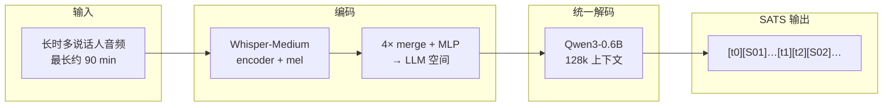
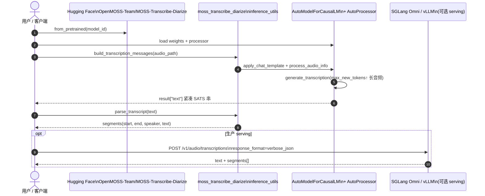

# MOSS Transcribe Diarize（长时多说话人 SATS）

**MOSS Transcribe Diarize**（*MOSS Transcribe Diarize Technical Report*，[arXiv:2601.01554](https://arxiv.org/abs/2601.01554)，MOSI.AI / OpenMOSS；顾问 Xipeng Qiu · **复旦大学 NLP**；[项目页](https://mosi.cn/models/moss-transcribe-diarize) · [代码](https://github.com/OpenMOSS/MOSS-Transcribe-Diarize) · [权重](https://huggingface.co/OpenMOSS-Team/MOSS-Transcribe-Diarize) · [HF Demo](https://huggingface.co/spaces/OpenMOSS-Team/MOSS-transcribe-diarize)）是 **0.9B** 统一音频–文本 MLLM，在 **单次前向** 中联合完成 **Speaker-Attributed, Time-Stamped Transcription（SATS）**：转写内容、说话人标签与段级时间戳一并输出，面向会议、播客、访谈等 **长时多说话人** 场景。

## 一句话定义

用 **一个 128k 上下文 MLLM** 替代 Whisper+Pyannote 级联，直接产出 `[start][Sxx]text[end]` 格式转写——谁说了什么、何时说，最长约 **90 分钟** 不分块。

## 英文缩写速查

| 缩写 | 英文全称 | 简要说明 |
|------|----------|----------|
| SATS | Speaker-Attributed, Time-Stamped Transcription | 带说话人归因与时间戳的转写；本文核心任务 |
| ASR | Automatic Speech Recognition | 纯文本转写；CER 只评 ASR 分量 |
| SD | Speaker Diarization | 说话人分离；Δcp 隔离分离引入的额外错误 |
| cpCER | concatenated minimum-permutation CER | 带说话人置换的最小编辑距离；联合指标 |
| Δcp | cpCER − CER | 分离错误导致的增量；越低分离越稳 |
| MLLM | Multimodal Large Language Model | 音频+文本统一建模骨干 |

## 为什么重要

- **机器人/HRI 语音上游：** [人形智能语音交互](../methods/humanoid-voice-interaction.md) 传统链是 ASR→NLU；多说话人场景（示教、群聊、现场解说）需要 **谁说了哪句**，SATS 一体输出可少一层对齐与 ID 漂移。
- **级联管线 brittle：** Whisper + Pyannote/x-vector + 强制对齐（WhisperX/MFA）错误级联、分块边界身份漂移——论文用 **Δcp** 量化分离拖累。
- **长上下文是会议尺度关键：** 128k 单次处理 ~90 分钟，对比 JEDIS-LLM 分块+Speaker Prompt Cache 或 GPT-4o/Gemini 长音频格式不稳定。
- **开源可部署：** 0.9B + SGLang/vLLM/FunASR 多后端；Pro 闭源但 0.9B 已可在单卡跑长会议（README H100 `aishell4_long` RTF ≈ 0.02–0.12）。

## 核心信息

| 项 | 内容 |
|----|------|
| 机构 | MOSI.AI（模思智能 / OpenMOSS）；顾问 Xipeng Qiu（复旦大学） |
| 参数量 | **0.9B**（开源）；**Pro** 更强，仅 [MOSI Playground](https://platform.mosi.cn/app/playground) |
| 上下文 | **128k tokens**；最长约 **90 分钟** 输入 |
| 语言 | **50+**；INTERSPEECH 2026 2nd MLC-SLM **14 语第一**（2026-07-14） |
| 代码 | [OpenMOSS/MOSS-Transcribe-Diarize](https://github.com/OpenMOSS/MOSS-Transcribe-Diarize) |
| 权重 | [OpenMOSS-Team/MOSS-Transcribe-Diarize](https://huggingface.co/OpenMOSS-Team/MOSS-Transcribe-Diarize) |
| 开源核查 | **已开源**（2026-09-07）：推理+服务+Web UI+微调文档+HF 权重；Pro 权重 **未开源** |

## 核心原理

### 架构

- **音频侧：** Whisper-Medium 编码器配置；16 kHz、80 mel、`WhisperFeatureExtractor`、30 s chunk。
- **桥接：** 4× 时序 merge + MLP adaptor，将声学 embedding 映射到文本 LLM 空间。
- **文本侧：** Qwen3-0.6B 风格因果解码器；音频特征经 `masked_scatter` 替换 `<|audio_pad|>` token。
- **时间戳：** 参考 TimeMarker/Whisper 思路，用 **格式化时间戳文本** 插入 chunk 间，避免长音频绝对位置编码稀疏。

### 训练数据

1. **真实：** 互联网多语对话；AISHELL-4 远场平均通道等。
2. **模拟：** 2–12 说话人、词段切分、高斯间隔、≤80% 重叠、50 ms cross-fade、0–15 dB SNR 噪声混响——补重叠/交替/声学多样性。

### 流程总览

## 源码运行时序图

节点对齐 [`sources/repos/moss-transcribe-diarize.md`](../../sources/repos/moss-transcribe-diarize.md) 与官方 README。

关键复现路径：`uv pip install -e ".[torch-runtime]"` → Python API 或 `sgl-omni serve`；长音频务必提高 `max_new_tokens`（如 65536），并避免 `eager` attention。

## 工程实践

| 项 | 建议 |
|----|------|
| 最短本地推理 | clone 仓库 → Python 3.12 venv → `generate_transcription` + `parse_transcript` |
| 长会议部署 | **SGLang Omni**（推荐）或 vLLM；`max_new_tokens` 按音频长度放大 |
| 体验入口 | [HF Space](https://huggingface.co/spaces/OpenMOSS-Team/MOSS-transcribe-diarize)（≤30 min 远程）；本地 Web App 无该上限 |
| 热词 / 提示 | README § Custom Prompt and Hotwords；评测用固定 prompt（附录 6.1） |
| 微调 | [FINETUNING.md](https://github.com/OpenMOSS/MOSS-Transcribe-Diarize/blob/main/FINETUNING.md) |
| 人形语音栈 | 作 [ASR 上游](../methods/humanoid-voice-interaction.md) 替换 Whisper-only；多说话人示教/群聊先 SATS 再 NLU |
| Pro vs 0.9B | 选型看 cpCER/Δcp；Pro 全面领先但 **仅 API**；复现/私有化用 0.9B |

## 实验与评测

### 客观指标（技术报告 Table 2 + README 扩展）

| 数据集 | 特点 | MOSS 0.9B 亮点（README 更新值） |
|--------|------|--------------------------------|
| AISHELL-4 | ~40 min 真实会议，5–7 说话人 | CER **14.84** / cpCER **15.83** / Δcp **0.99**（优于 Doubao、Gemini 2.5 Pro 等） |
| Alimeeting | 中文会议 | cpCER **22.17**，Δcp **−2.69**（分离甚至「帮」转写） |
| Podcast | 长时多嘉宾 | CER **5.97**，Δcp **1.40** |
| Movies | 短句高重叠 | cpCER **12.76**，Δcp **6.40** |

**读榜：** 优先看 **Δcp**——多家商用系统 CER 尚可但 Δcp 很大（Movies 上 Doubao Δcp 20.94），说明分离是瓶颈。GPT-4o / Gemini 3 Pro 对 **长音频** 常无法完整或格式合规输出。

## 与其他工作对比

SATS（转写 + 说话人 + 时间戳）可以由 **几段拼**，也可以 **一次出**。分歧在 **在哪一步引入说话人**：

| 路线 | 代表 | 说话人在哪引入 | 长音频怎么办 | 主要局限 |
|------|------|----------------|--------------|----------|
| 级联 ASR + SD | Whisper + Pyannote（+ WhisperX/MFA 对齐） | **转写之后** 另一模块 | 分块 | 错误级联；**无原生段级时间戳**；块边界身份漂移 |
| LLM 后处理 | DiarizationLM | 转写之后，由 LLM 修正 | 分块 | 非端到端，**仍吃前端失配** |
| 两阶段联合 | Sortformer | **先 SD 再 ASR** | 分块 | 非单 pass SATS |
| 短上下文 MLLM | SpeakerLM | 联合 | 不适用 | ~50–90 **秒**、≤4 说话人、**无原生时间戳段** |
| 流式分块 MLLM | JEDIS-LLM + Speaker Prompt Cache | 联合 | cache + 分块 | 边界 artifact；需维护 cache |
| 通用长音频 MLLM | GPT-4o / Gemini 3 Pro | 提示词里要求 | 号称长上下文 | 论文观察：长音频常 **无法完整或格式合规输出** |
| **本文（MOSS 0.9B）** | 统一音频–文本 MLLM | **单次前向内联合** | **128k 单 pass ≈ 90 min，不分块** | 非流式（future work）；Pro 更强但 **闭源** |

**为什么 Δcp 是这张表的判据：** 上述前四类都把说话人当独立子问题，代价直接体现在 **Δcp = cpCER − CER**——CER 尚可但 Δcp 很大（如 Movies 上某商用系统 Δcp **20.94**）意味着「字认得出、人分不清」。MOSS 在 AISHELL-4 上 Δcp **0.99**、Alimeeting 上甚至 **−2.69**（联合建模让说话人信息反过来帮了转写），这是单 pass 相对级联最实在的结构性收益。

**读表须知：** 表内 MOSS 数值取自 **README 更新值**（技术报告 Table 2 之后有更新），且论文最优数含 **未开源的 Pro**；与商用系统的对比是 **作者自测**，非第三方同台。选型请以自己的音频域复测为准。

## 结论

**一句话总判：MOSS Transcribe Diarize 把「长会议 SATS」从级联工程堆栈拉进 128k 单 pass MLLM，0.9B 开源版已在 cpCER/Δcp 上压过多家闭源商用——部署时优先看 Δcp 与 `max_new_tokens`，Pro 只作 API 上限参考。**

1. **真影响指标是 Δcp，不是单看 CER** — 分离稳不稳决定多说话人可用性；Movies 高重叠场景尤其明显。
2. **128k 单 pass 是产品差异点** — 避免分块 identity drift；与「能听长音频的通用 MLLM」不是同一能力（格式/完整性常翻车）。
3. **0.9B 够私有化，Pro 够刷榜** — 复现/边缘部署用 GitHub+HF；要极致指标走 MOSI Playground。
4. **Serving 选型：SGLang Omni > vLLM > 裸 Transformers** — 长序列调 `max_new_tokens`；禁用 `eager` 防 OOM。
5. **机器人读法：SATS 是 HRI 上游，不是对话大脑** — 输出结构化转写后仍接 NLU/LLM/技能；与 [Daily-Omni](./paper-daily-omni.md) 的 AV 对齐评测正交。
6. **模拟数据是 Δcp 低的重要配方** — 重叠/交替/噪声可控合成补真实会议稀缺。
7. **Demo 上限 ≠ 模型上限** — HF Space 30 min 是体验约束；模型宣称 90 min 需本地/SGLang 验证。

## 局限与风险

- **Pro 闭源：** 论文/README 最优数含 Pro；0.9B 与 Pro 仍有差距（尤其 Alimeeting CER）。
- **算力与延迟：** 40 min 会议单卡 latency 数十秒–分钟级（README H100 表）；实时交互需 streaming（论文列为 future work）。
- **语言与领域：** 50+ 语覆盖不等于全方言/工业噪声；机器人现场 SNR 可能更差。
- **评测集待全开源：** Podcast/Movies 承诺 HF 发布，入库日以 upstream 为准。
- **非具身动作指标：** 高 SATS 分数不保证 downstream 指令跟随或 VLN 成功率。

## 关联页面

- [人形智能语音交互](../methods/humanoid-voice-interaction.md) — ASR→NLU 闭环中的 ASR/分离上游
- [Daily-Omni](./paper-daily-omni.md) — 音频 MLLM 另一轴（跨模态时序对齐评测）
- [World Action Models（WAM）](../concepts/world-action-models.md) — 同 OpenMOSS 生态综述入口
- [具身大模型分类学选型闭环](../queries/embodied-fm-taxonomy-loop.md) — 感知层 I/O 边界
- [Awesome-WAM OpenMOSS](../../sources/repos/awesome-wam-openmoss.md) — 同源团队资源索引

## 参考来源

- [论文摘录 · arXiv:2601.01554](../../sources/papers/moss_transcribe_diarize_arxiv_2601_01554.md)
- [MOSI 项目页](../../sources/sites/moss-transcribe-diarize-mosi.md)
- [官方仓库 OpenMOSS/MOSS-Transcribe-Diarize](../../sources/repos/moss-transcribe-diarize.md)
- [Hugging Face Space 演示](../../sources/sites/moss-transcribe-diarize-hf-space.md)

## 推荐继续阅读

- [GitHub README · Quickstart & Serving](https://github.com/OpenMOSS/MOSS-Transcribe-Diarize#quickstart) — SGLang/vLLM 参数与 H100 吞吐表
- [arXiv:2601.01554](https://arxiv.org/abs/2601.01554) — SATS 问题形式化、模拟器与 Table 2 商用对比
- [MOSI 在线 Demo](https://moss-transcribe-diarize-demo.mosi.cn) — 零代码体验 Pro/服务侧能力
