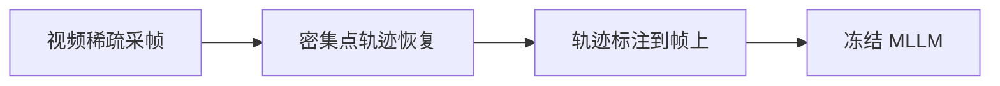
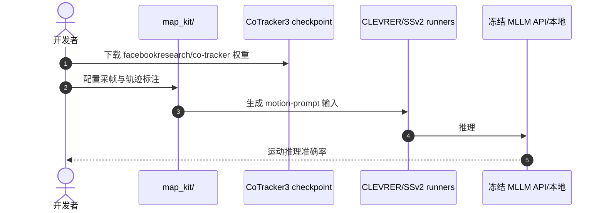

# Motion-as-Prompt：先把运动画给 MLLM 看

**Motion-as-Prompt（MaP）**（*Enhancing Motion Reasoning in Multimodal Large Language Models via Motion-Guided Cross-Frame Visual Prompting*；[arXiv:2608.11655](https://arxiv.org/abs/2608.11655)，[代码](https://github.com/SunVictor23/MaP)）是 **training-free** 框架：恢复密集点轨迹，选运动信息高的帧，把 **相邻采样帧间累积轨迹** 直接标注到视觉输入上。

## 一句话定义

**稀疏均匀采帧会丢掉帧间转移——不如把运动轨迹画进输入，让冻结 MLLM 看见位移与交互。**

## 英文缩写速查

| 缩写 | 英文全称 | 简要说明 |
|------|----------|----------|
| MaP | Motion-as-Prompt | 本文 visual prompting 框架 |
| MLLM | Multimodal Large Language Model | 冻结的多模态大模型 |
| SSv2 | Something-Something-v2 | 动作/运动理解 benchmark |
| CoT | Chain-of-Thought | 部分 MLLM 推理模式（非本文训练） |
| TR | Tracking | 点轨迹跟踪（如 CoTracker3） |

## 为什么重要

- **机器人视频推理依赖运动：** 操作与导航都要看 **转移、碰撞、因果**，不是静态识别。
- **不改权重：** 部署侧只需改输入管线，适合已有 GPT/Qwen 等 API/本地 MLLM。
- **非运动理解不损：** 摘要报告 SSv2/CLEVRER 涨点同时非运动任务不降。

## 核心信息

| 项 | 内容 |
|----|------|
| **出处** | arXiv:2608.11655（2026-08） |
| **依赖** | CoTracker3 轨迹；可选 Qwen3-VL-2B 本地 eval |
| **结果** | GPT-5.5 在 CLEVRER / SSv2 分别 **+4.2% / +8.9%** 运动推理（摘要） |
| **开源（截至 2026-08-19）** | **已开源** 框架；**无 MaP 训练权重** |

## 核心原理

## 源码运行时序图

官方仓 [SunVictor23/MaP](https://github.com/SunVictor23/MaP)：

- **最短复现：** 装依赖 + CoTracker3 → 跑 `map_kit` 标注 → 接 benchmark runner。

## 工程实践

| 项 | 建议 |
|----|------|
| 轨迹质量 | CoTracker3 失败时 MaP 增益会塌 |
| 算力 | 密集轨迹 + 多帧标注增加 prefill 成本 |
| 机器人栈 | 可与 [Hand Visibility](./paper-hand-visibility-detector.md) 等 **可靠性信号** 组合 |

## 结论

**MaP 证明视频运动推理可以先改输入证据，再考虑改模型。**

1. **Training-free** — 适合快速试验现有 MLLM。
2. **轨迹即 prompt** — 把隐藏转移显式化。
3. **依赖 tracker** — 系统瓶颈可能在 CoTracker，不在 MLLM。
4. **机器人侧待接** —  benchmark 以 CLEVRER/SSv2 为主，真机闭环需自行验证。

## 局限与风险

- 无专用权重，极端遮挡/运动模糊下 tracker 可能失效。
- API 模型（GPT-5.5）结果难完全复现。
- 标注帧数增加可能触达 MLLM 上下文/成本上限。

## 实验与评测

CLEVRER / Something-Something-v2 运动推理准确率提升；GPT-5.5 分别 **+4.2% / +8.9%**（摘要）；非运动理解不降。

## 与其他工作对比

相对 finetune MLLM：本文 **training-free**。相对更密采帧：本文用 **运动 prompt** 补转移信息而非加算力。

## 关联页面

- [世界模型与真实执行 10 篇技术地图](../overview/world-model-exec-10-papers-technology-map.md)
- [VLA](../methods/vla.md)
- [Hand Visibility Detector](./paper-hand-visibility-detector.md)
- [机器人感知栈选型](../queries/robot-perception-stack-selection-loop.md)

## 参考来源

- [MaP 论文摘录](../../sources/papers/motion_as_prompt_arxiv_2608_11655.md)
- [仓库归档](../../sources/repos/motion-as-prompt.md)
- [具身智能小站 10 篇盘点（2026-08-19）](../../sources/blogs/wechat_embodied_station_world_model_exec_10_papers_2026-08-19.md)

## 推荐继续阅读

- [MaP GitHub](https://github.com/SunVictor23/MaP)
- [arXiv:2608.11655](https://arxiv.org/abs/2608.11655)
- [CoTracker](https://github.com/facebookresearch/co-tracker)
