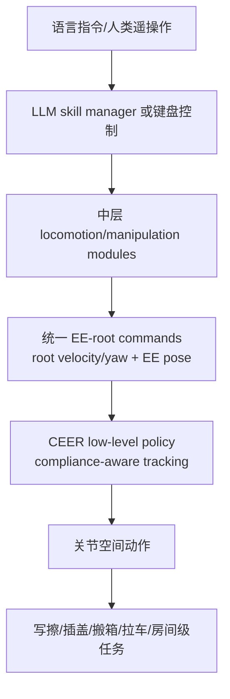

# CEER

**CEER**（*Compliant End-Effector and Root Control as a Unified Interface for Hierarchical Humanoid Loco-Manipulation*）把人形移动操作接口压缩为 **root motion commands + end-effector pose targets + compliance-aware low-level policy**，让 LLM skill manager、导航模块、操控模块和遥操作模块都能调用同一身体接口。

## 一句话定义

CEER 是一种 EE-root 任务空间控制抽象，用统一低层策略把根部移动与柔顺末端目标转成全身动作，从而支持可插拔的层级 loco-manip planners。

## 英文缩写速查

| 缩写 | 英文全称 | 简要说明 |
|------|----------|----------|
| CEER | Compliant End-Effector and Root Control | 本文提出的柔顺末端-根部统一接口 |
| EE | End-Effector | 末端执行器，CEER 中为高层主要操控目标 |
| LLM | Large Language Model | 高层 skill manager 可由语言模型驱动 |
| WBC | Whole-Body Control | CEER 底层策略承担的全身协调职责 |
| IK | Inverse Kinematics | 对比/中层模块常见末端目标求解方式 |
| DoF | Degree of Freedom | 键盘遥操作与 EE-root 命令均涉及控制自由度 |

## 为什么重要

- **把高层接口从关节空间中解放出来**：长时程家庭任务里，高层不应直接处理 20+ 关节轨迹；CEER 提供 root+EE 命令作为 planner-compatible API。
- **柔顺是接口能力而非单任务技巧**：写字、擦拭、插盖、搬箱、拉车都共用 CEER policy，而不是每个任务重新训练底层。
- **异构 planner 可插拔**：项目页展示 LLM skill manager、键盘遥操作、任务模块都能产生统一 EE-root 命令。
- **有明确系统级评测**：项目页报告 **3.3 cm** EE tracking accuracy、jerk 低于 baselines，房间级单物体模拟任务最高 **70%** 成功率。

## 流程总览

## 核心原理（详细）

### 1. EE-root 抽象

CEER 将高层控制自由度限制在根部运动与末端执行器目标。键盘遥操作示例中，`W/S/A/D` 控制平面基座速度，`Q/E` 控制 yaw，`I/K/J/L/U/O` 控制末端在三维空间移动；两只末端关于矢状面对称控制。这说明接口足够低维，可以人类实时操作，也能由 planner 输出。

### 2. Teacher-student 蒸馏

低层 CEER policy 不是从零学习每个任务，而是把 general motion-tracking controller 蒸馏成仅消费 EE-root commands 的策略。这样保留全身运动跟踪能力，同时让部署接口更符合任务规划。

### 3. 三层系统

- **高层**：语言指令解析、技能选择与组合。
- **中层**：可插拔 locomotion/manipulation modules，产生 EE-root commands。
- **低层**：统一 CEER policy 转换为关节动作并处理柔顺交互。

### 4. 房间级长时程任务

项目页在包含蓝床、黄桌、绿沙发的房间场景中评测四类任务：移动蓝盒到黄/红盒中间、移动到床、移动到沙发、先移动蓝盒再移动红盒。对照包括 LLM-controlled execution 与五名参与者键盘遥操作，任务总计 **40 trials**。

## 评测与结果

CEER 提供明确的**系统级评测**，同时覆盖末端跟踪质量与房间级长时程任务：

- **末端跟踪与柔顺**：项目页报告 **3.3 cm** end-effector tracking accuracy，且 jerk 低于 baselines，说明统一低层策略在保持跟踪精度的同时输出更平滑、更柔顺的动作。
- **真机技能演示**：Box-on-wall Rotate、Write and Wipe、Cap Insertion、Box Transport、Cart Pulling 等真机任务共用同一 CEER policy，验证 EE-root 接口对多类接触任务的复用性。
- **房间级长时程任务**：在含蓝床、黄桌、绿沙发的房间场景中评测四类单物体搬运任务，对照 LLM-controlled execution 与五名参与者键盘遥操作（共 **40 trials**，5 人 × 4 任务 × 2 次），模拟任务最高 **70%** 成功率。

> 指标说明：3.3 cm、70%、40 trials 均为项目页报告值，且长程评测使用 minimal skill set 与 single grasp primitive；本页不额外补充未在原文出现的数字。

## 源码运行时序图

**不适用**：官方项目页未列出 GitHub/可运行代码链接，仅提供项目页、arXiv 与视频/实验说明。截至 2026-07-22 不把页面静态资源视为可复现代码。

## 工程实践（含开源状态）

| 项 | 结论 |
|----|------|
| 项目页 | <https://robotproject8.github.io/ceer_page/> |
| 论文 | arXiv:2605.19981 |
| 代码 | 未在项目页列出官方 GitHub |
| 真机展示 | Box-on-wall Rotate、Write and Wipe、Cap Insertion、Box Transport、Cart Pulling |
| 系统评测 | 3.3 cm EE 跟踪精度；房间级模拟单物体任务最高 70% 成功率 |

## 与其他工作对比

CEER 的贡献是 loco-manip 的**接口抽象**，与同样重新定义高层/示范接口的 [Pro-HOI](./paper-loco-manip-161-074-pro-hoi.md)、[WT-UMI](./paper-loco-manip-07-wt-umi.md) 相邻但落点不同。下表为定性对照。

| 维度 | CEER | Pro-HOI | WT-UMI |
|------|------|---------|--------|
| 接口抽象 | root motion + EE pose + 柔顺参数 | root trajectory + 二值 contact state | 全身触觉图像 + 接触力 + 末端位姿 |
| 高层可插拔性 | LLM skill manager / 键盘 / 任务模块统一产 EE-root 命令 | TEB / task planner 产 root 轨迹 | force-supervised planner 产位姿+力块 |
| 柔顺/力处理 | compliance-aware 统一低层策略 | 接触状态仅二值，无显式柔顺 | tactile admittance 闭环柔顺修正 |
| 低层学习 | teacher-student 蒸馏出消费 EE-root 命令的统一 policy | PPO root-guided policy + digital twin 掉落恢复 | admittance controller + target-pose correction |
| 任务侧重 | 房间级长时程写擦/插盖/搬箱/拉车 | 箱子搬运 + 掉落 re-grasp | 笨重刚体/柔性/人机协作接触任务 |
| 开源 | 项目页未列 GitHub | 未确认官方可运行仓库 | Code Coming Soon |

## 局限与风险

- **接口表达力有限**：EE-root 命令适合许多双手/移动操作，但对灵巧手接触、复杂多点身体接触可能仍需更丰富表示。
- **高层成功依赖技能库**：项目页长程评测使用 minimal skill set 与 single grasp primitive；复杂任务仍需要中层模块扩展。
- **代码未开放**：目前不能直接复现 teacher-student 训练和 CEER policy。
- **从单物体到多物体/动态场景仍需验证**：房间任务关注系统连通性，真实多物体物理交互尚未充分覆盖。

## 关联页面

- [运动小脑 · G Loco-Manip 接口](../overview/motion-cerebellum-category-07-loco-manip-interface.md)
- [Loco-Manip 接触分类 02：接触表示](../overview/loco-manip-contact-category-02-contact-representation.md)
- [Whole-Body Control](../concepts/whole-body-control.md)
- [Loco-Manipulation](../tasks/loco-manipulation.md)
- [Pro-HOI](./paper-loco-manip-161-074-pro-hoi.md)
- [WT-UMI](./paper-loco-manip-07-wt-umi.md)

## 参考来源

- [motion_cerebellum_survey_47_ceer.md](../../sources/papers/motion_cerebellum_survey_47_ceer.md)
- [motion_cerebellum_64_catalog.md](../../sources/papers/motion_cerebellum_64_catalog.md)
- [wechat_embodied_ai_lab_humanoid_motion_cerebellum_survey.md](../../sources/blogs/wechat_embodied_ai_lab_humanoid_motion_cerebellum_survey.md)
- [motion-cerebellum-category-07-loco-manip-interface](../overview/motion-cerebellum-category-07-loco-manip-interface.md)
- [loco-manip-contact-category-02-contact-representation](../overview/loco-manip-contact-category-02-contact-representation.md)
- [wechat_embodied_ai_lab_loco_manip_contact_survey.md](../../sources/blogs/wechat_embodied_ai_lab_loco_manip_contact_survey.md)
- 官方项目页：<https://robotproject8.github.io/ceer_page/>
- arXiv: <https://arxiv.org/abs/2605.19981>

## 推荐继续阅读

- [CEER 项目页](https://robotproject8.github.io/ceer_page/)
- [Whole-Body Control](../concepts/whole-body-control.md)
- [Loco-Manip 接触技术地图](../overview/loco-manip-contact-technology-map.md)
