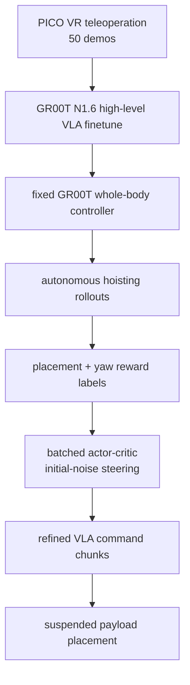

# HOIST

**HOIST**（*Humanoid Optimization with Imitation and Sample-efficient Tuning for Manipulating Suspended Loads*）把工地/物流中「人扶悬挂重物定位」抽象为人形机器人任务：机器人不能直接驱动吊装机构，只能靠身体移动、双手接触和停止时机影响一个欠驱动摆动物体。

## 一句话定义

HOIST 用 VR 示范初始化高层 VLA，再用少量自主 rollout 的离线 actor-critic 微调命令噪声，让人形机器人更准地定位悬挂负载并减少残余摆动。

## 英文缩写速查

| 缩写 | 英文全称 | 简要说明 |
|------|----------|----------|
| HOIST | Humanoid Optimization with Imitation and Sample-efficient Tuning | 本文方法名 |
| VLA | Vision-Language-Action | 高层策略基于 GR00T N1.6 改造 |
| VR | Virtual Reality | 示范采集接口 |
| RL | Reinforcement Learning | 使用 batched rollout refinement 优化闭环误差 |
| WBC | Whole-Body Control | 固定 GR00T whole-body execution stack |
| IMU | Inertial Measurement Unit | 用于分析悬挂负载残余运动 |

## 为什么重要

- **对象是欠驱动的**：悬挂负载像摆，机器人只能间接施力，停止后物体仍会摆动/过冲。
- **模拟真实安全需求**：施工吊装最终定位常由人站在负载旁手扶，存在 struck-by/caught-between 风险。
- **示范不够，闭环偏差要优化**：额外 30 条示范不如 30 条自主 rollout + RL refinement 有效，因为后者直接看部署分布误差。
- **保持低层控制固定**：不改 whole-body controller，只优化高层命令，让方法更像「任务层后训练」。

## 流程总览

## 核心原理（详细）

### 1. 高层命令空间

策略输入包括 ego RGB、ego depth、side RGB、机器人本体、语言指令、上一导航命令；输出未来 action chunk 的 planner-command increments：head target、left/right hand targets、navigation command、base height。低层 WBC 将这些命令转成电机动作。

### 2. 监督微调

VLA-50 使用 **50 条** VR 示范，VLA-80 使用 **80 条**。监督学习负责给出安全的 approach-contact-push-stop 初始行为，但不能直接最小化最终摆动和定位误差。

### 3. Batched RL refinement

HOIST 冻结 VLA 本身，只学习 flow-matching action expert 的 initial-noise steering actor-critic。每轮收集少量自主 rollout，按最终 `Δx, Δy, Δψ` 标注 reward，再做离线更新。这样可复用冻结 VLM features，样本效率较高。

### 4. 指标与结果

主指标是 payload 终端 `Δx, Δy, Δψ` 和 Manhattan error。摘要给出相对 pure VLA rollouts，HOIST translational placement error 降低 **19.9 cm**、raw angular error 降低 **3.56°**。

## 关键实验数字

| Domain | Method | Demos | RL rollouts | `|Δx|+|Δy|` |
|--------|--------|-------|-------------|-----------|
| Simulation | VLA-50 | 50 | 0 | 22.44 cm |
| Simulation | VLA-80 | 80 | 0 | 18.58 cm |
| Simulation | HOIST | 50 | 30 | **6.25 cm** |
| Real platform | VLA-50 | 50 | 0 | 9.28 cm |
| Real platform | VLA-80 | 80 | 0 | 8.57 cm |
| Real platform | HOIST | 50 | 30 | **6.38 cm** |

## 源码运行时序图

**不适用**：arXiv 页面未列出官方代码仓库；论文引用 GR00T Whole-Body Control 仓库作为低层执行栈，但 HOIST 自身训练/rollout refinement 未确认开源。

## 工程实践（含开源状态）

| 项 | 结论 |
|----|------|
| 论文 | <https://arxiv.org/abs/2606.00252> |
| 代码 | 未确认 HOIST 官方可运行代码 |
| 示范 | PICO VR headset/controllers；50/80 demos 对比 |
| 低层 | 固定 GR00T Whole-Body Control stack |
| 观测 | ego RGB-D + side RGB + proprioception + language + nav history |

## 与其他工作对比

HOIST 面向**欠驱动悬挂负载**的间接定位，与同库的强接触/受力工作 [FALCON](./paper-loco-manip-161-109-falcon.md)、[Thor](./paper-hrl-stack-42-thor.md)、[CHIP](./paper-hrl-stack-36-chip.md) 在「接触/力」议题上相邻，但对象与控制层次都不同。下表为定性对照。

| 维度 | HOIST | FALCON | Thor | CHIP |
|------|-------|--------|------|------|
| 交互对象 | 欠驱动悬挂摆动负载（间接施力/定位） | 主动施力的车/门/重物 | 强接触环境的反作用力 | 接触物体的柔顺跟踪 |
| 控制层次 | 高层 VLA + 固定 WBC，只后训练高层命令 | 双 agent RL 全身策略 | 分体 RL 全身策略 | motion tracking + 可调末端柔顺 |
| 关键手段 | 50 demos SFT + 30 rollout batched actor-critic（initial-noise steering） | torque-limit-aware 3D force curriculum | FAT2 力自适应躯干倾斜 | hindsight perturbation |
| 力/接触角色 | 停止时机与残余摆动，间接影响负载 | 持续主动外力 | 峰值大力发力 | 可调末端刚度 |
| 目标指标 | 负载终端 Δx/Δy/Δψ 定位误差 | 力范围 + 上肢跟踪精度 | 拉力（N） | 任务成功率 |
| 开源 | 未确认官方可运行代码 | MIT 全链路 | 代码 Coming Soon | 代码 Coming Soon |

## 局限与风险

- **低层不会自适应负载力**：论文承认 WBC 未针对悬挂负载微调，接口无法显式适配不同重量。
- **依赖 side-view 图像**：真实工地可能难布置外部视角。
- **奖励简单**：当前用位置/yaw 误差，不含显式安全约束；未来需加入人机安全边界。
- **任务窄但重要**：专注悬挂负载，不是通用 manipulation。

## 关联页面

- [运动小脑 · H 真实任务](../overview/motion-cerebellum-category-08-real-tasks.md)
- [Loco-Manip 接触分类 04：接触后如何稳住](../overview/loco-manip-contact-category-04-post-contact-stability.md)
- [VLA](../methods/vla.md)
- [FALCON](./paper-loco-manip-161-109-falcon.md)
- [CHIP](./paper-hrl-stack-36-chip.md)
- [Thor](./paper-hrl-stack-42-thor.md)

## 参考来源

- [motion_cerebellum_survey_53_hoist.md](../../sources/papers/motion_cerebellum_survey_53_hoist.md)
- [motion_cerebellum_64_catalog.md](../../sources/papers/motion_cerebellum_64_catalog.md)
- [wechat_embodied_ai_lab_humanoid_motion_cerebellum_survey.md](../../sources/blogs/wechat_embodied_ai_lab_humanoid_motion_cerebellum_survey.md)
- [motion-cerebellum-category-08-real-tasks](../overview/motion-cerebellum-category-08-real-tasks.md)
- [loco-manip-contact-category-04-post-contact-stability](../overview/loco-manip-contact-category-04-post-contact-stability.md)
- [wechat_embodied_ai_lab_loco_manip_contact_survey.md](../../sources/blogs/wechat_embodied_ai_lab_loco_manip_contact_survey.md)
- Liu et al., *HOIST: Humanoid Optimization with Imitation and Sample-efficient Tuning for Manipulating Suspended Loads*, arXiv:2606.00252, 2026. <https://arxiv.org/abs/2606.00252>

## 推荐继续阅读

- [HOIST arXiv HTML](https://arxiv.org/html/2606.00252)
- [GR00T Whole-Body Control](https://github.com/NVlabs/GR00T-WholeBodyControl)
- [安全强化学习综述](https://jmlr.org/papers/v16/garcia15a.html)
