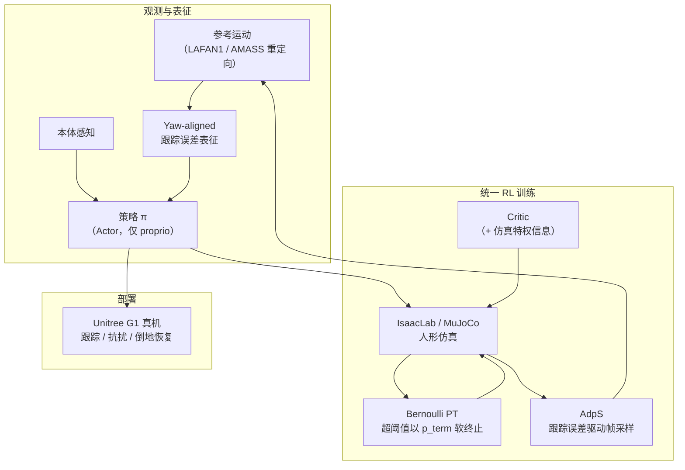

---

type: entity
tags: [paper, motion-cerebellum-survey, humanoid, motion-control, fall-recovery, reinforcement-learning, unitree]
status: complete
updated: 2026-07-16
venue: arXiv:2606.12814
summary: "Stubborn（SUSTech ACT Lab）用单一 RL 策略统一鲁棒全身运动跟踪与跌倒恢复：yaw-aligned 跟踪表征、Bernoulli 概率终止（PT）与跟踪误差驱动自适应采样（AdpS），在 LAFAN1 全库与 Unitree G1 真机上验证。"
related:
  - ../overview/humanoid-motion-cerebellum-technology-map.md
  - ../overview/motion-cerebellum-category-04-wbt-base.md
  - ../methods/any2track.md
  - ../entities/holomotion.md
  - ../methods/beyondmimic.md
  - ../entities/paper-hrl-stack-14-robust_and_generalized_humanoid_moti.md
  - ../entities/paper-unified-walk-run-recovery-sdamp.md
  - ../entities/lafan1-dataset.md
  - ../entities/unitree-g1.md
  - ../methods/reinforcement-learning.md
  - ../concepts/whole-body-control.md
sources:
  - ../../sources/papers/stubborn_arxiv_2606_12814.md
  - ../../sources/papers/motion_cerebellum_survey_34_stubborn.md
  - ../../sources/blogs/wechat_embodied_ai_lab_humanoid_motion_cerebellum_survey.md
  - ../../sources/papers/motion_cerebellum_64_catalog.md
---

# Stubborn

**Stubborn**（*A Streamlined and Unified Reinforcement Learning Framework for Robust Motion Tracking and Fall Recovery for Humanoids*，[arXiv:2606.12814](https://arxiv.org/abs/2606.12814)）是 **南方科技大学 ACT Lab**（Xiao Ren、Yuhui Yang 等）提出的 **人形全身运动跟踪 + 跌倒恢复** 统一 RL 框架：用 **单一策略、单阶段训练** 替代常见的 **多阶段跟踪/恢复拆分** 与 **硬 episode 终止**，在 **完整 LAFAN1** 与 **29-DoF Unitree G1** 真机上验证跟踪精度、抗扰与倒地恢复。项目页：[aislab-sustech.github.io/Stubborn](https://aislab-sustech.github.io/Stubborn/)。

## 英文缩写速查

| 缩写 | 英文全称 | 简要说明 |
|------|----------|----------|
| PT | Probabilistic Termination | 跟踪超阈值后以 Bernoulli 概率软终止，为恢复探索留窗 |
| AdpS | Adaptive Sampling | 由段内平均跟踪误差驱动的参考帧重采样策略 |
| RL | Reinforcement Learning | 通过与环境交互学习策略的范式 |
| WBC | Whole-Body Control | 协调全身关节满足多任务/约束的控制层 |
| MPBPE | Mean Per-Body Position Error | 根相对全身位置跟踪误差（论文报告 mm 量级） |
| MPJPE | Mean Per-Joint Position Error | 关节位置跟踪误差 |
| MPJVE | Mean Per-Joint Velocity Error | 关节速度跟踪误差 |

## 为什么重要

- 在 [运动小脑 64 篇技术地图](../overview/humanoid-motion-cerebellum-technology-map.md) 中归类为 **D 全身跟踪基座**（34/64）：**把跟踪与跌倒恢复放进统一 RL**，而非独立状态机或专用恢复控制器。
- **问题切口清晰：** 多数 RL 跟踪在严重失败时 **立即终止 episode**，策略学不到倒地后的恢复；社区常靠 **恢复专用奖励、多阶段训练或独立恢复策略**（如 [HoST](./paper-host-humanoid-standingup.md)、[SD-AMP](./paper-unified-walk-run-recovery-sdamp.md) 的分判别器路线）——Stubborn 主张 **跟踪失败本身是进入倒地流形的自然入口**，应在 **同一策略** 内联合探索。
- **工程可部署：** 非对称 Actor-Critic（策略仅本体感知、Critic 用仿真特权信息）+ **yaw-aligned 表征** 减轻全局漂移下的过度纠偏；真机 G1 演示含 **翻转/杂技** 类高动态跟踪与 **跟踪中恢复**。
- **与 SOTA 跟踪栈对照阅读：** 对比 [HoloMotion](./holomotion.md)、[Any2Track](../methods/any2track.md)、[BFM-Zero](./paper-behavior-foundation-model-humanoid.md) 与 BeyondMimic 式 From-scratch multi-motion RL，Stubborn 在 **LAFAN1 全库** 上取得更低 MPBPE/MPJPE/MPJVE，同时 PT 消融显示 **5 m/s 强扰动下 100% 恢复成功率**。

## 核心机制（提炼）

1. **Yaw-aligned 跟踪表征：** 在 **yaw 对齐根坐标系** 下编码身体相对位姿误差，削弱 **全局平移/航向漂移** 敏感度，保留 **俯仰/横滚** 等与平衡相关的重力信息；根部仍保留世界系位姿供控制。
2. **Bernoulli 概率终止（PT）：** 当根部高度或姿态误差超阈值（实验 $\theta_{pos}=0.25$ m、$\theta_{quat}=\pi/2$）时，以概率 $p_{term}=0.005$ **软终止**而非硬截断——期望额外存活 **200 步**（50 Hz × 4 s），为倒地恢复提供探索窗口并缓解 time-limit 截断带来的 value bias。
3. **跟踪误差驱动自适应采样（AdpS）：** PT 下终止统计不再可靠反映片段难度；用 episode 内 **平均关键点跟踪误差** $\bar{e}$ 在线更新参考轨迹各帧采样权重——难段增权、已成功段衰减（$\theta_{success}=0.06$），与 [BeyondMimic](../methods/beyondmimic.md) 类自适应采样互补但 **显式面向 PT 场景**。
4. **训练与部署：** 非对称 Actor-Critic；仿真 **IsaacLab/MuJoCo**，数据 **LAFAN1**（跟踪评测）+ **AMASS 重定向**（真机演示）；**29-DoF Unitree G1** 闭环部署。

## 流程总览

## 实验与评测（摘要）

| 维度 | 设置 | 主要结论 |
|------|------|----------|
| **跟踪（LAFAN1 全库）** | vs HoloMotion、Any2Track、BFM-Zero、From-scratch RL | MPBPE **48.85** mm（最优）、MPJPE **113.38**、MPJVE **624.03**；$\Delta$acc **17.09**（接近 BFM-Zero 且位置/速度误差更低） |
| **PT 消融** | 5 m/s 外力扰动；恢复阈值 0.15 m / 0.25 m | **Ours 100%** 恢复成功率；w/o PT **77.5% / 85.0%**；含 PT 时恢复步数更少、训练更稳 |
| **AdpS 消融** | 固定其他模块 | MPJPE 120.7→**119.4**、MPJVE 548.5→**541.5**、$\Delta$acc 14.50→**14.42** |
| **真机** | 29-DoF G1；LAFAN1 + AMASS 动作 | 高动态跟踪（含翻转/杂技）、扰动恢复、**跟踪过程中倒地再起** |

## 常见误区或局限

- **不是「无恢复奖励」的魔法：** PT 提供探索窗口，但跟踪奖励与稳定性项仍主导学习；论文强调 **无需额外 recovery-specific reward 设计**，并非完全无奖励塑形。
- **与专用起身工作的分工：** [HoST](./paper-host-humanoid-standingup.md)、[HumanUP](https://arxiv.org/abs/2502.12152) 等聚焦 **多姿态站起**；Stubborn 侧重 **跟踪被打断后的在线恢复并回到参考轨迹**，动作风格与极限倒地场景可能不如专用恢复栈激进。
- **代码尚未公开：** 项目页标注 Code Coming Soon；复现细节以 arXiv 附录表格为准。
- **未来工作（作者自述）：** 严重跌倒后恢复的 **敏捷性与平滑性**、更复杂地形与更高动态行为。

## 与其他页面的关系

- 分类 hub：[运动小脑 D 组 · 全身跟踪基座](../overview/motion-cerebellum-category-04-wbt-base.md)
- 鲁棒跟踪姊妹篇：[RGMT](./paper-hrl-stack-14-robust_and_generalized_humanoid_moti.md)、[Any2Track](../methods/any2track.md)
- 统一「走/跑/起身」对照：[SD-AMP](./paper-unified-walk-run-recovery-sdamp.md)
- 规模化跟踪基线：[HoloMotion](./holomotion.md)、[BeyondMimic](../methods/beyondmimic.md)
- 数据与平台：[LaFAN1](./lafan1-dataset.md)、[Unitree G1](./unitree-g1.md)

## 推荐继续阅读

- [Stubborn 项目页](https://aislab-sustech.github.io/Stubborn/)
- [arXiv:2606.12814](https://arxiv.org/abs/2606.12814)
- [具身智能研究室 · 运动小脑 64 篇（微信公众号）](https://mp.weixin.qq.com/s/Kx9myecE1Z0eGqOapoqQnA)
- [Any2Track — Track any motions under any disturbances](https://arxiv.org/abs/2509.13833)

## 参考来源

- [stubborn_arxiv_2606_12814.md](../../sources/papers/stubborn_arxiv_2606_12814.md) — arXiv 深读策展
- [motion_cerebellum_survey_34_stubborn.md](../../sources/papers/motion_cerebellum_survey_34_stubborn.md) — 运动小脑 34/64 索引
- [motion_cerebellum_64_catalog.md](../../sources/papers/motion_cerebellum_64_catalog.md) — 64 篇总表
- [wechat_embodied_ai_lab_humanoid_motion_cerebellum_survey.md](../../sources/blogs/wechat_embodied_ai_lab_humanoid_motion_cerebellum_survey.md) — 微信公众号编译导读
