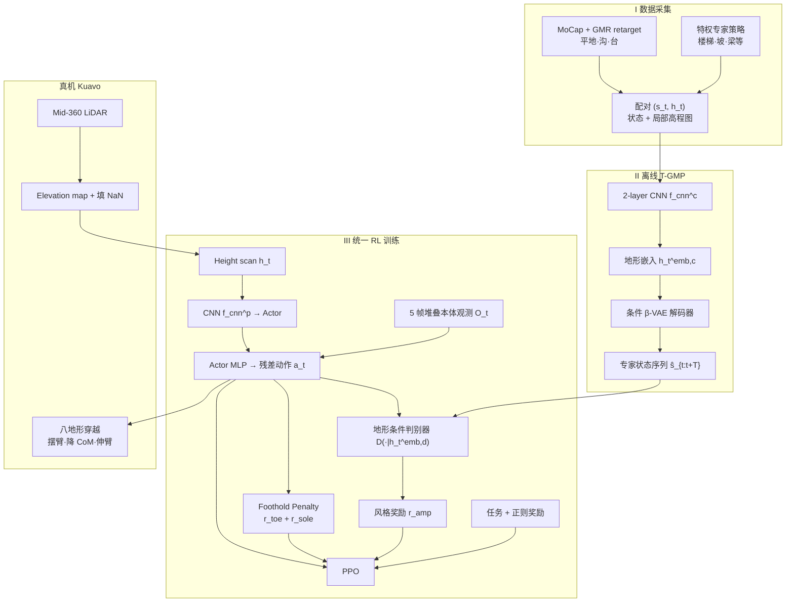

# T-GMP：地形条件生成式运动先验的人形多地形行走

**T-GMP**（*Terrain-conditioned Generative Motion Priors for Versatile and Natural Humanoid Locomotion*，[arXiv:2606.06944](https://arxiv.org/abs/2606.06944)，2026；[项目页](https://t-gmp.github.io)）由 **Junhong Guo**、**Hao Hu** 等（哈尔滨工业大学 × 乐聚机器人）提出。论文同时收录于 [运动小脑 64 篇](https://mp.weixin.qq.com/s/Kx9myecE1Z0eGqOapoqQnA) **#02/64（A 走路底座）**。核心命题：**运动先验不应是固定模板，而应是随局部地形变化的生成式流形**——用少量专家状态–高程示范即可学到摆臂、降质心、伸臂平衡等全身协调策略。

## 一句话定义

**离线用条件 CVAE 学地形嵌入上的专家运动流形（T-GMP），在线用地形条件 AMP 判别器把风格约束注入 PPO，并用 Foothold Penalty 管住落脚质量，在单一策略内兼顾八类地形的穿越率与仿生自然性。**

## 英文缩写速查

| 缩写 | 英文全称 | 简要说明 |
|------|----------|----------|
| T-GMP | Terrain-conditioned Generative Motion Priors | 本文核心模块：地形条件生成式运动先验 |
| CVAE | Conditional Variational Autoencoder | 以高程图为条件学习专家状态序列分布 |
| AMP | Adversarial Motion Prior | 对抗判别约束策略转移接近专家运动 |
| RL | Reinforcement Learning | 本文用 PPO 训练统一 locomotion 策略 |
| PPO | Proximal Policy Optimization | on-policy 策略优化（Isaac Lab） |
| CoM | Center of Mass | 质心；楼梯/坡道策略性降低以稳态 |
| GMR | General Motion Retargeting | MoCap 人形动作重定向到机器人（Araujo et al.） |
| HIT | Harbin Institute of Technology | 哈尔滨工业大学 |
| DoF | Degrees of Freedom | Kuavo 全身 **28** 自由度 |

## 为什么重要

- **生成先验 × 地形感知：** 相对 [GMP](./paper-amp-survey-06-natural_humanoid_robot_locomotion_wi.md) 的**冻结平地走跑 CVAE**，T-GMP 把条件变量扩展到 **局部高程图**，并与 **AMP 共训**而非仅稠密轨迹奖励；相对 [TRAMP](./paper-tramp-vision-assisted-bipedal-locomotion.md) 的**双地形判别式 AMP**，走 **CVAE 流形 + 在线合成专家转移** 路线。
- **全身协调而非下肢专精：** 论文强调人形应调动手臂与躯干——平地摆臂、楼梯/坡降 CoM、沟/窄梁伸臂平衡；与「只盯落脚 scheduling」的感知足式文献形成对照。
- **数据效率锚点：** 仅 **~29.6 min（88.8k 帧）** 专家数据覆盖 **8 地形** 流形，说明 **地形条件生成先验** 可缓解多地形示范收集成本。
- **工程平台：** 在乐聚 **Kuavo** 全尺寸真机（LiDAR 高程图 + 双机计算架构）闭环，为 [乐聚机器人](./leju-robotics.md) 运动控制研究线提供可引用基准。

## 核心信息

| 项 | 内容 |
|----|------|
| **机构** | 哈尔滨工业大学（HIT）；乐聚机器人（Leju Robotics） |
| **作者** | Junhong Guo、Hao Hu、Chen Chen、Haoxuan Han、Linao Gong、Xin Yang、Zhicheng He、Yao Su、Fenghua He |
| **发表** | arXiv:2606.06944（2026 preprint） |
| **平台** | **Kuavo** 1.66 m / ~55 kg / 28 DoF；头载 Mid-360 LiDAR |
| **仿真** | Isaac Lab；2048 并行 env；单卡 RTX 4090；PPO（Table 3 超参） |
| **感知** | 前方 **9×7 height scan**（局部 0.8 m×0.6 m 高程 patch）；真机由点云 elevation mapping 采样 |
| **专家数据** | 特权策略（楼梯/坡/梁等）+ MoCap/GMR（平地/沟/台）；合计 **88.8k 帧** |
| **验证地形** | Gap、Beam、Stage、上/下楼梯、上/下坡、平地（共 8 类） |
| **开源** | **确认未开源**（2026-08-24）：[项目页 404](../../sources/sites/t-gmp.md)；无官方 GitHub |

## 流程总览

## 核心原理（归纳）

### 1）地形条件生成式先验（T-GMP）

- 专家状态 $s_t=[q_t,\dot{q}_t,p_t]$（关节位速 + 相对根坐标系末端位姿）与同步局部高程图 $h_t$ 构成数据集 $\mathcal{D}$。
- **条件 β-VAE：** CNN 提取 $h_t^{\mathrm{emb},c}$，解码器 $\hat{s}_{t:t+T}=\mathrm{Decoder}(z_t,h_t^{\mathrm{emb},c})$；损失为重建 MSE + $\beta\cdot\mathrm{KL}$。
- **部署一致性：** 推理仅用**当前单帧** $h_t$ 条件解码；缩短重建 horizon $T$ 抑制长程误差累积。

### 2）地形条件 AMP 判别器

- 五层 CNN $f_{\mathrm{cnn}}^d$ 提取 $h_t^{\mathrm{emb},d}$；判别器 $D(s_k,s_{k+1}|h_t^{\mathrm{emb},d})$ 用 WGAN-GP 式目标训练。
- 专家转移由 **T-GMP 解码器在线生成** 再随机采样；策略转移来自 rollout。
- 风格奖励 $r_{\mathrm{amp}}=\max[0,1-(D(s_t^\pi,s_{t+1}^\pi)-1)^2/4]$，避免多地形风格在标准 AMP 中塌缩为不可分行为。

### 3）Foothold Penalty

- **趾端：** $r_{\mathrm{toe}}$ 惩罚 $d_{\mathrm{toe}}$ 低于阈值（抑制上楼踢沿）。
- **足底：** $r_{\mathrm{sole}}$ 在接触时惩罚足底悬空过大（抑制下楼边缘支撑与打滑）。

### 4）策略与奖励

- Actor 输入：速度命令 + height scan + 5 帧堆叠 $[\omega_t,g_t,q_t,\dot{q}_t,a_{t-1}]$；Critic 额外用线速度、力矩、接触力等特权项（训练期 only）。
- 控制：PD 力矩 $\tau=K_p(q^*-q)-K_d\dot{q}$，$q^*=q_0+a$（残差动作）。
- 总奖励 $r=w_1 r_{\mathrm{task}}+w_2 r_{\mathrm{reg}}+w_3 r_{\mathrm{amp}}+w_4 r_{\mathrm{foothold}}$；风格项减轻手工调参敏感度。

## 源码运行时序图

**不适用**（截至 2026-08-24）：[项目页](https://t-gmp.github.io) 返回 GitHub Pages 404，未发现含训练/推理/部署入口的官方仓库；见 [sources/sites/t-gmp.md](../../sources/sites/t-gmp.md)。

## 实验与评测

### 运动风格分布（t-SNE，700-step × 8 地形）

- **Ours：** 各地形簇内紧凑、簇间可分。
- **w/o Condition：** 判别器难以分离多地形风格。
- **w/o CVAE：** 流形缺失，跨地形自适应减弱。

### 运动平滑度（全身均值）

| 方法 | 关节力矩 (N·m) | 关节加速度 (rad/s²) |
|------|---------------:|--------------------:|
| Baseline RL | — | — |
| **Ours** | **178.97** | **434.72** |
| 相对 Baseline 降幅 | **−30.01%** | **−38.20%** |

### 单次穿越成功率（%，Table 1 节选）

| 地形 | Baseline RL | **Ours** | w/o Condition | w/o CVAE | w/o Foothold |
|------|------------:|---------:|--------------:|---------:|-------------:|
| Gap | 92.97 | **98.83** | 96.88 | 97.27 | 98.05 |
| Beam | 79.69 | **96.88** | 81.41 | 78.52 | 94.14 |
| Stair Descent | 85.55 | **93.75** | 82.42 | 84.38 | 85.94 |
| Slope Descent | 95.31 | **100.00** | 97.66 | 97.66 | 98.83 |

- **梁穿越** 平均提升 **+17.01 pp**（伸臂平衡）；**下楼** 平均 **+9.18 pp**（降 CoM + Foothold）。

### 真机部署

- 地形：0.3 m 台、台阶 0.13 m/0.28 m、15° 坡、0.4 m 沟、0.35 m 梁等。
- 行为：与专家分布一致的摆臂、降质心、伸臂；双计算架构（Orin-NX 感知 + i9-13900 控制）。

## 结论

**地形条件生成流形 + 地形条件 AMP 是把「自然」和「能走过去」绑在同一套约束里的实用组合，Foothold Penalty 负责补上落脚几何这一环。**

1. **条件化是关键** — 固定先验会在复杂地形上惩罚必要偏离；$h_t$ 嵌入同时进入 CVAE 与判别器，t-SNE 显示各地形风格可分。
2. **CVAE 负责「有什么风格」** — w/o CVAE .beam 成功率跌至 **78.52%**；在线解码器为判别器供给多样专家转移，比静态数据集采样更贴地形。
3. **Foothold 负责「站得住」** — 下楼 w/o Foothold 仅 **85.94%** vs Ours **93.75%**；趾/足底射线距离显式约束接触质量。
4. **数据量可很小** — **88.8k 帧** 覆盖八地形，适合作为「少示范 + 生成先验」的工程参考，但仍依赖特权专家与 MoCap 两路数据工程。
5. **感知栈是 LiDAR 高程图** — 与深度图单阶段方法（TRAMP 等）选型不同；论文亦承认 LiDAR 噪声与更新率限制，未来拟融合深度。
6. **复现入口未开放** — 项目页 404、无官方代码；读者应直接读 arXiv PDF，勿假设 Isaac Lab 配置可下载。

## 局限与风险

- **专家数据自然性：** 特权策略轨迹物理可行但欠仿生；MoCap 难与高程图严格时间对齐（论文 Limitations §7）。
- **项目页不可用：** 视频与补充材料暂无法从 <https://t-gmp.github.io> 获取（2026-08-24 核查）。
- **仿真–真机：** 高程图由点云重建，存在空洞填充与延迟；与纯本体策略比部署复杂度高。
- **未开源：** 无训练脚本、权重或 Kuavo 部署包。

## 常见误区

1. **T-GMP ≠ 浙大 GMP（arXiv:2503.09015）** — 后者冻结 CVAE 参考轨迹 + guidance reward、NAVIAI 平台；T-GMP 强调 **地形条件 + AMP 共训 + Kuavo 多地形**。
2. **不是纯模仿跟踪** — 先验经对抗蒸馏进 RL，策略可偏离单条参考以满足平衡与穿越。
3. **运动小脑条目 ≠ 任务规划** — 解决身体层 locomotion，不替代 VLA/导航高层。

## 与其他页面的关系

- 技术地图：[humanoid-motion-cerebellum-technology-map.md](../overview/humanoid-motion-cerebellum-technology-map.md)
- 分类 hub：[motion-cerebellum-category-01-locomotion-base.md](../overview/motion-cerebellum-category-01-locomotion-base.md)
- AMP 谱系：[amp-reward.md](../methods/amp-reward.md)、[humanoid-amp-motion-prior-survey.md](../overview/humanoid-amp-motion-prior-survey.md)
- 对照实体：[GMP #06](./paper-amp-survey-06-natural_humanoid_robot_locomotion_wi.md)、[MoRE #08](./paper-amp-survey-08-more.md)、[TRAMP](./paper-tramp-vision-assisted-bipedal-locomotion.md)
- 机构/平台：[乐聚机器人](./leju-robotics.md)

## 参考来源

- [T-GMP 论文归档（arXiv:2606.06944）](../../sources/papers/t_gmp_terrain_conditioned_generative_motion_priors_arxiv_2606_06944.md)
- [运动小脑策展索引 #02/64](../../sources/papers/motion_cerebellum_survey_02_t_gmp.md)
- [t-gmp.github.io 项目页核查](../../sources/sites/t-gmp.md)
- [运动小脑 64 篇微信公众号编译](../../sources/blogs/wechat_embodied_ai_lab_humanoid_motion_cerebellum_survey.md)

## 推荐继续阅读

- [arXiv 摘要与 PDF](https://arxiv.org/abs/2606.06944)
- [项目页](https://t-gmp.github.io)（若恢复可补视频）
- [GMP — Natural Humanoid Locomotion with Generative Motion Prior](./paper-amp-survey-06-natural_humanoid_robot_locomotion_wi.md) — 生成先验平地对照
- [TRAMP — 地形相关 AMP 单阶段视觉双足](./paper-tramp-vision-assisted-bipedal-locomotion.md) — 判别式双示范对照
