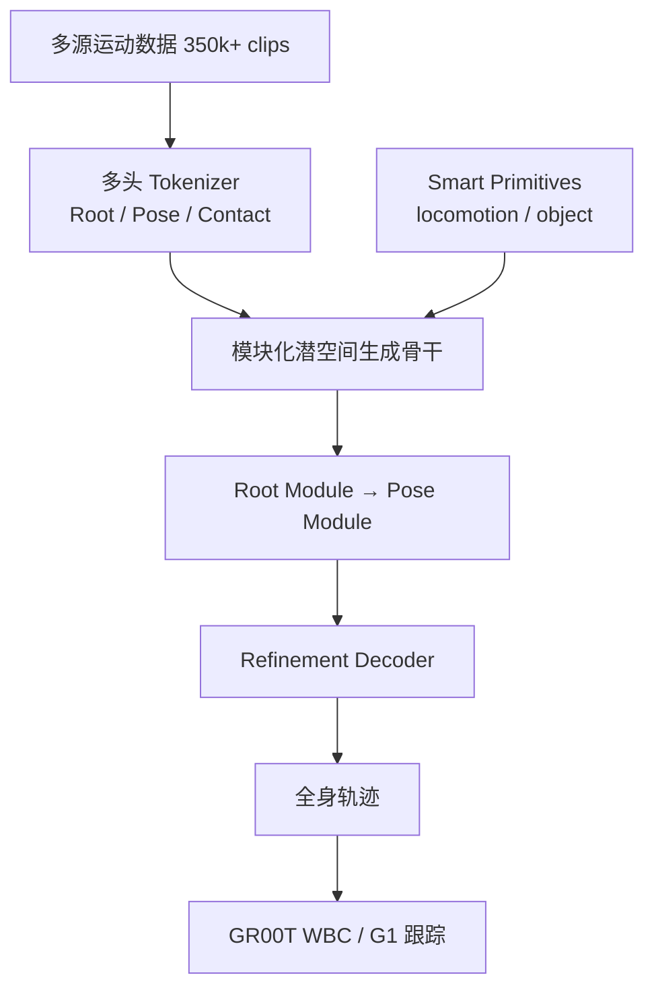
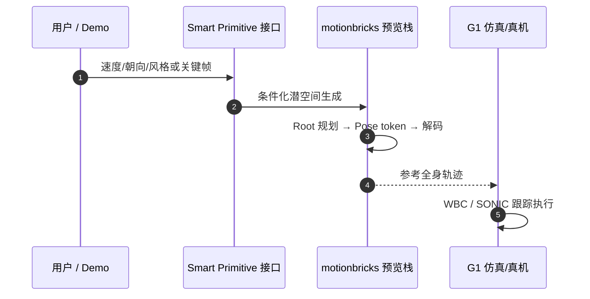

# MotionBricks：模块化潜空间实时运动生成

**MotionBricks**（*Scalable Real-Time Motions with Modular Latent Generative Model and Smart Primitives*，[arXiv:2604.24833](https://arxiv.org/abs/2604.24833)，[项目页](https://nvlabs.github.io/motionbricks/)，**ACM TOG · SIGGRAPH 2026**，NVIDIA Research）提出 **大规模实时生成式运动框架**：单一神经网络骨干在 **350,000+** 运动片段上建模，报告 **~15,000 FPS / ~2 ms** 延迟，并通过 **Smart Primitives** 为零样本组合导航与物体交互提供统一接口；已嵌入 **GR00T Whole-Body Control** 作为运动意图层。

## 一句话定义

**用模块化潜空间骨干 + Smart Primitives 把「速度/风格/关键帧式意图」实时变成可执行全身轨迹，取代脆弱动画图与单体式大 Transformer。**

## 英文缩写速查

| 缩写 | 英文全称 | 简要说明 |
|------|----------|----------|
| VQ | Vector Quantization | 运动离散 token；与 FSQ 等用于多头 tokenizer |
| WBC | Whole-Body Control | GR00T 全身控制栈；MotionBricks 为其供给参考轨迹 |
| G1 | Unitree G1 Humanoid | 论文与预览 Demo 的机器人验证平台 |
| UE5 | Unreal Engine 5 | 项目页 2:40 无剪辑游戏级演示环境 |
| AMP | Adversarial Motion Prior | 判别式运动先验；MotionBricks 代表生成式演进 |
| FPS | Frames Per Second | 论文报告单卡 ~15k 生成吞吐 |
| TOG | ACM Transactions on Graphics | SIGGRAPH 2026 发表期刊 |

## 核心信息

| 字段 | 内容 |
|------|------|
| **机构** | NVIDIA Research（ETH Zürich、SFU、UT Austin 等合作） |
| **arXiv** | [2604.24833](https://arxiv.org/abs/2604.24833) |
| **会议** | SIGGRAPH 2026 / ACM TOG |
| **规模** | 350k+ clips；单骨干 |
| **性能** | ~15,000 FPS；~2 ms latency（论文/项目页） |
| **开源（截至 2026-09-15）** | **部分开源** — [GR00T-WholeBodyControl/motionbricks](https://github.com/NVlabs/GR00T-WholeBodyControl/tree/main/motionbricks) 预览（G1 交互 Demo + 合成训练管线）；完整 GR00T 嵌入版 **待发布** |

## 为什么重要

- **实时 + 大规模技能库**：把生成式运动从「离线文本扩散」推到 **控制环可用的毫秒级 API**，与 [Kimodo](./kimodo.md) 的 **高质量约束扩散** 形成同生态 **延迟档位** 对照。
- **Smart Primitives 零样本组合**：locomotion 与 object interaction 用统一代理关键帧/命令接口，无需 per-task 微调或动画图布线（项目页 2:40 UE5 Demo **无 foot-locking/blending**）。
- **机器人落点明确**：G1 演示 + GR00T WBC 一体化；社区 [motion-bricks.cpp](./motion-bricks-cpp.md) 已提供 **C++/GGML** 部署路径。

## 流程总览

## 源码运行时序图

预览代码 **已开源**（Python，GR00T 单仓子目录）：

工程入口见 [GR00T-WholeBodyControl/motionbricks](https://github.com/NVlabs/GR00T-WholeBodyControl/tree/main/motionbricks)；无 Python 场景见 [motion-bricks.cpp](./motion-bricks-cpp.md)。

## 评测与结论

| 维度 | 要点 |
|------|------|
| In-betweening | 项目页展示优于 6 个 SOTA 基线（侧面对比） |
| 规模 | 单模型 350k+ skills |
| 延迟/吞吐 | ~2 ms / ~15k FPS |
| 机器人 | Unitree G1 全身控制演示 |

## 与其他工作对比

> 下表只做 **定位对照**：本页数字来自论文与项目页，与下列各页不共享同一评测协议，吞吐/延迟数字尤其依赖硬件与实现，不可直接横比。

| 对照 | 差异读法 |
|------|----------|
| [Kimodo](./kimodo.md) | 同生态的两个 **延迟档位**：Kimodo 走 **文本 + 运动学约束的扩散编辑**，强在质量与可控编辑；MotionBricks 走 **命令式实时生成**（~2 ms），强在控制环内可用。选型问的是「离线出一段好动作」还是「每个控制周期都要一段」 |
| [ARDY](./ardy.md) | 同为交互式生成路线，但骨干形态不同：ARDY 是 **自回归扩散**；MotionBricks 是 **模块化潜空间 + 多头 tokenizer**（Root / Pose / Contact 分头），后者把实时性放在首位 |
| [AMP 运动先验](../methods/amp-reward.md) | 代表 **判别式** 运动先验一支：用判别器给 RL 打「像不像数据」的奖励，技能库随判别器与数据集绑定；MotionBricks 是 **生成式** 演进——直接产出参考轨迹，单骨干覆盖 350k+ clips，不必 per-skill 重训判别器 |
| 传统动画图 / blend tree | 论文要替代的默认做法：状态机 + 混合树需人工布线，技能越多越脆；项目页 UE5 Demo 强调 **无 foot-locking / blending** 即为此条的直接证据 |
| [SONIC](../methods/sonic-motion-tracking.md) | **不是竞品而是下游**：MotionBricks 出的是参考全身轨迹，物理执行仍交给跟踪/WBC 层。读本页时不要把生成吞吐当成真机跟踪成功率 |
| [motion-bricks.cpp](./motion-bricks-cpp.md) | 同一方法的 **社区 C++/GGML 移植**，非独立方法；能力边界以 NVIDIA 预览 + parity 报告为准，Smart Object 全谱与 Kimodo style 转换仍不完整 |

## 结论

**MotionBricks 把「生成式运动」做成可嵌入控制栈的实时意图 API，而不是离线动画工具。**

- **真影响指标**：单骨干能否在 **350k+** 技能上保持 **毫秒级** 推理，并用 Smart Primitives **零样本** 组合导航与交互。
- **机器人读法**：把它放在 **VLA/任务层之下、WBC/跟踪层之上**；轨迹仍须 [SONIC](../methods/sonic-motion-tracking.md) 等执行，不要跳过物理层。
- **与 Kimodo**：Kimodo 强 **文本与运动学约束编辑**；MotionBricks 强 **实时命令式 locomotion + 游戏/机器人 API**。
- **开源策略**：当前以 **GR00T 预览子目录** 为准；完整训练与深度嵌入版需跟进项目页更新。
- **部署备选**：[motion-bricks.cpp](./motion-bricks-cpp.md) 提供 G1 GGUF + 可选 GGML SONIC，但 Smart Object 全谱与 Kimodo style 转换仍不完整。

## 局限与风险

- **完整管线未全发布**：预览版不含项目页承诺的「完全嵌入 GR00T robotics formulation」训练栈。
- **UE5 Demo ≠ 机器人开箱**：游戏级展示依赖引擎侧资源与神经生成组合；机器人复现以 G1 预览与 parity 报告为准。
- **社区 C++ 移植非官方**：数值与能力边界以 NVIDIA 预览 + LocalAI parity 为准。

## 关联页面

- [MotionBricks（方法页）](../methods/motionbricks.md) — 技术细节主入口
- [motion-bricks.cpp](./motion-bricks-cpp.md) — C++/GGML 部署
- [Kimodo](./kimodo.md) — 同生态文生运动与约束扩散
- [GR00T-WholeBodyControl](./gr00t-wholebodycontrol.md) — 官方预览母仓
- [ARDY](./ardy.md) — 交互式自回归扩散对照

## 参考来源

- [sources/papers/motionbricks.md](../../sources/papers/motionbricks.md)
- [sources/sites/motionbricks-project.md](../../sources/sites/motionbricks-project.md)
- [sources/repos/gr00t_wholebodycontrol.md](../../sources/repos/gr00t_wholebodycontrol.md)

## 推荐继续阅读

- [NVIDIA MotionBricks 项目页](https://nvlabs.github.io/motionbricks/)
- [GR00T-WholeBodyControl 文档](https://nvlabs.github.io/GR00T-WholeBodyControl/)
